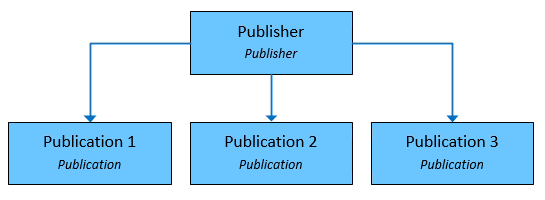

# Data Flow

This article explains data flows in Management Pack for SQL Server Replication.

## Logical Structure

## Publication Flow

## Replication Database Health

### Virtual Distributor Level Structure

### Replication Agents

The following table lists replication agent files located in the **\Program Files\Microsoft SQL Server\100\COM** directory.

|Agent Executable|File Name|
|-|-|
|[Replication Snapshot Agent](/sql/relational-databases/replication/agents/replication-snapshot-agent)|snapshot.exe|
|[Replication Distribution Agent](/sql/relational-databases/replication/agents/replication-distribution-agent)|distrib.exe|
|[Replication Log Reader Agent](/sql/relational-databases/replication/agents/replication-log-reader-agent)|logread.exe|
|[Replication Queue Reader Agent](/sql/relational-databases/replication/agents/replication-queue-reader-agent)|qrdrsvc.exe|
|[Replication Merge Agent](/sql/relational-databases/replication/agents/replication-merge-agent)|replmerg.exe|

### Replication Maintenance Jobs

In addition to replication agents, replication has many jobs that perform scheduled and on-demand maintenance operations.

|Clean up job|Description|Default schedule|
|-|-|-|
|Agent History Clean Up: Distribution|Removes replication agent history from the distribution database.|Runs every 10 minutes|
|Distribution Clean Up: Distribution|Removes replicated transactions from the distribution database. Deactivates subscriptions that haven't been synchronized within the maximum distribution retention period.|Runs every 10 minutes|
|Expired Subscription Clean Up|Detects and removes expired subscriptions from publication databases.|Runs every day at 1:00 A.M.|
|Reinitialize Subscriptions Having Data Validation Failures|Detects all subscriptions that have data validation failures and marks them for reinitialization. The next time the Merge Agent or Distribution Agent runs, a new snapshot will be applied at the Subscribers.|No default schedule (not enabled by default).|
|Replication Agents Checkup|Detects replication agents that aren't actively logging history. It writes to the Microsoft Windows event log if a job step fails.|Runs every 10 minutes.|
|Replication monitoring refresher for distribution|Refreshes cached queries used by Replication Monitor.|Runs continuously.|

### Virtual Publisher Level Structure

### Virtual Subscriber Level Structure

