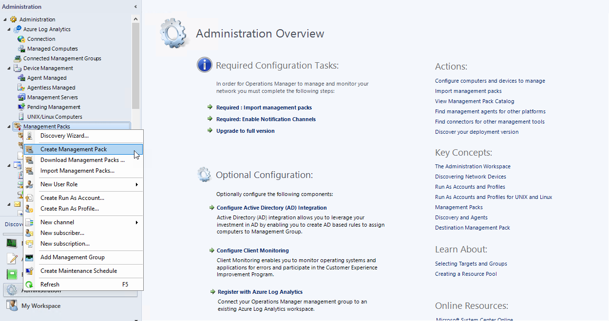

# Management Pack Configuration

Management Pack for Microsoft SQL Server Replication is sealed; you can't change any of the original settings.

To change the original settings, you can create a custom management pack to keep overrides and new monitoring objects.

Creating a custom management pack for storing overrides has the following advantages:

- Quick export of customized settings from the test environment to production environment.

- You don't have to remove the dependencies when removing the management pack with overrides.

- If customizations for all the management packs are saved to the default management pack and you want to remove a single pack, you must first remove the default management pack, which also removes customizations for other management packs.

To create a new management pack, perform the following steps:

1. Open the System Center Operations Manager console.

2. In the **Administration** view, right-click **Management Packs**, and select **Create New Management Pack**.

    

3. Enter a new name, select **Next**, and select **Create**.
