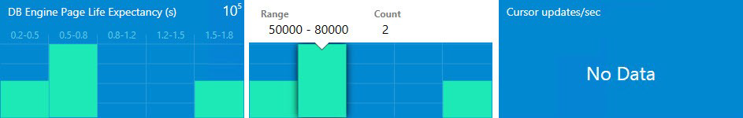

# Adjusting Datacenter Dashboard

To set up a datacenter dashboard, it's necessary to add groups and provide corresponding widgets to each group.

## Personalizing Datacenter View

The datacenter dashboard menu is accessible by left- or right-clicking the menu button. It allows the user to add a group, virtual group, configure the settings, and refresh the dashboard.

The settings are as follows:

- **Refresh Rate**–defines how often the dashboard refreshes data on the client. This setting doesn't change the actual collection frequency of metrics on a server. The refresh rate can be set to 5 (default), 15, and 30 minutes.

- **Time Interval**–defines for which period the data should be displayed. The performance widget on the instance view depends on this setting. The time interval can be set to **Last Day**, **Last Week**, and **Last Two Weeks**.

- **Background Color**–allows changing the background color for all views.

- **Theme**–allows choosing **Light** or **Dark** theme for the dashboard. The background color can be changed manually.

The **Show instance path** checkbox is enabled by default. When it's unchecked, the **Show** title is changed to **Hide**.

The **Contrast** theme is automatically activated when the corresponding system theme is used. Background and font colors are taken from the system palette.

## Adding Groups

To add groups, select the menu button and select **Add Group** from the dropdown list. You can search for the desired group in the **Add group** dialog by entering a group name.

The **Add Group** dialog requires the **GROUP** combobox and the **DISPLAY NAME** field. When the **GROUP** combobox is in focus, the **It is required to select a group** hint is displayed.

When the **DISPLAY NAME** field is in focus, the **The field is required** hint is displayed. The **GROUP** combobox is in focus by default after opening the **Add Group** view.

>[!NOTE]
>The red highlighting disappears only after entering valid data in the field.

The user can open the dropdown list with available groups or type part of a group name and best match groups will be displayed in the dropdown list. Information entered in the **GROUP** field can be deleted by selecting the **X** button.

To select a group, choose one in the dropdown list (groups in the dropdown list should be placed in the alphabetical order). The **DISPLAY NAME** field should also be populated with the name unless the user has already defined a name.

If the selected group is already added to the board, the **The name already exists** hint is displayed when the **DISPLAY NAME** field is in focus.

>[!NOTE]
>The **Add** button changes its state when it's disabled.

When the Data Center dashboard is loaded for the first time or refreshed by the refresh option from the Dashboard menu, a special blink animation is displayed.

>[!NOTE]
>It's possible to create a custom group and populate it with a desired set of objects. See [TechNet](/previous-versions/system-center/system-center-2012-R2/hh298605(v=sc.12)) for guidance.

The added group is displayed in the collapsed (minimized) state by default. To expand the panel, click the arrow symbol on the right from the group name.

The **State** part of the widget displays the worst state of its objects and it's colored according to the represented state (the priority list looks like this: critical, warning, unavailable, maintenance, not monitored, healthy). Critical state is red, warning – yellow, unavailable – gray, healthy is green, and the rest are blue. For alerts, priority/colors are as follows: critical - red, warning - yellow, info - blue.

In expanded mode, the state widget changes its representation.

It still displays the worst state and is colored according to the represented state (the priority list looks as follows: critical, warning, unavailable, maintenance, not monitored, healthy), but it also lists all possible states and shows the number of objects in the states.

The context menu of the **State** tile allows removing it and opening the **Enabled States** view.

All other tiles (three types of alerts) can be only removed in the context menu.

Observe that if all the tiles are removed, the group widget looks as follows:

The remove object dialog is similar for all tiles, but the display name of the object to be removed is different.

The alert widget in the expanded mode is separated by the alert type. The red widget represents critical alerts, orange for warnings, and blue widget for info.

### Enabled States

When the user chooses the **Settings** item in the group context menu (right mouse click at the group), the **Enabled states** view is opened.

A user can select states of the group objects, which will be displayed on the state tile in this view.

When the user changes the **Default** checkboxes settings, the **Current** checkbox settings are changed for all the groups in the current Dashboard view.

If the **Current** group checkbox settings were changed previously, сhanging the **Default** checkboxes settings won't affect **Current** checkbox settings until **Reset to default** settings are applied to this group.

The **Current** checkbox settings applied only for the current Dashboard view group
**Enabled states** window has **Save**, **Reset to default**, and **Cancel** buttons. The **Esc** button causes a cancel action, while the **Enter** button saves the inserted data.

The **Reset to default** button is disabled if the **Default** checkbox settings match the **Current** checkboxes settings.

>[!NOTE]
>The object states unchecked in the **Enabled states** view have a gray backlight and their states don't participate in forming of the **State** tile.

### Adding Aggregated Tiles

Left- or right-click the group menu button calls the **Add aggregated tile** menu. In this menu, the user can add a performance tile and monitor tile, and rename and remove a group.

>[!NOTE]
>Aggregated tiles are available in the Datacenter view only.

### Adding Aggregated Monitor Tile

From the **Group options** menu, the user can open the **Add Aggregated Monitor Tile** dialog. While the content is being loaded, a pre-loader is displayed.

The left part of the **Aggregated Monitor** tile consists of a colored donut, which displays the relative share of objects in one state against objects in other states with the total number of entities.

The right part of the tile has a list of states and the number of objects in the states. If there are no objects in a state, a line representing the state isn't displayed. Hovering over the donut part, its objects amount or state name changes the backlight.

All aggregated monitor elements have corresponding tooltips.

### Adding Aggregated Performance Tile

From the **Group** options menu, the user can open the **Add Aggregated Performance Tile** dialog. While the content is being loaded, a pre-loader is displayed.

The display name is a required field that will be populated automatically when the user selects a performance rule. Another selected rule won't override the field. The auto-fill mechanism doesn't work if the user has already populated the field.

The **CLASS** column displays all group classes. The **PERFORMANCE RULE** column displays all the performance rules of the class.

>[!NOTE]
>If class rules have the same prefix (for example, “MSSSQL SERVER 2014:”) the prefix isn't displayed. Parent classes are displayed firstly in the alphabetical order in the **CLASS** list, and then children classes are displayed in the alphabetical order. Rules in the **PERFORMANCE RULE** dropdown list are also displayed in the alphabetical order. The classes for which the rules have already been selected are displayed first.

The “X” button wipes the selected data. Validation messages disappear when the conditions are met.

**Enter** and **Esc** buttons have the **Save** and **Cancel** configuration. When the user adds a performance tile into a collapsed group, the group is expanded automatically and the screen is centered on the widget.

A performance tile has five columns. Each column represents a range of values. Upon hovering over a column, a tooltip with detailed information is displayed. In the top right corner of the widget, the degree of the values can be displayed. If the chosen performance rule(s) return nothing, the widget displays the “No Data” message. The values the widgets return appear to be the last values received from the agents. The Aggregated performance tile name has a corresponding tooltip.

## Adding Virtual Group

A virtual group with many classes can be added to a Datacenter Dashboard.

