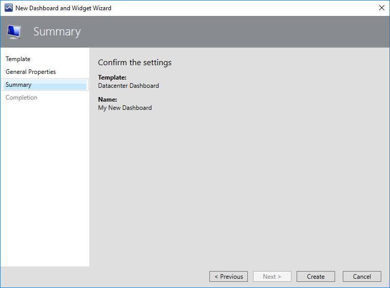
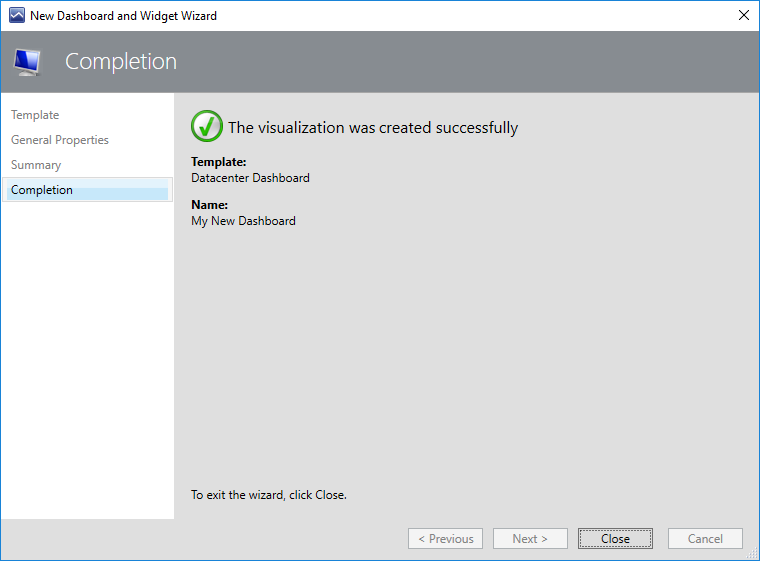

# Configuring Datacenter Dashboard

It's recommended to store datacenter dashboards in a separate management pack to allow easy exporting and reusing configured views.

## Creating Management Pack

To create a new management pack, perform the following steps:

1. Open the **Administration** view and select **Management Packs**.

2. Right-click **Management Packs** and select **Create Management Pack**.

## Creating Datacenter Dashboard

To create a new datacenter dashboard, perform the following steps:

1. Open the Operations Manager console.

2. In the **Monitoring** view, right-click a folder for a new dashboard, and select **New** > **Dashboard View**.

3. At the **Template** step, select **SQL Server Dashboards** and select **Next**.

    

4. At the **General Properties** step, specify a name and description for the template.

    

5. At the **Summary** step, select **Create** and wait until the dashboard view is created.

    

6. At the **Completion** step, select **Close**.

    

A new dashboard has no groups by default and only the **Home** note (not clickable) that represents the root of breadcrumbs and datacenter menu is available.

While the dashboard is in the **Loading…** state, the hamburger button and the **Home** title aren't displayed.
