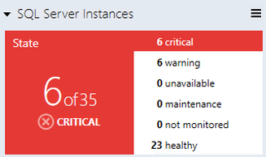

# Datacenter View

This article explains datacenter view. The **Datacenter** view is the home page of the dashboard. This view provides information about the datacenter health state in an aggregated way.

It's possible to drill down from the **Datacenter** view to the **Instance** view in order to investigate the root cause of the issue.

You can return to the home page from any **Instance** view by selecting **Home** in the navigation pane.

All group tiles on the datacenter view are collapsed by default. A tile consists of two parts:

- The left part displays the number of objects within a group in the worst state and the total number of objects.

- The right part of the widget displays the number of alerts with the highest severity.

Expanded mode shows the number of objects in other states in addition to the data displayed in collapsed mode.

By default, expanded mode displays three Alert widgets: **Critical**, **Warning**, and **Info**. The number of alerts for each alert type is displayed in the corresponding widget.

The Aggregated state monitor tile provides the number of object selected classes per state.

The Aggregated performance tile shows five columns. Each column represents the number of object selected classes in the current data range.

>[!NOTE]
>Use the **Datacenter View** menu button or a group to add a new tile or group. It's possible to edit or remove the tile by selecting the corresponding menu item from the right-click context menu. The background color, time interval, and refresh rate settings that are applied to the **Datacenter** view and all the **Instance** views can be set from the Datacenter view menu and Instance view menu.
