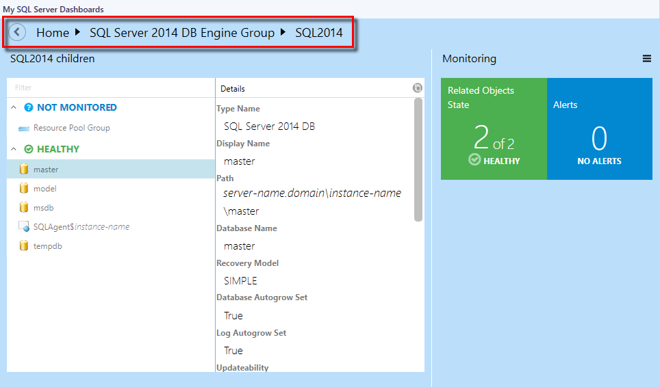
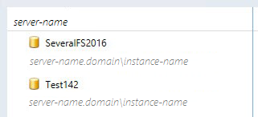
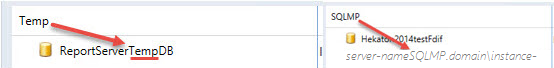

# Instance Dashboard Navigation

This article explains how to navigate through the structure provided on the dashboards.

## Drill Down to Related Objects

Drilling down can be performed as follows:

1. In the left pane, select an object.

2. In the right pane, double click the **Related Objects State** widget.

## Using Show alerts Function

This function allows seeing an object alert list. To activate this function, select the **Show alerts from all events** checkbox.

## Using Navigation Pane

To move to any location in the path, just click it. To move to the parent view, click the button.

## SQL Instance Path Property

A dashboard object path is shown after switching on the **Show instance path** checkbox in the **Settings** menu.

The user can search objects in the instance view by the path and name if the **Show instance path** checkbox is switched on. To perform a search, start entering the name of the object in the **Filter** field.

> [!NOTE]
> The user can search objects in the instance view by the name only if the **Show instance path** checkbox is switched off.

The user can search objects in the instance view by any part of the object path and by any part of the object name.

A path line of an object without a path is hidden; path lines of all other instances are displayed.

A tooltip with the object name and object path appears when the user hovers over the dashboard object and the **Show instance path** checkbox is enabled/disabled.

A tooltip with the object name appears only when the user hovers over the dashboard object with the empty path line.

The **Filter** field is cleared every time the user changes the dashboard level.

A user can use the filter field even if the dashboard group has objects with the empty path line and objects with a path at the path line simultaneously.

## Keyboard Navigation

The SQL Server Dashboard management pack allows you to navigate using the keyboard.

The following keys are available:

|Button|Purpose|
|-|-|
|Tab|Navigate to the next section|
|Shift + Tab|Navigate back to the previous section|
|Enter|Enter into the list or element|
|Up|Navigate to the next element of the list|
|Down|Navigate to the previous element of the list|
|Backspace|Collapse or expand the list|
|Left|Navigate to the next tile|
|Right|Navigate to the previous tile|
|A|Navigate to the next spike on the chart|
|D|Navigate back to the previous spike on the chart|
