# Instance View

The following is an example of an instance view that's displayed after drilling down into a group or an object from the previous view.

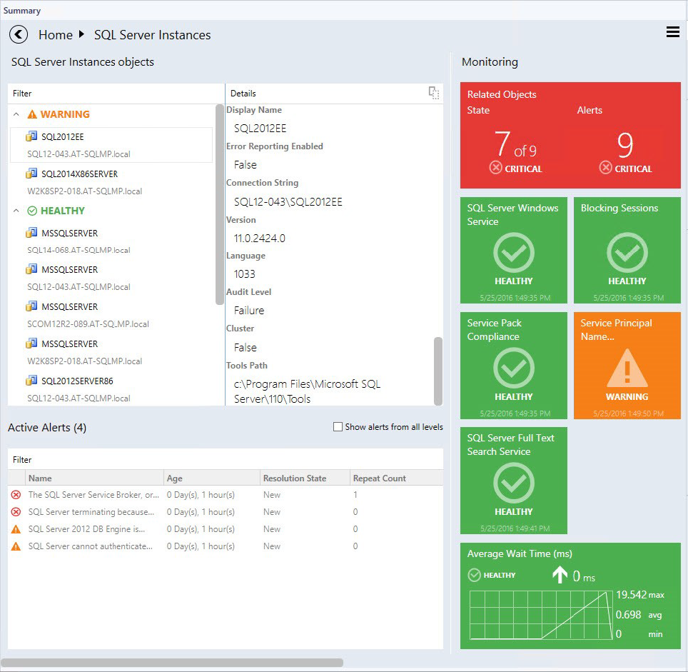

>[!NOTE]
>Double-click the name of an object in the object widget to drill down to the instance dashboard of related objects (double-click the **Related Objects** tile does the same). The **Back** button is available in the upper-left corner of the navigation pane for navigating back to the previous instance view.

Instance view tiles display information about the current state of the monitors and the latest performance data.

Depending on the current state and configuration, these tiles will have different background colors and layout. Refer to the examples below for illustrations of the tile capabilities.

Related objects tile displays the number of objects that are either hosted on the selected entity or linked by a containment. Double-clicking the tile opens the instance view for the related objects.

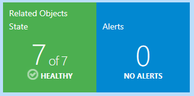

The monitor is in a critical state.

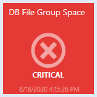

The monitor is in a healthy state.

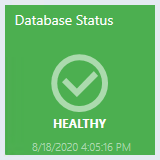

The monitor is in a warning state.

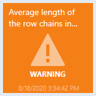

The monitor is disabled.

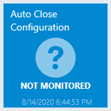

The monitor is unavailable.

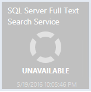

The monitor is under maintenance.

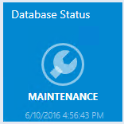

The monitor is in a critical state. The data for the selected time range is being displayed.

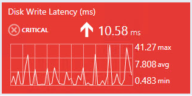

The monitor is in a warning state. The data for the selected time range is being displayed.

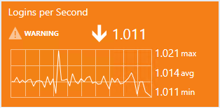

The monitor is in a healthy state. The data for the selected time range is being displayed.

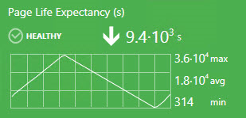

The monitor is disabled. The data for the selected time range is being displayed.

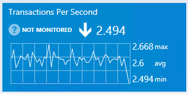

The performance counter has no correlated monitor (note that there's no icon in the top-right corner). The data for the selected time range is being displayed.

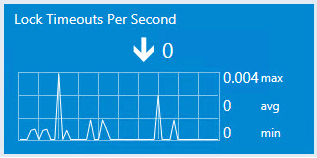

It's possible to view the exact value of the performance metric by hovering the cursor over the performance chart.

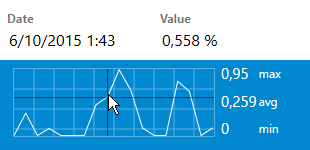

The monitor is unavailable. The data for the selected time range is being displayed.

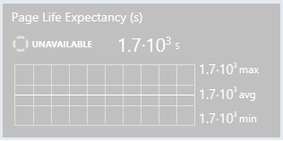

The monitor is under maintenance. The data for the selected time range is being displayed.

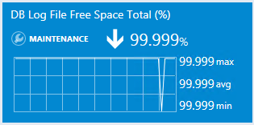
