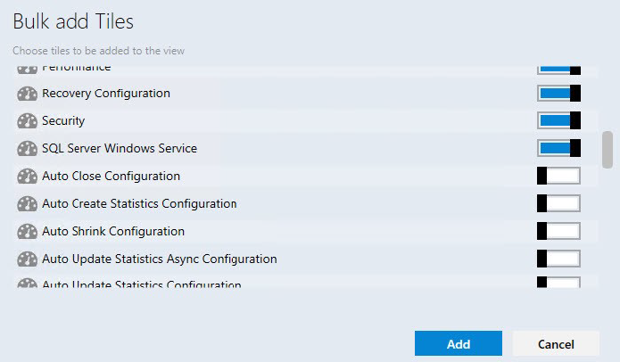
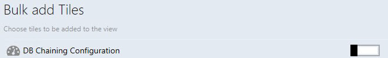
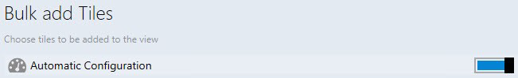
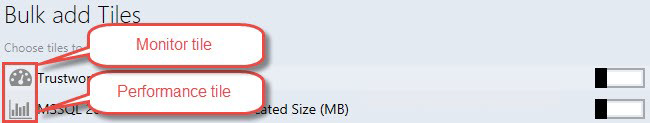
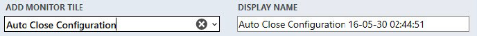

# Managing Tiles

The tiles can be moved by means of drag-n-drop.

Datacenter dashboards allow the following methods of tile moving:

- Moving groups in Datacenter View.
- Moving aggregated tiles within the expanded group in Datacenter View.
- Moving tiles in Instance View.

To open **Performance View** and Health Explorer, it is necessary to double-click the corresponding tile (performance tile and monitor tile, respectively).

The user can use the **Bulk add Tiles** menu to quickly add monitors and performance tiles to the instance view (all object rules and monitors are displayed in the **Chose tiles to be added to the view** list).

The checkboxes for already added tiles are switched off (monitor tiles that are added as part of 2x1 performance tile are considered already added).

Note that checkboxes are switched on for the tiles that have not been added to the instance view.

Performance and monitor have different icons.

The same performance and monitor tiles can be added many times by means of the **Bulk add Tiles** menu. The date and time parameters will be added to **DISPLAY NAME** for each subsequent adding of repeated performance\monitor tiles.

