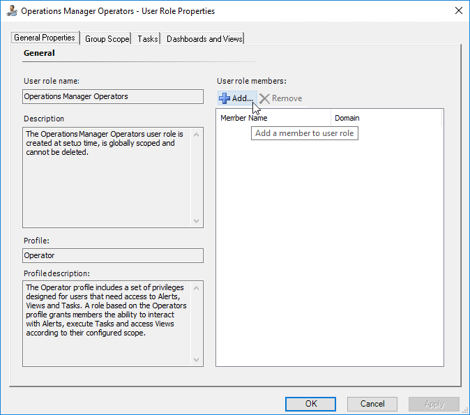

# Configuring Run As Profiles

When the management pack is imported for the first time, it creates a new Microsoft SQL Server visualization library Run As Profile. This profile allows creating low privilege environments for System Center Operations Manager.

To configure permissions on the System Center Operations Manager management server, perform the following steps:

1. Create a **SSVISLIB** account on the domain controller.

2. Grant Local Administrator permissions to the **SSVISLIB** account.

To configure permissions on System Center Operations Manager, perform the following steps:

1. Open the System Center Operations Manager console.

2. Open the **Administration** view.

3. In the navigation pane, select **User Roles** under the **Security** folder.

4. Right-click the **Operations Manager Operators** role and select **Properties**.

    

5. On the **General Properties** tab, select **Add**.

    

6. Find the **SSVISLIB** user and select **OK**.

7. Select **OK** to save the changes, and close the **User Role Properties** dialog.

    
