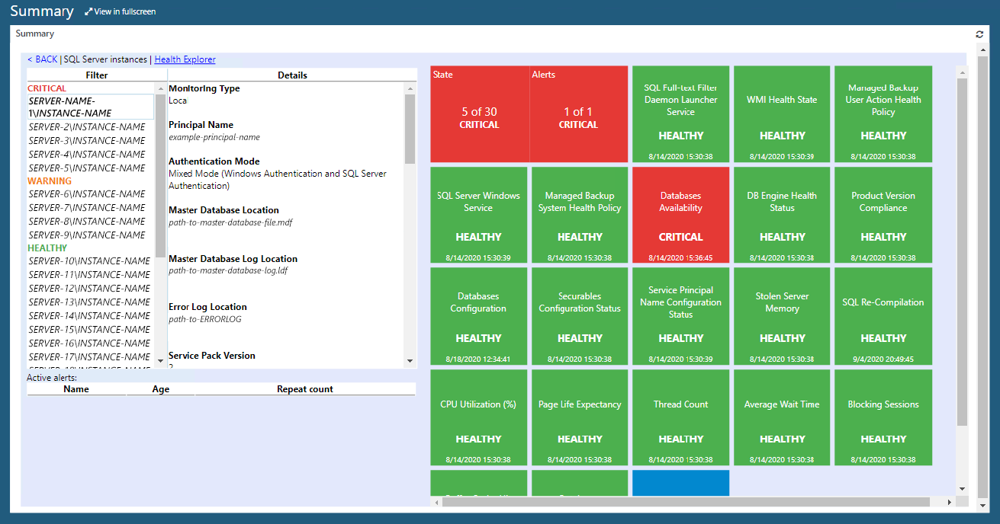
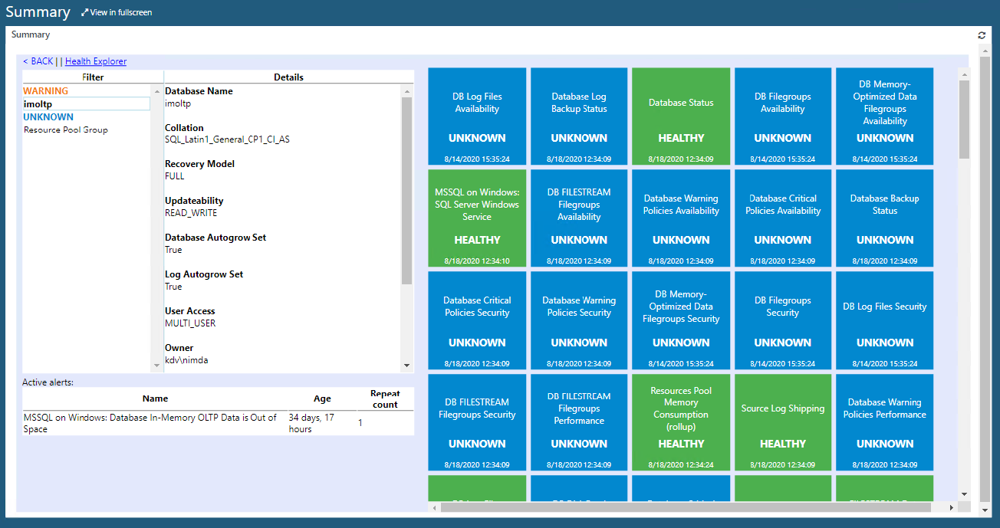

# SQL Server Web Dashboards

With System Center Operations Manager 2019 and later, you can access SQL Server dashboards using a web browser.

To open web dashboards, perform the following steps:

1. Navigate to http://localhost/OperationsManager using a web browser.

2. Open the **Monitoring** view, navigate to **Monitoring** > **Microsoft SQL Server**, and select **Summary**.

    Ensure that you've installed the **Web console** component.

On the **Summary** page, select a tile to drill down and review detailed information about the state and alerts.

The **Filter** column in the left pane shows objects that might be in the **Critical**, **Warning**, or **Healthy** state. You can select an object to review its details, such as **Monitoring Type**, **Principal Name**, **Authentication Mode**, and so on, in the **Details** column.

The right pane consists of tiles that show the health state of various components that belong to the object that you select in the **Filter** column.

In the right pane, you can select the first tile in the top-left corner that shows **State** and **Alerts** to drill down into the health hierarchy even further.

To get back to the previous view, you can select **Back**. You can also launch **Health Explorer**.

