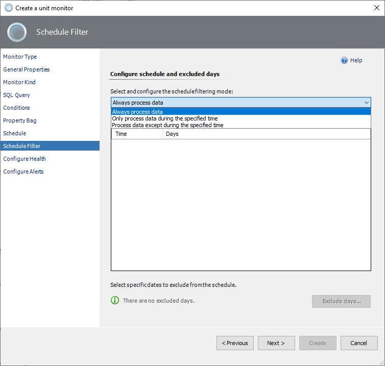
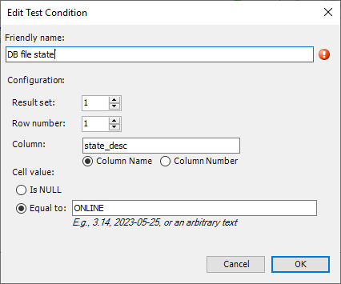

# Custom query-based database monitors

If the set of default monitors in System Center Management Pack for SQL Server isn't enough to cover your workflows, you can create a monitor that targets the SQL Server Database for Windows and Linux platforms.

During the monitor creation process, you use *conditions* to define how the monitor will determine the state after it receives query results. The approach for creating query-based monitors is similar to the approach for creating SQL Server policies. If the query result matches the condition, the monitor state is healthy. If the result doesn't match the condition, the monitor is unhealthy and shows an alert.

There are two types of unit monitors based on custom queries that you can create for the SQL Server Database: two-state monitors and three-state monitors. Depending on the sql query, two options are available: cookdown and database context.

> [!NOTE]
> Since the latest preview version of System Center Management Pack for SQL Server 7.1.0.0, the management pack for the custom monitoring feature is on a separate package installer: *SQLServerMP.CustomMonitoring.msi*. Be sure to import the management pack file *Microsoft.SQLServer.Core.CustomMonitoring.mpb* manually. The import process with the update option is not supported.

## Custom cookdown query-based monitors targeting the SQL Server Database

The Cookdown type allows you to retrieve data from multiple databases using a single query.

### Two-state custom database cookdown monitor

To create a two-state custom query-based monitor, follow these steps:

1. In the System Center Operations Manager console, go to **Authoring** > **Management Pack Objects**. Right-click **Monitors**, select **Create a Monitor**, and then select **Unit Monitor**.

    

2. At the **Monitor Type** step, select **Microsoft SQL Server** > **Database** > **User-defined SQL Query Two-State Database Monitor**.

3. From the **Select destination management pack** dropdown list, select a management pack that you want to use, or select **New** to create a new one. Then select **Next**.

    

4. At the **General Properties** step, enter the monitor name and an optional description. Make your selections for **Monitor target** and **Parent monitor**. If you want the monitor to be enabled by default, select the **Monitor is enabled** checkbox. Then select **Next**.

    

5. At the **Monitor Kind** select **Cookdown** and enter **Database name selector** using the column number or column name.

    The database name selector is a selector that parses the database name from the result set of a sql query. Setting the selector helps to identify the database from the result set to retrieve the data.

   

6. At the **SQL Query** step, enter the database name, query text, and timeouts (in seconds). The default database is **master**.

    The Database name field specifies the database that will be used to execute the SQL query from this step.

    The screenshot shows an example of using cookdown with a SQL query to [msdb.backupset](/sql/relational-databases/system-tables/backupset-transact-sql). This table contains information about all database backups on the server.

    

7. At the **Conditions** step, add one or more conditions to verify query results.

   Condition supports two modes of evaluation:

   - **ANY** - if any of the conditions are violated, the monitor switches to an unhealthy state.
  
   - **ALL** - if all the conditions are violated, the monitor switches to an unhealthy state.

    To add a new condition, select **Add**, and then select **Scalar Value**.

      Checks the scalar value in the specified cell of the result set. Only equal comparison is available at this moment. If you need complex logic, you can cover that with the query.

    

    When you add a condition, you must specify **Friendly name** and **Configuration** details for a specific check to be performed.

    You can use a scalar value with two options:

    - **Is NULL** is a true\false verification option. If the value is false, the monitor is unhealthy. Otherwise, the monitor is healthy.
    - Use **Equal to** to insert the specific value. If the result of the query matches the number value, the monitor is healthy. Otherwise, the monitor is unhealthy.

    

      > [!NOTE]
      > The **Equal to** option is culture-independent (invariant) for a single value only and can't parse a range of values. Example of use: *3.14*, *2023-05-25*, or an arbitrary text.

    You can make more than one condition. If you want to add, edit, or remove a condition, select the condition and use the appropriate button.

    

    After you finish setting all the required conditions, select **Next**.

8. At the **Property Bag** step, add one or more conditions to parse the sql query result into a property bag to add properties to the alert context. This step can be skipped if the default alert context is sufficient for display.

    

    To add a new condition, select **Add**, and then select **Scalar Value**. When you add a condition, you must specify **Friendly name** and **Configuration** details for a specific check to be performed.

    

    After you finish setting all the required conditions, select **Next**.

9. At the **Schedule** step, configure a query execution schedule and synchronization time.

    

10. At the **Schedule Filter** step, select the schedule filtering mode with the following options:

    - **Always process data**

      This is the regular mode, in which the monitor processes the data all the time. This mode doesn't support the time range schedule and excludes day options.

    - **Only process data during the specified time**
  
      In this mode, you schedule monitoring by selecting a date and time range during the week.

    - **Process data except during the specified time**

      In this mode, you exclude days so that the monitor doesn't track the specified time periods. You can exclude it temporarily by using the **Exclude days** button. You can exclude it permanently by using the time range schedule.

    

    To specify the time range for both **Only process data during the specified time** and **Process data except during the specified time** modes, use the **Add** button and select the days and times.

    

    To exclude some days from the schedule, use the **Exclude days** button and choose the date range by using the **Start** and **End** fields. Complete the description, if applicable.

    

    You can use both options to exclude time ranges and days at the same time.

    

11. At the **Configure Health** step, select the health state that the monitor should generate. Change the **Operational State** information if needed.

      

12. At the **Configure Alerts** step, enable the generating of alerts and edit the **Alert properties** area if needed.

    If you need to activate alerts for the monitor, select the **Generate alerts for this monitor** checkbox, and set up an alert name and description to be shown when conditions fail. Change priority and severity, and resolve the alert mode.

    Use the `$Data/Context/Property[@Name=’Message’]$` placeholder to show the list of failed conditions in the alert description.

    When you're finished configuring alert properties, select **Create**.

    

> [!TIP]
> By default, a custom query-based monitor works for all SQL Server databases. To avoid alert storming you need to override the monitor target only to a specific instance of the SQL Server. To do that, in the monitor's override properties set the **Enabled = False** for the **MSSQL on Windows: Database class**, and set the **Enabled = True** for the **specific SQL Server Database** object.

## Custom database context query-based monitors targeting the SQL Server Database

The database context monitor type will execute the specified query on all databases in the target manner. To exclude a specific database from this monitor, use overrides after creation.

This monitor type can increase performance.

### Two-state custom database context monitor

To create a two-state custom query-based monitor, follow these steps:

1. In the System Center Operations Manager console, go to **Authoring** > **Management Pack Objects**. Right-click **Monitors**, select **Create a Monitor**, and then select **Unit Monitor**.

    

2. At the **Monitor Type** step, select **Microsoft SQL Server** > **Database** > **User-defined SQL Query Two-State Database Monitor**.

3. From the **Select destination management pack** dropdown list, select a management pack that you want to use, or select **New** to create a new one. Then select **Next**.

    

4. At the **General Properties** step, enter the monitor name and an optional description. Make your selections for **Monitor target** and **Parent monitor**. If you want the monitor to be enabled by default, select the **Monitor is enabled** checkbox. Then select **Next**.

    

5. At the **Monitor Kind** select **Database context**.

    The database context monitor type will perform the sql query to all databases in turn, so the database name selector can be omitted.

   

6. At the **SQL Query** step, enter query text and timeouts (in seconds). The default database is **master**.

    The database context will be executed on all databases, so the field for specifying only one database to query is locked.

    

    The screenshot shows an example of using database context with a SQL query to [sys.database_files](/sql/relational-databases/system-catalog-views/sys-database-files-transact-sql). This table exists in each database, so the database context monitor type will connect to each database and retrieve data in a targeted manner.

7. At the **Conditions** step, add one or more conditions to verify query results.

   Condition supports two modes of evaluation:

   - **ANY** - if any of the conditions are violated, the monitor switches to an unhealthy state.
  
   - **ALL** - if all the conditions are violated, the monitor switches to an unhealthy state.

    To add a new condition, select **Add**, and then select one of the available conditions:

    - **Empty Result Set**

      Checks if the specified result set that the query returned is empty.

    - **Not Empty Result Set**

      Checks if the specified result set that the query returned isn't empty.

    - **Scalar Value**

      Checks the scalar value in the specified cell of the result set. Only equal comparison is available at this moment. If you need complex logic, you can cover that with the query.

    

    When you add a condition, you must specify **Friendly name** and **Configuration** details for a specific check to be performed.

    You can use a scalar value with two options:

    - **Is NULL** is a true\false verification option. If the value is false, the monitor is unhealthy. Otherwise, the monitor is healthy.
    - Use **Equal to** to insert the specific value. If the result of the query matches the number value, the monitor is healthy. Otherwise, the monitor is unhealthy.

    

      > [!NOTE]
      > The **Equal to** option is culture-independent (invariant) for a single value only and can't parse a range of values. Example of use: *3.14*, *2023-05-25*, or an arbitrary text.

    You can make more than one condition. If you want to add, edit, or remove a condition, select the condition and use the appropriate button.

    

    After you finish setting all the required conditions, select **Next**.

8. At the **Property Bag** step, add one or more conditions to parse the sql query result into a property bag to add properties to the alert context. This step can be skipped if the default alert context is sufficient for display.

    

    To add a new condition, select **Add**, and then select **Scalar Value**. When you add a condition, you must specify **Friendly name** and **Configuration** details for a specific check to be performed.

    

    You can make more than one condition for property bag. If you want to add, edit, or remove a condition, select the condition and use the appropriate button.

    

    After you finish setting all the required conditions, select **Next**.

9. At the **Schedule** step, configure a query execution schedule and synchronization time.

    

10. At the **Schedule Filter** step, select the schedule filtering mode with the following options:

    - **Always process data**

      This is the regular mode, in which the monitor processes the data all the time. This mode doesn't support the time range schedule and excludes day options.

    - **Only process data during the specified time**
  
      In this mode, you schedule monitoring by selecting a date and time range during the week.

    - **Process data except during the specified time**

      In this mode, you exclude days so that the monitor doesn't track the specified time periods. You can exclude it temporarily by using the **Exclude days** button. You can exclude it permanently by using the time range schedule.

   

   To specify the time range for both **Only process data during the specified time** and **Process data except during the specified time** modes, use the **Add** button and select the days and times.

   

   To exclude some days from the schedule, use the **Exclude days** button and choose the date range by using the **Start** and **End** fields. Complete the description, if applicable.

   

   You can use both options to exclude time ranges and days at the same time.

   

11. At the **Configure Health** step, select the health state that the monitor should generate. Change the **Operational State** information if needed.

      

12. At the **Configure Alerts** step, enable the generating of alerts and edit the **Alert properties** area if needed.

    If you need to activate alerts for the monitor, select the **Generate alerts for this monitor** checkbox, and set up an alert name and description to be shown when conditions fail. Change priority and severity, and resolve the alert mode.

    Use the `$Data/Context/Property[@Name=’Message’]$` placeholder to show the list of failed conditions in the alert description.

    When you're finished configuring alert properties, select **Create**.

    

> [!TIP]
> By default, a custom query-based monitor works for all SQL Server databases. To avoid alert storming you need to override the monitor target only to a specific instance of the SQL Server. To do that, in the monitor's override properties set the **Enabled = False** for the **MSSQL on Windows: Database class**, and set the **Enabled = True** for the **specific SQL Server Database** object.

## Three-state monitor

Creating a three-state custom query-based monitor is similar to creating a two-state monitor. The main difference is that you select **User-defined SQL Query Three-State Monitor** at the **Monitor Type** step. Then, you can specify details for **Warning Conditions** and **Critical Conditions** steps.

A critical state has a higher priority than a warning in three-state monitors, and it's verified first. If one or more critical conditions fail, the monitor switches to the critical state, and warning conditions aren't verified.

When you use the **Equal to** condition in a three-state monitor:

- Choose a value.
- Use conditions with unhealthy states that will be determined for the desired monitor's operational state.
- Keep in mind the alert priority: the critical state is verified first.

Condition types are different for cookdown and the database context monitor type. For cookdown, only one option is available: scalar value. For the database context, you can use all kinds of conditions: empty result set, not empty result set, and scalar value.