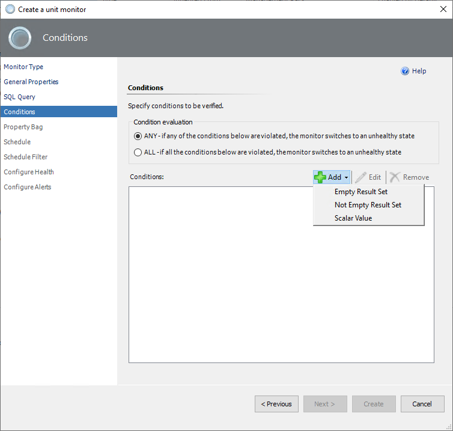
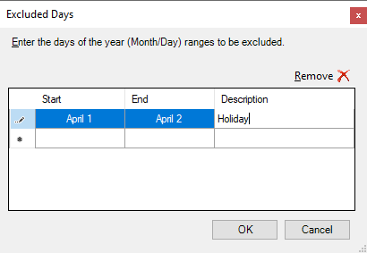

# Custom Query-Based Monitors

> [!WARNING]
> Note that since the latest preview version of the SQL Server MP 7.1.0.0, the management pack for the custom monitoring feature is on the separate package installer - **SQLServerMP.CustomMonitoring.msi**. The management pack file **Microsoft.SQLServer.Core.CustomMonitoring.mpb** should be imported from scratch, the importing process with the update option is not supported.

If the set of default monitors in the management pack isn't enough to cover your workflows, you can create your monitor that targets the SQL Server DB Engine for Windows and Linux platforms.

During the monitor creation process, you will define how the monitor will determine the state after query results are received, it's called **conditions**.

Conditions for the query-based monitors were realized with an approach similar to SQL Server policies. It means when the query result matches the condition, the monitor state will be healthy. If the result does not match the condition, the monitor becomes unhealthy and shows an alert.

There are two types of unit monitors based on custom queries that can be created:

- Two-state monitor
- Three-state monitor

An example of creating 3-states monitor conditions at the bottom of the page.

## Two-State Monitor

To create a new two-state custom query-based monitor, perform the following steps:

1. In the System Center Operations Manager console, navigate to **Authoring | Management Pack Objects**, right-click **Monitors**, and select **Create a Monitor | Unit Monitor**.

    

2. At the **Monitor Type** step, select **Microsoft SQL Server | User-defined SQL Query Two State Monitor**.

3. From the **Select destination management pack** dropdown list, select a management pack that you want to use or create a new one and select **Next**.

    

4. At the **General Properties** step, enter the monitor name and optional description, select **Monitor target** and **Parent monitor**, and select **Next**.

    

    At this step, you can determine whether this **Monitor is enabled** by default or not.

5. At the **SQL Query** step, enter the database name, query text, and timeout (in seconds).

    The default selected database is **master**.

    

6. At the **Conditions** step, add one or more **Conditions** to verify query results.

    To add a new condition, select **Add** and select one of the available conditions:

    - **Empty Result Set**

      Checks if the specified result set that was returned by the query is empty.

    - **Not Empty Result Set**

      Checks if the specified result set that was returned by the query isn't empty.

    - **Scalar Value**

      Checks the scalar value in the specified cell of the result set. Only equal comparison is available at this moment. If you need complex logic, you may cover that with the query.

    

    When you add a condition, you must specify **Friendly name** and **Configuration** required for a specific check to be performed. 

    

    As an example in the screenshot above, the Scalar value can be used with two options:
    - The first radio button **Is NULL** - True\False verification option. If False, the monitor is unhealthy, otherwise, the monitor becomes healthy.
    - The second radio button **Equal to** - option to insert the specific value. If the result of the query matches the number value, the monitor becomes healthy, otherwise, the monitor becomes unhealthy.

    >[!Warning]
    > The 'Equal to' option is for single value only and can't parse a range of values.

    You can make more than one condition using the **OR** and **AND** operators. Any condition can be changed or deleted using the following buttons.

    

    After all the required conditions are set, select **Next**

7. At the **Schedule** page, configure a query execution schedule and synchronization time.

    

8. At the **Schedule Filter** page, select the schedule filtering mode with the following options:
 
   

    - **Always process data**

    Regular mode, in which the monitor processes the data all the time.

    >[!Note]
    > 'Always process data' mode doesn't support the time range schedule and excluding days options.

    - **Only process data during the specified times**
  
    Monitoring schedule management mode by date and time range during the week.

    - **Process data except during the specified time**

    The mode allows you to exclude days so that monitor doesn't track the specified time periods. It can be temporarily excluded using the **Exclude days** button or permanently excluding some days using the **time range** schedule.

    To specify the time range for both "Only process data during the specified time" or "Process data except during the specified time" modes, use **Add** button and pick the desired days and times.

    

   To exclude some days from the schedule, use the **Exclude days** button and pick the date range with both the Start and End fields. Complete the description, if applicable.

    

    Both options to exclude time ranges and days can be used at the same time.

    

9. At the **Configure Health** step, select the health state that should be generated by the monitor and change the **Operational State** if needed.

      

10. At the **Configure Alerts** step, enable the generating alerts and edit the **Alert properties** if needed, and select **Create**.

    If you need to activate alerts for the monitor, check the box **Generate alerts for this monitor**, and set up an alert name and description to be shown in cases of conditions failing. Change priority and severity, and resolve the alert mode.

    Use the `$Data/Context/Property[@Name=’Message’]$` placeholder to show the list of failed conditions in the alert description.

      

> [!TIP]
> By default, a custom query-based monitor will work for all SQL Server instances. If you only need to target a specific instance, override your monitor after creation.

## Three-State Monitor

Creating a three-state custom query-based monitor is similar to a two-state monitor. The main difference is that you may specify the **Warning** and **Critical** conditions.

> [!IMPORTANT]
> A critical state has a higher priority than a warning in 3-state monitors, and it's verified first. If one or more critical conditions fail, the monitor will switch to the critical state, and warning conditions won't be verified.

How to use the **Equal to condition** in the 3-state monitor:

1. Use any desired value;
2. Use conditions with unhealthy states that will be determined for the desired monitor's operational state;
3. Keep in mind alerts priority - the Critical state verifies at first.

**Example**: The expected value is a number in a range from 1 to 70, which is the healthy state of the monitor. The range 71-85 will be a warning state, and 86-100 will be a critical state. You need to create a condition for each value from the 71 to 85 range to specify the warning state and do the same for the 86-100 critical range.

The check performs as follows: the result compares with all critical conditions, and if there are no matches, the result compares with warning conditions. Otherwise, the result will be in a healthy condition.
