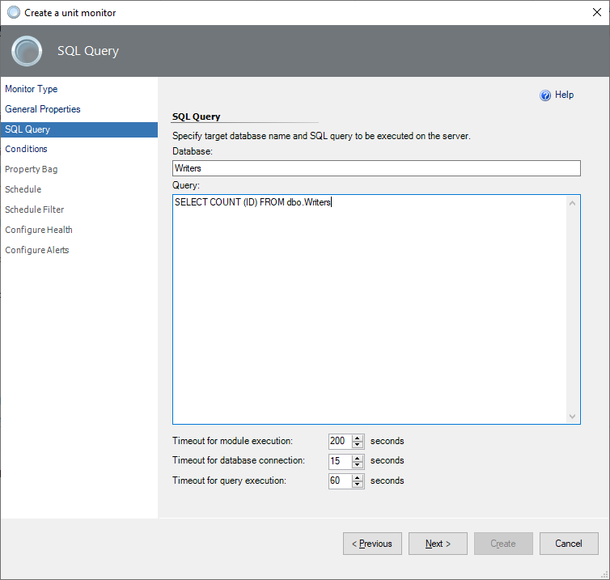
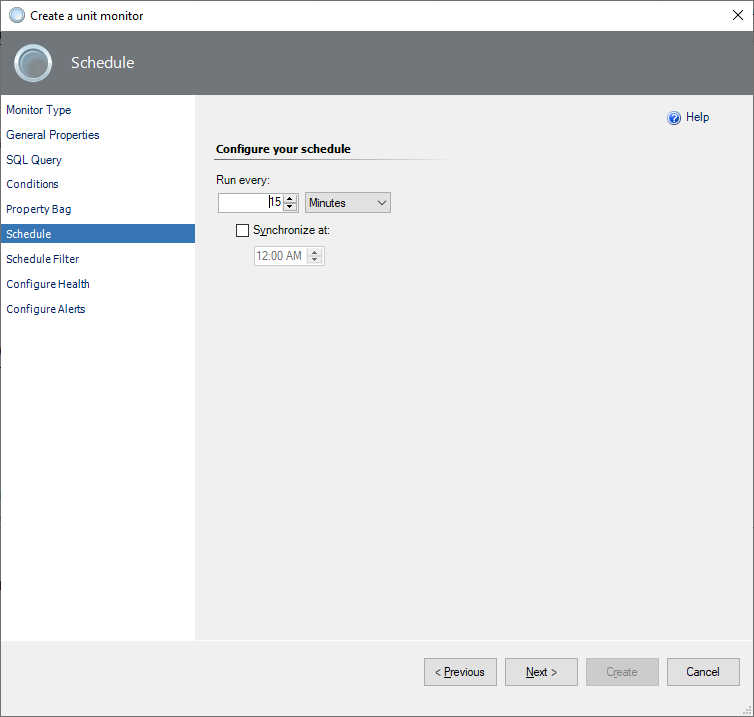
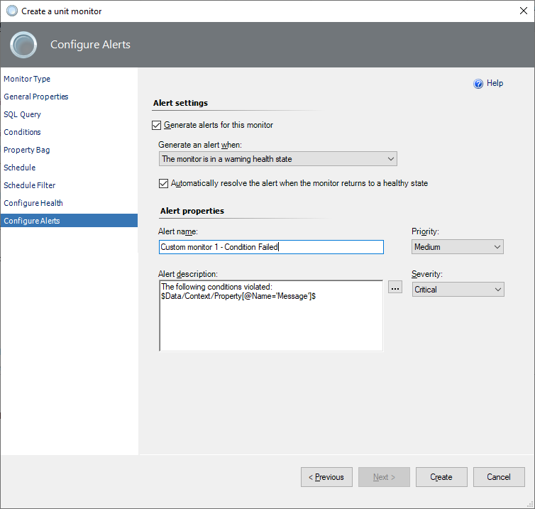

# Custom query-based monitors

If the set of default monitors in System Center Management Pack for SQL Server isn't enough to cover your workflows, you can create a monitor that targets the SQL Server Database Engine for Windows and Linux platforms.

During the monitor creation process, you use *conditions* to define how the monitor will determine the state after it receives query results. The approach for creating query-based monitors is similar to the approach for creating SQL Server policies. If the query result matches the condition, the monitor state is healthy. If the result doesn't match the condition, the monitor is unhealthy and shows an alert.

There are two types of unit monitors based on custom queries that you can create: two-state monitors and three-state monitors. This article shows how to create both types and includes an example of a three-state monitor condition.

> [!NOTE]
> Since the latest preview version of System Center Management Pack for SQL Server 7.1.0.0, the management pack for the custom monitoring feature is on a separate package installer: *SQLServerMP.CustomMonitoring.msi*. Be sure to import the management pack file *Microsoft.SQLServer.Core.CustomMonitoring.mpb* manually. The import process with the update option is not supported.

## Two-state monitor

To create a two-state custom query-based monitor, perform the following steps:

1. In the System Center Operations Manager console, go to **Authoring** > **Management Pack Objects**. Right-click **Monitors**, select **Create a Monitor**, and then select **Unit Monitor**.

    

2. At the **Monitor Type** step, select **Microsoft SQL Server** > **DB Engine** > **User-defined SQL Query Two-State Monitor**.

3. From the **Select destination management pack** dropdown list, select a management pack that you want to use, or select **New** to create a new one. Then select **Next**.

    

4. At the **General Properties** step, enter the monitor name and an optional description. Make your selections for **Monitor target** and **Parent monitor**. If you want the monitor to be enabled by default, select the **Monitor is enabled** checkbox. Then select **Next**.

    

5. At the **SQL Query** step, enter the database name, query text, and timeouts (in seconds). The default database is **master**.

    

6. At the **Conditions** step, add one or more conditions to verify query results.

   Condition supports two modes of evaluation:

   - **ANY** - if any of the conditions are violated, the monitor switches to an unhealthy state.
  
   - **ALL** - if all the conditions are violated, the monitor switches to an unhealthy state.

    To add a new condition, select **Add**, and then select one of the available conditions:

    - **Empty Result Set**

      Checks if the specified result set that the query returned is empty.

    - **Not Empty Result Set**

      Checks if the specified result set that the query returned isn't empty.

    - **Scalar Value**

      Checks the scalar value in the specified cell of the result set. Only equal comparison is available at this moment. If you need complex logic, you can cover that with the query.

    

    When you add a condition, you must specify **Friendly name** and **Configuration** details for a specific check to be performed.

    

    You can use a scalar value with two options:

    - **Is NULL** is a true\false verification option. If the value is false, the monitor is unhealthy. Otherwise, the monitor is healthy.
    - Use **Equal to** to insert the specific value. If the result of the query matches the number value, the monitor is healthy. Otherwise, the monitor is unhealthy.

      > [!NOTE]
      > The **Equal to** option is culture-independent (invariant) for a single value only and can't parse a range of values. Example of use: *3.14*, *2023-05-25*, or an arbitrary text.

    You can make more than one condition by using the **OR** and **AND** operators. If you want to add, edit, or remove a condition, select the condition and use the appropriate button.

    

    After you finish setting all the required conditions, select **Next**.

7. At the **Schedule** step, configure a query execution schedule and synchronization time.

    

8. At the **Schedule Filter** step, select the schedule filtering mode with the following options:

    - **Always process data**

      This is the regular mode, in which the monitor processes the data all the time. This mode doesn't support the time range schedule and excludes day options.

    - **Only process data during the specified time**
  
      In this mode, you schedule monitoring by selecting a date and time range during the week.

    - **Process data except during the specified time**

      In this mode, you exclude days so that the monitor doesn't track the specified time periods. You can exclude it temporarily by using the **Exclude days** button. You can exclude it permanently by using the time range schedule.

   

   To specify the time range for both **Only process data during the specified time** and **Process data except during the specified time** modes, use the **Add** button and select the days and times.

   

   To exclude some days from the schedule, use the **Exclude days** button and choose the date range by using the **Start** and **End** fields. Complete the description, if applicable.

   

   You can use both options to exclude time ranges and days at the same time.

   

9. At the **Configure Health** step, select the health state that the monitor should generate. Change the **Operational State** information if needed.

      

10. At the **Configure Alerts** step, enable the generating of alerts and edit the **Alert properties** area if needed.

    If you need to activate alerts for the monitor, select the **Generate alerts for this monitor** checkbox, and set up an alert name and description to be shown when conditions fail. Change priority and severity, and resolve the alert mode.

    Use the `$Data/Context/Property[@Name=’Message’]$` placeholder to show the list of failed conditions in the alert description.

    When you're finished configuring alert properties, select **Create**.

      

> [!TIP]
> By default, a custom query-based monitor works for all SQL Server instances. To avoid alert storming you need to override the monitor target only to a specific instance of the SQL Server. To do that, in the monitor's override properties set the **Enabled = False** for the **MSSQL on Windows: DB Engine class**, and set the **Enabled = True** for the **specific SQL Server DB Engine** object.

## Three-state monitor

Creating a three-state custom query-based monitor is similar to creating a two-state monitor. The main difference is that you select **User-defined SQL Query Three-State Monitor** at the **Monitor Type** step. Then, you can specify details for **Warning Conditions** and **Critical Conditions** steps.

A critical state has a higher priority than a warning in three-state monitors, and it's verified first. If one or more critical conditions fail, the monitor switches to the critical state, and warning conditions aren't verified.

When you use the **Equal to** condition in a three-state monitor:

- Choose a value.
- Use conditions with unhealthy states that will be determined for the desired monitor's operational state.
- Keep in mind the alert priority: the critical state is verified first.

### Example

The expected value is a number in the range 1-70, which is the healthy state of the monitor. The range 71-85 is a warning state, and 86-100 is a critical state. You need to create a condition for each value in the 71-85 range to specify the warning state. Do the same for the 86-100 critical range.

The monitor performs the check by comparing the result with all critical conditions. If there are no matches, the monitor compares the result with warning conditions. Otherwise, the result is in a healthy condition.
