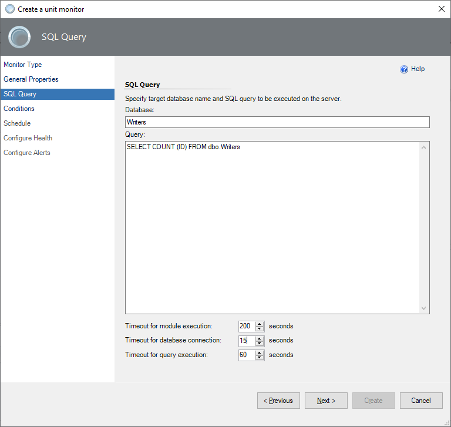

# Custom Query-Based Monitors

If the set of default monitors in the management pack isn't enough to cover your workflows, you can create your monitor that targets the SQL Server DB Engine for Windows and Linux platforms.

There are two types of monitors:

- Two-state monitor
- Three-state monitor

## Two-State Monitor

To create a new two-state custom query-based monitor, perform the following steps:

1. In the System Center Operations Manager console, navigate to **Authoring | Management Pack Objects**, right-click **Monitors**, and select **Create a Monitor | Unit Monitor**.

    

2. At the **Monitor Type** step, select **Microsoft SQL Server | User-defined SQL Query Two State Monitor**.

3. From the **Select destination management pack** dropdown list, select a management pack that you want to use or create a new one and select **Next**.

    

4. At the **General Properties** step, enter the monitor name and optional description, select **Monitor target** and **Parent monitor**, and select **Next**.

    

    At this step, you can determine whether this **Monitor is enabled** by default or not.

5. At the **SQL Query** step, enter the database name, query text, and timeout (in seconds).

    The default selected database is **master**.

    

6. At the **Conditions** step, add one or more **Conditions** to verify query results.

    To add a new condition, select **Add** and select one of the available conditions:

    - **Empty Result Set**

      Checks if the specified result set that was returned by the query is empty.

    - **Not Empty Result Set**

      Checks if the specified result set that was returned by the query isn't empty.

    - **Scalar Value**

      Checks the scalar value in the specified cell of the result set. Only equal comparison is available at this moment. If you need complex logic, you may cover that with the query.

    

    When you add a condition, you must specify **Friendly name** and **Configuration** required for a specific check to be performed.

    

    You can make more than one condition using the **OR** and **AND** operators. Any condition can be changed or deleted using the following buttons.

    

    After all the required conditions are set, select **Next**

7. At the **Schedule** page, configure a query execution schedule and synchronization time.

    

8. At the **Configure Health** step, select the health state that should be generated by the monitor and change the **Operational State** if needed.

      

9. At the **Configure Alerts** step, enable the generating alerts and edit the **Alert properties** if needed, and select **Create**.

    If you need to activate alerts for the monitor, check the box **Generate alerts for this monitor**, and set up an alert name and description to be shown in cases of conditions failing. Change priority and severity, and resolve the alert mode.

    Use the `$Data/Context/Property[@Name=’Message’]$` placeholder to show the list of failed conditions in the alert description.

   :::image type="content" source="./media/sql-server-management-pack/editing-alerts.png" alt-text="Screenshot of editing alerts." border="true"::: 

> [!NOTE]
> By default, a custom query-based monitor will work for all SQL Server instances. If you only need to target a specific instance, override your monitor after creation.

## Three-State Monitor

Creating a three-state custom query-based monitor is similar to a two-state monitor. The main difference is that you may specify the **Warning** and **Critical** conditions.

> [!IMPORTANT]
> Critical conditions are verified first. If one or more critical conditions fail, the monitor will switch to the critical state, and warning conditions won't be verified.
