# Examples of custom query-based monitors

All examples of using custom query-based monitors and performance rules based on the `AdventureWorks` sample database can be found on the [installation](/sql/samples/adventureworks-install-configure) page or directly within the [SQL Server samples](https://github.com/microsoft/sql-server-samples) GitHub repository.

## Prerequisites

Before you configure custom query monitors and performance rules in the System Center management pack for SQL Server, ensure you meet these prerequisites:

- [SQL Server Management Studio](/sql/ssms/download-sql-server-management-studio-ssms) (SSMS).
- A running instance of the [AdventureWorks2022](/sql/samples/adventureworks-install-configure) database. If you don't have one, follow these steps to install it:

  1. Download the [AdventureWorks2022.bak](https://github.com/Microsoft/sql-server-samples/releases/download/adventureworks/AdventureWorks2022.bak) database sample backup with online transaction processing (OLTP) data, which is for most typical OLTP workloads. If you're not sure what sample you need, start with the OLTP version that matches your SQL Server version.

  1. [Restore the AdventureWorks sample database](/sql/samples/adventureworks-install-configure?tabs=tsql#restore-to-sql-server) to your SQL Server instance by using the `.bak` file. You can use the [RESTORE (Transact-SQL)](/sql/t-sql/statements/restore-statements-transact-sql) command or the graphical interface in SSMS.

## Custom query-based two-state monitor

You can create two types of unit monitors based on custom queries: two-state monitors and three-state monitors. This article shows typical examples of the usage of two-state monitors.

## [Example 1 with "Empty Result Set"](#tab/example-1-with-empty-result-set)

In this example, consider the condition under which the `Sales.CreditCard` table is checked to ensure that no entries in the `ExpYear` column have the 2005 year:

```SQL
SELECT * FROM [Sales].[CreditCard]
WHERE ExpYear = 2005
```

The query returns several records:

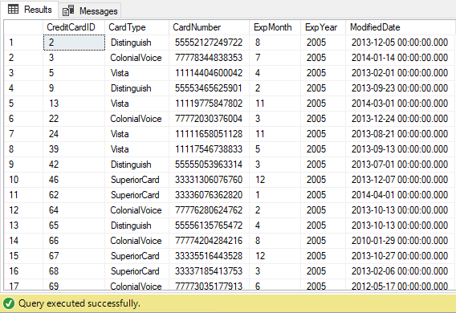

To create a monitor that changes its state to unhealthy if the table contains records with an expiration year of 2005, follow these steps:

1. In the System Center Operations Manager console, go to **Authoring** > **Management Pack Objects**. Right-click **Monitors**, select **Create a Monitor**, and then select **Unit Monitor**.
  
1. At the **Monitor Type** step, do the following:

   1. Select **Microsoft SQL Server** > **DB Engine** > **User-defined SQL Query Two-State Monitor**.
   1. In the **Select destination management pack** dropdown list, select a management pack that you want to use. Or select **New** to create a new one.
   1. Select **Next**.

   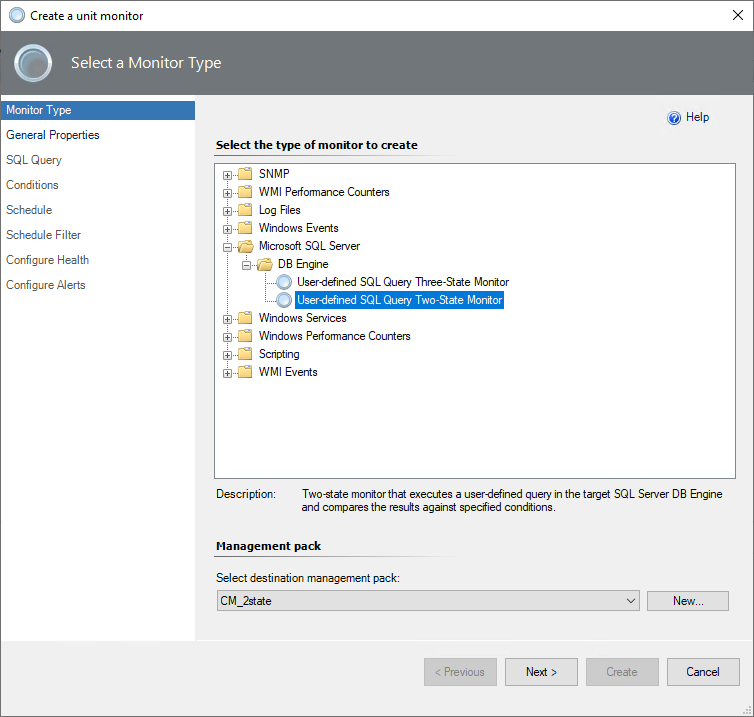

1. At the **General Properties** step, do the following:
  
   1. Enter the monitor name as `[Sales].[CreditCard] table with Expiration Year values = 2005`.
   1. Enter the description as `This monitor checks the [Sales].[CreditCard] table to find the rows with ExpYear values = 2005.`  
   1. Make your selections for **Monitor target** as `MSSQL on Windows: Local DB Engine` and **Parent monitor** as any of the Entity Health options.  
   1. If you want the monitor to be enabled by default, select the **Monitor is enabled** checkbox.
   1. Select **Next**.

   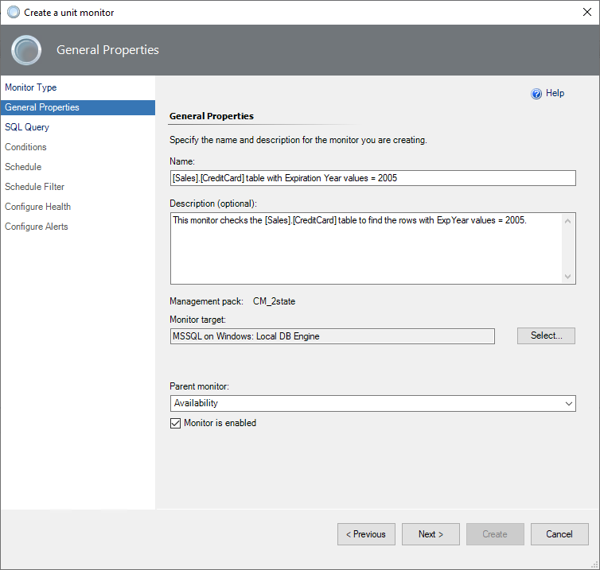

1. At the **SQL Query** step, do the following:
  
   1. Enter the database name as `AdventureWorks2022`.
   1. Enter the query text.
   1. Select the timeouts (in seconds).
   1. Select **Next**.

   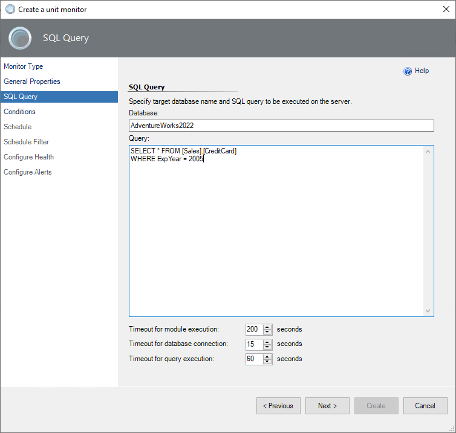

1. At the **Conditions** step, do the following:
  
   1. Select the **ANY** condition. It means that if any of the added conditions are violated, the monitor switches to an unhealthy state. This example needs only one condition.  
   1. To add a new condition, select **Add**, and then select **Empty Result Set**. This condition checks if the specified result set that the query returned is empty.

      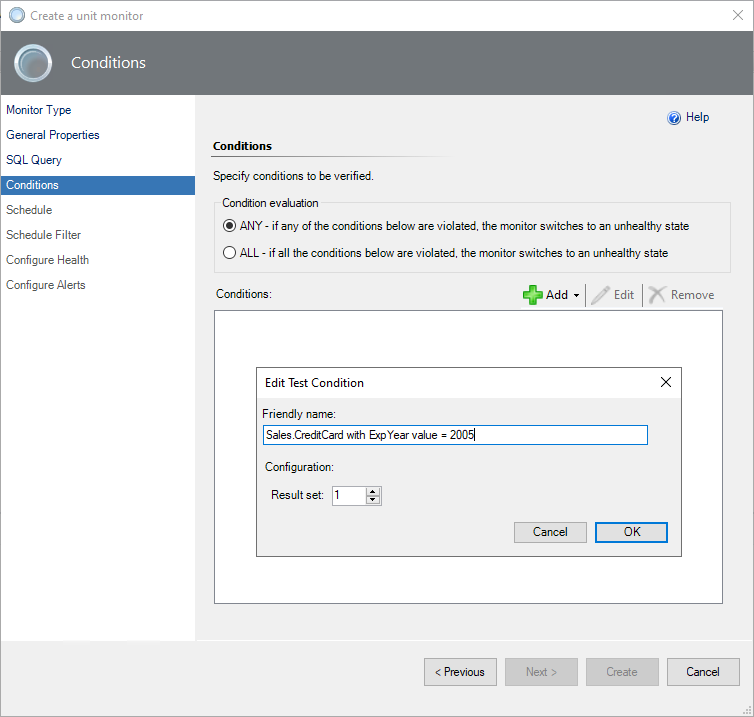

      The monitor operates based on a condition that checks the query result if no rows that correspond to the expiring year 2005 are returned. Otherwise, the monitor switches to an unhealthy state.

   1. Select **Next**.

   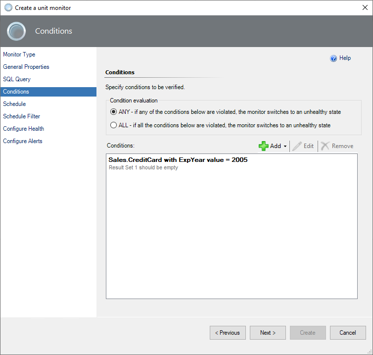

1. At the **Schedule** and **Schedule Filter** steps, leave the default values. The monitor will process the data without a schedule, once every 15 minutes.

1. At the **Configure Health** step, do the following:
  
   1. Select **Critical** as the health state that the monitor should generate if the condition fails.
   1. Change the **Operational State** information if necessary.
   1. Select **Next**.

   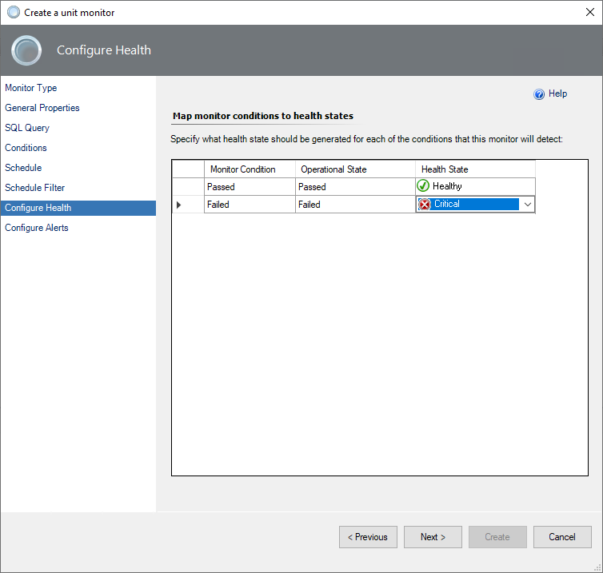

1. At the **Configure Alerts** step, do the following:
  
   1. Select **Generate alerts for this monitor**.
   1. Set **Alert name** as `[Sales].[CreditCard] table with ExpYear values = 2005`.
   1. Set **Alert description** as `The following conditions violated: $Data/Context/Property[@Name='Message']$ The [Sales].[CreditCard] table has rows with ExpYear values = 2005. Consider updating the table to eliminate outdated values.`
   1. When you finish configuring alert properties, select **Create**.

   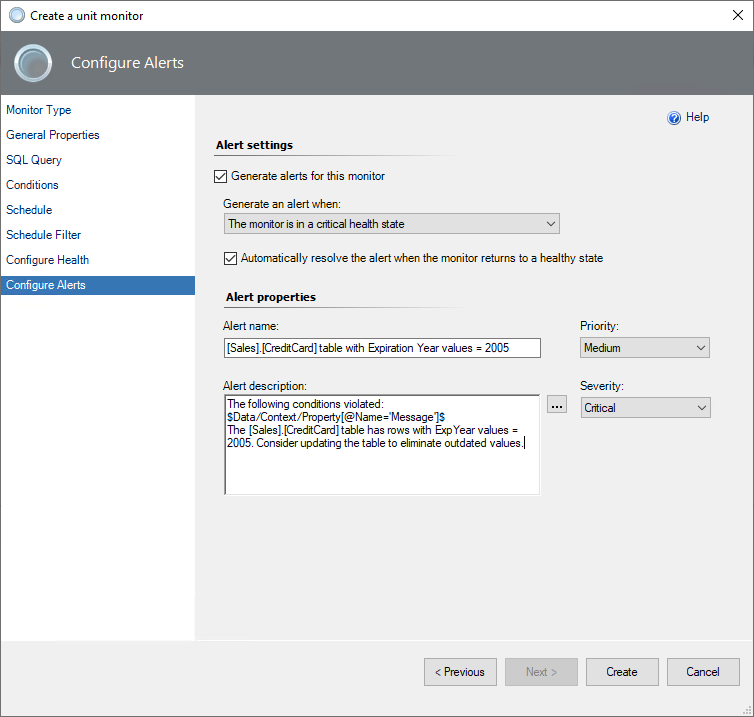

After you create the custom monitor, you can run it to see how it changes its state and generates an alert. In this example, the monitor should switch to the critical state, because the resulting query returns several records in the `Sales.CreditCard` table with the expiring year 2005.

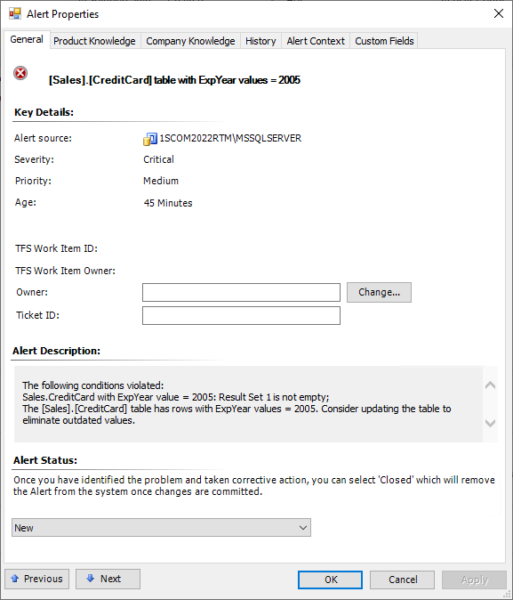

> [!TIP]
> By default, a custom query-based monitor works for all SQL Server instances. To avoid alert storming on instances where the sample database doesn't exist, you need to override the monitor target only to a specific SQL Server instance that hosts the `AdventureWorks2022` database. In the monitor's override properties:
>
> - Set `Enabled = False` for the `MSSQL on Windows: DB Engine` class.
> - Set `Enabled = True` for the specific `SQL Server DB Engine` object that hosts the `AdventureWorks2022` sample database.

## [Example 2 with "Empty Result Set"](#tab/example-2-with-empty-result-set)

In this example, consider the condition under which the `Production.Illustration` table is checked to ensure that for each `IllustrationID` record, an entry also exists in the `Production.ProductModelIllustration` table, because the `Illustration` table has the schema-bound dependency for the `ProductModelIllustration` table:

```SQL
SELECT *
FROM [Production].[Illustration] PIL
LEFT JOIN [Production].[ProductModelIllustration] PMI
ON PIL.IllustrationID = PMI.IllustrationID
WHERE PMI.IllustrationID IS NULL
```

The query returns one record without a model illustration in the `Production.ProductModelIllustration` table:

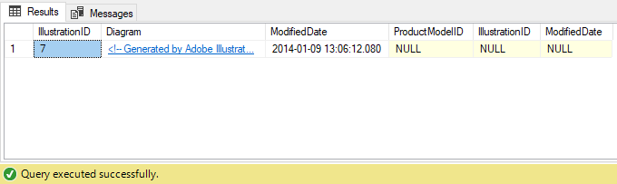

To create a monitor that changes its state to unhealthy if the `Illustration` table doesn't contain models in the dependent `ProductModelIllustration` table, follow these steps:

1. In the System Center Operations Manager console, go to **Authoring** > **Management Pack Objects**. Right-click **Monitors**, select **Create a Monitor**, and then select **Unit Monitor**.

1. At the **Monitor Type** step, do the following:
  
   1. Select **Microsoft SQL Server** > **DB Engine** > **User-defined SQL Query Two-State Monitor**.
   1. In the **Select destination management pack** dropdown list, select a management pack that you want to use. Or select **New** to create a new one.
   1. Select **Next**.

   

1. At the **General Properties** step, do the following:
  
   1. Enter the monitor name as `[Production].[Illustration] table has values w/o model in the [Production].[ProductModelIllustration] table`.
   1. Enter the description as `This monitor checks the [Production].[Illustration] table to find the values with missed models in [Production].[ProductModelIllustration] table.`  
   1. Make your selections for **Monitor target** as `MSSQL on Windows: Local DB Engine` and **Parent monitor** as any of the Entity Health options.
   1. If you want the monitor to be enabled by default, select the **Monitor is enabled** checkbox.
   1. Select **Next**.

   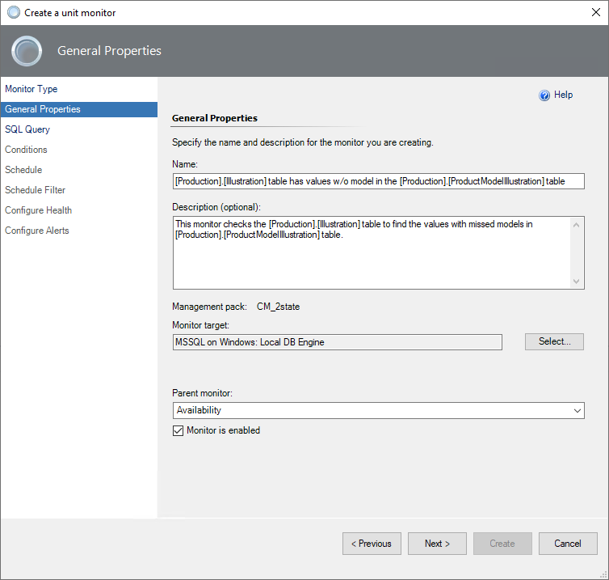

1. At the **SQL Query** step, do the following:
  
   1. Enter the database name as `AdventureWorks2022`.
   1. Enter the query text.
   1. Select the timeouts (in seconds).
   1. Select **Next**.

   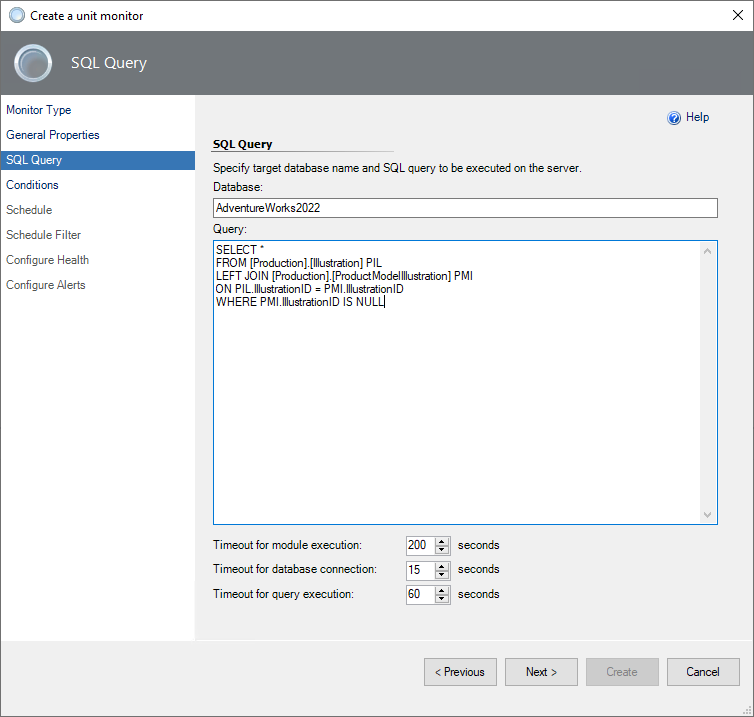

1. At the **Conditions** step, do the following:
  
   1. Select the **ANY** condition. It means that if any of the added conditions are violated, the monitor switches to an unhealthy state. This example needs only one condition.  
   1. To add a new condition, select **Add**, and then select **Empty Result Set**. This condition checks if the specified result set that the query returned is empty.

      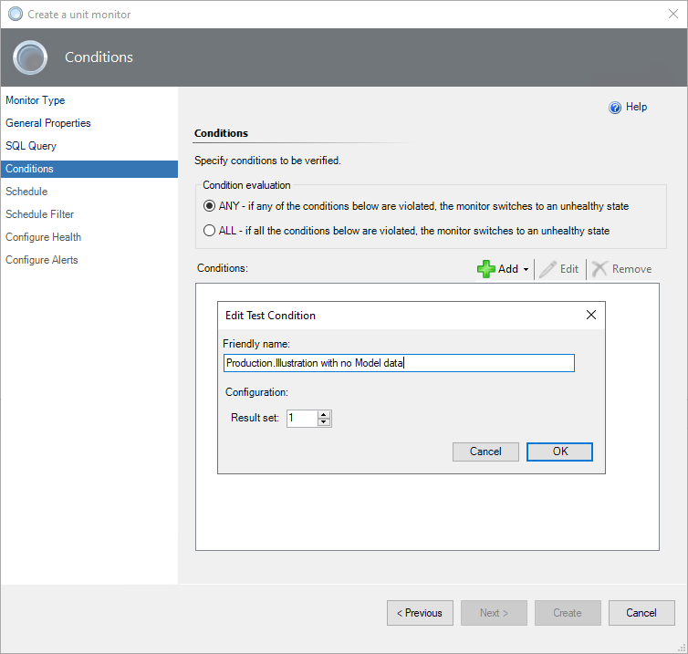

      The monitor operates based on a condition that checks the query result if no illustration IDs that correspond to models are returned. Otherwise, the monitor switches to an unhealthy state.

   1. Select **Next**.  

   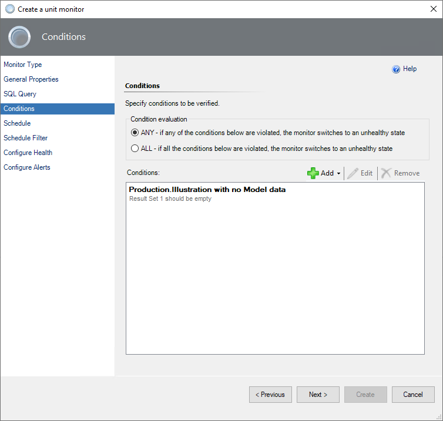

1. At the **Schedule** and **Schedule Filter** steps, leave the default values. The monitor will process the data without a schedule, once every 15 minutes.

1. At the **Configure Health** step, do the following:
  
   1. Select **Critical** as the health state that the monitor should generate if the condition fails.
   1. Change the **Operational State** information if necessary.
   1. Select **Next**.

   

1. At the **Configure Alerts** step, do the following:
  
   1. Select **Generate alerts for this monitor**.
   1. Set **Alert name** as `[Production].[Illustration] table has values w/o model in the [Production].[ProductModelIllustration] table`.
   1. Set **Alert description** as `The following conditions violated: $Data/Context/Property[@Name='Message']$ The [Production].[Illustration] table has rows without the following models in [Production].[ProductModelIllustration] table. Consider updating the [Production].[ProductModelIllustration] table to add missing data.`
   1. When you finish configuring alert properties, select **Create**.

   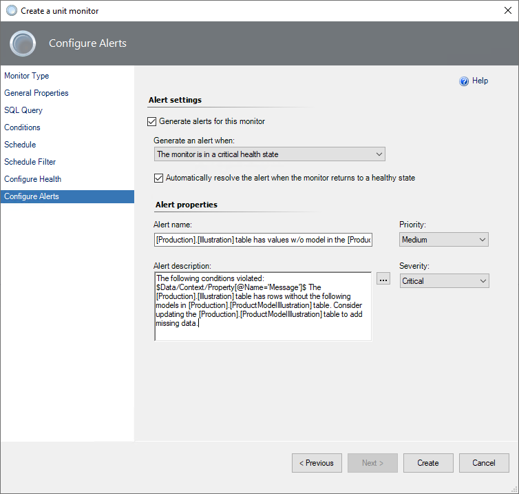

After you create the custom monitor, you can run it to see how it changes its state and generates an alert. In this example, the monitor should switch to the critical state because the resulting query returns a record in the `Product.Illustration` table, whereas there's no data for the `Product.ProductModelIllustration` table.

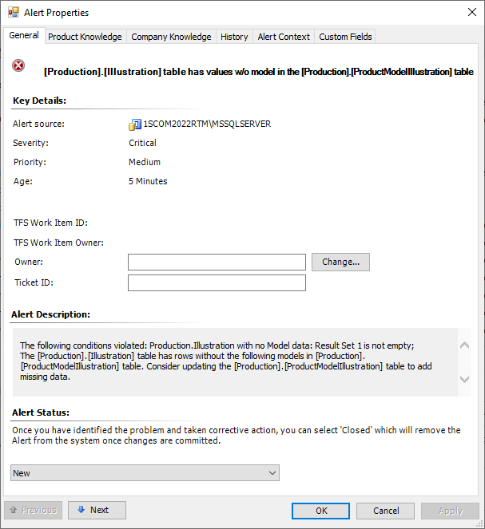

## [Example 3 with "Not Empty Result Set and Scalar Value"](#tab/example-3-with-not-empty-result-set-and-scalar-value)

In this example, consider the condition under which the `Person.Address` table is checked to ensure that for the `Kansas City` record, the number of employees from the `Person.BusinessEntityAddress` table is no more than one. Also, the result set of the query should not be empty. That means the `Kansas City` record exists in the `Person.Address` table:

```SQL
SELECT PA.City, COUNT(PBEA.AddressID) NoOfEmployees
FROM Person.BusinessEntityAddress PBEA
INNER JOIN Person.Address PA
ON PBEA.AddressID = PA.AddressID
WHERE PA.City like 'Kansas City'
GROUP BY PA.City
```

As a result of the query, the `Kansas City` record exists and the number of employees for that city is two:

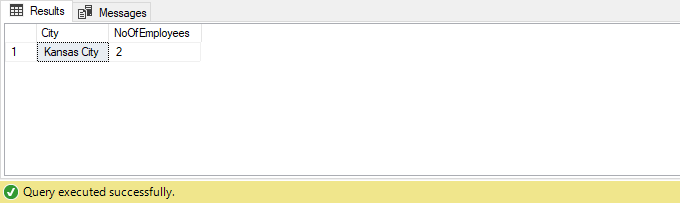

To create a monitor that changes its state to unhealthy if the `Person.Address` table contains a `Kansas City` record with more than one employee, follow these steps:

1. In the System Center Operations Manager console, go to **Authoring** > **Management Pack Objects**. Right-click **Monitors**, select **Create a Monitor**, and then select **Unit Monitor**.
  
1. At the **Monitor Type** step, do the following:

   1. Select **Microsoft SQL Server** > **DB Engine** > **User-defined SQL Query Two-State Monitor**.
   1. In the **Select destination management pack** dropdown list, select a management pack that you want to use. Or select **New** to create a new one.
   1. Select **Next**.

   

1. At the **General Properties** step, do the following:

   1. Enter the monitor name as `[Person].[Address] table has a specific city w/ extra NoOfEmployees values`.
   1. Enter the description as `This monitor checks the number of employees from the [Person].[BusinessEntityAddress] table for the "Kansas City" record in the [Person].[Address table].`
   1. Make your selections for **Monitor target** as `MSSQL on Windows: Local DB Engine` and **Parent monitor** as any of the Entity Health options.
   1. If you want the monitor to be enabled by default, select the **Monitor is enabled** checkbox.
   1. Select **Next**.

   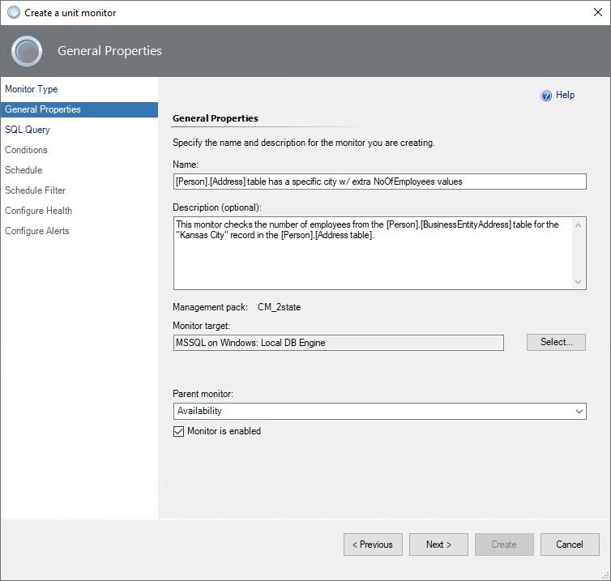

1. At the **SQL Query** step, do the following:

   1. Enter the database name as `AdventureWorks2022`.
   1. Enter the query text.
   1. Select the timeouts (in seconds).
   1. Select **Next**.

   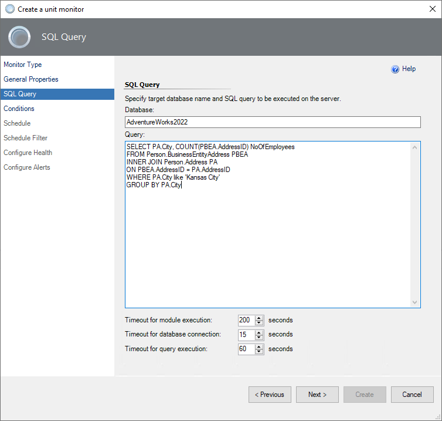

1. At the **Conditions** step, do the following:

   1. Select the **ANY** condition. It means that if any of the added conditions are violated, the monitor switches to an unhealthy state. This example needs both conditions because the monitor checks not only the number of employees for a certain city, but also whether the city exists in the table.  
   1. To add a first condition, select **Add**, and then select **Not Empty Result Set**. This condition checks if the specified result set that the query returned is not empty.

      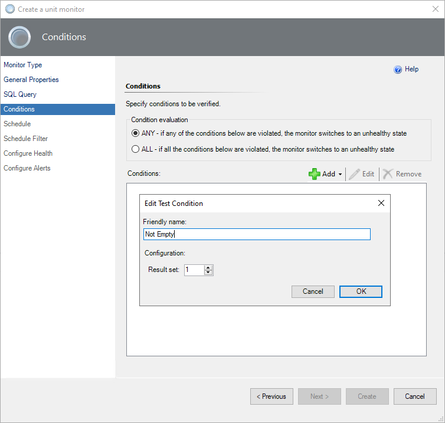

   1. To add a second condition, select **Add**, and then select **Scalar Value**. This condition checks if the specified result set, specified row number, and specified column name (that is, cell value) are equal to 1.

      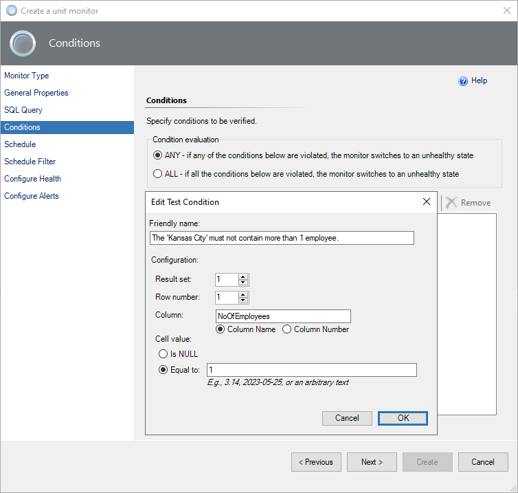

      The monitor operates based on conditions that check that the query result is not empty and the number of employees is equal to 1. Otherwise, the monitor switches to an unhealthy state.

   1. Select **Next**.

   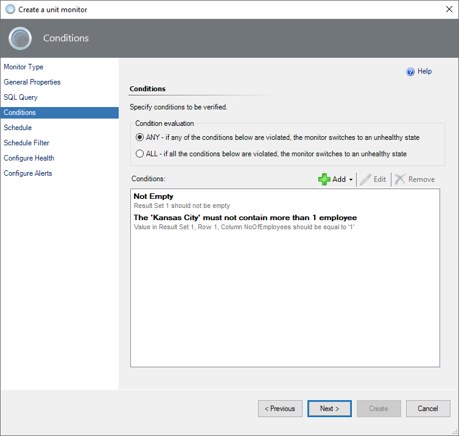

1. At the **Schedule** and **Schedule Filter** steps, leave the default values. The monitor will process the data without a schedule, once every 15 minutes.

1. At the **Configure Health** step, do the following:

   1. Select **Critical** as the health state that the monitor should generate if the condition fails.
   1. Change the **Operational State** information if necessary.
   1. Select **Next**.

   

1. At the **Configure Alerts** step, do the following:

   1. Select **Generate alerts for this monitor**.  
   1. Set **Alert name** as `[Person].[Address] table has a specific city w/ extra NoOfEmployees values`.
   1. Set **Alert description** as `The following conditions violated: $Data/Context/Property[@Name='Message']$ The number of employees in the [Person].[Address] table 'Kansas City' value is not equal to 1.`
   1. When you finish configuring alert properties, select **Create**.

   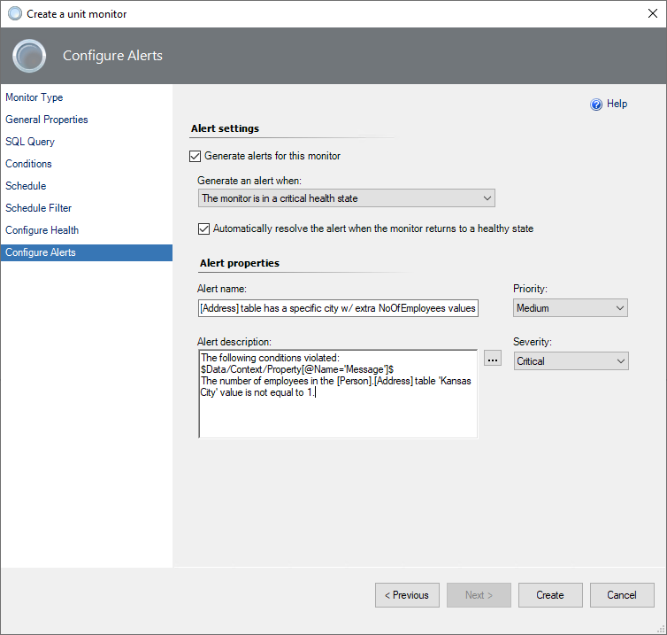

After you create the custom monitor, you can run it to see how it changes its state and generates an alert. In this example, the monitor should switch to the critical state because the resulting query returns a record in the `Person.Address` table and there are two employees for `Kansas City` in the `Person.BusinessEntityAddress` table.

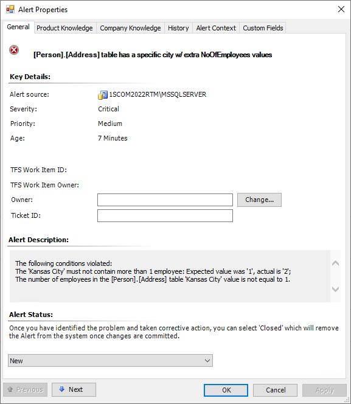

---
