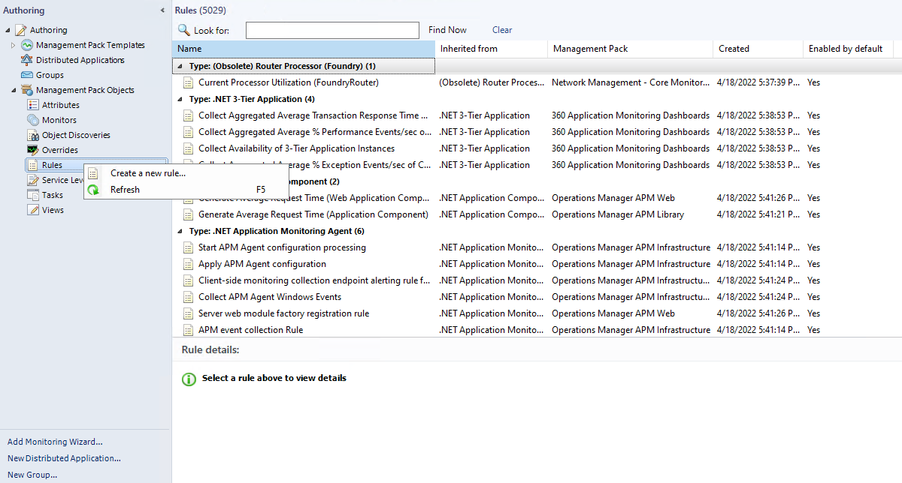
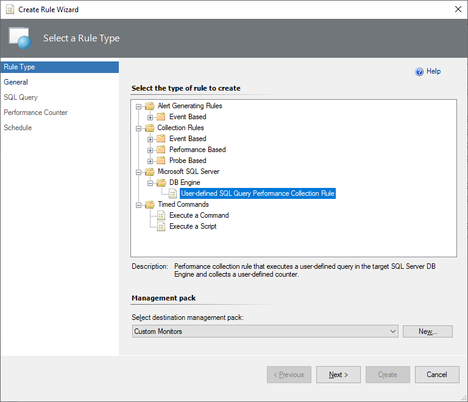
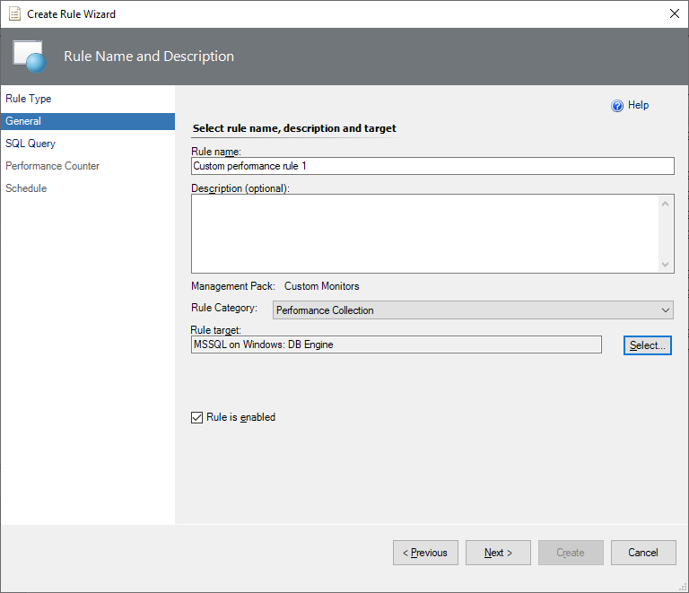
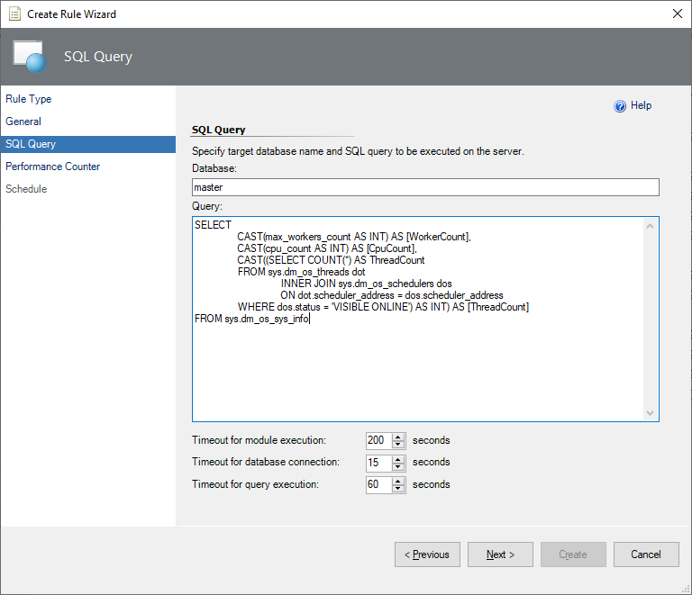
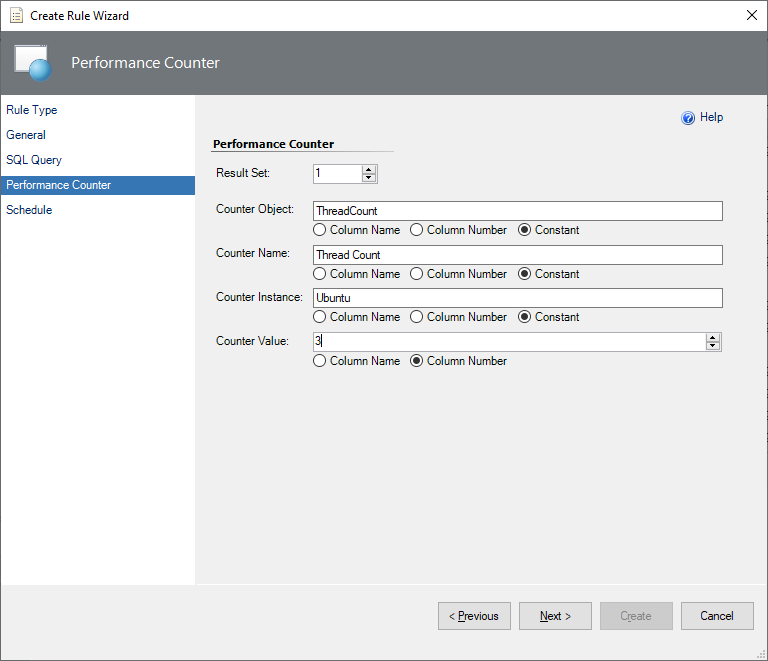
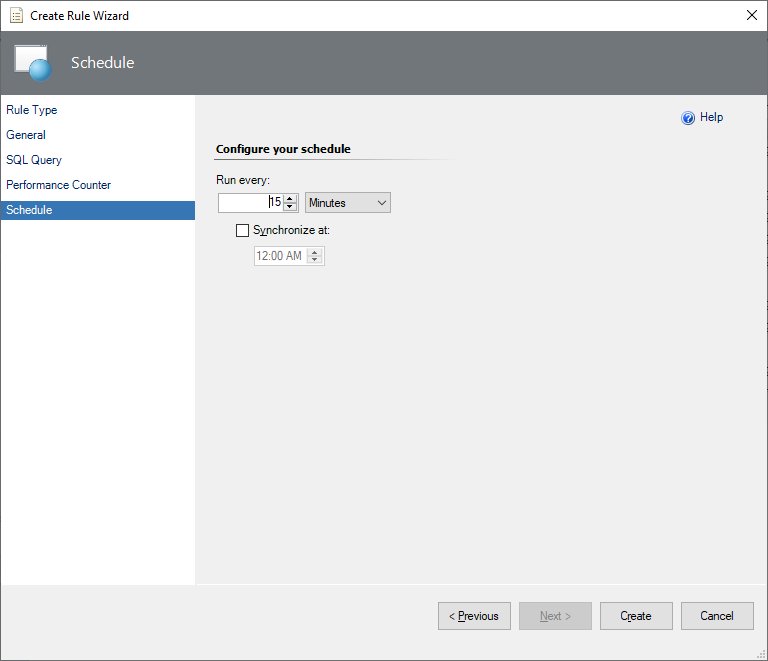

# Custom Query-Based Performance Rule

If the set of default performance rules in the management pack isn't enough to cover your workflows, you can create your rule that targets the SQL Server DB Engine for Windows and Linux platforms.

This article explains how to configure custom query performance rule in Management Pack for SQL Server.

To create a new custom query-based performance rule, perform the following steps:

1. In the System Center Operations Manager console, navigate to **Authoring | Management Pack Objects**, right-click **Rules**, and select **Create a Rule**.

    

2. At the **Rule Type** step, select **Microsoft SQL Server | User-defined SQL Query Performance Collection Rule**.

   From the **Select destination management pack** dropdown list, select a management pack that you want to use or create a new one and select **Next**.

    

3. At the **General** step, enter the rule name and optional description, select **Rule Category**, select **Next**.

    The default selected category is **Performance Collection**.

    

    At this step, you can determine whether this **Rule is enabled** by default or not. Disabled rules can't be displayed in the System Center Operations Manager performance view. If you need to see the performance rule, keep it enabled.

4. At the **SQL Query** step, enter the database name, query text, and timeout (in seconds).

    The default selected database is **master**.

    

    > [!TIP]
    > After creating a custom performance rule, the original query can't be changed later. First, test your query with the SQL Server Management Studio directly against the instances before using it in a custom rule.

5. At the **Performance Counter** step, specify conditions to displaying query results.

    To create custom rule conditions, enter the values in the following fields:

    **Result set** is 1 by default. You can increase the number of expected result sets.

    **Counter Object** - rule's target.

    **Counter Name** - rule's counter.

    **Counter Instance** - monitored instance.

    For Counter Object, Counter Name, and Counter Instance, there are three options to choose:
      - **Column Name**: field to enter the column name
      - **Column Number**: serial number of the column
      - **Constant**: field to enter a value different from the column name; for example, one from all the values in the column

    For the **Counter Value**, you can use the Column Name or the Column Number only.

    

    If you need complex logic, you may cover that with the query.

    After all the required conditions are set, select **Next**.

6. At the **Schedule** page, configure a query execution schedule and synchronization time, and select **Create**.

    

> [!NOTE]
> By default, a custom query-based rule will work for all the SQL Server instances. If you only need to target a specific instance, override your rule after creation.
