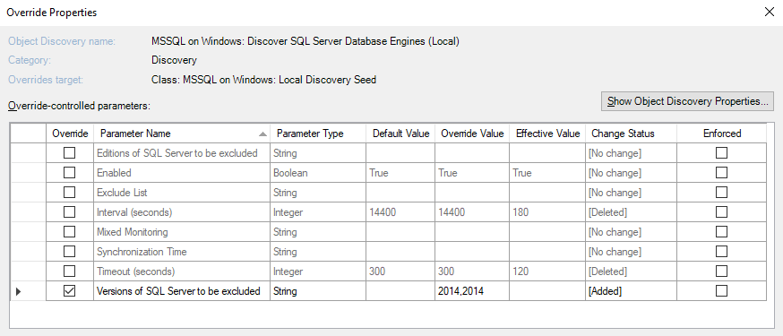
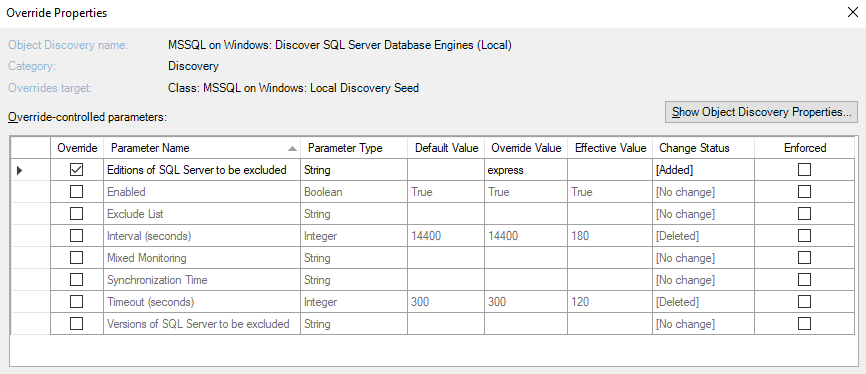
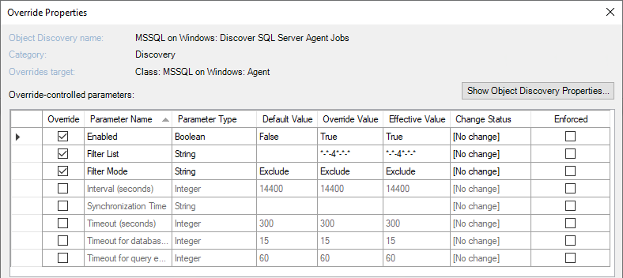
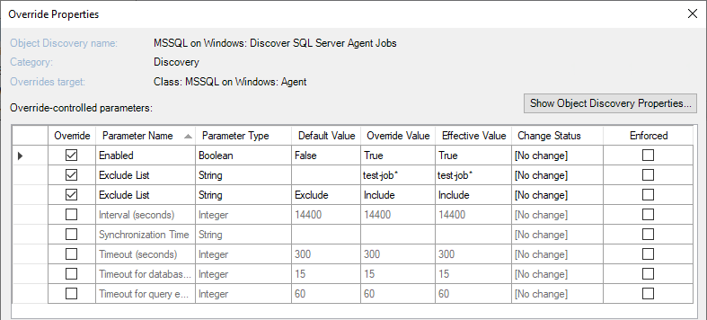

# Disabling Monitoring of Specified SQL Servers and Databases

This section explains how to disable monitoring of SQL Servers and Databases.

## Disabling Monitoring of Specified SQL Server Versions

Management Pack for SQL Server allows you to exclude certain versions of SQL Server instances from monitoring.

To exclude versions that you don't want to monitor, override the **Versions of SQL Server to be excluded** parameter in the **MSSQL on Windows: Discover SQL Server Database Engines (Local)** discovery with the versions that you want to exclude. Use comma to specify multiple versions.

For example, an override "2014,2012" instructs the management pack to skip instances of SQL Server 2012 and 2014.

## Disabling Monitoring of Specified SQL Server Editions

Management Pack for SQL Server allows you to exclude certain editions of SQL Server instances from monitoring.

To exclude editions that you don't want to monitor, override the **Editions of SQL Server to be excluded** parameter in the **MSSQL on Windows: Discover SQL Server Database Engines (Local)** discovery with the editions that you want to exclude. Use comma to specify multiple editions.

The following table lists short names that you can use to override the **Editions of SQL Server to be excluded** parameter.

|Short Name|Covered Editions|
|-|-|
|Enterprise|Enterprise Edition, Enterprise Edition: Core-based Licensing|
|Standard|Standard Edition, Business Intelligence Edition|
|Web|Web Edition|
|Developer|Developer Edition|
|Express|Express Edition, Express Edition with Advanced Services|
|Evaluation|Enterprise Evaluation Edition|

## Disabling Monitoring of Specified Databases by Name

You can disable discovery and monitoring of databases by specifying database names in the **Exclude list** parameter available in the following discoveries:

- MSSQL on Windows: Discover SQL Server Databases for a Database Engine

- MSSQL on Linux: Discover SQL Server Databases for a Database Engine

Use commas to separate database names and asterisks to replace one or more characters. For example, when setting the **Exclude list** parameter to dev*, \*test*, *stage, dbnotmon, the monitoring behavior would be as follows:

|DB Name|Monitored/Not monitored|
|-|-|
|dev|Not monitored|
|dev_sales|Not monitored|
|sales_dev|Monitored|
|test|Not monitored|
|test_sales|Not monitored|
|sales_test|Not monitored|
|stage|Not monitored|
|stage_dev|Monitored|
|dev_stage|Not monitored|
|dbnotmon|Not monitored|
|dbnotmon_sales|Monitored|
|sales_dbnotmon|Monitored|

If you've \* (asterisk) in the list as a database name (for example, \*temp*, \*, \*dev* or \*temp,*), it disables monitoring of any database.

## Disabling Monitoring of specified SQL Agent Jobs by name

Discovery and monitoring of SQL Agent Jobs can be disabled by specifying agent job names in the **Filter list** parameter available in the following discoveries:

- MSSQL on Windows: Discover SQL Server Agent Jobs
- MSSQL on Linux: Discover SQL Server Agent Jobs

The discovery rule supports filtering settings with the following overrides:

- Filter List - for filtering SQL Server Agent Jobs with agent job name.
- Filter Mode - for setting the filter mode ("Exclude" or "Include") for the SQL Agent job filter list.

The filtering modes work as follows:

- Exclude mode - exclude agent jobs by name and do not monitor them.

- Include mode - Include only specific agent jobs by name in monitoring.

- If no filter mode is specified, the default mode is "Exclude".

**Filter list** override supports wildcards and can be used for excluding SQL Agent Jobs with the agent job names with comma-separated values. For example, use conditions like `*test` to exclude jobs that end with `test`, or `Test*` to exclude jobs that start with `Test`, or `*test*` condition to exclude jobs that have a `test` entry in any part of the jobs text.

If an element should contain an asterisk (\*) that is not a wildcard, double quote ("), or backslash (\\), the element must be escaped with a backslash `\`. For example, use conditions like `Job\*3` to exclude jobs that have `Job*3` in the job name, use conditions like `\\job\\service\\` to exclude agent jobs that have `\job\service\` in the job name.

The following table defines wildcard patterns that you can use in expressions:

|Character|Description|Example|  
|---|---|---|
| ? |Matches any single character. You can use the question mark (?) anywhere in a character string.|**Jo?** finds Job, Jo1, Jo_, Jo?, Jo*, but not Job1, or Jobs.
| \* |Matches any number of characters. You can use the asterisk (*) anywhere in a character string.|**Jo\*** finds Jobs, Job1, Job2, Job_prod, but not 1Job. **\*Job** finds 1Job, _Job, test-Job, but not 1Job_prod or Job_Base. **\*Job\*** finds cloudJob_1, Jobtest, 3Job, but not prod_J_O_B.
| " |Matches any number of characters in double quotes. You can use the double quotes (" ") anywhere in a character string. If a character string contains a comma, the string must be quoted.|**"Job, Report"** finds a Job, Report string with a comma inside, but not a Job string separately, and a Report string separately. **"   Job name with leading and trailing spaces  "** finds an entry with all spaces included in double-quotes.

The following table defines escape patterns that you can use in expressions:

|Character|Description|Example|
|---|---|---|
| \\* |Not a wildcard. Escapes the asterisk (\*) anywhere in a character string.|**jobname\\*** finds jobname\*, but not jobname1, jobname_prod, jobnames.
|\\" |Not a wildcard. Escapes the double quotes (") anywhere in a character string.|**job \\"example\\"** finds job "example", but not job\\, job example, or "example".
| \\\\ |Not a wildcard. Escapes the backslash (\\) anywhere in a character string.|**\\\job\\\service\\\\** finds \\job\\service\\, but not \\, job\\\service.
