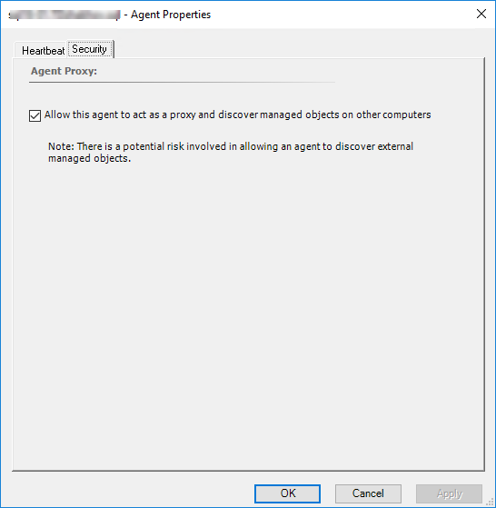

# Enable Agent Proxy Option

The **Agent Proxy** option should be enabled in cases when the agent workflow scenarios discover any non-hosted objects created by the management pack for each SQL Server instance.

## Enable Agent Proxy

To enable the **Agent Proxy** option, follow these steps:

1. Open the System Center Operations Manager console.

2. In the **Administration** view, select **Agent Managed**.

3. Double-click an agent.

4. On the **Security** tab, select the **Allow this agent to act as a proxy and discover managed objects on other computers** checkbox, and select **OK**.

    
