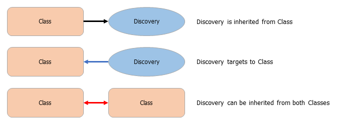
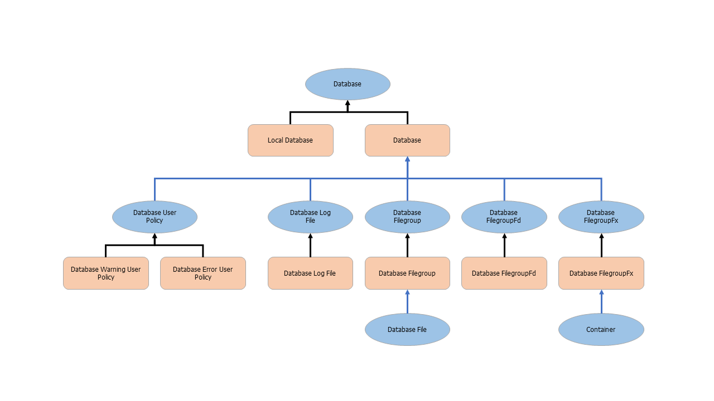

# How Health Rolls Up in SQL Server Management Pack

This section explains diagrams that show how the health state of objects roll up in Management Pack for SQL Server.

## Legend

The following figure explains how to read the diagram.

## Database Engine Health Rollup Diagram

The following diagram shows the inheritance model of the health state of Database Engine objects. The health state of child objects affects the health state of parent objects.

## Database Health Rollup Diagram

The following diagram shows the inheritance model of the health state of database objects. The health state of child objects affects the health state of parent objects.

