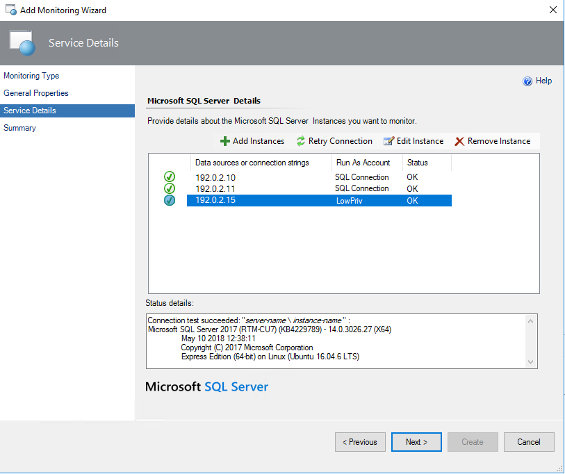

# Low-Privilege Monitoring

All workflows (discoveries, rules, monitors, and actions) in this management pack are bound to [Run As Profiles](sql-server-management-pack-run-as-profiles.md).

To enable low-privilege monitoring, grant appropriate permissions to Run As accounts and map these accounts to respective Run As Profiles.

>[!NOTE]
>The **Virtual Log File Count** monitor (VLF) does not support low-privilege monitoring on SQL Servers 2012 and 2014.

## Agent Monitoring

This section explains how to configure low-privilege agent monitoring.

### In Active Directory

1. In Active Directory, create the following domain users for low-privilege access to the target SQL Server instances:

    - SQLTaskAction
    - SQLDiscovery
    - SQLMonitor

2.  Create the **SQLMPLowPriv** domain group and add the following domain users to this group:

    - SQLDiscovery
    - SQLMonitor

3. Grant the **SQLMPLowPriv** group the **Read-only Domain Controllers** permission.

### On Agents

1. Grant the **SQLTaskAction** user and the **SQLMPLowPriv** group the **Read** permission at HKLM:\\Software\\Microsoft\\Microsoft SQL Server.

2. Add the **SQLTaskAction** and **SQLMonitor** users to the **EventLogReaders** local group.

3. Configure the **Allow log on locally** local security policy to allow the **SQLTaskAction** user and the **SQLMPLowPriv** domain group users to log on locally.

4. Grant **Execute Methods**, **Enable Account**, **Remote Enable**, and **Read Security** permissions to **SQLTaskAction** and **SQLMPLowPriv** for the following WMI namespaces:

    - root
    - root\cimv2
    - root\default
    - root\Microsoft\SqlServer\ComputerManagement11 (if exists)
    - root\Microsoft\SqlServer\ComputerManagement12 (if exists) 
    - root\Microsoft\SqlServer\ComputerManagement13 (if exists)
    - root\Microsoft\SqlServer\ComputerManagement14 (if exists)
    - root\Microsoft\SqlServer\ComputerManagement15 (if exists)

5. On each monitored instance, grant the **SQLMPLowPriv** grop the **Read** permission at HKLM:\Software\Microsoft\Microsoft SQL Server\\[InstanceID]\MSSQLServer\Parameters.

### Extra Steps for Cluster SQL Server Instances

1. Take the steps above for each cluster node.

2. Grant **SQLMPLowPriv** and **SQLTaskAction** the **Remote Launch** and **Remote Activation** DCOM permissions using DCOMCNFG.

3. Allow Windows Remote Management through Windows Firewall.

4. Grant the **SQLMPLowPriv** group **Full Control** to the cluster using Failover Cluster Manager.

5. Grant **Execute Methods**, **Enable Account**, **Remote Enable**, and **Read Security** permissions to **SQLTaskAction** and **SQLMPLowPriv** for the **root\MSCluster** WMI namespace.

### On SQL Server Instances

1. Open SQL Server Management Studio and connect to the SQL Server Database Engine instance.

2. In SQL Server Management Studio, for each instance of SQL Server Database Engine running on a monitored server, create a login for **SQLMPLowPriv** and **SQLTaskAction**. 
  
   To add **SQLMPLowPriv**, in the **Object Types** window, select the **Groups** checkbox.

3. Create **SQLMPLowPriv** and **SQLTaskAction** users in each user database, **master**, **msdb**, and **model** databases. 
  
4. Link **SQLMPLowPriv** users to the **SQLMPLowPriv** login and **SQLTaskAction** users to the **SQLTaskAction** login:

      ```SQL
      --  This script is an example of how to create new users
      --  in the msdb database. Execute this script
      --  for every database on each SQL instance.
      USE [msdb]
      GO
      CREATE USER [SQLMPLowPriv] FOR LOGIN [SQLMPLowPriv]
      CREATE USER [SQLTaskAction] FOR LOGIN [SQLTaskAction]
      ```

5. Grant **SQLMPLowPriv** the following permissions:

      ```SQL
      USE [master]
      GO
      GRANT VIEW SERVER STATE TO [SQLMPLowPriv]
      GRANT VIEW ANY DEFINITION TO [SQLMPLowPriv]
      GRANT VIEW ANY DATABASE TO [SQLMPLowPriv]
      GRANT EXECUTE ON xp_readerrorlog TO [SQLMPLowPriv]

      USE [msdb]
      GO
      GRANT EXECUTE ON msdb.dbo.sp_help_job TO [SQLMPLowPriv]
      GRANT EXECUTE ON msdb.dbo.sp_help_jobactivity TO [SQLMPLowPriv]
      GRANT SELECT ON sysjobs_view TO [SQLMPLowPriv]
      GRANT SELECT ON sysschedules TO [SQLMPLowPriv]
      GRANT SELECT ON sysjobschedules TO [SQLMPLowPriv]
      GRANT SELECT ON log_shipping_monitor_history_detail
        TO [SQLMPLowPriv]
      GRANT SELECT ON log_shipping_monitor_secondary
        TO [SQLMPLowPriv]
      GRANT SELECT ON log_shipping_secondary_databases
        TO [SQLMPLowPriv]
      GRANT SELECT ON log_shipping_monitor_primary
        TO [SQLMPLowPriv]
      GRANT SELECT ON log_shipping_primary_databases
        TO [SQLMPLowPriv]
      ```

6. For the **msdb** database, assign the **SQLMPLowPriv** user both the **SQLAgentReaderRole** role and the **PolicyAdministratorRole** role:

      ```SQL
      USE [msdb]
      GO
      ALTER ROLE [SQLAgentReaderRole] ADD MEMBER [SQLMPLowPriv]
      ALTER ROLE [PolicyAdministratorRole] ADD MEMBER [SQLMPLowPriv]
      ```

### On SMB Shares

1. Grant share permissions by opening the share properties dialog for the share that hosts SQL Server data files or SQL Server transaction log files.
  
2. Grant the **Read** permission to **SQLMPLowPriv**.
  
3. Grant NTFS permissions by opening the properties dialog for the shared folder and navigating to the **Security** tab.
  
4. Grant the **Read** permission to **SQLMPLowPriv**.

### Optional Steps for Tasks on Agents

Some optional System Center Operations Manager tasks require a higher privilege on an agent machine and/or database to allow task execution.

Take the following steps on an agent machine or database only if you want to allow the System Center Operations Manager console operator to take remedial actions:

1. If the task is related to starting or stopping an NT service (such as DB Engine Service, SQL Server Agent service, SQL Full Text Search Service, Integration Services), on the agent machine, grant the **SQLTaskAction** user the permission to start or stop an NT service. This involves setting a service security descriptor. For more information, see [Sc sdset](/previous-versions/windows/it-pro/windows-server-2008-R2-and-2008/cc742037(v=ws.10)).

    Read existing privileges for the given service using **sc sdshow** and grant extra privileges to the **SQLTaskAction** user.

    For example, if the results of the **sdshow** command for SQL Server service are as follows:

    ```
    *D:(A;;CCLCSWRPWPDTLOCRRC;;;SY)(A;;CCDCLCSWRPWPDTLOCRSDRCWDWO;;;BA)(A;;CCLCSWLOCRRC;;;IU)(A;;CCLCSWLOCRRC;;;SU)S:(AU;FA;CCDCLCSWRPWPDTLOCRSDRCWDWO;;;WD)*
    ```

    In this case, the following command grants sufficient access to **SQLTaskAction** for starting and stopping the SQL Server service. Replace 'SQLServerServiceName' and 'SID for SQLTaskAction' with the appropriate values and keep everything on a single line.

    ```
    *sc sdset SQLServerServiceName D:(A;;GRRPWP;;;SID for SQLTaskAction)(A;;CCLCSWRPWPDTLOCRRC;;;SY)(A;;CCDCLCSWRPWPDTLOCRSDRCWDWO;;;BA)(A;;CCLCSWLOCRRC;;;IU)(A;;CCLCSWLOCRRC;;;SU)S:(AU;FA;CCDCLCSWRPWPDTLOCRSDRCWDWO;;;WD)*
    ```

2. In SQL Server Management Studio, add **SQLTaskAction** to the **db_owner** database role for each database if the task is related to performing database checks:

    - Check Catalog (DBCC)
    - Check Database (DBCC)
    - Check Disk (DBCC)” (invokes DBCC CHECKALLOC)

    ```sql
    USE [msdb]
    GO
    ALTER ROLE [db_owner] ADD MEMBER [SQLTaskAction]
    ```

3. Grant the ALTER ANY DATABASE privilege to the **SQLTaskAction** login to run the task if the task is related to changing the database state:

    - Set Database Offline
    - Set Database Emergency State
    - Set Database Online

    ```sql
    USE [master]
    GO
    GRANT ALTER ANY DATABASE TO [SQLTaskAction]
    ```

### In System Center Operations Manager

1. [Import SQL Server Management Pack](sql-server-management-pack-management-pack-delivery.md).

2. Create the following Windows-based Run As accounts:

    - SQLTaskAction
    - SQLDiscovery
    - SQLMonitor

3. In the System Center Operations Manager console, configure Run As Profiles as follows:

    - Set the **Microsoft SQL Server Task** Run As Profile to use the **SQLTaskAction** Run As account.
    - Set the **Microsoft SQL Server Discovery** Run As Profile to use the **SQLDiscovery** Run As account.
    - Set the **Microsoft SQL Server Monitoring** Run As profile to use the **SQLMonitor** Run As account.

To prevent SQL Server monitoring issues, the **SQLTaskAction**, **SQLDiscovery**, and **SQLMonitor** Run As accounts should be used to manage the instances of **MSSQL on Windows: Local DB Engine**.

## Agentless Monitoring

[Applicable to SQL Server on Windows and on Linux.]

This section explains how to configure low-privilege agentless monitoring.

### On SQL Server Instances

1. Open SQL Server Management Studio and connect to the SQL Server Database Engine instance.

2. In SQL Server Management Studio, for each instance of SQL Server Database Engine, create a SQL login for monitoring and grant the following permissions:

    ```sql
    USE [msdb]
    GO
    GRANT VIEW SERVER STATE TO [SQLMPLowPriv]
    GRANT VIEW ANY DEFINITION TO [SQLMPLowPriv]
    GRANT VIEW ANY DATABASE TO [SQLMPLowPriv]
    GO
    ALTER ROLE [db_datareader] ADD MEMBER [SQLMPLowPriv]
    GRANT EXECUTE ON xp_readerrorlog TO [SQLMPLowPriv]
    GO
    ```

3. Create a user in each user database, **master**, **msdb**, and **model** databases. 

4. Link created users to the **SQLMPLowPriv** login.

    ```sql
    --  This script is an example of how to create new users
    --  in the msdb database. Execute this script
    --  for every database on each SQL instance.
    USE [msdb]
    GO
    CREATE USER [SQLMPLowPriv] FOR LOGIN [SQLMPLowPriv]
    ```

5. For the **msdb** database, grant the user the following permissions:

    ```sql
    USE [msdb]
    GO
    GRANT EXECUTE ON msdb.dbo.sp_help_job TO [SQLMPLowPriv]
    GRANT EXECUTE ON msdb.dbo.sp_help_jobactivity TO [SQLMPLowPriv]
    GRANT SELECT ON sysjobs_view TO [SQLMPLowPriv]
    GRANT SELECT ON sysschedules TO [SQLMPLowPriv]
    GRANT SELECT ON sysjobschedules TO [SQLMPLowPriv]
    GRANT SELECT ON log_shipping_monitor_history_detail
      TO [SQLMPLowPriv]
    GRANT SELECT ON log_shipping_monitor_secondary
      TO [SQLMPLowPriv]
    GRANT SELECT ON log_shipping_secondary_databases
      TO [SQLMPLowPriv]
    GRANT SELECT ON log_shipping_monitor_primary
      TO [SQLMPLowPriv]
    GRANT SELECT ON log_shipping_primary_databases
      TO [SQLMPLowPriv]
    ```

Some optional System Center Operations Manager tasks require a higher privilege on an agent machine and/or database to allow task execution.

Take the following steps only if you want to allow the System Center Operations Manager console operator to take remedial actions on that target:

1. In SQL Server Management Studio, add **SQLMPLowPriv** to the **db_owner** database role for each database if the task is related to performing database checks:
      
    - Check Catalog (DBCC)
    - Check Database (DBCC)
    - Check Disk (DBCC) (invokes DBCC CHECKALLOC)

    ```sql
    USE [yourdatabase]
    GO
    ALTER ROLE [db_owner] ADD MEMBER [SQLMPLowPriv]
    GO
    ```

2. Grant the ALTER ANY DATABASE privilege to **SQLMPLowPriv** to perform the following database tasks:
      
    - Set Database Online
    - Set Database Offline
    - Set Database to Emergency State

    ```sql
    USE [master]
    GO
    GRANT ALTER ANY DATABASE TO [SQLMPLowPriv]
    ```

3. For the **msdb** database, add the **SQLMPLowPriv** user to the **SQLAgentReaderRole** and **PolicyAdministratorRole** database roles:

    ```sql
    USE [msdb]
    GO
    ALTER ROLE [PolicyAdministratorRole]
      ADD MEMBER [SQLMPLowPriv]
    GO
    USE [msdb]
    GO
    ALTER ROLE [SQLAgentReaderRole]
      ADD MEMBER [SQLMPLowPriv]
    GO
    ```

### Using Monitoring Wizard

To configure low-privilege agentless monitoring using the monitoring wizard, perform the steps provided in the [Configuring Agentless Monitoring Mode](sql-server-management-pack-monitoring-modes.md#configuring-agentless-monitoring-mode) section, but with the following changes:

1. In the **Add Monitoring Wizard** window, click **Add Instances**.

2. In the **Add Instances** window, select a common Run As account with the appropriate SQL low-privilege login and specify data sources and/or connection strings. 

    For example:
     
     - 172.31.2.133;MachineName="W12BOX-839";InstanceName="MSSQLSERVER";Platform="Windows"
     - 172.31.2.133,50626;MachineName="W12BOX-839";InstanceName="SQLEXPRESS";Platform="Windows"
     - 172.17.5.115;MachineName="ubuntu";InstanceName="MSSQLSERVER";Platform="Linux"

    You can also create a new Run As account. For that, in the **Add Instances** window, click **New**, enter a new name for the Run As account, and specify credentials to access the SQL Server that you want to monitor.

    

    After connection is established, you can view and edit properties of the added instance.

    

## Mixed Monitoring

To configure low-privilege [mixed monitoring](sql-server-management-pack-monitoring-modes.md#configuring-mixed-monitoring-mode), perform the steps described in the [Agent Monitoring](#agent-monitoring) section and do the following:

- [Configure remote access to WMI](#managing-remote-access-to-wmi)

- [Grant permissions to get information about the services](#granting-service-permissions)

- [Use a registry key to manage the remote access to the registry](#managing-remote-access-to-the-registry)

### Managing Remote Access to WMI

To configure security for configurations with low-privilege accounts, perform the following steps on each mixed mode monitoring server:

1. Launch the **mmc.exe** console and add the following snap-ins:

    - Component Services
    - WMI Control (for a local computer)

2. Expand **Component Services**, right-click **My Computer**, and select **Properties**.

   

3. Open the **COM Security** tab.

4. In the **Launch and Activation Permissions** section, click **Edit Limits**.

   

5. Grant the following permissions to the remote machine account:

    - Remote Launch
    - Remote Activation

   

6. Go to the **WMI Control** snap-in and open its properties.
  
7. Open the **Security** tab and select the following namespaces:

    - Root\CIMV2
    - Root\Microsoft\SqlServer
    - Root\Microsoft\SqlServer\ComputerManagement11 (if exists)
    - Root\Microsoft\SqlServer\ComputerManagement12 (if exists)
    - Root\Microsoft\SqlServer\ComputerManagement13 (if exists)
    - Root\Microsoft\SqlServer\ComputerManagement14 (if exists)
    - Root\Microsoft\SqlServer\ComputerManagement15 (if exists)

8. Click **Security**.

9. Grant the following permissions to the target computer:

    - Enable Account
    - Remote Enable

   

10. Click **Advanced**.

11. Select the target account and click **Edit**.

12. From the **Applies to** drop-down list, select **This namespace only**.

13. In the **Permissions** section, enable the following checkboxes:

    - Enable Account
    - Remote Enable

    

### Granting Service Permissions

To get information about the services, grant required permissions according to the following steps:

1. Open the PowerShell console.

2. Run the following command to retrieve a **Spotlight User** SID.

    ```powershell
    function GetSidByName($userName){
    $objUser = New-Object System.Security.Principal.NTAccount($userName)
    $strSID = $objUser.Translate([System.Security.Principal.SecurityIdentifier])
    return $strSID.Value
    }
    GetSidByName 'domainName\userName'
    ```

    Replace **domainName\userName** with the domain and user names for the **Spotlight User** account.

    

3. From the Windows command prompt, run the following command to retrieve the current SDDL for the Services Control Manager:

    ```
    sc sdshow scmanager > file.txt
    ```

    The SDDL is saved to the **file.txt** file and looks similar to the following one:
    
    ```
    D:(A;;CC;;;AU)(A;;CCLCRPRC;;;IU)(A;;CCLCRPRC;;;SU)(A;;CCLCRPWPRC;;;SY)(A;;KA;;;BA)S:(AU;FA;KA;;;WD)(AU;OIIOFA;GA;;;WD). 
    ```

4. Modify the SDDL string by copying the SDDL section that ends in **IU** (Interactive Users).

    This section is enclosed in parentheses (that is, A;;CCLCRPRC;;;IU). Paste this clause directly after the clause you have copied.

    In the following text, replace the IU string with the **Spotlight User** SID.

    The new SDDL looks similar to the following one: 
    
    ```
    D:(A;;CC;;;AU)(A;;CCLCRPRC;;;IU) (A;;CCLCRPRC;;;S-1-5-21-214A909598-1293495619-13Z157935-75714)(A;;CCLCRPRC;;;SU)(A;;CCLCRPWPRC;;;SY)(A;;KA;;;BA) S:(AU;FA;KA;;;WD)(AU;OIIOFA;GA;;;WD)
    ```

5. Set security credentials to access the Service Control Manager by using the **sdset** command.

    ```
    sc sdset scmanager "D:(A;;CC;;;AU)(A;;CCLCRPRC;;;IU)(A;;CCLCRPRC;;;SU)(A;;CCLCRPWPRC;;;SY)(A;;KA;;;BA)(A;;CCLCRPRC;;;S-1-5-21-214A909598-1293495619-13Z157935-75714)S:(AU;FA;KA;;;WD)(AU;OIIOFA;GA;;;WD)"
    ```

6. Set rights for SQL Server, SQL agent, and SQL Full-text Filter Daemon Launcher services by using the **Command-Line Tool SubInACL** utility for the **Spotlight User** SID.

    Run the utility with the following options:

    ```
    subinacl.exe /service mssqlserver /GRANT= S-1-5-21-214A909598-1293495619-13Z157935-75714=LQSEI
    
    subinacl.exe /service sqlserveragent /GRANT= S-1-5-21-214A909598-1293495619-13Z157935-75714=LQSEI
    
    subinacl.exe /service mssqlfdlauncher /GRANT= S-1-5-21-214A909598-1293495619-13Z157935-75714=LQSEI
    ```
    
    

    The following rights can be read as:
    
      - L: Read contro
      - Q: Query Service Configuration
      - S: Query Service Status
      - E: Enumerate Dependent Services
      - I: Interrogate Service

7. Set rights for **ClusSvc** (Cluster Service) using the **Command-Line Tool SubInACL** utility for the **Spotlight User** SID.

    Run the utility with the following options:

    ```
    subinacl.exe /service clussvc /GRANT= S-1-5-21-214A909598-1293495619-13Z157935-75714=LQSEI
    ```

### Managing Remote Access to the Registry

Create a registry key to manage remote access to the registry.

To create a key, perform the following steps:

1. Open **Registry Editor** (Regedt32.exe) and locate the **HKEY_LOCAL_MACHINE\SYSTEM\CurrentControlSet\Control** key.

2. In the **Edit** menu, click **Add Key** and enter the following values:

    - **Key Name:** SecurePipeServers
    - **Class:** REG_SZ

3. Locate the following key: 'HKEY_LOCAL_MACHINE\SYSTEM\CurrentControlSet\Control\SecurePipeServers'.

4. In the **Edit** menu, click **Add Key** and enter the following values:

    - **Key Name:** winreg
    - **Class:** REG_SZ

5. Locate the following key: 'HKEY_LOCAL_MACHINE\SYSTEM\CurrentControlSet\Control\SecurePipeServers\winreg'.

6. In the **Edit** menu, click **Add Key** and enter the following values:

    - **Value Name:** Description
    - **Data Type:** REG_SZ
    - **String:** Registry Server

7. Locate the following key: 'HKEY_LOCAL_MACHINE\SYSTEM\CurrentControlSet\Control\SecurePipeServers\winreg'.

8. Right-click **winreg**, click **Permissions**, and edit the current permissions, or add users or groups you want to grant access to.

9. Quit **Registry Editor** and restart Windows.