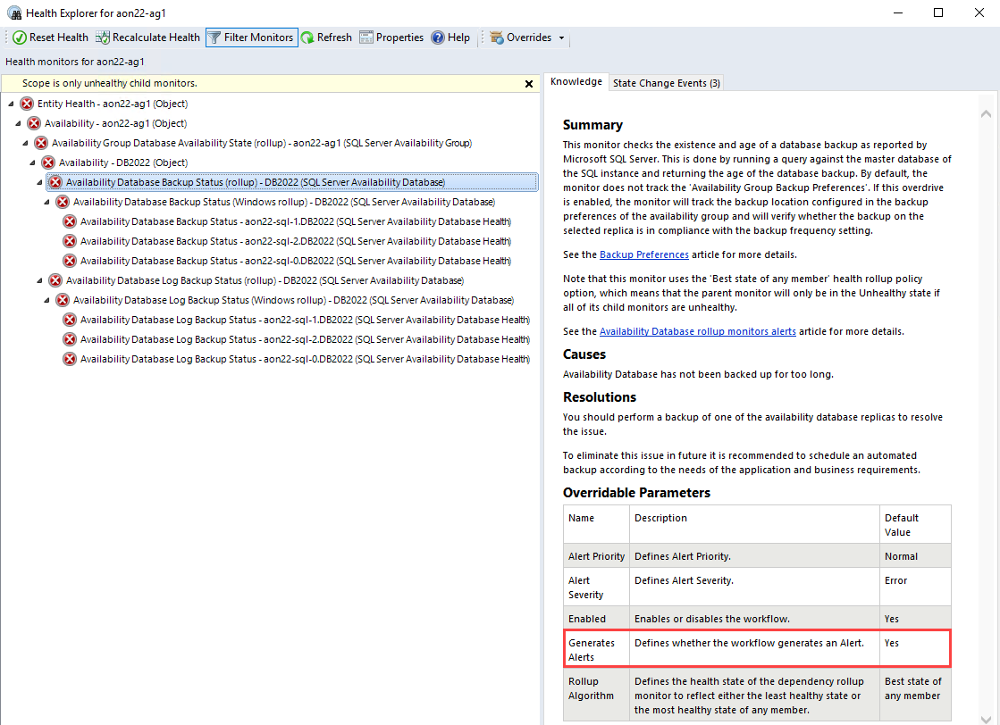

# Monitoring Configuration in Management Pack for SQL Server

This section explains monitoring configurations in Management Pack for SQL Server.

## SQL Server Agent Alerting Rules: Specifics of Configuration

Management Pack for SQL Server provides the following SQL Server agent alerting rules:

- MSSQL on Windows: Alert engine stopped due to unrecoverable local eventlog errors
- MSSQL on Windows: A SQL job failed to complete successfully
- MSSQL on Windows: Job step cannot be run because the subsystem failed to load
- MSSQL on Windows: The agent is suspect. No response within last minutes
- MSSQL on Windows: SQL Server Agent could not be started
- MSSQL on Windows: SQL Server Agent initiating self-termination
- MSSQL on Windows: Step of a job caused an exception in the subsystem
- MSSQL on Windows: SQL Server Agent is unable to connect to SQL Server
- MSSQL on Windows: Unable to re-open the local eventlog

By default, these rules are enabled in [agent monitoring](sql-server-management-pack-monitoring-modes.md) mode, but disabled in [mixed monitoring](sql-server-management-pack-monitoring-modes.md#configuring-mixed-monitoring-mode) mode because Operations Manager doesn't allow events from event logs to collect on remote computers. To change this, you can override each of these rules by enabling the **AllowProxying** option.

> [!NOTE]
> Enabling the **AllowProxying** option may cause remote code execution. Don't enable this option unless you're sure that your computer is secured.

None of these rules work in the [agentless monitoring](sql-server-management-pack-monitoring-modes.md#configuring-agentless-monitoring-mode) mode and are unavailable for SQL on Linux.

## Always On Alert Rules

Management Pack for SQL Server has two event rules for alerting in cases when the following events appear in the Windows Application log:

- Event ID 1480, Database Replica role is changed

- Event ID 19406, Availability Replica role changed

By default, SQL Server may not fire these events in the application log. To enable them, run the following T-SQL scripts:

```sql
sp_altermessage 1480, 'with_log', 'true'
```

```sql
sp_altermessage 19406, 'with_log', 'true'
```

## Availability Database Backup Monitoring

Management Pack for SQL Server provides monitors that check the existence and age of a database and log backups as reported by Microsoft SQL Server. This is done by running a query against the master database of the SQL instance and returning the age of the backup.

These monitors are located under the Availability Group Database Availability State rollup in the Availability Group view. The list of monitors is as follows:

- Availability Database Backup Status monitor
- Availability Database Log Backup Status monitor

### Availability Database Backup Status monitor

This monitor targets on Availability Database Health and checks the database backup status according to the threshold in days.

By default, the monitor doesn't track the [Availability Group Backup Preferences](/sql/database-engine/availability-groups/windows/availability-group-properties-new-availability-group-backup-preferences-page). If this overdrive is enabled, the monitor will track the backup location configured in the backup preferences of the availability group and will verify whether the backup on the selected replica complies with the backup frequency setting.

The backup preferences of the selected availability group can be as follows:

- **Prefer Secondary**

  Specifies that backups should occur on a secondary replica except when the primary replica is the only replica online. In that case, the backup should occur on the primary replica. This is the default option.

- **Secondary only**

  Specifies that backups should never be performed on the primary replica. If the primary replica is the only replica online, the backup shouldn't occur.

- **Primary**

  Specifies that the backups should always occur on the primary replica. This option is useful if you need backup features, such as creating differential backups that aren't supported when backup is run on a secondary replica.

- **Any Replica**

  Specifies that you prefer that backup jobs ignore the role of the availability replicas when choosing the replica to perform backups.
  > [!NOTE]
  > Backup jobs might evaluate other factors such as backup priority of each availability replica in combination with its operational state and connected state.

The following are examples of turning the track settings option on and off in the case of **backup preferences is the Primary replica** for Availability Group, and the **backup file exists on a secondary replica** only.

Track backup preferences parameter is **enabled** - for **both database replicas** the Availability Database Backup Status monitor is in a **Critical** state:


Track backup preferences parameter is **disabled** - only for the **primary database replica** the Availability Database Backup Status monitor is in a **Critical** state:


### Availability Database Log Backup Status monitor

This monitor targets on Availability Database Health and checks the database log backup status according to the threshold in minutes.

## Availability Database rollup monitors alerts

Availability Database Backup Status and Availability Database Log Backup Status monitors are configured with the rollup policy "Best state of any member" and have the critical alerts on the respective rollup by default to display the complete status of the database in the availability group.

Availability Database is the entity of one database that may be hosted on many replicas, based on this, only the "Availability Database Backup Status (rollup)" has the alerting, to check the whole availability database status against displaying database status on each replica:



A rollup becomes critical and raises an alert only when all Database Replicas have a critical Database Backup or Log Backup status. If only one Replica has a critical Database Backup or Log Backup status, the rollup remains healthy according to the rollup policy.

## Policies Monitoring

Management Pack for SQL Server collects health metrics for databases and Always On objects located on the target SQL Server instance by reading the PBM (Policy-Based Management) policies state for each of the objects.

In addition to system policies, the management pack allows monitoring custom user policies for the following objects:

- Database
- Availability Group
- Availability Replica
- Database Replica

For each of these objects, the management pack has the following monitors:

- Two-state monitor with a **Warning** state. This monitor shows the state of the custom user policy that has one of the predefined warning categories as **Policy Category**.
- Two-state monitor with an **Error** state. This monitor shows the state of the custom user policy that has one of the predefined error categories as **Policy Category**.

## Space Monitoring

Management Pack for SQL Server is capable of performing space monitoring by collecting a set of metrics at the following levels:

- Database
- Filegroup
- File
- Log file

You can use unit monitors, as well as performance metrics to view this information for multiple databases and for long time intervals.

Space monitoring supports the following types of media:

- Local storage and mount points
- Cluster Shared Volumes
- SMB Shares
- Azure BLOBs

After you import Management Pack for SQL Server, you may find that some of the space monitoring workflows are enabled by default while others are disabled. For the purposes of reducing the load on the environment, space monitoring is enabled only for the database level and disabled for the filegroup, log file, In-Memory OLTP container, and FILESTREAM filegroup levels. If your environment is sensitive to extra load, enabling rarely used workflows isn't recommended.

> [!NOTE]
> When monitoring filegroups, an alert is only thrown if all files in the filegroup are unhealthy altogether. If there is at least one file in the filegroup that is healthy, then no alerts will be registered.

The following is a list that explains the default state of each of the space monitoring workflows:

- Enabled Discoveries for Windows and Linux
	- Database Engines
	- Databases for a Database Engine
- Disabled Discoveries for Windows and Linux
  - DB Filegroups
  - DB Files
  - Transaction Log File
  - FILESTREAM Filegroups
  - Memory-Optimized Data Filegroup
  - Memory-Optimized Data Filegroup Containers
- Enabled Monitors for Windows
	- Targeted to the Database
		- ROWS Data Free Space Left
		- LOG Free Space Left
- Disabled monitors for Windows
	- Targeted to the Database
		- ROWS Data Space Percentage Change
		- In-Memory OLTP Data Free Space Left
		- FILESTREAM Data Free Space Left
  - Targeted to the Filegroup
    - DB File Free Space Left
  - Targeted to the Log file
    - DB Log File Free Space Left
  - Targeted to the In-Memory OLTP Data container
    - Memory-Optimized Data Filegroup Container Free Space
  - Targeted to the FILESTREAM filegroup
    - DB FILESTREAM Filegroup Free Space
- Enabled Monitors for Linux
	- Targeted to the Filegroup
		- DB File Free Space Left
	- Targeted to the Log file
		- DB Log File Free Space Left
	- Targeted to the In-Memory OLTP Data container
		- Memory-Optimized Data Filegroup Container Free Space

The following monitors support the **Health Calculation Mode** override:

- FILESTREAM Data Free Space Left
- In-Memory OLTP Data Free Space Left
- DB Log File Free Space Left
- ROWS Data Free Space Left

This override allows you to define how you want to monitor free space in your environment. You can instruct any of the monitors above to track the health state based on the 'Threshold' parameter expressed as a percentage term (%) or as a capacity metric (MB). To make monitoring even more efficient, you can use both the percentage term (%) and the capacity metric (MB) thresholds simultaneously, in which case, the metric with the worst state is going to be used to report the overall health status.

## Disabled Space Monitoring Workflows for SQL on Linux

The following workflows are disabled by default as they aren't provided with the necessary data by the SQL Server on Linux:

- Rules
  - MSSQL on Linux: DB Memory-Optimized Data Filegroup Free Space Total (MB)
  - MSSQL on Linux: DB Memory-Optimized Data Filegroup Free Space Total (%)
  - MSSQL on Linux: DB FILESTREAM Filegroup Free Space Total (%)
  - MSSQL on Linux: DB FILESTREAM Filegroup Free Space Total (MB)
  - MSSQL on Linux: DB Filegroup Free Space Total (%)
  - MSSQL on Linux: DB Filegroup Free Space Total (MB)
  - MSSQL on Linux: DB Filegroup Allocated Free Space (%)
  - MSSQL on Linux: DB Filegroup Allocated Free Space (MB)
  - MSSQL on Linux: DB Free Outer Space (MB)
  - MSSQL on Linux: DB Allocated Free Space (MB)
  - MSSQL on Linux: DB Transaction Log Free Space Total (%)
  - MSSQL on Linux: DB Allocated Space Used (MB)
  - MSSQL on Linux: DB Free Space Total (%)
  - MSSQL on Linux: DB Free Space Total (MB)
  - MSSQL on Linux: DB Allocated Space (MB)
- Monitors
  - DB Free Space Left
  - DB Space Percentage Change
  - Transaction Log Free Space (%)
  - DB FILESTREAM Filegroup Free Space

## Database Status Monitoring

Database status monitoring is intended to check the database status as reported by Microsoft SQL Server. Status check is done by running a query against the master database of the SQL Server instance that returns the database state. If you receive an alert from this monitor, an action is required in order to bring the database back to an operational state.

All database states except the ONLINE one will result in an unhealthy monitor state. The following table defines the database states.  

|State|Definition|  
|-----------|----------------|  
|ONLINE|Database is available for access. The primary filegroup is online, although the undo phase of recovery may not have been completed.|  
|OFFLINE|Database is unavailable. A database becomes offline by explicit user action and remains offline until additional user action is taken. For example, the database may be taken offline in order to move a file to a new disk. The database is then brought back online after the move has been completed.|  
|RESTORING|One or more files of the primary filegroup are being restored, or one or more secondary files are being restored offline. The database is unavailable.|  
|RECOVERING|Database is being recovered. The recovering process is a transient state; the database will automatically become online if the recovery succeeds. If the recovery fails, the database will become suspect. The database is unavailable.|  
|RECOVERY PENDING|SQL Server has encountered a resource-related error during recovery. The database is not damaged, but files may be missing or system resource limitations may be preventing it from starting. The database is unavailable. Additional action by the user is required to resolve the error and let the recovery process be completed.|  
|SUSPECT|At least the primary filegroup is suspect and may be damaged. The database cannot be recovered during startup of SQL Server. The database is unavailable. Additional action by the user is required to resolve the problem.|  
|EMERGENCY|User has changed the database and set the status to EMERGENCY. The database is in single-user mode and may be repaired or restored. The database is marked READ_ONLY, logging is disabled, and access is limited to members of the **sysadmin** fixed server role. EMERGENCY is primarily used for troubleshooting purposes. For example, a database marked as suspect can be set to the EMERGENCY state. This could permit the system administrator read-only access to the database. Only members of the **sysadmin** fixed server role can set a database to the EMERGENCY state.|  

For more information, see [Database States](/sql/relational-databases/databases/database-states).

The monitor also supports the "Disable if Availability Group is offline" override for Windows-based environments. When this override is set to true and the Availability Group that hosts the database is unavailable, the monitor stops tracking the state of such a database. This override is useful as it helps you prevent alert storming that may happen when working with SQL Server 2012 due to the specifics of its architecture. For higher versions of SQL Server, this override isn't required.

## Many Databases on the Same Drive

Space monitoring in the management pack may be noisy in environments where many databases share the same media and have the **autogrowth** setting enabled. In such cases, an alert for each database is generated when the amount of free space on the hard drive reaches the threshold.

To reduce the noise, turn off space monitoring for data and transaction log files and use the Operating System Management Pack to monitor space on the hard drive.

## DB Storage Latency Monitoring

Management Pack for SQL Server collects **DB Disk Read Latency (ms)** and **DB Disk Write Latency (ms)** performance metrics for each database. In addition, the management pack defines two associated monitors that register alerts in cases of significant performance degradation. These monitors and performance rules are disabled by default. Enable them only for specific DBs when necessary.

## Blocked Sessions

Blocking Sessions monitor is designed to query each database for a session that is blocked during a significant period of time. If blocking is detected and it exceeds the given threshold, the state is changed and an alert is raised.

You can apply an override to change the **WaitMinutes** parameter used to determine if the blocked session should be considered as long-running. The default value for this parameter is one minute.

## Securables Configuration Status Monitor

This monitor checks if each of the required SQL Server securables is accessible under the configured [Run As Account](sql-server-management-pack-run-as-profiles.md).

The following is a complete list of securables that are checked by the monitor targeted to the SQL Server DB Engine:

- Server-Level permissions
  - VIEW SERVER STATE
  - VIEW ANY DEFINITION
  - VIEW ANY DATABASE

- SELECT permission on dynamic management views
  - master.sys.dm_hadr_availability_group_states
  - master.sys.dm_hadr_availability_replica_states
  - master.sys.dm_hadr_database_replica_cluster_states
  - master.sys.dm_os_performance_counters
  - master.sys.dm_tran_active_transactions
  - master.sys.dm_tran_session_transactions
  - master.sys.dm_exec_sessions
  - master.sys.dm_exec_requests
  - master.sys.dm_exec_connections
  - master.sys.dm_os_sys_info
  - master.sys.dm_os_ring_buffers
  - master.sys.dm_os_volume_stats
  - master.sys.dm_os_threads
  - master.sys.dm_server_services
  - master.sys.dm_db_xtp_checkpoint_files
  - master.sys.dm_db_xtp_table_memory_stats
  - master.sys.dm_db_xtp_hash_index_stats
  - master.sys.dm_resource_governor_resource_pools
  - master.sys.dm_db_index_physical_stats

- SELECT permission on catalog views

  - master.sys.dm_os_host_info
  - master.sys.availability_groups
  - master.sys.databases
  - master.sys.database_files
  - master.sys.tables
  - master.sys.filegroups
  - master.sys.syscolumns
  - master.sys.sysprocesses
  - master.sys.availability_replicas
  - master.sys.database_mirroring
  - master.sys.configurations
  - master.sys.indexes
  - msdb.dbo.syspolicy_policies
  - msdb.dbo.syspolicy_conditions
  - msdb.dbo.syspolicy_policy_execution_history
  - msdb.dbo.syspolicy_configuration
  - msdb.dbo.syspolicy_system_health_state
  - msdb.dbo.syspolicy_object_sets
  - msdb.dbo.syspolicy_policy_categories
  - msdb.dbo.syspolicy_target_sets
  - msdb.dbo.syspolicy_target_set_levels
  - msdb.dbo.syspolicy_policy_execution_history_details
  - msdb.dbo.sysjobschedules
  - msdb.dbo.syscategories
  - msdb.dbo.sysjobs_view
  - msdb.dbo.sysjobactivity
  - msdb.dbo.sysjobhistory
  - msdb.dbo.syssessions
  - msdb.dbo.log_shipping_primary_databases
  - msdb.dbo.log_shipping_secondary_databases
  - msdb.dbo.backupset

- EXECUTE permission on stored procedures
  - master.sys.sp_enumerrorlogs
  - master.sys.xp_readerrorlog
  - master.sys.xp_instance_regread
  - msdb.dbo.sp_help_job
  - msdb.dbo.agent_datetime
  - msdb.dbo.SQLAGENT_SUSER_SNAME

The following is a complete list of securables checked by the monitor targeted to SQL Server Databases:

- SELECT permission on catalog views
  - sys.database_files
  - sys.tables
  - sys.filegroups
  - sys.syscolumns

> [!NOTE]
> Some monitors may have properties with double underscore in their names. Such properties are used for internal management pack purposes; ensure not to use them.

## WMI Health State Monitor

This monitor checks whether the configured [Run As Account](sql-server-management-pack-run-as-profiles.md) has access to the following namespaces located on the target SQL Server:

- ROOT\CIMV2
- ROOT\Microsoft\SqlServer
- ROOT\Microsoft\SqlServer\ComputerManagement11
- ROOT\Microsoft\SqlServer\ComputerManagement12
- ROOT\Microsoft\SqlServer\ComputerManagement13
- ROOT\Microsoft\SqlServer\ComputerManagement14
- ROOT\Microsoft\SqlServer\ComputerManagement15
- ROOT\Microsoft\SqlServer\ComputerManagement16

The monitor produces an alert in cases when there's no access to any of the above namespaces.

## SQL Server Agent Jobs Monitoring

Management Pack for SQL Server is capable of performing availability and performance monitoring Agent Jobs for SQL Server with the following workflows:

- Last Runs Status monitor

  This monitor checks all jobs on the SQL Agent and if any of the jobs didn't complete successfully, the monitor changes its state to Warning. This doesn't generate an alert because there's an override to disable alerts to control noise. If you want this level of monitoring, you need to override **Generates Alerts** back to enabled.

  The monitor has the **Number of fails threshold** override, which indicates how many times a SQL Agent Job can fail before the monitor's state is changed to Warning. The override **Defines the Canceled status as Failed** could track the Canceled job's last run status as a Failed.

- Long Running Jobs monitor

  This monitor checks for long running SQL Agent jobs. A Warning or Error alert will appear if a job has been running for longer than the configured thresholds - **Warning Threshold (minutes)** and **Critical Threshold (minutes)**.

  By default, this monitor doesn't monitor jobs that have schedule type **Start automatically when SQL Server Agent starts** because these jobs often run until SQL Agent stops (that is, continuously). Usually, SQL Server Replication uses such jobs, but in some cases, jobs with the **Start automatically when SQL Server Agent starts** schedule type may run for a relatively short interval. To monitor these jobs, override the parameter **Included continuously executed jobs** with a comma-delimited list of the job names. The job name in the list should meet the requirements of one of the following identifier classes:

  - Regular
    - Can contain any character except the comma sign (,) and double quote sign (").
    - Shouldn't start or end with any of the white-space characters.

  - Delimited
    - Can contain any characters and should be delimited by double quotes.
    - Double quotes should be escaped by doubling them.
  
  Any name belonging to any of the classes above should be from 1 to 128 characters, excluding delimiter characters.

- Job Duration monitor

  This monitor checks all jobs on the SQL Agent and if any of the jobs takes longer than the specified threshold. A Warning or Error alert will appear if a job duration is longer than the configured thresholds - **Warning Threshold (minutes)** and **Critical Threshold (minutes)**. This doesn't generate an alert because there's an override to disable alerts to control noise. If you want this level of monitoring, you need to override **Generates Alerts** back to enabled, or use the **Job Duration alert rule**.

- Job Duration alert rule

  This rule checks whether the execution time of any of your SQL Agent jobs has exceeded the specified threshold in minutes and throws an alert if the execution time has breached the threshold.

- Job Duration performance rule

  This rule collects the duration in minutes of any of your SQL Agent jobs.

## SQL Server connection encryption certificate monitoring

Management Pack for SQL Server provides the monitor which is capable of performing the SQL Server connection encryption certificate status.

SQL Server can use TLS to encrypt data that is transmitted across a network between an instance of SQL Server and a client application. TLS uses a certificate to implement encryption. Enabling TLS encryption increases the security of data transmitted across networks between instances of SQL Server and applications. For more information, see [Certificate overview](/sql/database-engine/configure-windows/certificate-overview) and [Certificate procedures](/sql/database-engine/configure-windows/certificate-procedures) articles.

This monitor targets the SQL Server DB Engine on Windows and Linux and checks the certificate validation period in days and the [certificate requirements](/sql/database-engine/configure-windows/certificate-requirements).

> [!IMPORTANT]
> SQL Server will not start if a certificate exists in the computer store, but only meets some requirements in the above list and if it is manually configured for use by SQL Server Configuration Manager or through registry entries (for SQL Server on Windows only). Select another certificate that meets all the requirements or remove the certificate from being used by SQL Server till you are able to provision one that meets requirements. For more information, see [Configure SQL Server for encryption](/sql/database-engine/configure-windows/configure-sql-server-encryption) article.

The following table defines the monitor override parameters and fine-tunes the certificate validation requirements for SQL Server:

|Override name|Description|  
|----------|----------|
|Additional host names to check|By default, the monitor checks that the certificate contains the target DB Engine's Principal name. This override allows checking with a comma-separated list of additional host names like Always On listener DNS name, DNS alias of the hosting machine, FCI virtual name, etc.
|Certificate must be configured (for SQL Server on Windows only)|If true, the monitor changes its state to a Critical when a DB Engine has no explicitly configured certificate.|
|Ignore 'Untrusted Root' check|If true, the monitor will ignore that the certificate is not placed in the Trusted Root Certification Authorities. If placed, these certificates are trusted by the operating system and can be used by applications as a reference for which public key infrastructure (PKI) hierarchies and digital certificates are trustworthy.
|Set flag 'IgnoreCertificateAuthorityRevocationUnknown'|Ignore that the certificate authority revocation is unknown when determining certificate verification.
|Set flag 'IgnoreCtlNotTimeValid'|Ignore that the certificate trust list (CTL) is not valid, for reasons such as the CTL has expired, when determining certificate verification.
|Set flag 'IgnoreCtlSignerRevocationUnknown'|Ignore that the certificate trust list (CTL) signer revocation is unknown when determining certificate verification.
|Set flag 'IgnoreEndRevocationUnknown'|Ignore that the end certificate (the user certificate) revocation is unknown when determining certificate verification.
|Set flag 'IgnoreInvalidBasicConstraints'|Ignore that the basic constraints are not valid when determining certificate verification.
|Set flag 'IgnoreInvalidPolicy'|Ignore that the certificate has invalid policy when determining certificate verification.
|Set flag 'IgnoreNotTimeNested'|Ignore that the CA (certificate authority) certificate and the issued certificate have validity periods that are not nested when verifying the certificate. For example, the CA cert can be valid from January 1 to December 1 and the issued certificate from January 2 to December 2, which would mean the validity periods are not nested.
|Set flag 'IgnoreNotTimeValid'|Ignore certificates in the chain that are not valid either because they have expired or they are not yet in effect when determining certificate validity.
|Set flag 'IgnoreRootRevocationUnknown'|Ignore that the root revocation is unknown when determining certificate verification.
|Set flag 'IgnoreWrongUsage'|Ignore that the certificate was not issued for the current use when determining certificate verification.
|Skip 'Host Name' check|If true, the monitor will skip checking that the certificate contains particular host names.
|Skip 'Key Usage Server Authentication' check|If true, the monitor will skip the server's authentication certificate requirement of the presence of the key's usage extension 'Server Authentication'. Some connection driver implementations may not check the existence of this extension and they may consider the certificate valid even without the extension.
|Skip 'Revocation' check|If true, the monitor will ignore all issues related to revocation.

## Transparent data encryption (TDE) certificate backup status monitoring

Management Pack for SQL Server provides the monitor which is capable to check that the certificate used for encrypting the database encryption key hasn't been backed up.

Transparent data encryption (TDE) encrypts the storage of an entire database by using a symmetric key called the database encryption key. The database encryption key can also be protected using a certificate, which is protected by the database master key of the master database. TDE does real-time I/O encryption and decryption of data and log files. The encryption uses a database encryption key (DEK). The database boot record stores the key for availability during recovery. The DEK is a symmetric key and secured by a certificate that the server's master database stores or by an asymmetric key that an EKM module protects. TDE protects data at rest, which is the data and log files. It lets you follow many laws, regulations, and guidelines established in various industries. This ability lets software developers encrypt data by using AES and 3DES encryption algorithms without changing existing applications. For more information, see [SQL Server security best practices](/sql/relational-databases/security/sql-server-security-best-practices), and [Transparent data encryption (TDE)](/sql/relational-databases/security/encryption/transparent-data-encryption) articles.

> [!NOTE]
> TDE is not available for system databases. It can't be used to encrypt **master**, **model**, or **msdb**. **tempdb** is automatically encrypted when a user database enabled TDE, but can't be encrypted directly.

## Long running queries monitoring

Management Pack for SQL Server provides the rule which is capable to raise an alert if the execution time of any of the running SQL queries has exceeded the specified threshold (in seconds).

The rule supports alert customization filtering with the following overrides:

- Application Exclude List - for excluding the query with application name
- Database Exclude List - for excluding the query with database name
- Query Exclude List - for excluding the query with custom query-text

These overrides support wildcards and can be used for excluding long running queries with the application name, database name, or the query text itself with comma-separated values. For example, use conditions like `*test` to exclude queries that end with `_test`, or `Test*` to exclude queries that start with `Test`, or `*test*` condition to exclude queries that have a `test` entry in any part of the query text.

If an element should contain an asterisk (\*) that is not a wildcard, double quote ("), or backslash (\\), the element must be escaped with a backslash `\`. For example, use conditions like `Query\*3` to exclude queries that have `Query*3` in the query text, use conditions like `\\path\\to\\` to exclude queries that have `\path\to\` in the query text, or `"GO, WITH"` condition to exclude queries that have a `"GO, WITH"` entry with a comma inside of the query text. Overrides with exclude lists can be used simultaneously.

The following table defines wildcard patterns that you can use in expressions:

|Character|Description|Example|  
|---|---|---|
| ? |Matches any single character. You can use the question mark (?) anywhere in a character string.|**Quer?** finds Query, Quer1, Quer_, Quer?, Quer*, but not Query1, or Queries.
| \* |Matches any number of characters. You can use the asterisk (*) anywhere in a character string.|**DB\*** finds DBs, DB1, DB2, DB_prod, but not 1DB or Database. **\*DB** finds 1DB, _DB, test-DB, but not 1DB_prod or D_Base. **\*DB\*** finds cloudDB_1, DBtest, 3DB, but not prod_D_B or Database.
| " |Matches any number of characters in double quotes. You can use the double quotes (" ") anywhere in a character string. If a character string contains a comma, the string must be quoted.|**"Instance, Database"** finds an Instance, Database string with a comma inside, but not an Instance string separately, and a Database string separately. **"   Query with leading and trailing spaces  "** finds an entry with all spaces included in double-quotes.

The following table defines escape patterns that you can use in expressions:

|Character|Description|Example|
|---|---|---|
| \\* |Not a wildcard. Escapes the asterisk (\*) anywhere in a character string.|**dbname\\*** finds dbname\*, but not dbname1, dbname_prod, dbnames.
|\\" |Not a wildcard. Escapes the double quotes (") anywhere in a character string.|**query \\"example\\"** finds query "example", but not query\\, query example, or "example".
| \\\\ |Not a wildcard. Escapes the backslash (\\) anywhere in a character string.|**C:\\\Path\\\to\\\\** finds C:\\Path\\to\\, but not C:\\, Path\\\to.

> [!NOTE]
> This rule doesn't provide the texts of executing queries due to security reasons.
