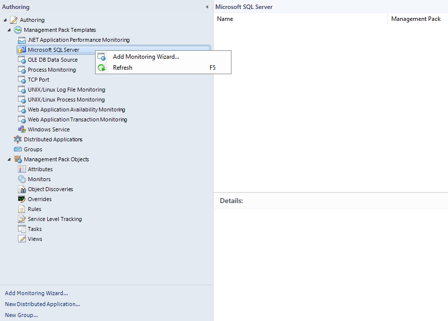
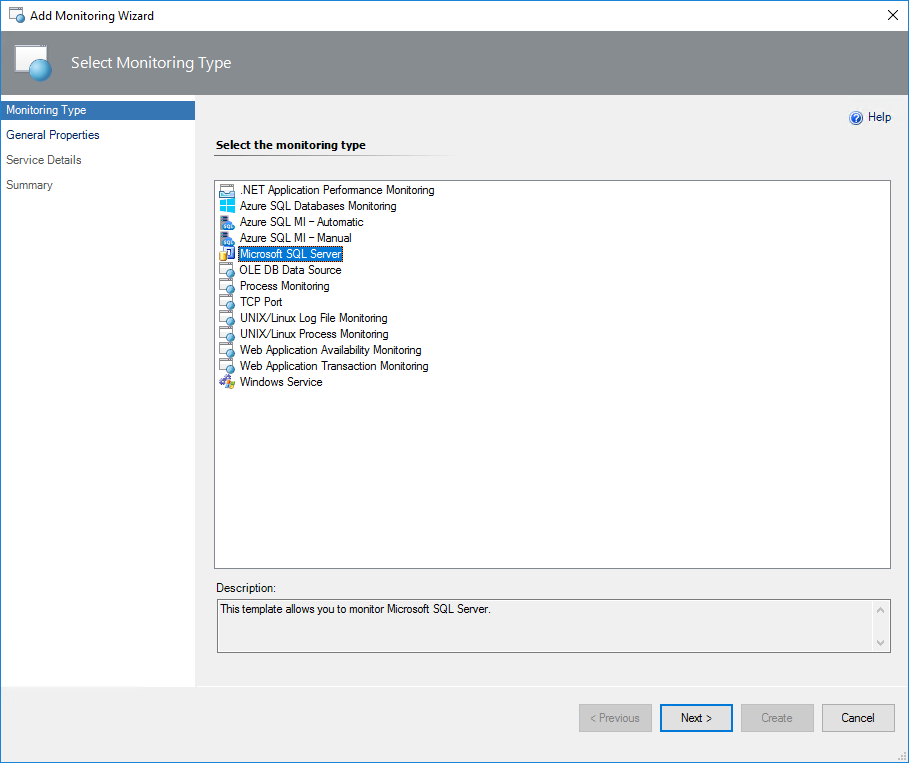
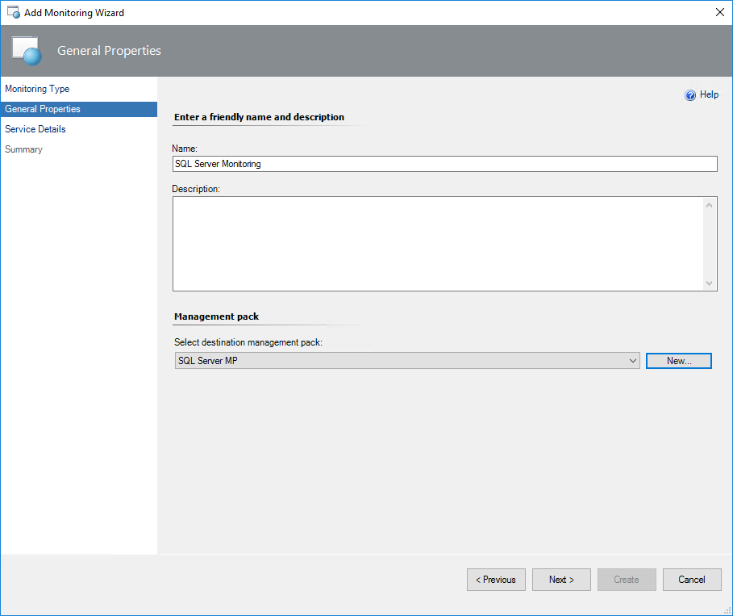
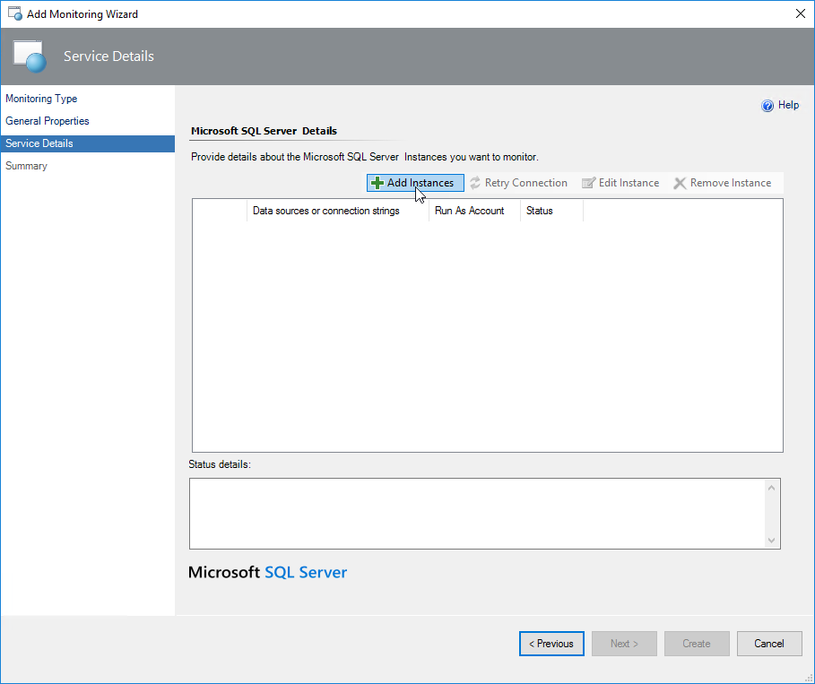
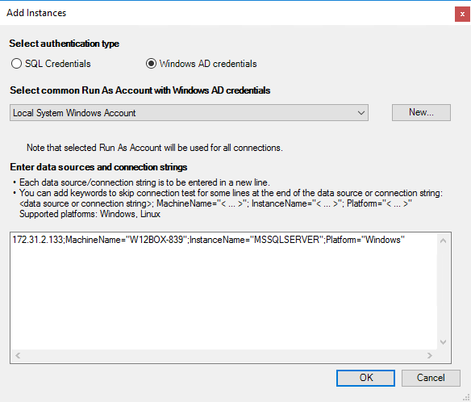
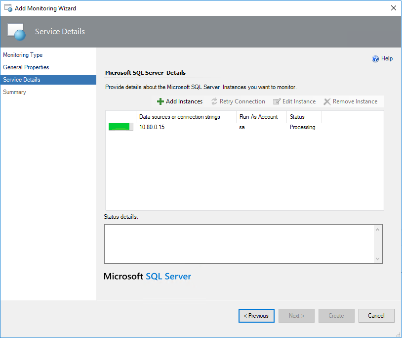
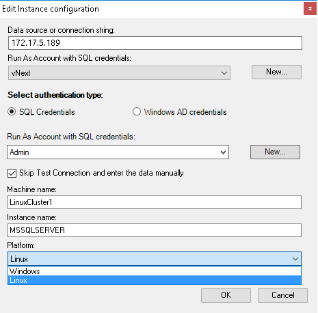
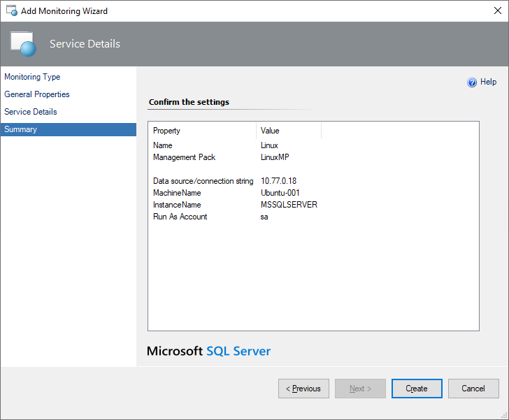
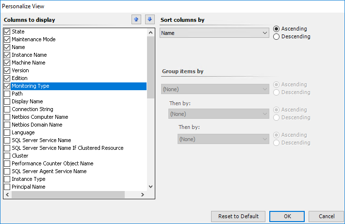

# Monitoring Modes

Management Pack for SQL Server provides the following monitoring modes:

- **Agent monitoring**

    Agent monitoring is performed by the System Center Operations Manager agent and supports SQL on Windows only. In this monitoring mode, the management pack automatically discovers standalone and clustered instances of SQL Server across all managed systems that run the System Center Operations Manager agent service.

    The following protocols are supported in this mode:

    - TCP/IP

    - Named Pipes

    - Shared Memory

- [**Agentless monitoring**](#configuring-agentless-monitoring-mode)

    This monitoring mode supports both SQL on Linux and SQL on Windows. In this monitoring mode, the management pack workflows run on Management Servers and Gateway Servers. Both servers are mapped to **SQL Server Monitoring Pool**. If SQL Server Monitoring Pool isn't configured, **All Management Servers Pool** is used.

    This monitoring mode doesn't provide automatic discovery of SQL Server instances. To discover SQL Server instances, add them to the monitoring list manually with the **Monitoring Wizard** management pack template. To make monitoring more efficient, configure a dedicated pool of Management Servers, as described in [Configuring SQL Server Monitoring Pool](sql-server-management-pack-sql-server-monitoring-pool.md).

    The following protocols are supported in this mode:

    - TCP/IP

    - Named Pipes

- [**Mixed monitoring**](#configuring-mixed-monitoring-mode)

    This monitoring mode supports SQL on Windows only. In this monitoring mode, the management pack places its seed on each computer that has the System Center Operations Manager agent. This seed is then used to automatically discover all SQL Server on Windows instances. The entire monitoring is performed by Management Servers and Gateway Servers that are members of the SQL Server Monitoring Pool.

    Only the TCP/IP protocol is supported in this mode.

Each of these modes supports both the SQL Server and the Windows authentication.

## Configuring Agentless Monitoring Mode

To configure agentless monitoring, perform the following steps:

1. In the Operations Manager console, navigate to **Authoring** | **Management Pack Templates**, right-click **Microsoft SQL Server**, and select **Add Monitoring Wizard**.

    

2. At the **Monitoring Type** step, select **Microsoft SQL Server**, and select **Next**.

    

3. At the **General Properties** step, enter a new name and description.

4. From the **Select destination management pack** dropdown list, select a management pack that you want to use to store the template.

    

    To create a new management pack, select **New**.

5. At the **Service Details** step, select **Add Instances** to add instances that you want to monitor.

    

6. In the **Add Instances** window, perform the following steps:

    - Select a preferable authentication type, which can be either **SQL Credentials** or **Windows AD credentials**.

      Use the **Windows AD credentials** method when SQL Server instances run on Windows or Linux-based servers that are part of an Active Directory domain.

    - Select a common Run As Account created in the Operations Manager with appropriate credentials or create a new one by selecting **New**.

      When you create a new Run As account, enter a name and credentials to connect to the SQL server that you want to monitor and select **OK**.

    - Specify data sources and/or connection strings.

      Use the following format when specifying connection strings:

        - 172.31.2.133;MachineName="W12BOX-839";InstanceName="MSSQLSERVER";Platform="Windows"

        - 172.31.2.133,50626;MachineName="W12BOX-839";InstanceName="SQLEXPRESS";Platform="Windows"

        - 172.17.5.115;MachineName="ubuntu";InstanceName="MSSQLSERVER";Platform="Linux"

    

    > [!TIP]
    > The connection test may fail if an IP address of a Linux-based instance is specified as a connection string and the authentication type is **Windows AD credentials**. To avoid that, specify the machine name as the connection string.

7. Select **OK** and wait until the connection is established.

    

    > [!NOTE]
    > **Monitoring Template Wizard** may show the following error when establishing connection: "An error occurred discovery: A connection was successfully established with the server, but then an error occurred during the login process". To work around this issue, decrease intervals for both the **MSSQL: Generic Monitoring Pool Watcher Discovery** discovery and the **Discover All Management Servers Pool Watcher** discovery to force them to run right away, and then restore the previous value.

    Once the connection is established, you can view and edit the properties of the instance. To view properties, select an instance and select **Edit Instance**.

    

    To skip connection testing and enter data manually, select the **Skip Test Connection and enter this data manually** checkbox.

8. At the **Summary** step, review summary information and select **Create**.

    

    > [!IMPORTANT]
    > To avoid double monitoring of the SQL Server instance and additional burden eventually, don't add the instance to the monitoring template wizard for **Agentless mode** if it is already monitoring in **Agent mode**.

## Configuring Mixed Monitoring Mode

Use the mixed monitoring mode when you want to switch monitoring from the agent to a System Center Operations Manager pool.

In this monitoring mode, you don't need to configure the connection strings manually. Instead, you can use overrides.

When enabling the mixed monitoring mode, only a SQL Server seed is discovered locally by the System Center Operations Manager agent. All other workflows are executed on a dedicated Management Server Pool.

To configure mixed monitoring, perform the following steps:

1. In the Operations Manager console, navigate to **Authoring** | **Management Pack Objects**, and select **Object Discoveries**.

2. Right-click **MSSQL: Discover Local SQL Database Engines on Windows** and select **Overrides** > **Override the Object Discovery** > **For all objects of class: MSSQL on Windows: Local Discovery Seed**.

    

3. In the **Override Properties** window, enable the **Mixed Monitoring** override.

4. In the **Override Value** field, specify instances that you want to switch to agentless monitoring.

    Use commas to separate instance names. To add all instances, including instances with the same name and instances that are located on different servers, use asterisk (\'*').

    

## Viewing Monitoring Type

Management Pack for SQL Server allows you to customize views and configure auxiliary columns that show used monitoring types.

To view currently used monitoring types, perform the following steps:

1. Right-click the **Database Engines** view and select **Personalize View**.

2. In the **Columns to display** list, select the **Monitoring Type** checkbox.

    

    After enabling the **Monitoring Type** checkbox, used monitoring types become available in the **Database Engines** table.

    
