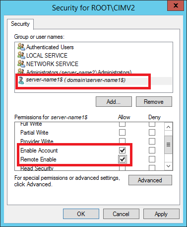

# SQL Server Run As Profiles

Management Pack for SQL Server provides the following Run As profiles:

- **Microsoft SQL Server Discovery Run As Profile**
  
  This profile is associated with existing discoveries.

- **Microsoft SQL Server Monitoring Run As Profile**

  This profile is associated with existing monitors and rules.

- **Microsoft SQL Server Task Run As Profile**

  This profile is associated with existing tasks.

- **Microsoft SQL Server SCOM SDK Run As Profile**

  This profile is for SQL Server MP workflows that need access to System Center Operations Manager SDK.

  Management Pack for SQL Server needs an author set of privileges on the System Center Operations Manager SDK to create a management pack and store overrides in it.

  If the default action account on System Center Operations Manager does not have these permissions, create such an account and map it to the Microsoft SQL Server SDK Run As Profile.

- **Microsoft SQL Server SQL Credentials Run As Profile**

  This profile is used for [agentless monitoring](sql-server-management-pack-monitoring-modes.md#configuring-agentless-monitoring-mode) mode only.

>[!NOTE]
>Do not bind accounts to the **Microsoft SQL Server SQL Credentials Run As Profile** if you monitor SQL Server in agent or mixed monitoring modes as only a basic action account can be bound to this profile. Also, do not use a Windows account or non-basic account with this profile.

When using agent or mixed monitoring mode, all discoveries, monitors, and tasks use accounts from the **Default Action Account** Run As profile.

If the default action account for a given system does not have necessary permissions to discover and monitor instances of SQL Server, such systems can be bound to more specific credentials defined in **Microsoft SQL Server** Run As Profiles.

For more information about Run As accounts, see [Managing Run As accounts and profiles](manage-security-maintain-runas-profiles.md)

## Enabling Allow Log On Locally Security Policy

If the domain account is used as an action account, enable the **Allow log on locally** policy on both SQL Server on Windows and SQL Server on Linux. For more information on how to configure the **Allow log on locally** policy, see [Allow Log On Locally](https://docs.microsoft.com/windows/security/threat-protection/security-policy-settings/allow-log-on-locally).

## Agent and Mixed Monitoring Modes

To configure Run As profiles, use one of the following scenarios:

- [Action Account is Local Administrator and SA](#action-account-is-local-administrator-and-sa)

- [Action Account is Local Administrator w/o SA](#action-account-is-local-administrator-wo-sa)

- [Action Account is Local System w/o SA](#action-account-is-local-system-wo-sa)

### Action Account is Local Administrator and SA

A System Center Operations Manager default action account is mapped to either local system account or any domain user account that is a member of the local administrators group on the monitored machines.

The account that you use must be granted the SQL System Administrator (SA) rights on the monitored SQL Server instances.

A domain user account can be granted SA rights by granting them to the BUILTIN\Administrators local group in the SQL Server security access list. In this case, monitoring of SQL Server instances will work out of the box, except for some configurations described below.

Follow these steps to ensure that all requirements are met:

- If you store SQL Server databases on an SMB file share, the default action account must have the rights, as described in [Low-Privilege Agent Monitoring](sql-server-management-pack-low-privilege-monitoring.md).

- In cases when servers hosting Always On Availability Replicas (at least one of them) have a machine name consisting of more than 15 characters, make sure to perform the steps described in [Monitoring of AG on Windows Servers with Long Names](#monitoring-of-ag-on-windows-servers-with-long-names).

### Action Account is Local Administrator w/o SA

A System Center Operations Manager default action account is mapped to either local system account or domain user account, but SA rights cannot be granted to this account due to security policies.

If the security policy allows granting SA rights to the separate domain user account used for launching SQL Server MP workflows only, perform the following steps:

1. Create a new domain user account and add this account to the Local Administrators group on each monitored server.

2. Grant SA rights to this account on SQL Server.

3. Create a new action account in System Center Operations Manager and map this account to the domain user account created above.

4. Map the new action account to all SQL Server MP Run As Profiles.

If you store SQL Server databases on an SMB file share, the default action account must have the rights, as described in [Low-Privilege Agent Monitoring](sql-server-management-pack-low-privilege-monitoring.md).

### Action Account is Local System w/o SA

[This scenario is for agent monitoring mode only.]

A System Center Operations Manager default action account is mapped to either local system account or domain user account, but SA rights cannot be granted to this account due to security policies that forbid access to SQL Server.

You can grant SA or low privilege rights to System Center Operations Manager HealthService using its Service Security Identifier. For more information, see [SQL Server uses a service SID to provide service isolation](https://support.microsoft.com/help/2620201/sql-server-uses-a-service-sid-to-provide-service-isolation) and [How to configure SQL Server 2012 to allow for System Center Advisor monitoring](https://support.microsoft.com/help/2667175/how-to-configure-sql-server-2012-to-allow-for-system-center-advisor-mo).

Follow these steps to configure the security configuration using SID:

1. Configure a service SID for HealthService, as described in [Service SID](sql-server-management-pack-service-sid.md).

2. If you have SQL Server cluster instances, perform the steps provided in [Service SID for SQL Server Cluster Instances and AG](sql-server-management-pack-service-sid.md#service-sid-for-sql-server-cluster-instances-and-ag).

## Agentless Monitoring Mode

To configure Run As Profiles in [agentless monitoring](sql-server-management-pack-monitoring-modes.md#configuring-agentless-monitoring-mode) mode, create an account on SQL Server and grant this account SA rights or a set of low privilege permissions. You can use SQL Server authentication or Windows authentication. Once created, you can use this account in the [Add Monitoring Wizard](sql-server-management-pack-low-privilege-monitoring.md#using-monitoring-wizard) to add SQL Server instances.

For more information on how to configure low privilege monitoring in agentless monitoring mode, see the [Low-Privilege Monitoring](sql-server-management-pack-low-privilege-monitoring.md).

## Monitoring of AG on Windows Servers with Long Names

Regardless of whether you use a local system account, domain user account, or rights assignment, permissions listed below are required.

**Example**: You have three replicas in your Availability Group that are hosted on the following computers:

- Computer_1
- Computer_2
- Computer_3
  
**Computer_1** hosts the primary replica. In this case, you should configure security settings for **Computer_1** on **Computer_2** and **Computer_3**. If **Computer_2** is going to host the primary replica after failover, other computers should also have WMI security configured for this computer.

The local system account of each node that might act as the primary one must have WMI permissions for other nodes in the current Availability Group. The same is for the domain action account.

Below are the steps to configure security for configurations with the local system account. The provided instruction suggests that the **SQLAON-020** computer hosts the primary replica. These steps should be taken on each replica that participates in the target Availability Group.

To configure permissions for Always On workflows when server names exceed 15 characters, perform the following steps:

1. Launch **mmc.exe** and add the following snap-ins:

    - Component Services
    - WMI Control (for local computer)

2. Expand **Component Services**, right-click **My Computer**, and select **Properties**.

3. Open the **COM Security** tab.

4. In the **Launch and Activation Permissions** section, click **Edit Limits**.

    

5. In the **Launch and Activation Permission** window, enable the following permissions for the remote machine account:

    - Remote Launch
    - Remote Activation

    

6. Open **WMI Control** snap-in properties, go to the **Security** tab, select the **Root\CIMV2** namespace, and click **Security**.

7. Allow the following permissions for the target computer:
  
    - Enable Account
    - Remote Enable

    

8. Click **Advanced**, select a target account, and click **Edit**.

9. From the **Applies to** drop-down list, select **This namespace only**.

10. In the **Permissions** section, enable the following checkboxes:
    
    - Enable Account
    - Remote Enable

    
