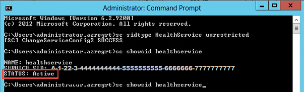

# Service SID

This section explains how to configure monitoring using Service SIDs for SQL Server on a Windows Server instance. These steps were first published by Kevin Holman in [his blog](https://kevinholman.com/2016/08/25/sql-mp-run-as-accounts-no-longer-required/). The SQL scripts to configure the lowest-privilege access were developed by Brandon Adams.

To configure monitoring using Service Security Identifier, perform the following steps for each monitored server with running SQL Server Database Engine:

1. Open the command prompt as an administrator and run the following command:

    ```CONSOLE
    sc sidtype HealthService unrestricted
    ```

2. Restart Health Service.

3. Run command:

    ```CONSOLE
    sc showsid HealthService
    ```

    The **STATUS** parameter should be active.

    

4. Open **Registry Editor**, and check that the **ServiceSidType** key is set to 1 at `HKLM\SYSTEM\CurrentControlSet\Services\HealthService`

5. Open SQL Server Management Studio and connect to the SQL Server Database Engine instance.

6. Create the **NT SERVICE\HealthService** login for the HealthService SID on every SQL Server Instance and grant it SA rights.

    If you can't grant SA rights, use the following SQL script to set the lowest privilege configuration for the account:

    ```sql
    USE [master];
    SET NOCOUNT ON;
    /*The user account that System Center Operations Manager will
    use to access the SQL Server instance*/
    DECLARE @accountname sysname = 'NT SERVICE\HealthService';
    /*In some cases, administrators change the 'sa' account default name.
    This will retrieve the name of the account associated to princicpal_id = 1*/
    DECLARE @sa_name sysname = 'sa';
    SELECT @sa_name = [name] FROM sys.server_principals WHERE principal_id = 1
    /*Create the server role with authorization to the account associated to principal id = 1.
    Create the role only if it does not already exist*/
    DECLARE @createSrvRoleCommand nvarchar(200);
    SET @createSrvRoleCommand = 'IF NOT EXISTS (SELECT 1 FROM sys.server_principals
    WHERE [name] = ''SCOM_HealthService'') BEGIN
    CREATE SERVER ROLE [SCOM_HealthService] AUTHORIZATION [' + @sa_name + ']; END'
    EXEC(@createSrvRoleCommand);
    GRANT VIEW ANY DATABASE TO [SCOM_HealthService];
    GRANT VIEW ANY DEFINITION TO [SCOM_HealthService];
    GRANT VIEW SERVER STATE TO [SCOM_HealthService];
    DECLARE @createLoginCommand nvarchar(200);
    SET @createLoginCommand = 'IF NOT EXISTS (SELECT 1 FROM sys.server_principals
    WHERE [name] = '''+ @accountname +''') BEGIN
    CREATE LOGIN '+ QUOTENAME(@accountname) +' FROM WINDOWS WITH DEFAULT_DATABASE=[master]; END'
    EXEC(@createLoginCommand);
    -- Add the login to the user-defined server role
    DECLARE @addServerMemberCommand nvarchar(200);
    SET @addServerMemberCommand = 'ALTER SERVER ROLE [SCOM_HealthService] ADD MEMBER '
    + QUOTENAME(@accountname) + ';'
    EXEC(@addServerMemberCommand);
    -- Add the login and database role to each database
    DECLARE @createDatabaseUserAndRole nvarchar(max);
    SET @createDatabaseUserAndRole = '';
    SELECT @createDatabaseUserAndRole = @createDatabaseUserAndRole + ' USE ' + QUOTENAME(db.name) + ';
    IF NOT EXISTS (SELECT 1 FROM sys.database_principals WHERE [name] = '''+ @accountname +''') BEGIN
    CREATE USER ' + QUOTENAME(@accountname) + ' FOR LOGIN ' + QUOTENAME(@accountname) + '; END;
    IF NOT EXISTS (SELECT 1 FROM sys.database_principals WHERE [name] = ''SCOM_HealthService'') BEGIN
    CREATE ROLE [SCOM_HealthService] AUTHORIZATION [dbo]; END;
    ALTER ROLE [SCOM_HealthService] ADD MEMBER ' + QUOTENAME(@accountname) + ';'
    FROM sys.databases db
        LEFT JOIN sys.dm_hadr_availability_replica_states hadrstate ON
            db.replica_id = hadrstate.replica_id
    WHERE db.database_id <> 2
        AND db.user_access = 0
        AND db.state = 0
        AND db.is_read_only = 0
        AND (hadrstate.role = 1 or hadrstate.role is null);
    EXEC(@createDatabaseUserAndRole);
    -- Add database specific permissions to database role
    USE [master];
    GRANT EXECUTE ON sys.xp_readerrorlog TO [SCOM_HealthService];
    GRANT EXECUTE ON sys.xp_instance_regread TO [SCOM_HealthService];
    GRANT SELECT ON [sys].[indexes] TO [SCOM_HealthService];
    GRANT SELECT ON [sys].[tables] TO [SCOM_HealthService];
    GRANT SELECT ON [sys].[dm_db_index_physical_stats] TO [SCOM_HealthService];
    USE [msdb];
    GRANT SELECT ON [dbo].[sysjobschedules] TO [SCOM_HealthService];
    GRANT SELECT ON [dbo].[sysschedules] TO [SCOM_HealthService];
    GRANT SELECT ON [dbo].[syscategories] TO [SCOM_HealthService];
    GRANT SELECT ON [dbo].[sysjobs_view] TO [SCOM_HealthService];
    GRANT SELECT ON [dbo].[sysjobactivity] TO [SCOM_HealthService];
    GRANT SELECT ON [dbo].[sysjobhistory] TO [SCOM_HealthService];
    GRANT SELECT ON [dbo].[syssessions] TO [SCOM_HealthService];
    GRANT SELECT ON [dbo].[log_shipping_primary_databases] TO [SCOM_HealthService];
    GRANT SELECT ON [dbo].[log_shipping_secondary_databases] TO [SCOM_HealthService];
    GRANT SELECT ON [dbo].[log_shipping_monitor_history_detail] TO [SCOM_HealthService];
    GRANT SELECT ON [dbo].[log_shipping_monitor_secondary] TO [SCOM_HealthService];
    GRANT SELECT ON [dbo].[log_shipping_monitor_primary] TO [SCOM_HealthService];
    GRANT EXECUTE ON [dbo].[sp_help_job] TO [SCOM_HealthService];
    GRANT EXECUTE ON [dbo].[agent_datetime] TO [SCOM_HealthService];
    GRANT EXECUTE ON [dbo].[SQLAGENT_SUSER_SNAME] TO [SCOM_HealthService];
    ALTER ROLE [SQLAgentReaderRole] ADD MEMBER [SCOM_HealthService];
    ```

7. To run SQL Server MP tasks, such as **Set database Offline**, **Set database Online**, and **Set database to Emergency state**, grant the HealthService SID account the **ALTER ANY DATABASE** permission.

    ```sql
    USE [master];
    GRANT ALTER ANY DATABASE TO [SCOM_HealthService];
    ```

8. In the **Microsoft Monitoring Agent** properties for the selected management group, set the **Local System** account to perform agent actions.

The **NT AUTHORITY\SYSTEM** account should be present as a SQL login and must not be disabled. This login must also be present and enabled for cluster nodes and Always On.
