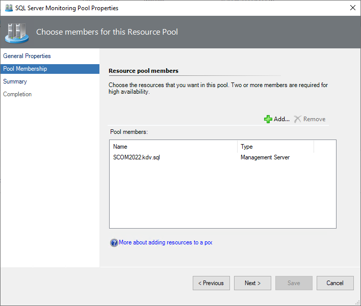
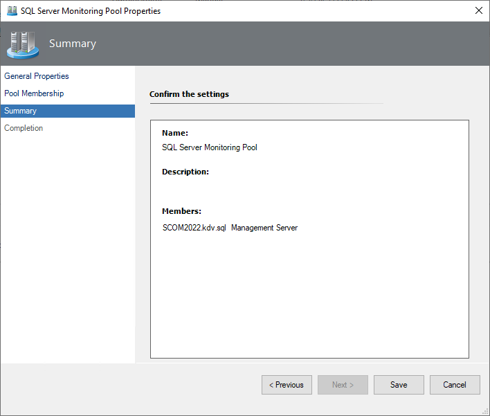

# SQL Server Monitoring Pool

You can configure **SQL Server Monitoring Pool** manually by adding custom gateways and management servers. Custom management server resource pools are also supported for [Agentless](sql-server-management-pack-monitoring-modes.md#configuring-agentless-monitoring-mode) monitoring mode.

To configure SQL Server Monitoring Pool, follow these steps:

1. Navigate to **Administration | Resource Pools** and in the list of resource pools, right-click **SQL Server Monitoring Pool**.

2. Select the **Manual Membership** option and select **Properties**.

    

3. In the **SQL Server Monitoring Pool Properties** window, open the **Pool Membership** tab and select **Add** to populate the monitoring pool.

    

4. If the pool is empty, it mirrors the contents of the **All Management Servers** pool. The pool can contain either gateways or management servers, but not both at the same time.

    

5. At the **Summary** step, check the settings and select **Save**.

    
