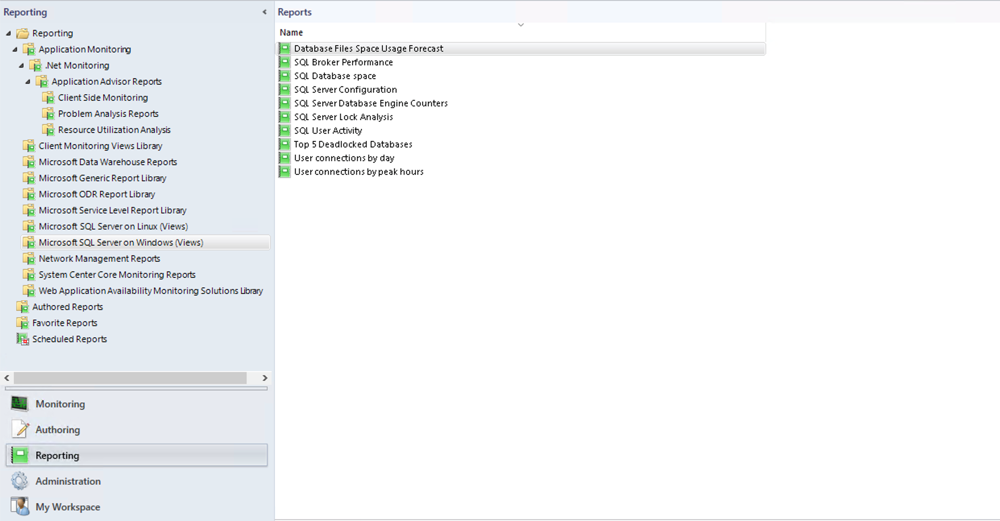
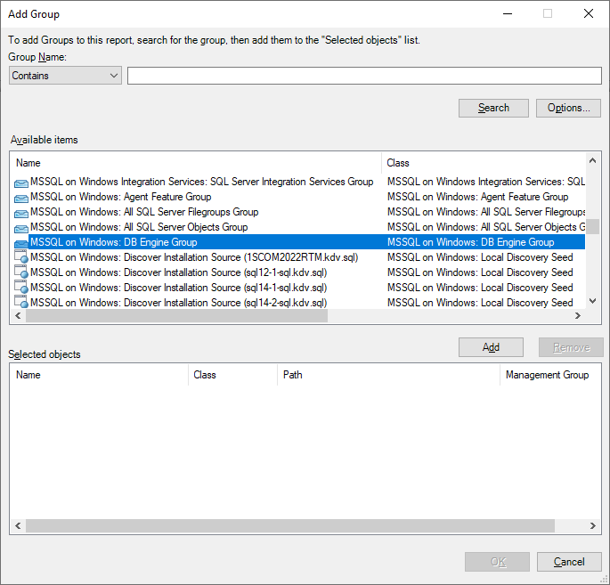
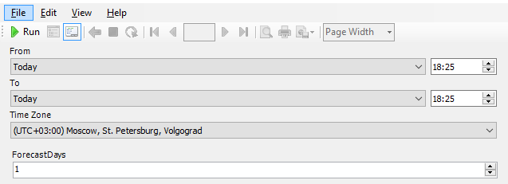
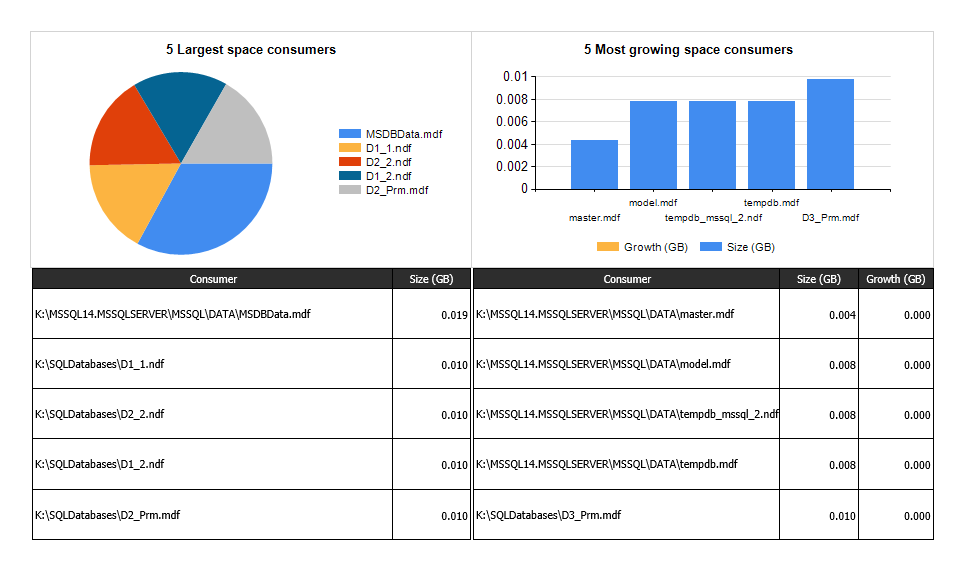
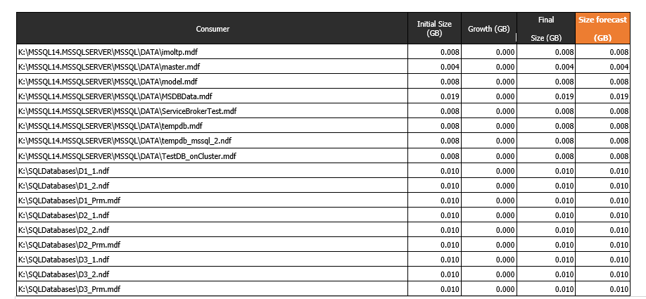

# SQL Server Reporting

Management Pack for SQL Server introduces the **Database Files Space Usage Forecast** report that provides the following information about Windows objects:

- Initially consumed file space (GB)
- Finally consumed file space (GB)
- File space consumption forecast (GB)

> [!IMPORTANT]
> The **Database Files Space Usage Forecast** report relies on several performance collection rules and discoveries that are disabled by default. You need to enable these rules and discoveries and let them run for *several days* before this report generates any data. Create overrides for the following rules and discoveries for either All Objects of Class, or individual objects if you only want to collect data from certain SQL instances:
> 
>**Discoveries**
> - MSSQL on Windows: Discover SQL Server DB Files
> - MSSQL on Windows: Discover SQL Server DB Filegroups
>
>**Rules**
> - MSSQL on Windows: ROWS Data Allocated Free Space (MB)
> - MSSQL on Windows: ROWS Data Free Space Total (MB) 
> - MSSQL on Windows: ROWS Data Allocated Free Space (%)
> - MSSQL on Windows: ROWS Data Free Space Total (%)

Once these rules and discoveries have had time to collect data to report on, the report can be executed by following these steps:

1. In the **Reporting** view, double-click **Database Files Space Usage Forecast**.

    
   
1. Using the **Add Group** option in the parameters, add a group of DB Engine objects. A default option is "MSSQL on Windows: DB Engine Group". If you want to add an individual object, use the **Add Object** option. Make sure you select the **DB Engine** object for the SQL Instance you want a forecast report for.

    
   
1. Select a period and the corresponding time zone for the report. Also, select the number of days for the file space consumption forecast.

    
   
1. Select **Run**.

    The report displays a separate chart for each selected object or a group of objects.

    
 
    You can review a space usage forecast in a separate table.

    

## Build custom reports

To build custom reports, follow these steps:

1. Create your own report in SQL Server Data Tools (SSDT).
1. Query the OperationsManager and OperationsManagerDW databases.
1. Deploy the report to the SCOM Reporting server.
1. View the report in the SCOM Console under **Reporting**.
