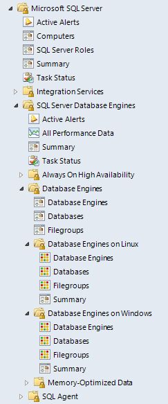
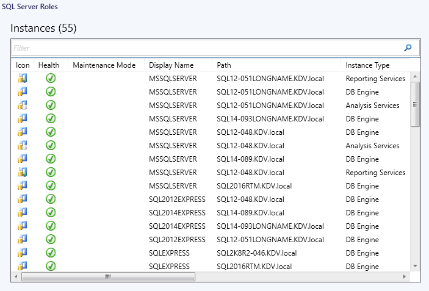

# Views and Dashboards in Management Pack for SQL Server

Management Pack for SQL Server introduces the following version-independent views and dashboards.

The **Computers** view displays computers on which agents are installed and management pack discovery is running. This view doesn't display computers configured for [agentless monitoring](sql-server-management-pack-monitoring-modes.md#configuring-agentless-monitoring-mode).

The **SQL Server Roles** dashboard provides information about instances of SQL Server Database Engine, SQL Server Reporting Services, SQL Server Analysis Services, and SQL Server Integration Services.

Some of these views may consist of a long list of objects and metrics. To find specific objects, you can use the **Scope**, **Search**, and **Find** buttons on the Operations Manager toolbar. For more information, see [Find data and objects in the Operations Manager consoles](manage-console-finding-data.md).
