# Adjusting Instance Dashboard

By double-clicking a group of a group widget or virtual group, the user drills down to the instance dashboard. The object tree is displayed at the top of the instance dashboard view.

>[!NOTE]
>Instance tiles are available in the instance view only.

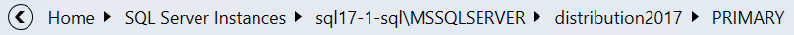

The user will see the list of group objects in the first level of the group or virtual group.

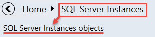

If the user drills-down into the group object, the list of group object child elements will be displayed.

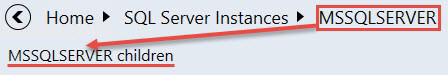

Note that if the group object or its child does not have any child, the user cannot drill-down into it.

The **Back** button opens the previous instance dashboard. The user can click any element to navigate directly to its dashboard. All objects of the group or children of the object are sorted by their state; the most critical ones are placed to the top of the list.

The **Details** widget lists all properties of the selected entity. When the user opens the dashboard, the first element is selected automatically, but if the user selects another object, the selection remains even if a refresh event occurs.

By clicking the icon in the header of the dashboard, all data is copied into the clipboard. If the user hovers over a property in the details widget, a similar button is displayed to allow copying the property data.

The Filter searches through the entity name and entity path, or thought entity name only.

It depends on the configuration of the **Show instance path** checkbox in the **Settings** view.

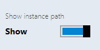

**Active alerts** displays all object alerts excluding the closed ones. Custom alerts are displayed as well.

The number of active alerts is displayed in brackets next to the **Active Alerts** title.

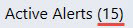

Object alerts and its child alerts are displayed if the **Show alerts from all levels** checkbox is switched on.

Alerts can be filtered by their names using the **Filter** field.

The **Related objects** and **Alerts** tiles are displayed by default and cannot be deleted. The tile has logic similar to the aggregated state tile. By double-clicking the tile, the user drills-down further to the child elements of the selected object.

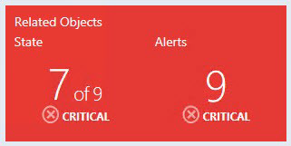

The **Related objects** tile shows the next level of the object children. The color of the tile complies the worst state color of its children. Under the name of the tile, the user can see the amount of object children in the worst state and the total number of children. The state name and state icon of the worst object children state is displayed under the number of the object children.

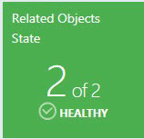

The **Alerts** tile displays the amount of its children worst alerts plus its children`s children worst alerts. The color of the tile complies the color of its children's worst alerts. The severity name and severity icon of its worst children’s alerts is displayed under the number of alerts.

From the menu of the **Monitoring** section, the user can add a performance tile, monitor tile, performance and monitor tile by using the **Bulk add tiles** view, customize dashboard view settings by using the **Settings** menu and refresh the dashboard view.

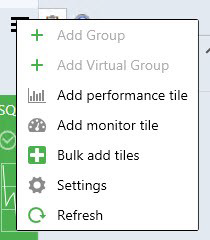

Double-clicking the performance tile opens a performance view. Double-clicking the monitor tile opens Health Explorer.

## Adding Performance Tile

Double-click the group to drill-down from the Datacenter to lnstance level. Click the menu button to add a performance tile.

In the **Add Performance Tile** dialog, select a performance tile.

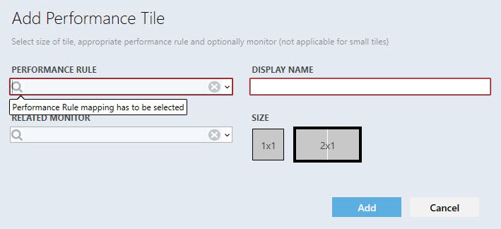

There are 3 types of performance tiles: 2x1 without a linked monitor, 2x1 with a linked monitor, and 1x1 tile.

The display name is populated automatically when a user selects the rule for the first time. The drop-down supports advanced filtering options based on the entered text.

If the user adds same tile twice and uses automatic display name population, the date and time value is added automatically to the rule\monitor name in the **DISPLAY NAME** field.

If all rules have a similar prefix, the prefix is not displayed in the alike rules.

The circle with a cross removes all data from the field.

When a rule is selected, validation messages disappear and the **Add** button becomes enabled. When the user tries to add performance tile with existing **DISPLAY NAME**, the corresponding error tooltip message appears.

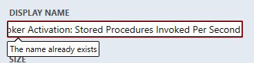

If the user selects a monitor, the tile would have a linked monitor, and the tile color will depend on the monitor state. If the user select a monitor, but set the 1x1 size right after, the data in the monitor field becomes disabled and is not saved in the configuration if the user added the tile, but becomes enabled again if the user sets the 2x1 size.

Upon hovering over the graph, a tooltip with the date and value is displayed.

The widget has kind of trend line, which is represented by the arrow. Near the arrow, a user can see the last value of the index.

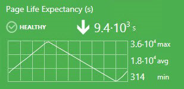

If the rule value has not been changed during the displayed period, the trend arrow is not displayed.

Note that if the index last value is too long to be fully displayed in the tile, it is displayed in the tooltip.

The minimum, maximum, and average rule value is displayed near the chart. Measurement units are displayed if the rule has them in its name in brackets. The user can select a period to be displayed in the 2x1 tile chart of the dashboard view **Settings** menu.

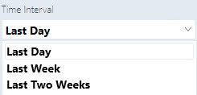

The 1x1 tile displays only the last value. The same data is displayed in the 2x1 version right under the widget name.

The last value of date and time is displayed under the rule last value in the 1x1 performance tile. If there is no data in the System Center Operations Manager database for the set period, the widget returns **No Data** message.

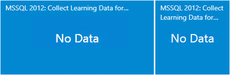

Two options are available by right-clicking the tile: **Edit** and **Remove**.

## Adding Monitor Tile

Double-click the Group to drill-down from Datacenter to the Instance level. Click the menu button to add a monitor tile.

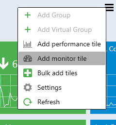

In the **Add Monitor Tile** dialog, select a monitor.

The control has the logic similar to the performance dialog.

The monitor has a name, state indicator, and the date when the state has been changed for the last time. Two options are available by right-clicking the tile: **Edit** and **Remove**:

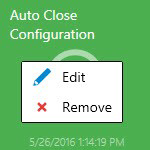