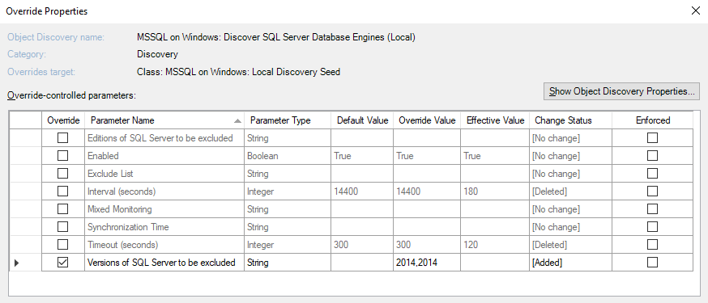
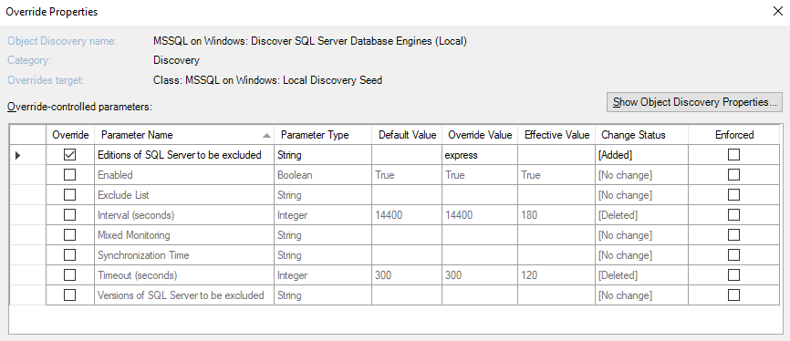

# Disabling Monitoring of Specified SQL Servers and Databases

## Disabling Monitoring of Specified SQL Server Versions

Management Pack for SQL Server allows you to exclude certain versions of SQL Server instances from monitoring.

To exclude versions that you do not want to monitor, create an override for the **Versions of SQL Server to be excluded** parameter of the **MSSQL on Windows: Discover SQL Server Database Engines (Local)** discovery and specify versions using commas. 

For example, the override "2014,2012" makes the management pack to remove all previously discovered instances of SQL Server 2012 and 2014 and disable any further discovery of such instances.

## Disabling Monitoring of Specified SQL Server Editions

Management Pack for SQL Server allows you to exclude certain editions of SQL Server instances from monitoring.

To exclude editions that you do not want to monitor, create an override for the **Editions of SQL Server to be excluded** parameter of the **MSSQL on Windows: Discover SQL Server Database Engines (Local)** discovery and specify editions using commas. 

The following table lists short names that you can specify in the **Editions of SQL Server to be excluded** parameter.

|Short Name|Covered Editions|
|-|-|
|Enterprise|Enterprise Edition, Enterprise Edition: Core-based Licensing, Enterprise Evaluation Edition|
|Standard|Standard Edition, Business Intelligence Edition|
|Web|Web Edition|
|Developer|Developer Edition|
|Express|Express Edition, Express Edition with Advanced Services|

## Disabling Monitoring of Specified Databases by Name

You can disable discovery and monitoring of databases by specifying their names in the **Exclude list** parameter.

You can set this parameter in the following discoveries:

- MSSQL on Windows: Discover SQL Server Databases for a Database Engine

- MSSQL on Linux: Discover SQL Server Databases for a Database Engine

Use commas to separate database names in the list and asterisks to replace one or more characters.

For example, when setting the parameter to "dev*, \*test*, *stage, dbnotmon", the monitoring behavior would be as follows:

|DB Name|Monitored/Not monitored|
|-|-|
|dev|Not monitored|
|dev_sales|Not monitored|
|sales_dev|Monitored|
|test|Not monitored|
|test_sales|Not monitored|
|sales_test|Not monitored|
|stage|Not monitored|
|stage_dev|Monitored|
|dev_stage|Not monitored|
|dbnotmon|Not monitored|
|dbnotmon_sales|Monitored|
|sales_dbnotmon|Monitored|

If you have "\*" in the list as a database name (e.g., "\*temp*, * , *\dev*" or "\*temp,*"), it disables monitoring of any database.

