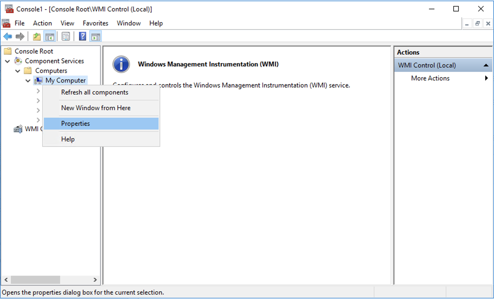

# Low-Privilege Monitoring

All workflows (discoveries, rules, monitors and actions) in this management pack are bound to [Run As profiles](ssmp-run-as-profiles).

To enable low-privilege monitoring, appropriate permissions should be granted to Run As accounts and these accounts should be bound to respective Run As profiles.

>[!NOTE]
> The **Virtual Log File Count** monitor (VLF) does not work in low-privilege monitoring due to insufficient permissions.

## Low-Privilege Agent Monitoring

To configure low-privilege environments for agent monitoring, perform the following steps:

- **In Active Directory**

  1. In Active Directory, create three domain users to be used for low-privilege access to target SQL Server instances:

      - SQLTaskAction
    
      - SQLDiscovery
    
      - SQLMonitor

  2.  Create a domain group - **SQLMPLowPriv** and add the following domain users:

      - SQLDiscovery
    
      - SQLMonitor

  3. Grant the **SQLMPLowPriv** group the **Read-only Domain Controllers** – “Read Permission”.

- **On Agents**

  1. Grant the **SQLTaskAction** and **SQLMPLowPriv** accounts the **Read** permission at HKLM:\\Software\\Microsoft\\Microsoft SQL Server.

  2. Add the **SQLTaskAction** and **SQLMonitor** domain users to the **EventLogReaders** local group.

  3. Configure the **Allow log on locally** local security policy to allow the **SQLTaskAction** and **SQLMPLowPriv** domain group users to log on locally.

  4. Grant **Execute Methods**, **Enable Account**, **Remote Enable**, **Read Security** permissions to **SQLTaskAction** and **SQLMPLowPriv** for the following WMI namespaces:

      - 'root'
      - 'root\cimv2'
      - 'root\default'
      - 'root\Microsoft\SqlServer\ComputerManagement11' (if exists)
      - 'root\Microsoft\SqlServer\ComputerManagement12' (if exists) 
      - 'root\Microsoft\SqlServer\ComputerManagement13' (if exists)
      - 'root\Microsoft\SqlServer\ComputerManagement14' (if exists)
      - 'root\Microsoft\SqlServer\ComputerManagement15' (if exists)

  5. Grant **SQLMPLowPriv** the **Read** permission at HKLM:\Software\Microsoft\Microsoft SQL Server\\'[InstanceID]'\MSSQLServer\Parameters on each monitored instance.

- **Additional steps for cluster SQL Server instances**

  1.  Take steps above for each node in a cluster.

  2. Grant **SQLMPLowPriv** and **SQLTaskAction** the **Remote Launch** and **Remote Activation** DCOM permissions using DCOMCNFG. Note that defaults and limits should be adjusted.

  3. Allow Windows Remote Management through the Windows Firewall.

  4. Grant **SQLMPLowPriv** the **Full Control** access to the cluster using Failover Cluster Manager.

  5. Grant **Execute Methods**, **Enable Account**, **Remote Enable**, **Read Security** permissions to **SQLTaskAction** and **SQLMPLowPriv** for the **root\MSCluster** WMI namespace.

- **On SQL Server instances**

  1. Open SQL Server Management Studio and connect to the instance of SQL Server Database Engine.

  2. In SQL Server Management Studio, for each instance of SQL Server Database Engine running on a monitored server, create a login for **SQLMPLowPriv** and **SQLTaskAction**. To be able to add **SQLMPLowPriv**, in the **Object Types** window, select the **Groups** checkbox.

  3. Create **SQLMPLowPriv** and **SQLTaskAction** users in each user database, as well as in master, msdb and model databases. 
  
  4. Link **SQLMPLowPriv** users to **SQLMPLowPriv** login and **SQLTaskAction** users to **SQLTaskAction** login.

      ```SQL
      --This script is an example of the creation new users
      --  in database msdb. Make sure to execute such a script
      --  for every database on each SQL instance.
      USE [msdb]
      GO
      CREATE USER [SQLMPLowPriv] FOR LOGIN [SQLMPLowPriv]
      CREATE USER [SQLTaskAction] FOR LOGIN [SQLTaskAction]
      ```

  5. Grant **SQLMPLowPriv** the following permissions:

      ```SQL
      USE [master]
      GO
      GRANT VIEW SERVER STATE TO [SQLMPLowPriv]
      GRANT VIEW ANY DEFINITION TO [SQLMPLowPriv]
      GRANT VIEW ANY DATABASE TO [SQLMPLowPriv]
      GRANT EXECUTE ON xp_readerrorlog TO [SQLMPLowPriv]

      USE [msdb]
      GO
      GRANT EXECUTE ON msdb.dbo.sp_help_job TO [SQLMPLowPriv]
      GRANT EXECUTE ON msdb.dbo.sp_help_jobactivity TO [SQLMPLowPriv]
      GRANT SELECT ON sysjobs_view TO [SQLMPLowPriv]
      GRANT SELECT ON sysschedules TO [SQLMPLowPriv]
      GRANT SELECT ON sysjobschedules TO [SQLMPLowPriv]
      GRANT SELECT ON log_shipping_monitor_history_detail
        TO [SQLMPLowPriv]
      GRANT SELECT ON log_shipping_monitor_secondary
        TO [SQLMPLowPriv]
      GRANT SELECT ON log_shipping_secondary_databases
        TO [SQLMPLowPriv]
      GRANT SELECT ON log_shipping_monitor_primary
        TO [SQLMPLowPriv]
      GRANT SELECT ON log_shipping_primary_databases
        TO [SQLMPLowPriv]
      ```

  6. For the msdb database, assign the **SQLMPLowPriv** user both the **SQLAgentReaderRole** role and **PolicyAdministratorRole** role.

      ```SQL
      USE [msdb]
      GO
      ALTER ROLE [SQLAgentReaderRole] ADD MEMBER [SQLMPLowPriv]
      ALTER ROLE [PolicyAdministratorRole] ADD MEMBER [SQLMPLowPriv]
      ```

- **On SMB Shares**

  1. Grant share permissions by opening the share properties dialog for the share that hosts SQL Server data files or SQL Server transaction log files.
  
  2. Grant **Read** permissions to **SQLMPLowPriv**.
  
  3. Grant NTFS permissions by opening the properties dialog for the shared folder and navigate to the **Security** tab.
  
  4. Grant **Read** permissions to **SQLMPLowPriv**.

- **Optional steps for tasks on Agents**

  Some optional System Center Operations Manager tasks require a higher privilege on an agent machine and/or database to allow task execution.

  You should execute the following provisioning steps on the agent machine or the database only if you want to allow the System Center Operations Manager console operator to take remedial actions on that target.

  - If the task is related to starting or stopping an NT service (such as DB Engine Service, SQL Server Agent service, SQL Full Text Search Service, ntegration Services), on the agent machine, grant the **SQLTaskAction** user the permission to start or stop an NT service This involves setting a service security descriptor. For more information, see [Sc sdset](http://go.microsoft.com/fwlink/?LinkId=193876).

    Read the existing privileges for a given service (using **sc sdshow**) and grant additional privileges to the **SQLTaskAction** user.

    For example, if the results of the **sdshow** command for SQL Server service are as follows:

    *D:(A;;CCLCSWRPWPDTLOCRRC;;;SY)(A;;CCDCLCSWRPWPDTLOCRSDRCWDWO;;;BA)(A;;CCLCSWLOCRRC;;;IU)(A;;CCLCSWLOCRRC;;;SU)S:(AU;FA;CCDCLCSWRPWPDTLOCRSDRCWDWO;;;WD)*

    In this case, the following command line grants sufficient access to **SQLTaskAction** for starting and stopping the SQL Server service (replace colored strings with appropriate values and keep everything on a single line).

    *sc sdset SQLServerServiceName D:(A;;GRRPWP;;;SID for SQLTaskAction)(A;;CCLCSWRPWPDTLOCRRC;;;SY)(A;;CCDCLCSWRPWPDTLOCRSDRCWDWO;;;BA)(A;;CCLCSWLOCRRC;;;IU)(A;;CCLCSWLOCRRC;;;SU)S:(AU;FA;CCDCLCSWRPWPDTLOCRSDRCWDWO;;;WD)*

  - In SQL Server Management Studio, add **SQLTaskAction** to the **db_owner** database role for each database if the task is related to performing database checks:

    - Check Catalog (DBCC)
    
    - Check Database (DBCC)
    
    - Check Disk (DBCC)” (invokes DBCC CHECKALLOC)

    ```sql
    USE [msdb]
    GO
    ALTER ROLE [db_owner] ADD MEMBER [SQLTaskAction]
    ```

  - Grant the ALTER ANY DATABASE privilege to *SQLTaskAction* login to run the task if the task is related to changing the database state:

    - “Set Database Offline”
    - “Set Database Emergency State”
    - “Set Database Online”

    ```sql
    USE [master]
    GO
    GRANT ALTER ANY DATABASE TO [SQLTaskAction]
    ```

- **On System Center Operations Manager**

  1. Import the SQL Server Management Pack if it has not been imported.

  2. Create *SQLTaskAction*, *SQLDiscovery* and *SQLMonitor* Run As accounts with the "Windows" account type. For more information, see [How to Create Run As Account in Operations Manager 2012](http://go.microsoft.com/fwlink/?LinkId=717832). For more information about various Run As Account types, see [Managing Run As Accounts and Profiles in Operations Manager 2012](http://go.microsoft.com/fwlink/?LinkId=717833).

  3. On the System Center Operations Manager console, configure Run As profiles as follows:

      - Set the **Microsoft SQL Server Task Run As Profile Run As** profile to use the **SQLTaskAction** Run As account.
      
      - Set the **Microsoft SQL Server Discovery Run As Profile** Run As profile to use the **SQLDiscovery** Run As account.
      
      - Set the **Microsoft SQL Server Monitoring Run As Profile** Run As profile to use the **SQLMonitor** Run As account.

  4. To prevent SQL Server monitoring issues, the **SQLTaskAction**, **SQLDiscovery**, **SQLMonitor** Run As accounts should be used to manage the instances of **MSSQL on Windows: Local DB Engine**.

  

## Low-Privilege Agentless Monitoring

[Applicable to SQL Server on Windows and on Linux.]

To configure low-privilege agentless monitoring, perform the following steps:

- **On SQL Instance**

  1. Open SQL Server Management Studio and connect to the instance of SQL Server Database Engine.

  2. In SQL Server Management Studio, for each instance of SQL Server Database Engine running on a monitored server, create a SQL login for monitoring and grant the following permissions.

      ```sql
      USE [msdb]
      GO
      GRANT VIEW SERVER STATE TO [SQLMPLowPriv]
      GRANT VIEW ANY DEFINITION TO [SQLMPLowPriv]
      GRANT VIEW ANY DATABASE TO [SQLMPLowPriv]
      GO
      ALTER ROLE [db_datareader] ADD MEMBER [SQLMPLowPriv]
      GRANT EXECUTE ON xp_readerrorlog TO [SQLMPLowPriv]
      GO
      ```

  3. Create a user in each user database, master, msdb and model. Link created users to the **SQLMPLowPriv** login.

      ```sql
      --This script is an example of the creation new users
      --  in database msdb. Make sure to execute such a script
      --  for every database on each SQL instance.
      USE [msdb]
      GO
      CREATE USER [SQLMPLowPriv] FOR LOGIN [SQLMPLowPriv]
      ```

  4. For msdb database, grant the user the following permissions.

      ```sql
      USE [msdb]
      GO
      GRANT EXECUTE ON msdb.dbo.sp_help_job TO [SQLMPLowPriv]
      GRANT EXECUTE ON msdb.dbo.sp_help_jobactivity TO [SQLMPLowPriv]
      GRANT SELECT ON sysjobs_view TO [SQLMPLowPriv]
      GRANT SELECT ON sysschedules TO [SQLMPLowPriv]
      GRANT SELECT ON sysjobschedules TO [SQLMPLowPriv]
      GRANT SELECT ON log_shipping_monitor_history_detail
        TO [SQLMPLowPriv]
      GRANT SELECT ON log_shipping_monitor_secondary
        TO [SQLMPLowPriv]
      GRANT SELECT ON log_shipping_secondary_databases
        TO [SQLMPLowPriv]
      GRANT SELECT ON log_shipping_monitor_primary
        TO [SQLMPLowPriv]
      GRANT SELECT ON log_shipping_primary_databases
        TO [SQLMPLowPriv]
      ```

  5. Some optional System Center Operations Manager tasks require a higher privilege on an agent machine and/or database to allow the task execution.

    You should execute the following provisioning steps on the database only if you want to allow the System Center Operations Manager console operator to take remedial actions on that target.

    - In SQL Server Management Studio, add **SQLMPLowPriv** to the **db_owner** database role for each database if the task is related to performing database checks:
      
      - Check Catalog (DBCC)
      
      - Check Database (DBCC)
      
      - Check Disk (DBCC) (invokes DBCC CHECKALLOC)

      ```sql
      USE [yourdatabase]
      GO
      ALTER ROLE [db_owner] ADD MEMBER [SQLMPLowPriv]
      GO
      ```

    - Grant the ALTER ANY DATABASE privilege to **SQLMPLowPriv** to perform the following database tasks:
      
      - Set Database Online
      
      - Set Database Offline
      
      - Set Database to Emergency State

      ```sql
      USE [master]
      GO
      GRANT ALTER ANY DATABASE TO [SQLMPLowPriv]
      ```

    - For msdb database, add the **SQLMPLowPriv** user to the **SQLAgentReaderRole** and **PolicyAdministratorRole** database roles:

      ```sql
      USE [msdb]
      GO
      ALTER ROLE [PolicyAdministratorRole]
        ADD MEMBER [SQLMPLowPriv]
      GO
      USE [msdb]
      GO
      ALTER ROLE [SQLAgentReaderRole]
        ADD MEMBER [SQLMPLowPriv]
      GO
      ```

### Using Add Monitoring Wizard

To configure low-privilege agentless monitoring using **Add Monitoring Wizard**, perform the steps provided in the [Configuring Agentless Monitoring Mode](ssmp-monitoring-modes.md#configuring-agentless-monitoring-mode) section, but with the following changes:

1. In the **Add Monitoring Wizard** window, click **Add Instances**.

2. In the **Add Instances** window, select a common Run As account with the appropriate SQL low-privilege login and specify data sources and/or connection strings. For example:

     - 172.31.2.133;MachineName="W12BOX-839";InstanceName="MSSQLSERVER";Platform="Windows"
     
     - 172.31.2.133,50626;MachineName="W12BOX-839";InstanceName="SQLEXPRESS";Platform="Windows"
     
     - 172.17.5.115;MachineName="ubuntu";InstanceName="MSSQLSERVER";Platform="Linux"

    

If you want to create a new Run As account, do the following:

1. In the **Add Instances** window, click **New**.

2. Enter a new name for the Run As account.

3. Specify credentials to access the SQL Server that you want to monitor, click **OK** and wait until the connection is established.

    

## Low-Privilege Mixed Monitoring

To configure low-privilege environments for [Mixed monitoring](ssmp-monitoring-modes#configuring-mixed-monitoring-mode), perform the steps described in the [Low-Privilege Agent Monitoring](#low-privilege-agent-monitoring) section and then do the following:

- [Configure remote access to WMI](#managing-remote-access-to-wmi)

- [Grant permissions to get information about the services](#granting-permissions)

- [Use a registry key to manage the remote access to the registry](#managing-remote-access-to-the-registry)

### Managing Remote Access to WMI

To configure security for configurations with low-privilege accounts, perform the following steps on each mixed mode monitoring server:

1. Launch the **mmc.exe** console and add the following snap-ins:

    - Component Services
    
    - WMI Control (for a local computer)

2. Expand **Component Services**, right-click **My Computer** and select **Properties**.

   

3. Open the **Security** tab.

4. In the **Launch and Activation Permissions** section, click **Edit Limits**.

   

5. Set the following permissions for the remote machine account:

    - Remote Launch
    
    - Remote Activation

   

6. Go to the **WMI Control** snap-in and open its properties.
  
7. Open the **Security** tab and select the following namespaces:

    - Root\CIMV2, Root\Microsoft\SqlServer
    - Root\Microsoft\SqlServer\ComputerManagement11 (if exists)
    - Root\Microsoft\SqlServer\ComputerManagement12 (if exists)
    - Root\Microsoft\SqlServer\ComputerManagement13 (if exists)
    - Root\Microsoft\SqlServer\ComputerManagement14 (if exists)
    - Root\Microsoft\SqlServer\ComputerManagement15 (if exists)

8. Click **Security**.

9. Add the following permissions for the target computer:

    - Enable Account
    
    - Remote Enable

   

10. Click **Advanced**.

11. Select the target account and click **Edit**.

12. Make sure that the **Applies to the** parameter is set to **This namespace only** and the following permissions are set:

    - Enable Account
    
    - Remote Enable

### Granting Permissions

To get information about services, grant required permissions according to the following steps:

1. Open the PowerShell console.

2. Run the following command to retrieve a **Spotlight User** SID.

    ```powershell
    function GetSidByName($userName){
    $objUser = New-Object System.Security.Principal.NTAccount($userName)
    $strSID = $objUser.Translate([System.Security.Principal.SecurityIdentifier])
    return $strSID.Value
    }
    GetSidByName 'domainName\userName'
    ```

    Replace **domainName\userName** with the domain and user names for the **Spotlight User** account.

    

3. From the Windows command prompt, run the **sc sdshow scmanager > file.txt** command to retrieve the current SDDL for the Services Control Manager.

    The SDDL is saved to the **file.txt** file and looks similar to the following one: D:(A;;CC;;;AU)(A;;CCLCRPRC;;;IU)(A;;CCLCRPRC;;;SU)(A;;CCLCRPWPRC;;;SY)(A;;KA;;;BA)S:(AU;FA;KA;;;WD)(AU;OIIOFA;GA;;;WD). 
    
    For more information, see [Microsoft KB914392](https://support.microsoft.com/help/914392/best-practices-and-guidance-for-writers-of-service-discretionary-acces)

4. Modify the SDDL string by copying the SDDL section that ends in **IU** (Interactive Users).

    This section is enclosed in parentheses (i.e. A;;CCLCRPRC;;;IU). Paste this clause directly after the clause you have copied.

    In the following text, replace the IU string with the **Spotlight User** SID.

    The new SDDL looks similar to the following one: D:(A;;CC;;;AU)(A;;CCLCRPRC;;;IU) (A;;CCLCRPRC;;;S-1-5-21-214A909598-1293495619-13Z157935-75714)(A;;CCLCRPRC;;;SU)(A;;CCLCRPWPRC;;;SY)(A;;KA;;;BA) S:(AU;FA;KA;;;WD)(AU;OIIOFA;GA;;;WD)

5. Set security credentials to access the Service Control Manager by using the **sdset** command.

    Note that permissions on **scmanager** are being replaced. Setting security credentials is not additive. That is why we needed to copy the existing permissions.

    **sc sdset scmanager** "D:(A;;CC;;;AU)(A;;CCLCRPRC;;;IU)(A;;CCLCRPRC;;;SU)(A;;CCLCRPWPRC;;;SY)(A;;KA;;;BA)(A;;CCLCRPRC;;;S-1-5-21-214A909598-1293495619-13Z157935-75714)S:(AU;FA;KA;;;WD)(AU;OIIOFA;GA;;;WD)"

6. Set the rights for the SQL Server, SQL agent and SQL Full-text Filter Daemon Launcher services by using the [Command-Line Tool SubInACL](https://www.microsoft.com/download/details.aspx?id=23510) utility for the **Spotlight User** SID.

    Run the utility with the following options:

      - subinacl.exe /service mssqlserver /GRANT= S-1-5-21-214A909598-1293495619-13Z157935-75714=LQSEI
      - subinacl.exe /service sqlserveragent /GRANT= S-1-5-21-214A909598-1293495619-13Z157935-75714=LQSEI
      - subinacl.exe /service mssqlfdlauncher /GRANT= S-1-5-21-214A909598-1293495619-13Z157935-75714=LQSEI

    

    The following rights have the following meaning:
    
      - L: Read control
      - Q: Query Service Configuration
      - S: Query Service Status
      - E: Enumerate Dependent Services
      - I: Interrogate Service

7. Set the rights for the ClusSvc (Cluster Service) by using the [Command-Line Tool SubInACL](https://www.microsoft.com/download/details.aspx?id=23510) utility for the **Spotlight User** SID.

    Run the utility with the following options:

      - subinacl.exe /service clussvc /GRANT= S-1-5-21-214A909598-1293495619-13Z157935-75714=LQSEI

### Managing Remote Access to the Registry

Create a registry key to manage remote access to the registry.

To create a key, perform the following steps:

1. Start **Registry Editor** (Regedt32.exe) and locate the **HKEY_LOCAL_MACHINE\SYSTEM\CurrentControlSet\Control** key.

2. In the **Edit** menu, click **Add Key** and enter the following values.

    - **Key Name:** SecurePipeServers
   
    - **Class:** REG_SZ

3. Locate the following key: 'HKEY_LOCAL_MACHINE\SYSTEM\CurrentControlSet\Control\SecurePipeServers'.

4. In the **Edit** menu, click **Add Key** and enter the following values.

    - **Key Name:** winreg
    
    - **Class:** REG_SZ

5. Locate the following key: 'HKEY_LOCAL_MACHINE\SYSTEM\CurrentControlSet\Control\SecurePipeServers\winreg'.

6. In the **Edit** menu, click **Add Key** and enter the following values.

    - **Value Name:** Description
    
    - **Data Type:** REG_SZ
    
    - **String:** Registry Server

7. Locate the following key: 'HKEY_LOCAL_MACHINE\SYSTEM\CurrentControlSet\Control\SecurePipeServers\winreg'.

8. Right-click **winreg**, click **Permissions** and edit the current permissions or add users or groups you want to grant access to.

9. Quit **Registry Editor** and restart Windows.