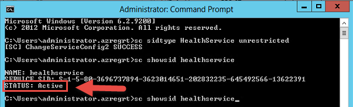
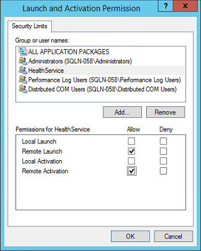
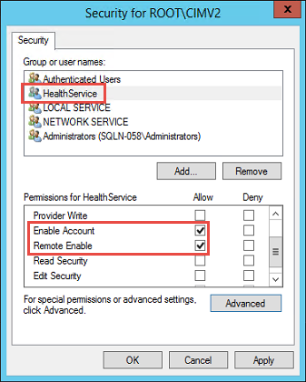
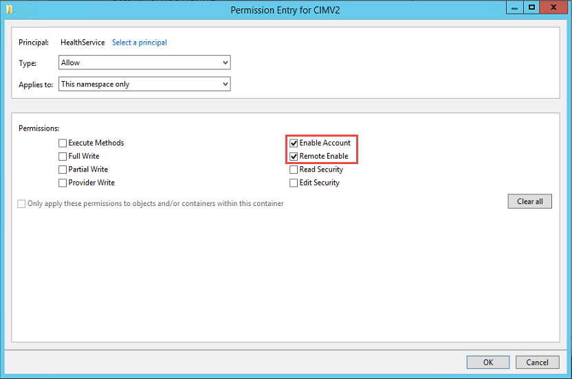
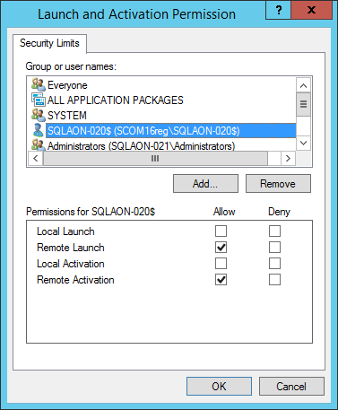
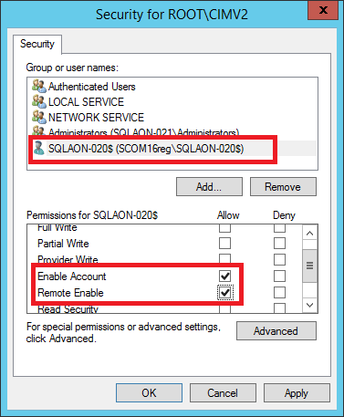

# Run As Profiles

## Management Pack for SQL Server Run As profiles

Management Pack for SQL Server provides the following Run As profiles:

- **Microsoft SQL Server Discovery Run As Profile**
  
  This profile is associated with existing discoveries.

- **Microsoft SQL Server Monitoring Run As Profile**

  This profile is associated with existing monitors and rules.

- **Microsoft SQL Server Run As Profile**

  This profile is associated with existing tasks.

- **Microsoft SQL Server SCOM SDK Run As Profile**

  This profile is for SQL Server MP workflows that need access to SCOM SDK.

- **Microsoft SQL Server SQL Credentials Run As Profile**

  This profile is used for [Agentless monitoring](ssmp-monitoring-modes.md#configuring-agentless-monitoring-mode) mode only.

Do not bind accounts to the **Microsoft SQL Server SQL Credentials Run As Profile** if you monitor SQL Server in agent or mixed monitoring modes, as only a basic action account can be bound to this profile. Also, do not use a Windows account or non-basic account with this profile.

When using agent or mixed monitoring mode, all discoveries, monitors and tasks defined in this management pack use accounts from the *Default Action Account* Run As profile.

If the default action account for a given system does not have necessary permissions to discover and monitor instances of SQL Server, such systems can be bound to more specific credentials defined in **Microsoft SQL Server** Run As profiles.

## Enabling Allow Log On Locally Security Policy

If the domain account is used as an action account for this management pack, enable the **Allow log on locally** policy for this account for both SQL Server on Windows and on Linux. For more information on how to configure this policy, see [Allow Log On Locally](https://docs.microsoft.com/windows/security/threat-protection/security-policy-settings/allow-log-on-locally).

## Configuring Run As Profiles for Agent and Mixed Monitoring Modes

To configure Run As profiles, use one of the following scenarios:

- [Action Account is Local Administrator and SA](#action-account-is-local-administrator-and-sa)

- [Action Account is Local Administrator w/o SA](#action-account-is-local-administrator-wo-sa)

- [Action Account is Local System w/o SA](#action-account-is-local-system-wo-sa)

- [Low-Privilege Monitoring](#low-privilege-monitoring)

### Action Account is Local Administrator and SA

A SCOM default action account is mapped to either local system account or any domain user account that is a member of the local administrators group on the monitored machines.

Note that the account that you use must be granted the SQL System Administrator (SA) rights on the monitored SQL Server instances.

A domain user account can be granted SA rights by granting them to the BUILTIN\Administrators local group in the SQL Server security access list. In this case, monitoring of SQL Server instances will work out of the box, except for some configurations described below.

Follow these steps to ensure that all requirements are met:

- If you store SQL Server databases on an SMB file share, the default action account must have the rights, as described in [Low-Privilege Agent Monitoring](ssmp-low-privilege-monitoring.md).

- In cases when servers hosting Always On Availability Replicas (at least one of them) have a machine name consising of more than 15 characters, make sure to perform the steps described in [Configuring Permissions for Always On Workflows with Long Server Names](#configuring-permissions-for-always-on-workflows-with-long-server-names).

### Action Account is Local Administrator w/o SA

A SCOM default action account is mapped to either local system account or domain user account, but SA rights cannot be granted to this account due to security policies.

If the security policy allows granting SA rights to the separate domain user account used for launching SQL Server MP workflows only, perform the following steps:

1. Create a new domain user account and add this account to the Local Administrators group on each monitored server.

2. Grant SA rights to this account on SQL Server.

3. Create a new action account in SCOM and map it to the domain user account created above.

4. Map the new action account to all SQL Server MP Run As Profiles.

If you store SQL Server databases on an SMB file share, the default action account must have the rights, as described in [Low-Privilege Agent Monitoring](ssmp-low-privilege-monitoring.md).

### Action Account is Local System w/o SA

[This scenario is for agent monitoring mode only.]

A SCOM default action account is mapped to either local system account or domain user account, but SA rights cannot be granted to this account due to security policies that forbid access to SQL Server.

You can grant SA or low privilege rights to SCOM HealthService using its Service Security Identifier. For more information, see [SQL Server uses a service SID to provide service isolation](https://support.microsoft.com/help/2620201/sql-server-uses-a-service-sid-to-provide-service-isolation) and [How to configure SQL Server 2012 to allow for System Center Advisor monitoring](https://support.microsoft.com/help/2667175/how-to-configure-sql-server-2012-to-allow-for-system-center-advisor-mo).

Follow these steps to configure the security configuration using SID:

- Configure a service SID for HealthService, as described in [Configuring Monitoring with Service Security Identifier](#configuring-monitoring-with-service-security-identifier).

- If you have SQL Server cluster instances, perform the steps provided in [Configuring HealthService Service SID for SQL Server Cluster Instances](#configuring-healthservice-service-sid-for-sql-server-cluster-instances).

### Low-Privilege Monitoring

If you need to grant minimum required rights to the SQL MP workflows, follow the instructions provided in [Configuring Low-Privilege Monitoring](ssmp-low-privilege-monitoring).

## Configuring Run As Profiles for Agentless Monitoring Mode

To configure Run As Profiles in [Agentless Monitoring](ssmp-monitoring-modes) mode, create an account in SQL Server grant this account SA rights or a set of low privilege permissions. You can use SQL Server authentication or Windows authentication. Once created, you can use this account in the [Add Monitoring Wizard](ssmp-low-privilege-monitoring.md) to add a SQL Server instance.

For more information on how to configure low privilege monitoring in agentless monitoring mode, see the [Low-Privilege Monitoring](ssmp-low-privilege-monitoring.md).

## Configuring Monitoring with Service Security Identifier

Below are the steps to configure monitoring using Service SIDs for SQL Server on a Windows Server instance. These steps were first published by Kevin Holman in [his blog](https://kevinholman.com/2016/08/25/sql-mp-run-as-accounts-no-longer-required/). The SQL scripts to configure lowest-privilege access were developed by Brandon Adams.

To configure monitoring with Service Security Identifier, perform the following steps:

1. Open the command prompt as administrator and run the **sc sidtype HealthService unrestricted** command.

2. Restart the Health Service.

3. Run the **sc showsid HealthService** command. The **STATUS** parameter should be active.

    

4. Open **Registry Editor** and check that the *ServiceSidType* key is set to 1 at *HKEY_LOCAL_MACHINE\SYSTEM\CurrentControlSet\Services\HealthService*.

5. Create the NT SERVICE\HealthService account for the HealthService SID on every SQL Server Instance and grant it SA rights. 

    If you cannot grant SA rights, use the following SQL scripts to set the lowest privilege configuration for the account.

    ```sql
    USE [master]
    SET NOCOUNT ON
    /*User account which SCOM will use for access
        Default is the Service SID for the HealthService*/
    DECLARE @accountname sysname = 'NT SERVICE\HealthService'
    -- Create the server role and grant permissions
    CREATE SERVER ROLE [SCOM_HealthService]
    GRANT VIEW ANY DATABASE TO [SCOM_HealthService];
    GRANT ALTER ANY DATABASE TO [SCOM_HealthService];
    GRANT VIEW ANY DEFINITION TO [SCOM_HealthService];
    GRANT VIEW SERVER STATE TO [SCOM_HealthService]
    DECLARE @createLoginCommand nvarchar(200)
    SET @createLoginCommand = '
      CREATE LOGIN '+ QUOTENAME(@accountname) +
      ' FROM WINDOWS WITH DEFAULT_DATABASE=[master];'
    EXEC(@createLoginCommand);
    -- Add the login to the user-defined server role
    EXEC sp_addsrvrolemember @loginame = @accountname
      , @rolename = 'SCOM_HealthService'
    DECLARE @createDatabaseUserAndRole nvarchar(max)
    SET @createDatabaseUserAndRole = '';
    SELECT @createDatabaseUserAndRole = @createDatabaseUserAndRole + '
      USE ' + QUOTENAME(db.name) + ';
      CREATE USER ' + QUOTENAME(@accountname) +
      ' FOR LOGIN ' + QUOTENAME(@accountname) + ';
      CREATE ROLE [SCOM_HealthService];
      EXEC sp_addrolemember @rolename =
      ''SCOM_HealthService'', @membername
      = '+ QUOTENAME(@accountname) + ''
    -- 'ALTER ROLE [SCOM_HealthService] ADD MEMBER '
      -- '+ QUOTENAME(@accountname) + ';'
    FROM sys.databases db
    LEFT JOIN sys.dm_hadr_availability_replica_states hadrstate ON
        db.replica_id = hadrstate.replica_id
    WHERE db.database_id <> 2
        AND db.user_access = 0
        AND db.state = 0
        AND db.is_read_only = 0
        AND (hadrstate.role = 1 or hadrstate.role is null);
    EXEC(@createDatabaseUserAndRole)
    GO
    USE [master];
    GRANT EXECUTE ON sys.xp_readerrorlog
      TO [SCOM_HealthService]
    USE [msdb];
    GRANT SELECT on [dbo].[sysjobschedules]
      TO [SCOM_HealthService];
    GRANT SELECT on [dbo].[sysschedules]
      TO [SCOM_HealthService];
    GRANT SELECT on [dbo].[sysjobs_view]
      TO [SCOM_HealthService];
    GRANT SELECT on [dbo].[log_shipping_primary_databases]
      TO [SCOM_HealthService];
    GRANT SELECT on [dbo].[log_shipping_secondary_databases]
      TO [SCOM_HealthService];
    GRANT SELECT on [dbo].[log_shipping_monitor_history_detail]
      TO [SCOM_HealthService];
    GRANT SELECT on [dbo].[log_shipping_monitor_secondary]
      TO [SCOM_HealthService];
    GRANT SELECT on [dbo].[log_shipping_monitor_primary]
      TO [SCOM_HealthService];
    GRANT EXECUTE on [dbo].[sp_help_job]
      TO [SCOM_HealthService];
    GRANT EXECUTE on [dbo].[sp_help_jobactivity]
      TO [SCOM_HealthService];
    EXEC sp_addrolemember @rolename='PolicyAdministratorRole'
      , @membername='SCOM_HealthService';
    EXEC sp_addrolemember @rolename='SQLAgentReaderRole'
      , @membername='SCOM_HealthService';
    ```

6. In order to run SQL Server MP tasks, such as *Set database Offline*, *Set database Online* and *Set database to Emergency state*, grant HealthService SID account the **ALTER ANY DATABASE** permission.

    ```sql
    USE [master]
    GRANT ALTER ANY DATABASE TO [SCOM_HealthService];
    ```

The NT AUTHORITY\SYSTEM account needs to be present as a SQL login and must not be disabled. This login must also be present and enabled for cluster nodes and Always On.

## Configuring HealthService Service SID for SQL Server Cluster Instances

To configure HealthService Service SID for monitoring of SQL Server failover cluster, perform the following steps for each cluster node:

1. Launch **mmc.exe** and add the following snap-ins:

    - Component Services
    
    - WMI Control (for the local computer)

2. Expand **Component Services**, right-click **My Computer**, select **Properties** and open the **Security** tab.

3. Click **Edit Limits** in the *Launch and Activation Permissions* section.

    

4. In the **Launch and Activation Permission** window, Enable the following permissions for the NT SERVICE\\HealthService account:

    - Remote Launch
    
    - Remote Activation

    

5. Go to the WMI Control snap-in and open its properties.

6. Open the **Security** tab, select the **Root\\CIMV2** namespace and click **Security**.

7. Enable the following permissions for the NT SERVICE\\HealthService account:

    - Enable Account
    
    - Remote Enable

    

8. Click **Advanced**.

9. In the **Permissions Entry for CIMV2** window, select a HealthService account and click **Edit**. 

    Make sure that **Applies to** is set to *This namespace only* and enable the following permissions:

    - Enable Account
    
    - Remote Enable

    

## Configuring SCOM SDK Run As Profile

Management Pack for SQL Server needs the author set of privileges on the SCOM SDK to be able to create a management pack and store overrides in it.

If the default action account on SCOM does not have these permissions, create such an account and map it to the Microsoft SQL Server SCOM SDK Run As Profile.

## Configuring Permissions for Always On Workflows with Long Server Names

Regardless of whether you use a local system account, domain user account or rights assignment, permissions listed below are required for the account.

**Example**: You have three replicas in your Availability Group that are hosted on the following computers:

- Computer_1

- Computer_2

- Computer_3
  
*Computer_1* hosts the primary replica. In this case, you should configure security settings for *Computer_1* on *Computer_2* and *Computer_3*. If *Computer_2* is going to host the primary replica after failover, other computers should also have WMI security configured for this computer.

The local system account of each node that might act as the Primary one must have WMI permissions for other nodes of the current Availability Group. The same is for domain action account used for monitoring.

Below are the steps to configure security for configurations with the local system account. The provided instruction suggests that the *SQLAON-020* computer hosts the primary replica. These steps should be taken on each replica that participates in the target Availability Group.

To configure permissions for Always On workflows when server names exceeds 15 characters, perform the following steps:

1. Launch **mmc.exe** and add the following snap-ins:

    - Component Services
    
    - WMI Control (for local computer)

2. Expand **Component Services**, right-click **My Computer** and select **Properties**.

3. Open the **COM Security** tab.

4. Click **Edit Limits** in the **Launch and Activation Permissions** section.

    

5. In the **Launch and Activation Permission** window, enable the following permissions for the remote machine account:

    - Remote Launch
    
    - Remote Activation

    

6. Open **WMI Control** snap-in properties, go to the **Security** tab, select the **Root\CIMV2** namespace and click **Security**.

7. Alow the following permissions for the target computer:
  
    - Enable Account
    
    - Remote Enable

    

8. Click **Advanced**, select a target account and click **Edit**.

9. Make sure that the **Applies to** parameter is set to **This namespace only** and enable the following permissions:

    - Enable Account
    
    - Remote Enable

    