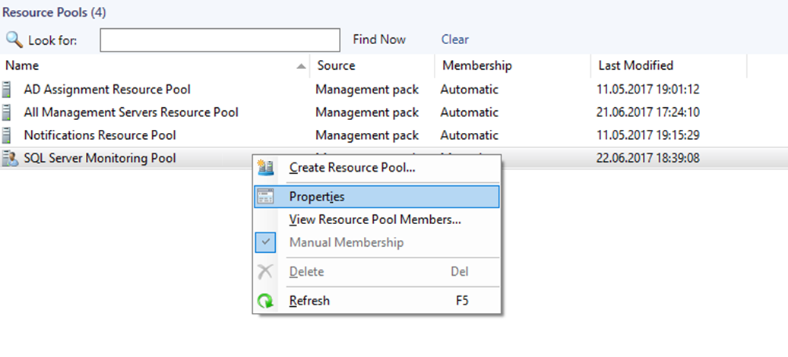
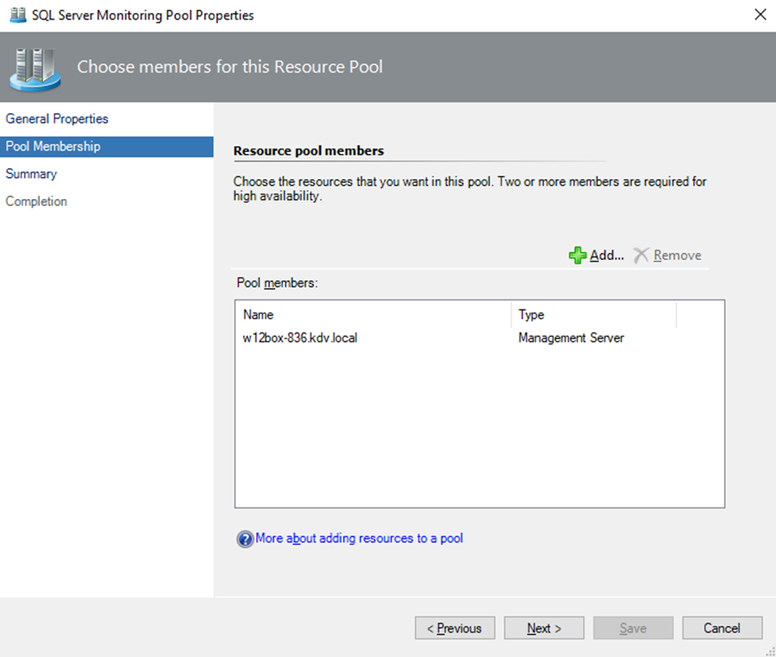

# SQL Server Monitoring Pool

You can configure SQL Server Monitoring Pool manually by adding custom gateways and management servers.

To configure SQL Server Monitoring Pool, perform the following steps:

1. Navigate to **Administration | Resource Pools** and in the list of resource pools, right-click **SQL Server Monitoring Pool**.

2. Select the **Manual Membership** option and click **Properties**.

    

3. In the **SQL Server Monitoring Pool Properties** window, open the **Pool Membership** tab and click **Add** to populate the monitoring pool.

    