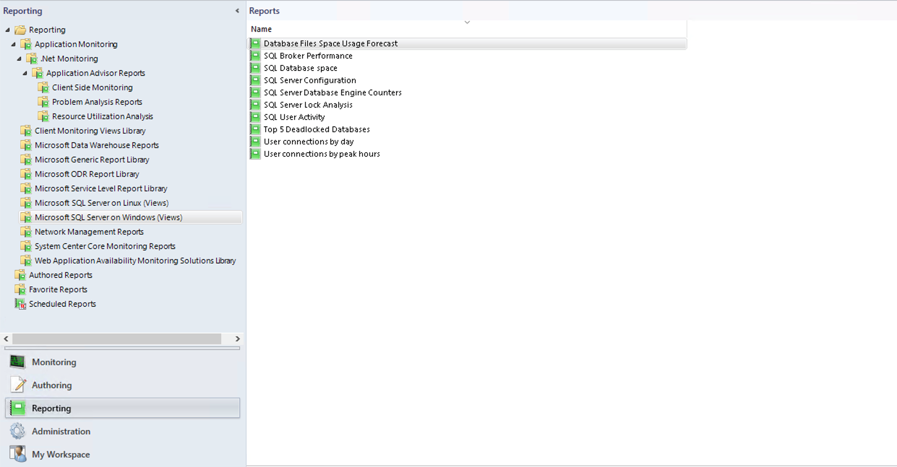
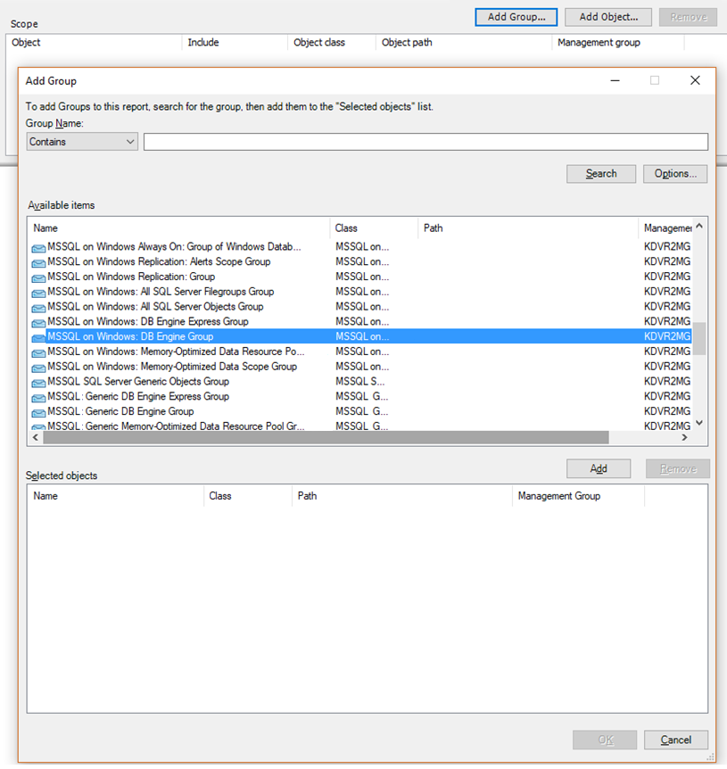
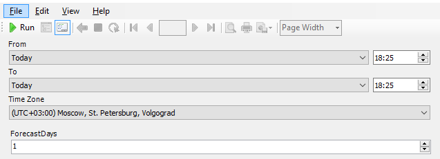
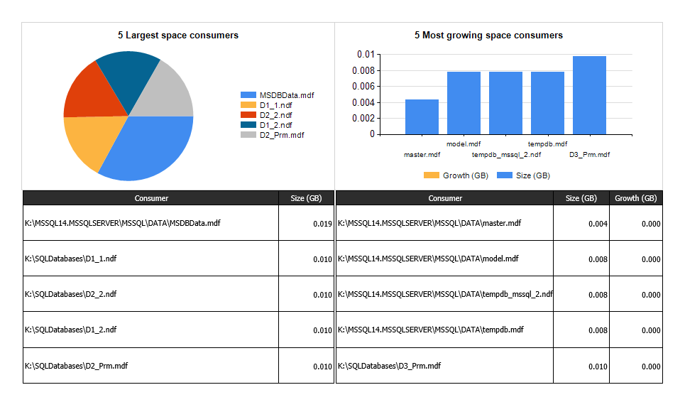
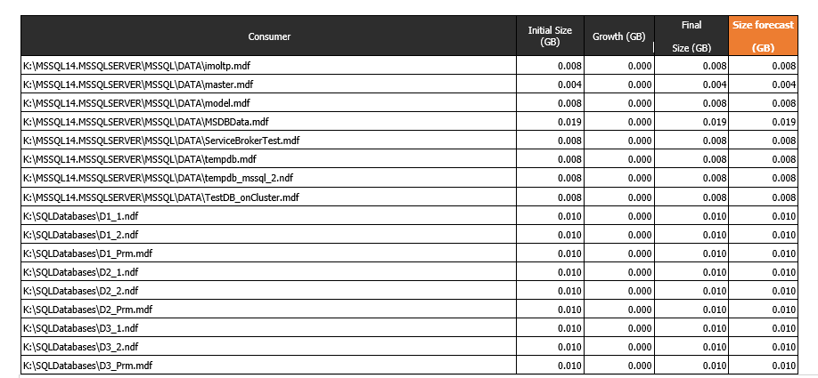

# SQL Server Reporting

Management Pack for SQL Server introduces the **Database Files Space Usage Forecast** report that provides the following information:

- Initially consumed file space (GB)

- Finally consumed file space (GB)

- Initial average free file space (%)

- Final average free file space (%)

- File space consumption forecast (GB)

Note that this report works with Windows objects only.

To open the report, perform the following steps:

1. In the **Reporting** view, double-click **Database Files Space Usage Forecast**.

    

2. In the **Add Group** window, add an object or a group of objects.

    

3. Select a period and the corresponding time zone for the report. Also, select the number of days for the file space consumption forecast.

    

4. Click **Run**.

The report displays a separate chart for every selected object or a group of objects.

A space usage forecast can be reviewed in a separate table.

