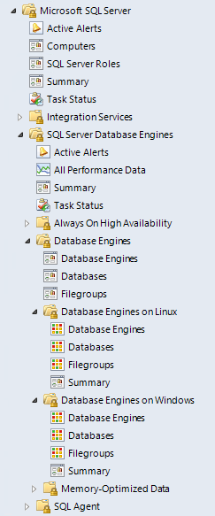

# Views and Dashboards in Management Pack for SQL Server

Management Pack for SQL Server introduces a common folder structure that will be used in future releases of management packs for different components of SQL Server.

The following views and dashboards are version-independent and show information about all versions of SQL Server.

The **Computers** view displays computers on which agents are installed and management pack discovery is running. This view does not display computers configured for [agentless monitoring](ssmp-monitoring-modes.md#configuring-agentless-monitoring-mode).

The **SQL Server Roles** dashboard provides information about instances of SQL Server Database Engine, SQL Server Reporting Services, SQL Server Analysis Services, and SQL Server Integration Services.

Some of these views may consist of a very long list of objects and metrics. To find specific objects, you can use the **Scope**, **Search**, and **Find** buttons on the Operations Manager toolbar. For more information, see [Finding data and objects in the Operations Manager consoles](manage-console-finding-data.md).