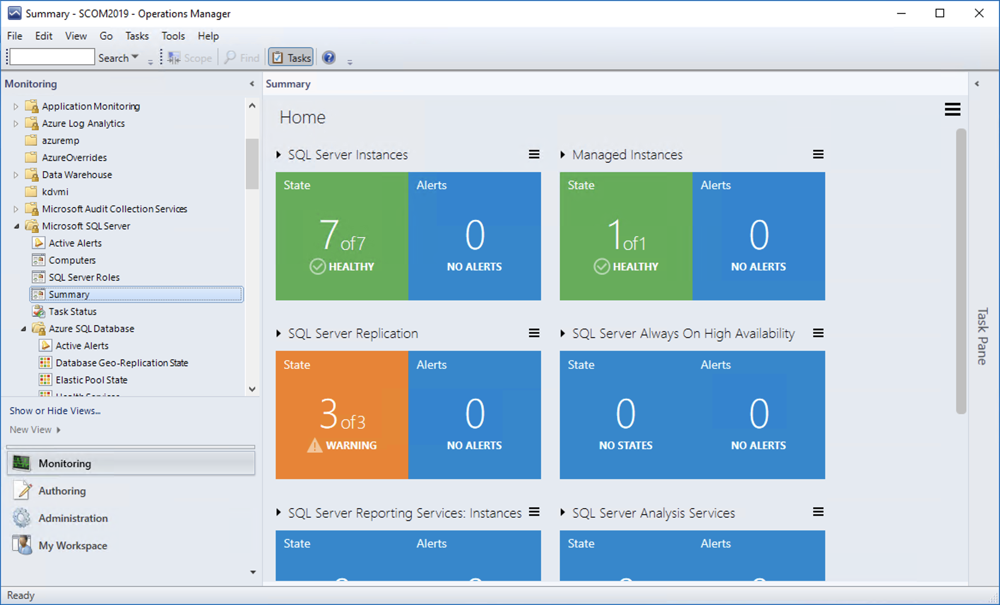
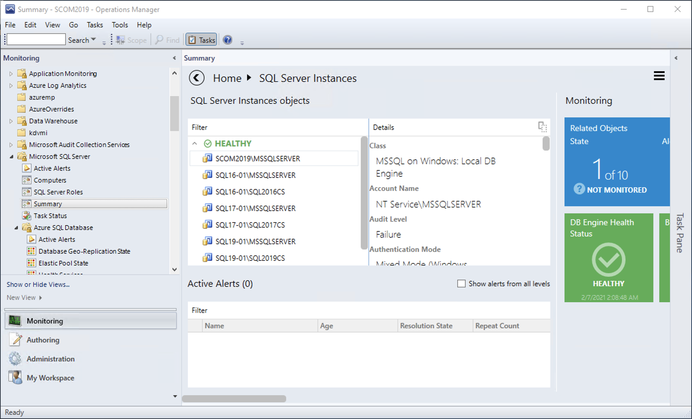
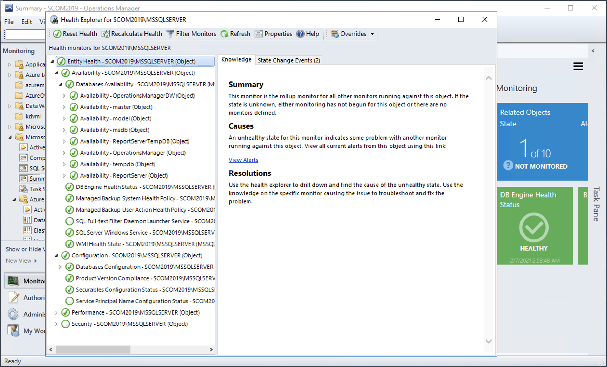

# Views and Dashboards

## Version-Independent (Generic) Views and Dashboards

Management Pack for SQL Server introduces a common folder structure that will be used by future releases of management packs for different components of SQL Server.

The following views and dashboards are version-independent and show information about all versions of SQL Server.

The **Computers** node view displays computers on which the agents are installed and the management pack discovery is running. This view does not display computers configured for [agentless monitoring](ssmp-monitoring-modes.md#configuring-agentless-monitoring-mode).

The **SQL Server Roles** dashboard provides information about all instances of SQL Server Database Engine, SQL Server Reporting Services, SQL Server Analysis Services, and SQL Server Integration Services.

## SQL Server Views

Management Pack for SQL Server introduces a comprehensive set of state, performance and alert views that can be found in the associated folders.

Some views may contain a long list of objects and metrics. To find a specific object or group of objects, you can use the **Scope**, **Search**, and **Find** buttons on the Operations Manager toolbar. For more information, see [Finding Data and Objects in the Operations Manager Consoles](https://go.microsoft.com/fwlink/?LinkId=717834).

## SQL Server Dashboards

Management Pack for SQL Server introduces a comprehensive set of dashboards that show summary information about your SQL Server infrastructure.

To see the dashboards, click the **Summary** node that can be found in the following section of the Operations Manager console.

The following figure shows an example of a dashboard from the **Microsoft SQL Server** section.

This dashboard consists of six aggregated group tiles. Each tile shows summary information about your infrastructure state as per SQL entity. For example, the **SQL Server Instances** tile is shown as critical, having 25 active alerts occurred on 3 SQL instances that require your attention.

You can double-click an aggregated group tile to drill down the hierarchy until you reach the objects you are most interested in.

As per example above, if you double-click the **SQL Server Instances** aggregated group tile, you will see information about existing instances, active alerts, and the **Monitoring** section that encompasses entity-specific tiles.

There are two types of entity-specific tiles:

- Performance tiles

- Monitor tiles

You can double-click any of these tiles to see the associated performance monitor or health explorer. For example, if you double-click the *DB Engine Health Status* tile, the **Health Explorer** window appears, showing you the health state of the DB engine.

You can scroll to the right to see all available performance and monitor tiles. You can also move any tile if you want to rearrange the default order of tiles. To move a tile, right-click it and then move it to the desired position.