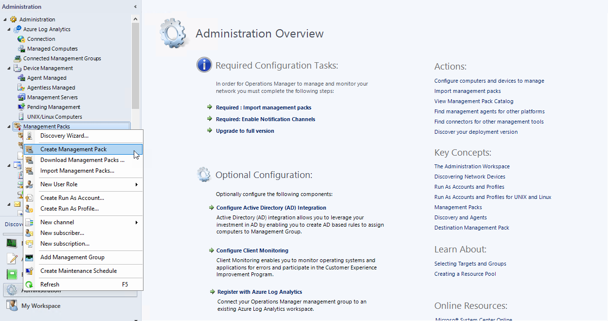
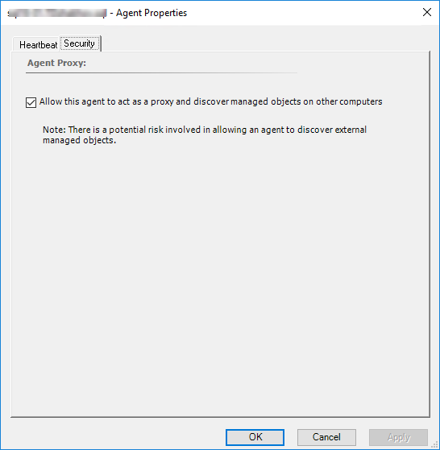

# Management Pack Configuration

Management Pack for Microsoft SQL Server Replication is sealed; you cannot change any of the original settings.

To change original settings, you can create a custom management pack to keep overrides and new monitoring objects.

Creating a custom management pack for storing overrides has the following advantages:
  
- Quick export of customized settings from the test environment to production environment.
  
- You do not have to remove dependencies when removing the management pack with overrides.

- If customizations for all management packs are saved to the default management pack and you want to remove a single pack, you must first remove the default management pack, which also removes customizations for other management packs.

For more information about sealed and unsealed management packs, see [Management Pack Formats](https://docs.microsoft.com/previous-versions//bb381260(v=technet.10)?redirectedfrom=MSDN).

For more information about management pack customizations and default management packs, see [About Management Packs in Operations Manager](https://docs.microsoft.com/en-us/previous-versions//bb309721(v=technet.10)?redirectedfrom=MSDN).

## Creating New Management Pack for Customizations

To create a new management pack, perform the following steps:

1. Open the System Center Operations Manager console.

2. In the **Administration** view, right-click **Management Packs**, and select **Create New Management Pack**.

    

3. Enter a new name, click **Next**, and click **Create**.

## Enabling Agent Proxy Option

To enable the **Agent Proxy** option, perform the following steps:

1. Open the System Center Operations Manager console.

2. In the **Administration** view, select **Agent Managed**.

3. Double-click an agent.

4. On the **Security** tab, select the **Allow this agent to act as a proxy and discover managed objects on other computers** checkbox, and click **OK**.

    