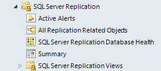

# Views and Dashboards in Management Pack for SQL Server Replication

Management Pack for Microsoft SQL Server Replication uses a common folder structure introduced in the first release of Management Pack for SQL Server.

The following views and dashboards are version-independent and show information about all versions of SQL Server.

The **All Replication Related Objects** diagram view provides information about all SQL Server Replication objects and their relations.

The **SQL Server Replication Database Health** state view provides information about all databases participating in replication as published database.

Some of these views may consist of a very long list of objects and metrics. To find specific objects, you can use the **Scope**, **Search**, and **Find** buttons on the Operations Manager toolbar. For more information, see [Finding data and objects in the Operations Manager consoles](manage-console-finding-data.md).