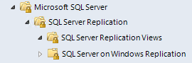
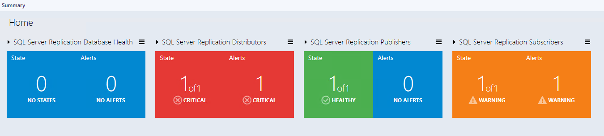
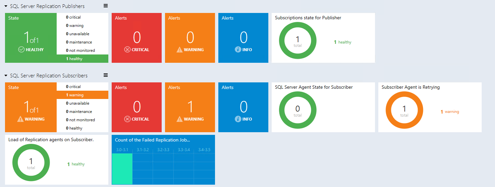

# Views and Dashboards in Management Pack for SQL Server Replication

Management Pack for Microsoft SQL Server Replication uses a common folder structure introduced in the first release of Management Pack for SQL Server.

The following views and dashboards are version-independent and show information about all versions of SQL Server.

The **All Replication Related Objects** diagram view provides information about all SQL Server Replication objects and their relations.

The **SQL Server Replication Database Health** state view provides information about all databases participating in replication as published database.

From this view, it is easy to open the diagram view specific to the published database.

## SQL Server Replication Views

Management Pack for Microsoft SQL Server Replication introduces the comprehensive set of state, performance and alert views.

Some of these views may consist of a very long list of objects and metrics. To find specific objects, you can use the **Scope**, **Search**, and **Find** buttons on the Operations Manager toolbar. For more information, see [Finding data and objects in the Operations Manager consoles](manage-console-finding-data.md).

## Dashboards

Management Pack for Microsoft SQL Server Replication includes a set of dashboards that provide detailed information about SQL Server Replication.

Each dashboard has a navigation widget (located in the leftmost part of the dashboard) that can be used to switch the current presentation context. Information displayed by other widgets depends on the object that was selected in the navigation widget.

Replication dashboards have the following personalization settings:

- **Refresh Rate**-defines how often the dashboard refreshes data on a client. This setting does not change the actual collection frequency of metrics on a server.

- **Time Interval**-defines for which period to display data. The *Performance* widget on the “Instance” view depends on this setting.

- **Background Color**-changes the background color for all views.

Use the menu button or a group in order to add a group or tile. To delete or edit a tile, right-click a tile and select the required action.

The background color, time interval and refresh rate settings are applied to the **Datacenter Dashboard** and all **Instance Dashboards**, and can be set from the **Datacenter Dashboard** menu.

### Replication Components Datacenter Dashboard

The Replication Components Datacenter dashboard is a dashboard for SQL Server version-independent replication. This dashboard contains four groups by default:

- Replication Database Health Group
- Distributors Group
- Publishers Group
- Subscribers Group

### SQL Server Replication Datacenter Dashboard

The SQL Server Replication Datacenter dashboard is a specific dashboard for SQL Server replication.

This dashboard contains only the SQL Server replication group that contains all SQL Server distributors, publishers and subscribers.

