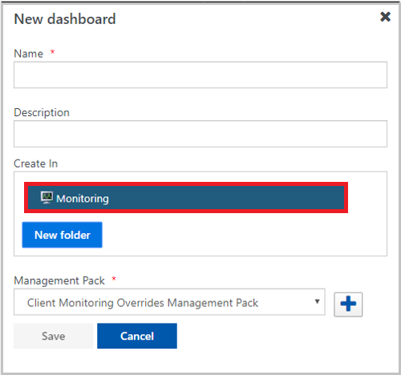
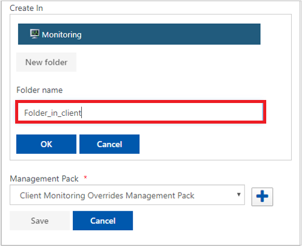
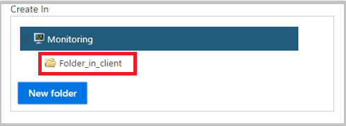
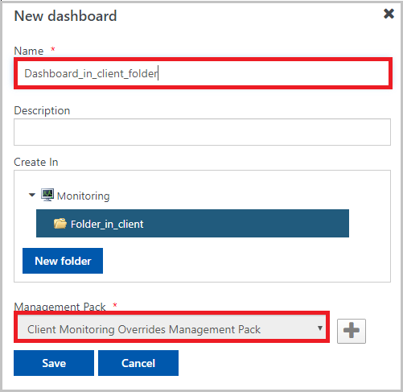

# Create folders from the web console in Operations Manager

You can create folders by using the System Center Operations Manager web console and then store dashboards inside them.

::: moniker range="sc-om-2019"

In Operations Manager 2016 and later, you can create a folder and place dashboards and views inside it by using the operations console. However, this feature isn't available from the web console. With 2019 UR2, by using the web console, you can create folders and place dashboards inside them. These folders can be saved in unsealed management packs.

::: moniker-end

::: moniker range=">=sc-om-2022"

In Operations Manager, you can create a folder and place dashboards and views inside it by using the operations console and the web console. You can also create folders and place dashboards inside them. These folders can be saved in unsealed management packs.

::: moniker-end

Folders and views created from the operations console can be viewed in the web console, but the dashboards created from the web console aren't visible in the operations console.

## Create a folder

1. Open the web console and go to **Monitoring**.

2. Select **New dashboard**. This step opens a pane where the **Monitoring** folder is selected by default.

   

3. In the **Management Pack** dropdown list, select the management pack where you want to save your new folder. In the current example, **Client Monitoring Overrides Management Pack** is selected.

4. Select **New folder**, and then enter the name of the new folder. In the current example, the new name is **Folder\_in\_client**.

   

5. Select **OK**.

   The new folder is saved in the selected management pack, and it appears in the list of folders.

   

> [!NOTE]
> You can save a folder inside a preexisting folder. In the preceding steps, select the desired folder instead of **Monitoring**. These folders can be deleted from the operations console.

## Save a dashboard inside a folder

1. Open the web console and go to **Monitoring**.

2. Select **New dashboard**.

3. Enter the name of the dashboard.

4. In the list, select the folder where you want to store the dashboard. Management pack selection is based on the root folder.

   

   > [!NOTE]
   > You can create a dashboard at the root monitoring level by not selecting any folder and selecting the monitoring root.

5. Select **Save**. The dashboard is stored inside the selected folder and appears on the left pane.

## Create folders in the web console by using the REST API

You can use the following REST API requests to create folders in the web console and save dashboards inside them.

This feature is applicable only to System Center Operations Manager 2019 UR2 and later versions.

### Data/monitoringTreeForRootFolders

`Data/monitoringTreeForRootfolders` is a `GET` request that returns all the folders stored in unsealed management packs inside which you can store dashboards and folders. You can use the output of this request for the following `POST` requests.

### monitoring/folder

You can use the `monitoring/folder` request of type `POST` to create a new folder inside a management pack. Here are the required parameters:

| Name | Type  | Definition |
|----|---|------|
| `path` | string |Name of the new folder. |
| `mpId` | string | ID of the management pack where you want to create the new folder.  |

You can also use the `monitoring/folder` request of type `POST` to create a new folder inside a preexisting folder. Here are the required parameters:

| Name | Type  | Definition |
|----|---|------|
| `component ID` | string |Folder ID of the parent where you want to store the new folder. |
| `path` | string | Name of the new folder.  |

### monitoring/dashboard/

You can use the `monitoring/dashboard/` request of type `POST` to save a dashboard inside a new folder. Here are the required parameters:

| Name | Type  | Definition |
|----|------|-----|
| `name` | string | Name of the new dashboard. |
| `path` | string | Folder ID where you want to save the new dashboard.  |

You can also use the `monitoring/dashboard/` request of type `POST` to save a dashboard inside the root monitoring. Here are the required parameters:

| Name | Type  | Definition |
|----|----|-----|
| `mpId`  | string  | ID of the management pack where you want to store the dashboard. |
| `name` | string| Name of the new dashboard.  |

## Related content

- [Standard views in Operations Manager](manage-console-standard-views.md)
- [Create and scope views in Operations Manager](manage-console-scope-views.md)
- [Data - Retrieve Items In Monitoring Tree View](/rest/api/operationsmanager/data/retrieve%20items%20in%20monitoring%20tree%20view) (API reference)
- [Monitoring - Add Dashboard](/rest/api/operationsmanager/monitoring/add-dashboard) (API reference)
