# Web Application Availability Monitoring template

The  **Web Application Availability Monitoring**  template lets you create availability monitoring tests for one or more web application URLs and run these monitoring tests from internal locations. In addition to state and alert views, you can display the status of these tests in a provided map dashboard and a details dashboard.

## Scenarios

Use the  **Web Application Availability Monitoring**  template in scenarios where you have to monitor web-based applications from different locations to see if they are working according to certain requirements, which you can specify.

## Internal locations

You might have web applications that must be available at all times at internal locations. Use the  **Web Application Availability Monitoring**  template to see which web applications are available from which internal locations.

## Monitoring Performed by the Web Application Availability Monitoring Template

By default, the  **Web Application Availability Monitoring**  template configures the following monitoring by default. You can modify the monitor in the  **Change Configuration**  page of the  **Web Application Availability Monitoring**  template.

| Monitor description | Default values |
| --- | --- |
| Web Application Monitor | - The monitor is enabled by default.
||- Test Frequency: 10 minutes
||- Performance data collection interval: 1 every 10 minutes
||- Test time-out: 45 seconds
||- HTTP status code: 400 (An alert will be generated if the HTTP status code is 400 or greater.)
||- Number of consecutive times a criteria should fail before an alert is generated: 1
||- Generate alerts from each test: enabled
||- Allow redirects: enabled
||- HTTP version: HTTP/1.1
||- HTTP method: GET
||- HTTP headers: accept "/"
||- HTTP headers: accept language of your product
||- HTTP headers: accept encoding GZIP
 |
| Performance Data Collection | - Transaction response time: enabled
||- Response time: enabled
||- TCP connect time: enabled
||- Time to first byte: enabled
||- Time to last byte: enabled
||- DNS resolution time: enabled
||- Content size: enabled
||- Content time: enabled
||- Download time: enabled

## Viewing monitoring data

All data collected by the  **Web Application Availability Monitoring**  template appears in the  **Web Application Availability Monitoring**  folder in the  **Application Monitoring**  folder in the  **Monitoring**  navigation pane. The  **Application Availability Monitoring**  folder contains the default views and subfolders that provide Test State, Web Application Status, and alerts related to the tests being monitored. By using the Test State view, you can see the test state of the individual tests. The state of each object matches the state of the targeted object that has the worst health state so that you see the worst state of the monitors that are running. If one or more of the tests are shown with an error while at least one other test is healthy, it could indicate a problem for that particular test location. If all of the components are unhealthy, it could indicate a problem with the web application itself.

**Web Application Availability Monitoring folder**

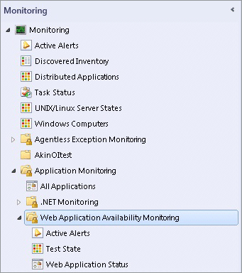

To view the state of the individual monitors, open the Health Explorer for each test.

## Wizard options

When you run the  **Web Application Availability Monitoring**  template, you have to provide values for options as listed in the following tables. Each table represents a single page in the wizard.

## General

The following options are available on the  **General**  page of the wizard.

| Option | Description |
| --- | --- |
| Name | Enter the friendly name used for the template and test group that you are creating. This name is displayed in the Operations Console in the Web Application status view and is used for the folder under the  **Web Application Availability Monitoring**  folder.  **Note:** After you have given the template a name and saved the template, this name cannot be edited without deleting and re-creating the template.  |
| Description | Describe the template. (Optional) |
| Select destination management pack | Select the management pack to store the views and configuration created by the template. Use the same name for your new management pack as the test group so you can easily pair the two names. You can use an existing management pack or create a new management pack. For more information about management packs, see [Selecting a Management Pack File](https://docs.microsoft.com/previous-versions/system-center/system-center-2012-R2/hh457560%28v%3dsc.12%29). |

## What to monitor

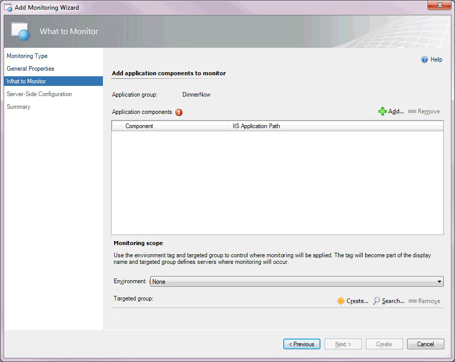

Add URLs to the list by typing, pasting, or importing a file into the table, including the appropriate protocol (http:// or https://). You can paste entire rows as pairs of comma-separated values (CSV) that are in the format 'Name, URL', or you can paste just the list of URLs.

The following options are available on the  **What to Monitor**  page of the wizard.

| Option | Description |
| --- | --- |
| Name | Name of the website you want to monitor. |
| URL | URL of the website you want to monitor in the format: http://www.website.com |
| Add | Add URLs to monitor from an external file. You can paste a list of URLs or rows of a spreadsheet as pairs of comma-separated values that are in the format: Name, URL |

## Where to Monitor From

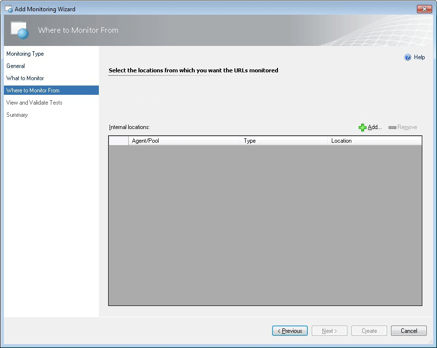

Select the internal locations from which you want the URLs to be monitored.

The following options are available on the  **Where to Monitor From**  page of the wizard.

| Option | Description |
| --- | --- |
| Internal locations | The internal locations you are configuring to monitor from. |
| Add/Remove | Add or remove internal locations you want to monitor from. |

## Select Internal Locations

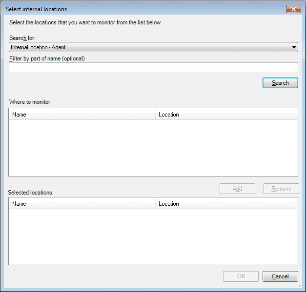

Select the internal locations from which you want to monitor the URLs you specified on the  **What to Monitor**  page. Click Add to add internal locations and then search for and select the internal locations that you want to monitor from.

The following options are available on the  **Select internal locations**  page of the wizard.

| Option | Description |
| --- | --- |
| Search for | Option showing the kind of locations you search will look for. You can choose agents or pools. |
| Filter by part of name | Filter your search of internal locations. |
| Search | Search for locations that are available to monitor from. Available locations are displayed in the in the Location area. |
| Where to monitor: Name | List of the internal locations from which you can select to monitor from. |
| Where to monitor: Location |   |
| Add | Add the internal locations you have selected to the Selected locations area. These are the locations you are configuring the wizard to monitor from. |
| Selected locations: Name | These are the internal locations you have chosen to monitor from. |
| Selected locations: Location | List of the locations you have chosen to monitor from. |

## View and validate tests

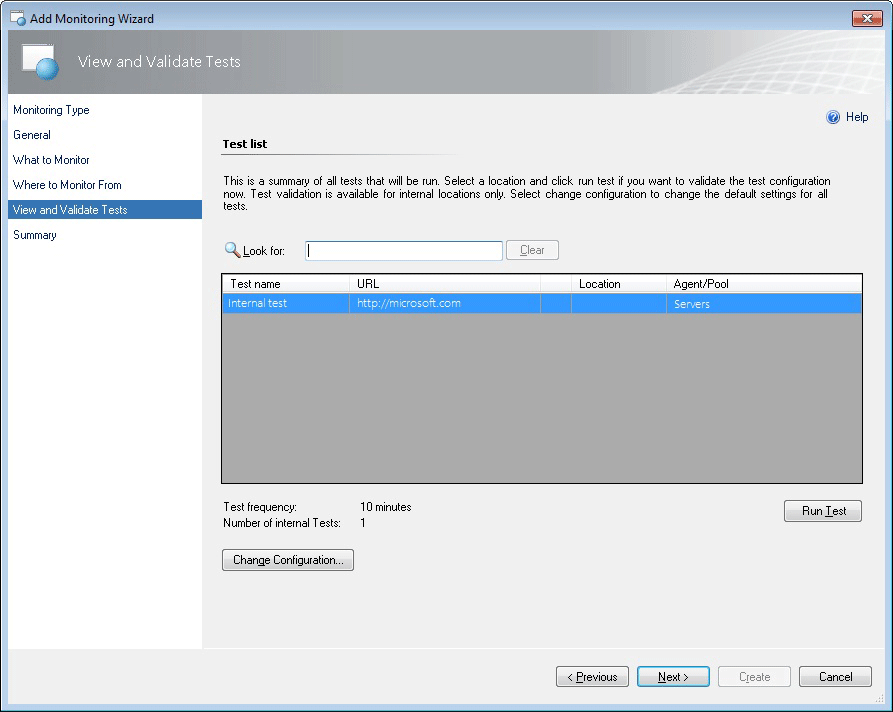

This is a summary of all tests that will be run. Select an internal location and click  **Run Test**  to validate the test configuration. Select Change configuration to change the default settings for all tests in this template.

The following options are available on the  **View and Validate Tests**  page of the wizard.

| Option | Description |
| --- | --- |
| Look for | Search for and returns results for items in the list of test names, URLs, Locations, and Agent/Pools. Use this to find specific tests or sets of tests that you want to validate. |
| Test Name | Name of a test. |
| URL | URL for a specific test. |
| Agent/Pool | The Agent or Pool location for your internal URL tests. |
| Run Test | Run a validation test for internal tests that are selected. |
| Change Configuration | Open the  **Change Configuration**  page where you can change the settings for all tests in the template you are authoring. |

## Test results: Summary tab

The following options are available on the  **Test Results Summary**  tab of the wizard.

| Option | Description |
| --- | --- |
| Summary tab | Confirms if the test request was correctly processed and shows the URL and Location used in the test. Additionally. The specific tests and results are shown: Status code, DNS resolution time, and Total response time. |

## Test results: Details tab

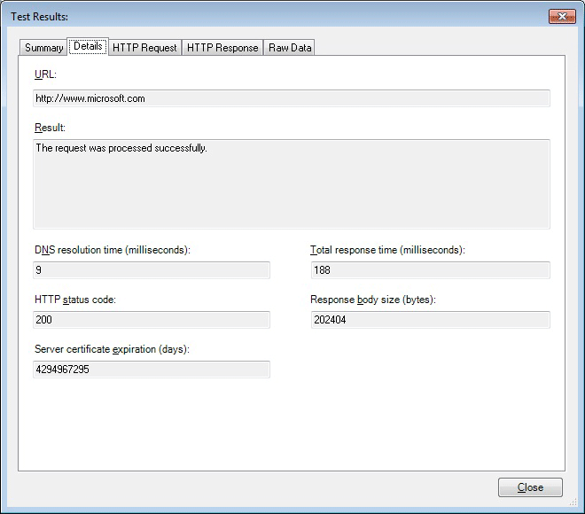

The following options are available on the  **Test Results Details**  tab of the wizard.

| Option | Description |
| --- | --- |
| Details tab: URL | See detailed information about the test. Displays which URL was tested. |
| Details tab: Result | Displays whether the test request was processed successfully or not. |
| Details tab: DNS resolution time (milliseconds) | Displays the DNS resolution time which checks that website performs as you expected it to. What's the IP address of the URL you are. Time it takes for DNS to get the IP address for the website. |
| Details tab: Total response time (milliseconds) | Displays the Total response time from same as transaction time performance counter. |
| Details tab: HTTP status code | Displays the HTTP status code when you ping a website, you get a status code. |
| Details tab: Response body size (bytes) | Displays the Response body size of the HTTP response information. |
| Details tab: Server certificate expiration (days) | Displays the certificate expiration of the date when the site expired. Website can have expired certificates. |

## Test results: HTTP request tab

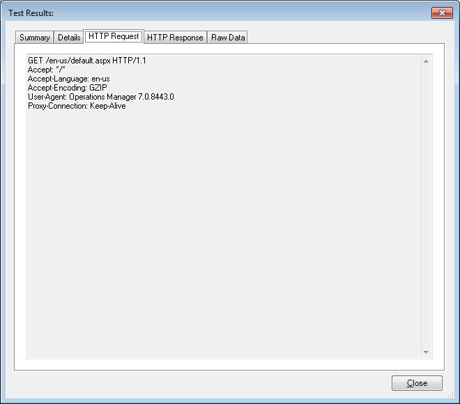

The following options are available on the  **Test Results HTTP Request**  tab of the wizard.

| Option | Description |
| --- | --- |
| HTTP Request tab | Displays details about the HTTP request of the test what is sent to the website. |

## Test results: HTTP response tab

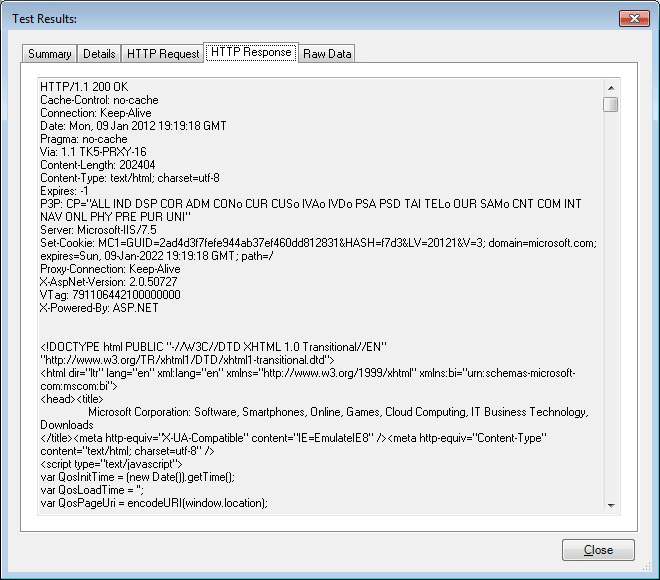

The following options are available on the  **Test Results HTTP Response**  tab of the wizard.

| Option | Description |
| --- | --- |
| What is shown on this tab | Displays details about the HTTP Response for the test comes back from website. |

## Test results: Raw data tab

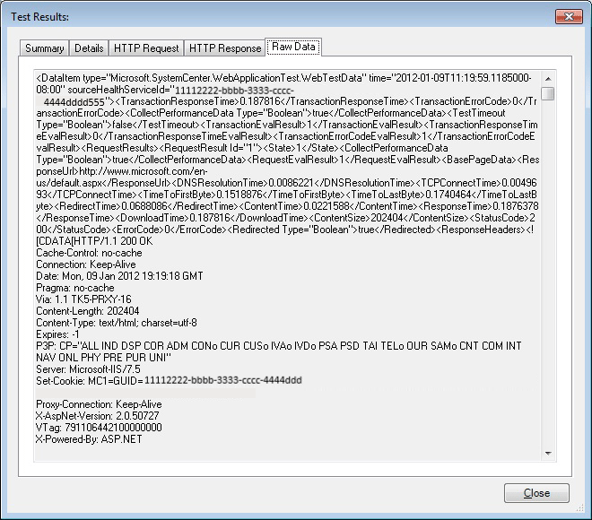

The following options are available on the  **Test Results Raw Data**  tab of the wizard.

| Option | Description |
| --- | --- |
| What is shown on this tab | Displays all of the data unformatted that we get back from the site. If there's a problem with the website, this information might help you figure out what might be wrong with the website. |

## Change configuration for test set

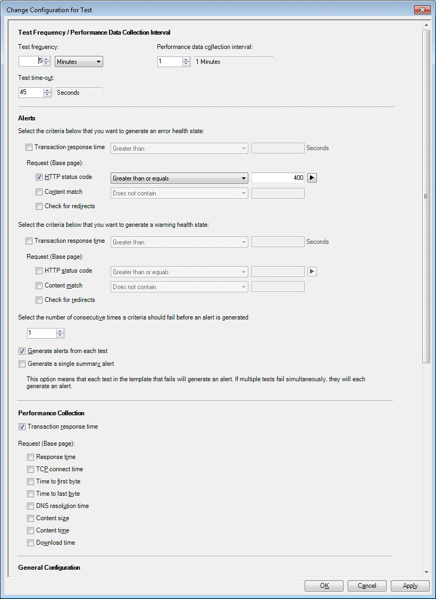

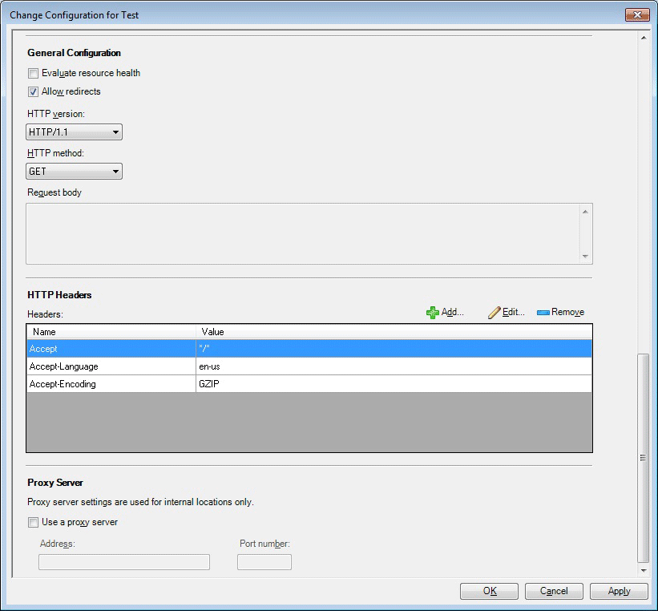

The following options are available on the  **Change Configuration for Test Set**  page of the wizard.

> [!Important]
> Settings on this page apply to all tests in the template.

| Option | Description |
| --- | --- |
| Test Frequency/Performance Data Collection Interval: Test frequency | Enter the how often you want to run each test. |
| Test Frequency/Performance Data Collection Interval: Performance data collection interval | Enter the frequency with which you want to collect performance data. This specifies whether you want to collect performance data every interval or not. For example, if the interval is 10 minutes and the collection interval is set to 2, this means that performance data will be collected every other interval, or once every 20 minutes. |
| Test Frequency/Performance Data Collection Interval: Test time-out | Enter how long you want the test to keep a request active until the test times out and cancels. |
| Alerts: Criteria for error health state: Transaction response time | Specify if transaction response time is a factor that should or should not generate an error health state. If it is specified to generate an error health state, set the threshold in seconds that a transaction must exceed before it generates an error health state. |
| Alerts: Criteria for error health state: Request (Base page): HTTP status code | Specify if the HTTP status code is a factor that should or should not generate an error health state. If it is specified to generate an error health state, set the HTTP status code to the number for which you want it to generate an error health state. |
| Alerts: Criteria for error health state: Request (Base page): Content match | Specify if any content matches should or should not generate an error health state. If it is specified to generate an error health state, specify the content you wish to match. |
| Alerts: Criteria for error health state: Request (Base page): Check for redirects | Specify if the presence of redirects should or should not generate an error health state. |
| Alerts: Criteria for warning health state: Transaction response time | Specify if the transaction response time is a factor that should or should not generate a warning health state. If it is specified to generate warning health state, set the threshold in seconds that a transaction must exceed before it generates a warning health state. |
| Alerts: Criteria for warning health state: Request (Base page): HTTP status code | Specify if the HTTP status code should or should not generate a warning health state. If it is specified to generate warning health state, set the HTTP status code to the number for which you want it to generate a warning health state. |
| Alerts: Criteria for warning health state: Request (Base page): Content match | Specify if any content matches should or should not generate a warning health state. If it is specified to generate a warning health state, specify the content you wish to match. |
| Alerts: Criteria for warning health state: Request (Base page): check for redirects | Specify if the presence of redirects should or should not generate a warning health state. |
| Alerts: Number of consecutive time a criteria should fail before an alert is generated | Specify the number of consecutive times selected criteria in the Alerts section list should fail before an alert is generated. |
| Alerts: Generate alerts from each test | Select to receive an alert for each URL test for an application. |
| Alerts: Generate a single summary alert | Select to receive a summary alert for an application, rather than choosing to receive an alert for each URL test for an application. This is helpful if you are monitoring a vertical website or an application because this will reduce the number of alerts you receive and keep the focus of your alerts the overall state of the application.  You can further reduce alerts by raising the threshold for how many failures you want to have before receiving an alert. Together, these two approaches will focus your alerts on what is most important to you: How well the application is running, given the performance you require.  |
| Performance Collection: Transaction response time | Cumulative response time: DNS\_RESOLUTION\_TIME + TCP\_CONNECT\_TIME + TIME\_TO\_LAST\_BYTE |
| Performance Collection: Request (Base page): Response time | Processing time for the request, such as opening a browser and waiting for all resources to load. |
| Performance Collection: Request (Base page): TCP connect time | Time taken to establish a TCP connection to the target server and receive the initial greeting from the service. |
| Performance Collection: Request (Base page): Time to first byte | Time take since the TCP connection is established till the first byte of response is received. |
| Performance Collection: Request (Base page): Time to last byte | Time from when TCP connection is established until the last byte of response is completely received. |
| Performance Collection: Request (Base page): DNS resolution time | Time taken to resolve the URL domain name to the IP address. |
| Performance Collection: Request (Base page): Content size | Size of the response body received. |
| Performance Collection: Request (Base page): Content time | Base page download time (base page only). |
| Performance Collection: Request (Base page): Download time | Processing time for the request, such as opening a browser and waiting for all resources to load. |
| General Configuration: Evaluate resource health | Specify whether to evaluate the health of the entire resource. |
| General Configuration: Allow redirects | Specify if redirects can be allowed and not cause an error or warning state. |
| General Configuration: HTTP version | Specify the HTTP version being tested. |
| General Configuration: HTTP method | Specify the HTTP method. |
| General Configuration: Request body |   |
| HTTP Headers: Headers column | Specify which headers can be accepted. |
| HTTP Headers: Value column | Specify the value in the header that can be accepted. |
| HTTP Headers: Add | Add header names and values that can be accepted. |
| HTTP Headers: Edit | Opens the HTTP Header Properties page where you can change the Name or Value of the selected HTTP headers. |
| HTTP Headers: Remove | Removes selected header from the accepted list. |
| Proxy Server: Use a proxy server | Specify whether to use a proxy server. |
| Proxy Server: Address | Specify the address of the proxy server. |
| Proxy Server: Port number | Specify the port number. |

## Summary

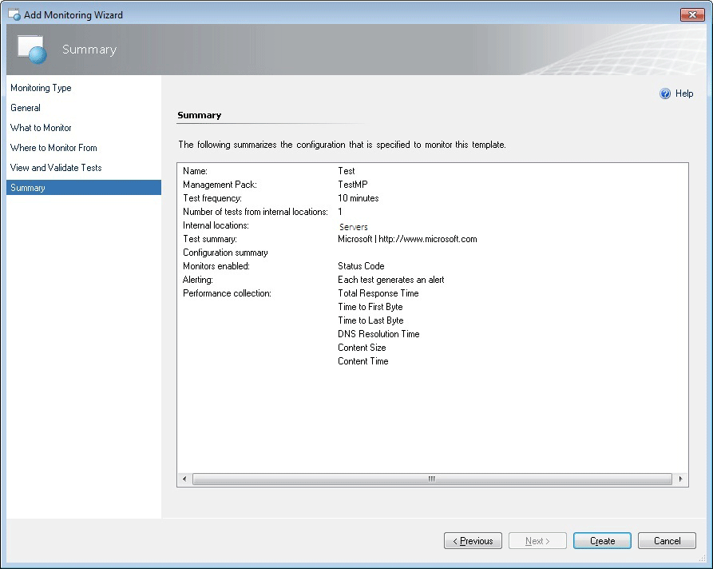

The  **Summary**  page of the wizard lists the settings you have configured for the  **Web Application Availability Monitoring**  template. If you want to change any of these settings, click  **Previous**  or the template page until you reach the page with the settings that you want to change.

## Creating and modifying web application availability monitoring templates

For the procedure to run the .NET Application Performance Monitoring wizard, see [How to Configure Web Application Availability Monitoring](https://docs.microsoft.com/previous-versions/system-center/system-center-2012-R2/hh881882%28v%3dsc.12%29)

#### To modify an existing Web application availability monitoring template

1. Open the Operations console with a user account that has Author credentials in the management group.
2. Click the  **Authoring**  workspace.
3. In the  **Authoring**  navigation pane, expand  **Management Pack Templates** , and then select  **Web Application Availability Monitoring**.
4. In the  **Web Application Availability Monitoring**  pane, locate the template you want to change.
5. Right-click the test group that you want to modify, and then select  **Properties**.
6. Using the tabs to navigate the pages of settings, make the desired changes, such as reconfiguring criteria for tests in this group, and then click  **OK**.

## Viewing web application availability monitoring monitors and collected data

After you configure monitoring for an application, these three views will help you get started with the monitoring experience.

#### To view all web application availability monitoring monitored applications

1. Open the Operations console.
2. Click the  **Monitoring**  workspace.
3. In the  **Monitoring**  navigation pane, expand  **Application Monitoring** , expand  **Web Application Availability Monitoring** , and then click  **Web Application Status**.

#### To view the state of each monitor

1. Open the Operations console.
2. Click the  **Monitoring**  workspace.
3. In the  **Monitoring**  navigation pane, expand  **Application Monitoring** , expand  **Web Application Availability Monitoring** , and then click  **Test State**.
4. In the  **Test State**  view, right-click an object. Select  **Open** , and then click  **Health Explorer**.

#### To view the performance collected for an application component

1. Open the Operations console.
2. Click the  **Monitoring**  workspace.
3. In the  **Monitoring**  navigation pane, expand  **Application Monitoring** , expand  **Web Application Availability Monitoring** , and then click  **Web Application Status**.
4. In the  **Test State**  pane, right-click an object. Select  **Open** , and then click  **Performance View**.
5. In the  **Legend**  pane, select the counters that you want to view.
6. Use options in the  **Actions**  pane to modify the Performance view.

## See also

- [How to Configure Web Application Availability Monitoring](https://docs.microsoft.com/previous-versions/system-center/system-center-2012-R2/hh881882%28v%3dsc.12%29)
- [Monitoring Web Application Availability Tests and Alerts](https://docs.microsoft.com/en-us/previous-versions/system-center/system-center-2012-R2/hh881880%28v%3dsc.12%29)
- [Dashboard Views for Web Application Availability Monitoring](https://docs.microsoft.com/en-us/previous-versions/system-center/system-center-2012-R2/hh881879%28v%3dsc.12%29)
- [Reporting for Web Application Availability Monitoring](https://docs.microsoft.com/en-us/previous-versions/system-center/system-center-2012-R2/hh881878%28v%3dsc.12%29)
