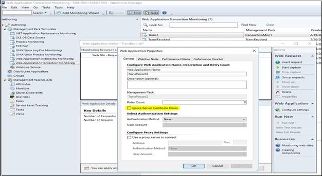

# Web Application Properties

 The following sections describe the settings available for a **Web Application Transaction Monitoring** template in Operations Manager. You can set the properties of these requests by using the procedure in [Edit Settings or Requests in a Web Application](edit-web-application-settings.md).

## Ignore server certificate errors

 Web application URL monitoring, web application availability, and transaction monitoring are used to test a URL/website/web-based application by sending WinHttp requests, validating their response, and measuring their performance.

 The Website that's being monitored can be an internal or an external URL. The monitoring is done from a watcher node computer on which you need to install the Operations Manager agent. You need to configure the web-based URL that you want to test (this configuration is written to a custom MP). The monitoring module establishes and connects to an HTTP/HTTPS session depending on the URL, and then sends a WinHttp request.

 ::: moniker range="sc-om-2019"

 In releases prior to Operations Manager 2019, if this send request fails due to a security error, it sets the flags to ignore the server certificate CN, expiry date, untrusted CA, and incorrect usage, and then retries the send request. This retry ignores the server certificate errors.

 ::: moniker-end

Operations Manager web application URL monitoring capability has been improved to not ignore server certificate errors by default. Send requests won't be retried for the URLs with certificate errors.

 However, you can ignore the server certificate errors if you wish to, while monitoring a website. To support this feature, we've added the option **Ignore Server Certificate Errors** in the Web Application Editor. To monitor a website for which there's no valid SSL certificate, select this option.

 

 For the existing websites that are being monitored, you can either select this new option on the Web Application Properties **General** tab or edit in the management pack. To support this enhancement, schema changes were made to the URLProbe module. [Learn more](url-probe-schema.md).

## General Tab

Use the **General** tab to specify the general details of the web application.

The following table lists the available options in the General tab:

| **Item** | **Description** |
| --- | --- |
| Web Application Name | The name of the application that appears in the Operations console. |
| Description | Optional description of the application that appears in the **Details** pane in the Operations console. |
| Retry Count | Number of times to retry connecting to a site if the first attempt fails. |
| Ignore Server Certificate Errors | When selected, Operational Manager ignores any certificate errors for the monitored servers. [Learn more](#ignore-server-certificate-errors).|
| Management Pack | The management pack in which the **Web Application Transaction Monitoring** template is stored. This can't be changed. |
| Authentication Method | Specifies the authentication method to use for the website. If no authentication is required, select **None**. |
| User Account | The Run As account to use for authenticating on the site. Only existing accounts that match the selected authentication method are listed. For more information about Run As accounts, see [Managing Run As Accounts and Profiles](plan-security-runas-accounts-profiles.md). |
| Use a proxy server to connect | Select this option if the watcher nodes must connect to the website through a proxy server. |
| Address | The address of the proxy server if one is required. |
| Port | The port for the proxy server if one is required. |
| Authentication Method | Specifies the authentication method to use for the proxy server. If no authentication is required, select **None**. |
| User Account | The Run As account to use for authenticating on the proxy server. Only existing accounts that match the selected authentication method are listed. For more information about Run As accounts, see [Managing Run As Accounts and Profiles](plan-security-runas-accounts-profiles.md). |

The following sections describe the details for each of the tabs in the **Web Application Properties** window.

## Watcher Node Tab

Use the **Watcher Node** tab to specify the watcher nodes that you want to use for this web application and the frequency that you want to run the web application. For more information about watcher nodes, see [Watcher Nodes](/previous-versions/system-center/system-center-2012-R2/hh457584%28v%3dsc.12%29).

## Performance Criteria Tab

Use the **Performance Criteria** tab to enable the **Transaction response time** monitor for the application to monitor the transaction time of all of the requests in the browser session.

The following table lists the various options in the Performance Criteria tab:

| **Item** | **Description** |
| --- | --- |
| Error Transaction Response Time | Select this option and provide a criteria and the number of seconds if you want to monitor for a critical state. If the time to process the complete set of requests matches this criteria, the monitor is set to a critical state. |
| Warning Transaction Response Time | Select this option and provide a criteria and number of seconds if you want to monitor for a warning state. If the time to process the complete set of requests matches this criteria and the error criteria isn't also true, the monitor is set to a warning state. |

## Performance Counter Tab

Use the **Performance Counter** tab to enable collection of performance counters for the web application.

The following table lists the various options in the Performance Counter tab:

| **Item** | **Description** |
| --- | --- |
| Transaction Response Time | If this option is selected, then the collective time to process all the requests in the browser session is collected. |
| Request Performance Counters | Select the performance counters that are collected for the application. Any selected counters are collected as an aggregate for all requests in the browser session. Each will also be added to the list of counters for every request in the browser session. |
| Reduction Factor | Select to reduce the number of counters selected for the web application and the requests. It specifies how many query intervals must be completed before each collection. If the value is 1, the counters are collected every time the browser session is run. If it's 2, the counters are only collected every second time the browser session is run, and so on. |

## Next steps

- [Edit Settings or Requests in a Web Application](edit-web-application-settings.md).
- [Web Application Request Properties](web-application-request-properties.md).
