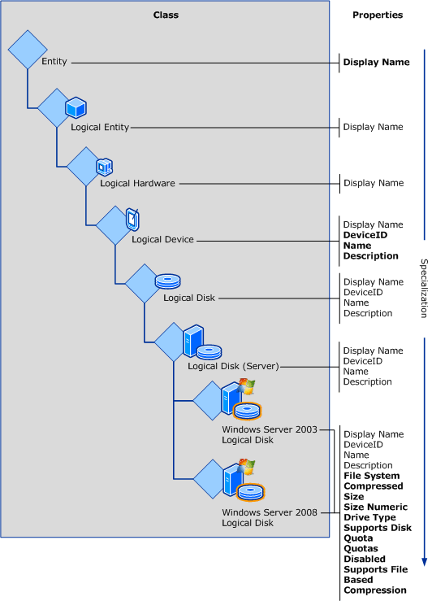
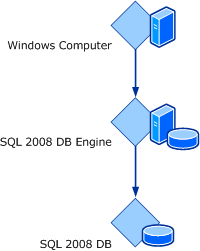
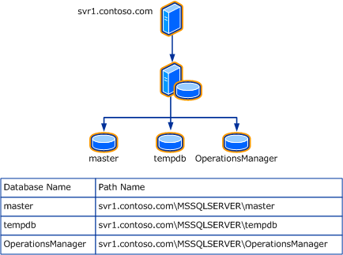

# Customize and author classes with Service Manager authoring

A class is the main element that is used to represent objects that are used in Service Manager. A class can represent a computer, a user, an incident, or a form.  

 Class definitions that represent a larger element, such as a Service Manager feature, are often grouped together. Class definitions are stored in management packs that must be imported into Service Manager to enable Service Manager functionality.  

## Key concepts for classes

Objects in Service Manager are *instances* of a particular base class. All instances of a base class have a common set of properties and common behavior.  

 Like all management pack elements, classes have *ID* and *Display Name* properties. In this documentation, "ID" refers to the unique name of the class that is seen only in the Authoring Tool, while "Name" and "Display Name" refer to the language\-specific name that appears in the Service Manager console.  

> [!NOTE]  
>  When you are creating a class, always ensure that class names are unique among management packs. If possible, use class names that are meaningful in your environment. You can determine whether a class name already exists by using the search feature in the **Class Browser** window of the Service Manager Authoring Tool.  

### properties  
 All instances of a particular class share a common set of *properties*. The values for these properties are provided in various methods by users and can vary among different instances. Properties are used to represent details of the actual object, such as a unique name, location, and other details that may be interesting to the user or that are required for management scenarios.  

#### Key properties  
 A *key property* uniquely identifies each instance of a particular class. If a property is marked as a key property, each instance of the class must have a unique value for that property, and the value cannot be null. For *hosted classes*, the value must only be unique for all instances of the class that have the same hosting parent. For *unhosted classes*, it must be unique for all instances of the class in the management group. Hosting relationships are further described later in this section.  

 Classes do not always require a key property. A key property is only required if more than one instance of a class is expected for a single parent. If only a single instance is expected, a key property is not required but may still be defined.  

 For example, **SQL Database Engine** has a key property of **Instance Name** because a single computer can have more than one instance of Microsoft SQL&nbsp;Server installed. When there are multiple instances of **SQL Database Engine**, each instance must have a different value for **Instance Name** in order to clearly distinguish between the different objects. The **IIS Web Server** class, by contrast, does not define a key property because there can be only one instance installed on any computer.  

 All objects have a **Path Name** property that is calculated from the object's key property or properties and those of its hosting parent or parents. For unhosted objects, **Path Name** will be the key property of the class itself. **Path Name** can be used to uniquely identify any instance of a class in the management group.  

### Base classes and inheritance  
 Every class must specify a *base class* that identifies an existing class that the new class will *specialize*. The management pack libraries that are included with Service Manager contain several classes that can be used as the base for custom classes in management packs. A management pack will typically have at least one class inheriting from a library class and potentially other classes inheriting from classes in the same management pack.  

 The concept of a base class can be illustrated with the Windows&nbsp;Server Operating System management pack. This management pack includes classes representing logical disks installed on the computer. The following illustration shows the classes **Windows&nbsp;Server&nbsp;2003 Logical Disk** and **Windows&nbsp;Server&nbsp;2008 Logical Disk**. These classes are both based on **Logical Disk \(Server\)** that is defined in the Microsoft.Windows.Server.Library management pack file. **Logical Disk \(Server\)** is in turn based on **Logical Disk**, which itself is based on **Logical Device**, and so on through **Logical Hardware**, **Logical Entity**, and finally **Entity**. All classes can trace a similar inheritance path and will always end up at **Entity**, which is the root of the class structure. This is the only class that does not have a base class, and all other classes eventually inherit from it.  

 **Inheritance of properties between classes**  

   

 **Entity** has a single property, named **Display Name**. This property is inherited by all classes inheriting from **Entity**. All classes eventually inherit from **Entity**. That is why all classes have a **Display Name** property. No other classes in this example have properties until **Logical Device**, which defines **Name**, **Description**, and **DeviceID**. **DeviceID** is specified as the key property. These properties are all inherited by **Logical Disk** and **Logical Disk \(Server\)**. **Logical Disk \(Server\)** then adds the additional properties **Size**, **Drive Type**, and **File System**. The bottom\-level classes that are specific to the version of the operating system inherit the entire set of properties provided by those classes above them in the inheritance tree.  

### Class types  
 Most classes have one or more actual instances and are known as *concrete classes*. *Abstract classes* and *singleton classes* are special kinds of classes that behave differently and are used for particular scenarios.  

#### Abstract classes  
 Abstract classes have no instances and exist only to act as a base class for other classes. All properties and relationships that are defined at the abstract class level are inherited by child classes and do not have to be defined again. Most of the classes that are defined in management pack libraries are abstract, since they are only provided to act as base classes for classes that are defined in custom management packs.  

 Abstract classes are used where there is a common set of properties, relationships, or grouping that can be defined across all further specializations of a class. In the previous example, all of the classes shown above **Windows&nbsp;Server&nbsp;2003 Logical Disk** and **Windows&nbsp;Server&nbsp;2008 Logical Disk** are abstract. They exist only for the lower\-level classes to inherit from.  

#### Singleton classes  
 *Singleton classes* are used when there is one and only one instance of a class. The class is the instance, and it always exists. The single instance is being created when the management pack is installed. Similarly, a key property is not required for a singleton class, because it will only ever have a single instance. A common use of singleton classes is for the **Groups** class, because there is only a single instance of this class required throughout the management group.  

### Class extensions  
 To customize a class, you can extend it by adding new properties to the existing class definition. The new properties will now be included in all instances of that class that already exist, and in any new instances that will be created. An abstract class cannot be extended.  

### Relationships  
 *Relationships* are defined between classes to indicate an association between a particular instance of one class and the particular instance of another. There are three types of relationships, and they are detailed in the following sections:  

-   Hosting relationship  

-   Containment relationship  

-   Reference relationship  

 Class relationships affect objects in the following ways.  

|Relationship type|Key property and existence|Available properties|  
|-----------------------|--------------------------------|--------------------------|  
|Hosting|The value of the key property must be unique for all instances of the class in the management group. For hosted classes however, the key property value must be unique only for all objects that have the same hosting parent.   To uniquely identify a hosted object, the key property of both the object and the object's parent are required and the key of the hosted class will be the combination of both the hosting class key property, and the hosted class key property.   The existence of a hosted class depends on the existence of the hosting class.|Any workflow that is targeted at a class have access to that class's properties in addition to the properties of any of its hosting parent\(s\).   For example, a script in a workflow using the **SQL&nbsp;2008 DB Engine** class as its target might require the name of the computer on which the instance of SQL Server 2008 is installed. Because an object can have only one hosting parent, we know the computer that hosts any particular instance of the **SQL&nbsp;2008 DB Engine** class. The workflow script can access the properties of the targeted object and the properties of that target's hosting parent.|  
|Containment|Key property and existence are not dependent on container object.|Any workflow that is targeted at a class have access to that class's properties in addition to the properties of any of its container parent\(s\).   For example, a script in a workflow targeting an incident class, can access the properties of the container queue's class.|  
|Reference|Key property and existence are not dependent on referenced object.|Any workflow that is targeted at a class have access only to that class's properties.|  

#### Reference relationship  
 The *reference relationship* is the most general relationship type. A reference relationship is used when the parent and child classes are not dependent on one another; for example, a database could reference another database that it is replicating. One database is not dependent on the other, and the objects exist separately.  

#### Containment relationship  
 The *containment relationship* type is less restrictive than the hosting relationship. It declares that one class is related to another class, although one is not required for the other. Unlike a hosting relationship, a containment relationship is many\-to\-many. This means that one object can contain multiple objects, and a single object can be contained by multiple other objects. For example, one group can contain multiple objects, and a single object can be a member of multiple groups.  

 Containment relationships are typically used for group membership where objects are included in a group through a containment relationship between the group and the member object.  

#### Hosting relationship  
 The most restrictive relationship between classes is the *hosting* relationship. A class hosted by another class is called a *hosted class*, and an instance of the class is called a *hosted object*. If a class is not hosted by another, it is called an *unhosted class*, and an instance of the class is called an *unhosted object*.  

 When one object is hosted by another, that object relies on its hosting parent for its very existence. If the hosting parent is removed, the hosted child will also be removed. For example, a logical disk cannot exist without the computer that it is installed on.  

 A hosted object can have only one hosting parent, but one parent can host multiple children. For example, a particular disk can be installed on only a single computer, but one computer can have several disks installed.  

 The SQL Server management pack provides another example of hosting relationships. The hosting relationship between the **Windows Computer** class, the **SQL 2008 DB Engine** class, and the **SQL 2008 DB** class is shown here.  

 **Hosting relationships for SQL&nbsp;Server&nbsp;2008 classes**  

   

 The **SQL&nbsp;2008 DB Engine** class represents an instance of SQL Server&nbsp;2008 installed on a particular computer. Because a database can be installed on only a single database engine, the **SQL&nbsp;2008 DB Engine** class hosts the **SQL&nbsp;2008 DB** class. There can be several databases with the same name in a management group, but any databases installed on a particular instance of the **SQL Server** class must have a unique name. The database engine, in turn, is hosted by the **Windows Computer** class. There can be several **SQL Server** instances with the same name in a management group. Each one on a particular computer must have a unique name.  

 Because there are two hosting relationships, the path name for each database will be the computer name followed by the instance name followed by the database name. An example is shown in the following diagram.  

 **Sample database hosting relationships**  

   

## General guidelines and best practices for classes

Use the following guidelines and best practices when you are customizing classes in the Service Manager Authoring Tool.  

### Naming conventions for type definitions  
 The Service Manager schema model naming convention is based on the .NET namespaces naming convention.  

#### Basic naming conventions  
 The basic naming convention is **CompanyName.TechnologyArea.ProductName.FunctionalityArea.Name**, where:  

-   **ProductName** is optional; use it if the definition is independent of any specific product.  

-   **FunctionalityArea** is optional; use it if the definition can apply to different areas.  

-   **Name** reflects the meaning of the class, not the inheritance hierarchy.  

 Examples: **Microsoft.AD.Printer**, **Microsoft.Windows.Computer**, **System.Knowledge.Article**, **System.WorkItem.Incident**, and **System.StarRating.Average**.  

#### The System namespace  
 The **System** namespace refers to definitions that are independent of Microsoft and Windows. This usually applies to the base definitions that either Windows applications or Unix applications depend on. These base definitions should be company independent.  

 Use the following guidelines for the System prefix:  

-   **System.Computer** represents any type of computer, and it is not vendor specific.  

-   Use the **System** prefix if you expect others to define schemas on top of that namespace.  

-   Note that **Microsoft.Windows.Computer** does not start with **System**, although most Windows applications \(regardless of the vendor that defines it\) rely on this definition.  

#### Best practices for naming classes  
 Use the following best practices when you are naming classes:  

-   Do not create two separate classes \(even if they are in two different management packs\) that would result in identical key values being stored for different objects of the two classes.  

-   When you are extending a class, always ensure that the class extension names are unique across management packs. If possible, use meaningful class extension names.  

-   When you are extending a class, do not define a property with an ID that is already in use in that class.  

-   Do not use periods in names of properties of a custom class.  

-   If you add a custom named calculation when you author a cube, preface the name of the named calculation with NC\_. This will reduce the possibility of using a name of a property that already exists.  

### Do not create too many classes  
 Creating too many classes can result in needless complexity with minimal value. A good rule is to use the least number of classes to achieve the desired results. Other than abstract classes, if a class is not going to be the target of any workflow or be used to store data, it probably should not be created. Also, if two classes are similar, consider using a single class for both of them, possibly by using a property that can hold the values for any differences.  

### Do not use properties that update frequently  
 Property values should change rarely after they are first populated. A possible cause for frequent property value changes is a custom connector or any other customization that programmatically updates the Service Manager database. These scenarios can potentially cause property values to update too frequently, such as every 10 to 15 minutes or less for a large number of objects.  

 Such frequent changes to property values might slightly impact the performance of the workflows, and they might have other performance impacts. This is because the system keeps track of those changes in history. Also, depending on the property being changed, these changes can add a significant amount of data to be processed and stored by the data warehouse.  

### Do not extend an abstract class  
 In Service Manager, you cannot extend an abstract class. If you need to extend an abstract class, you can do either of the following:  

-   Create a new class with the properties you want to add, and then create a relationship between the new class and the abstract class.  

-   Extend each of the relevant concrete classes that derive from the abstract class.  

### Improve simple search for work item classes  
 When you define a custom class that is derived from the "**System.WorkItem**" class, we recommend that you store the **DisplayName** property of that class in the following format: **WorkItem.ID\<SPACE\>WorkItem.Title**.  

 This improves simple search. Simple search searches only the **DisplayName** property, and by explicitly including the **Title** property value and the **ID** property value in the **DisplayName** property value, the results of simple search are improved. This is because the user can search either by a word in the title or by ID.  

## Browse a class in the Authoring tool

You can use the **Class Browser** pane in the Service Manager Authoring Tool to browse classes and their properties. While you are browsing classes, you can add a control to a form by dragging properties from the **Class Browser** pane to a form that is being authored in the authoring pane.  

 The **Class Browser** pane can display classes from any management pack that is in the Library folder and from any management pack that has been opened in the Authoring Tool. When you select a class, the **Class Browser** pane displays the properties that are specifically defined for that class and the internal properties that are generated by the system. By default, the Library folder is in the following location: C:\\Program Files \(x86\)\\Microsoft System Center\\Service Manager 2016 Authoring\\Library.  

 When you select a management pack in the **Class Browser** pane, all the classes from the selected management pack are displayed, and you can expand the class for which you want to view properties. When you select **All Management Packs**, all the classes from all the management packs in the Library folder are displayed. Whenever you change the selection of the management pack, you must refresh the **Class Browser** pane.  

### To browse a class  

1.  If the **Class Browser** pane is not visible in the Authoring Tool, click **View**, and then click **Class Browser**.  

2.  In the **Class Browser** pane, in the management pack list, select the management pack that contains the class that you want to browse. For example, select the **System Library** management pack.  

3.  Locate the class that you want to view, such as the **Computer** class, and then do the following:  

    -   To view the details of the class, such as **Description** and **Internal Name**, right\-click the class, and then click **Details**.  

    -   To view the list of class properties, such as **Display Name** and **Asset Status**, expand the class in the **Class Browser** pane. To further view details of a property, right\-click the property, and then click **Details**.  

    -   To open the management pack that contains the definition of the class, right\-click the class, and then click **View**.  

## Edit details of a class in the Authoring tool

You can use the Service Manager Authoring Tool to view the properties of a class and to edit the details, such as the name or description, of a class.  

 In the **Management Pack Explorer**, you can select a class and view its details in the **Details** pane. If you select a class that is defined in an unsealed management pack, you can change the name and description of that class.  

### To change the name or description of a class  

1.  On your desktop, click **Start**.  

2.  Click **Service Manager Authoring Tool**, and wait for the Authoring Tool to open.  

3.  Ensure that both the **Management Pack Explorer** and the **Details** panes are open.  

4.  Click **File**, and then click **Open**.  

5.  In the **Open File** dialog box, select an unsealed management pack that contains the class that you want to change, and then click **Open**. For example, open the *Authoring Tool installation folder* \\Samples\\Woodgrove.AutomatedActivity.AddComputerToGroupMP.xml sample management pack.  

6.  In the **Management Pack Explorer**, expand the management pack that contains the class that you want to change.  

7.  Expand **Classes**, and then locate and select the class that you want to change.  

8.  Select the value of the **Name** or **Description** property, and then enter the new value. Values that cannot be changed are unavailable.  

9. In the **Management Pack Explorer**, right\-click the management pack that contains the changed class, and then click **Save**.  

## Create a class using inheritance in the Authoring tool

In the Service Manager Authoring Tool, you can create a class that inherits properties and relationships from an existing base class. You can then modify or add properties and relationships to the new class.  

 As the first step of defining class inheritance, choose the base class from which to inherit properties and relationships. In the Authoring Tool, you can choose the base class by using one of the following methods:  

-   Use a shortcut to inherit properties and relationships from the base configuration item class.  

-   Use a shortcut to inherit properties and relationships from the base work item class.  

-   First select the base class, and then start defining the inheritance.  

-   Start defining inheritance without a specific base class selection.  

 The following procedures describe all the methods for defining class inheritance in the Authoring Tool.  

### To start with the configuration item class or the work item class as a base class  

1.  If the **Management Pack Explorer** is not visible in the Authoring Tool, click **View**, and then click **Management Pack Explorer**.  

2.  In the **Management Pack Explorer**, select and then expand any management pack.  

3.  Right\-click **Classes**, and then click **Create Configuration Item Class** or **Create Work Item Class**.  

4.  If you are creating a class from a sealed management pack, in the **Target Management Pack** dialog box, select an unsealed management pack to store the class customization, and then click **OK**.  

    > [!NOTE]  
    >  If you are creating a class from an unsealed management pack, this class customization is saved in that selected management pack.  

5.  In the **Create Class** dialog box, specify the internal name for the new class, and then click **Create**.  

     In the authoring pane, you can now view the list of properties of the new class. If you are creating a configuration item class, all properties of the configuration item class are listed. If you are creating a work item class, all properties of the work item class are displayed.  

6.  Click **Create property** or **Create relationship** to define new properties and new relationships for the class.  

### To start with a selected base class  

1.  If the **Management Pack Explorer** is not visible in the Authoring Tool, click **View**, and then click **Management Pack Explorer**.  

2.  In the **Management Pack Explorer**, locate and then right\-click the base class from which the new class will inherit properties and relationships. Select **Inherit from this class**.  

3.  In the **Inherit New Class** dialog box, enter an internal name for the class.  

     In the authoring pane, the **Class properties and relationship** list displays the properties of the base class.  

4.  You can now click **Create property** or **Create relationship** to add properties or a relationship to the new class.  

### To start without a selected base class  

1.  If the **Management Pack Explorer** is not visible in the Authoring Tool, click **View**, and then click **Management Pack Explorer**.  

2.  In the **Management Pack Explorer**, select and then expand any management pack.  

3.  Right\-click **Classes**, and then click **Create other class**.  

4.  In the **Base class** dialog box, select the base class to inherit properties and relationships from.  

     Optionally, if you know in which management pack the base class that you want to use is defined, you can filter on the respective management pack, and then select the base class for this customization.  

     Click **OK**.  

5.  If the base class that you selected to inherit properties and relationships from is in a sealed management pack, in the **Target Management Pack** dialog box, select an unsealed management pack to store the class customization, and then click **OK**.  

     If the base class that you selected to inherit properties and relationships from is in an unsealed management pack, this class customization will be saved in that selected management pack.  

6.  In the **Create class** dialog box, specify the internal name for this class, and then click **Create**.  

     In the authoring pane, you can now view the list of properties of the new class. This list includes all the properties of the base class that you selected.  

## Extend a class in the Authoring tool

You can extend a class in the Service Manager Authoring Tool by adding properties and relationships to the definition of the class. Extending a class affects all existing instances of that class: all instances of that class will be updated to include the new properties and relationships.  

### To extend a class  

1.  If the **Management Pack Explorer** pane is not visible in the Authoring Tool, click **View**, and then click **Management Pack Explorer**.  

2.  In the **Management Pack Explorer** pane, locate and right\-click the class that you want to extend, and then click **Extend class**.  

3.  In the **Target Management Pack** dialog box, select an unsealed management pack to store the class extension, and then click **OK**.  

4.  The **Class properties and relationship** list on the **Extension of class** tab in the authoring pane displays the properties and the relationships of the class. Create new properties and relationships as follows:  

    1.  Click **Create property**; in the **Create property** dialog box, type a name in **Internal name** for the new property; and then click **Create**.  

    2.  Click **Create relationship**; in the **Create relationship** dialog box, type a name in **Internal name** for the new relationship; and then click **Create**.  

    > [!NOTE]  
    >  When you are extending a class, do not define a property with an ID that is already in use in that class.  

5.  Locate and select the new property or relationship in the **Class properties and relationship** list, and modify its properties in the **Details** pane as needed.

## Next steps

- [Customize and author forms](auth-forms.md) to view and edit the properties of objects.
