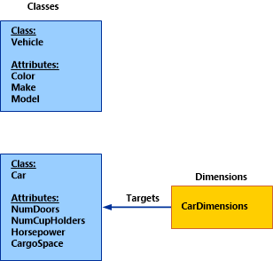
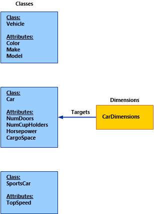

# Overview of customizing the Service Manager data warehouse

After the Service Manager data warehouse is deployed and you have viewed its reports, you can customize the information in the reports to better suit your organization. For example, you might want to recreate reports that you have used in the past with other information systems using Service Manager. Or, you might want to customize the reports for your internal business processes for incidents or change management.

The information in this section can help you determine how to extend and customize the data warehouse to enable in-depth analyses.

## Data warehouse dimensional modeling using a star schema

The data warehouse in Service Manager is a set of databases and processes. The processes add information to the databases automatically. In short, the purpose of the data warehouse is to add information to the data mart where you and other users run reports and perform analyses to help manage your business. Service Manager stores data warehouse data longer in the warehouse than in the Service Manager database because of the usefulness of the data for trending and analysis. Also, data warehouse data often outlives its usefulness for normal transactional processing needs.

The data warehouse is optimized for aggregating and analyzing a lot of data at once in many seemly unpredictable ways. This behavior differs from transactional processing systems, which are optimized for write access on few records in any given transaction, making the behavior of those transactions more predictable.

To optimize the data warehouse for performance and ease of use, Service Manager uses the Kimball approach to dimensional modeling. (For more information about the Kimball approach, see [Dimensional modeling](https://go.microsoft.com/fwlink/p/?LinkId=246459).) This means that tables in the DWDataMart database are grouped logically into subject matter areas that resemble a star when they are laid out in a diagram. Therefore, these groupings are often called star schemas, and they include the following:

- In the center of the star is a fact table. Fact tables represent relationships, measures, and key performance indicators (KPIs). Fact tables are normally long and have relatively few columns, but they contain a large number of transactions.
- The fact table joins to dimension tables, which represent classes, properties, and enumerations. Dimension tables usually contain far fewer rows than fact tables, but they are wider because they have attributes by which report users slice and dice reports. These attributes can include status, classifications, and date attributes (such as Created Date or Resolved Date) of a class.
- An outrigger is a special kind of dimension table that hangs off another dimension table for performance and usability reasons.

When you think about a star schema, consider what a star schema for a coffee shop might resemble. If the transactions represent coffee purchases, the dimensions might include the following:

- A date dimension to consolidate the transaction by both Gregorian and fiscal calendars
- A customer dimension that indicates who bought the coffee
- An employee dimension that indicates who made the coffee
- A product dimension that indicates the coffee type, such as espresso, drip coffee, latte, or breve
- A store dimension

When you consider the measures that the fact table might include, the list might include the following:

- Quantity sold
- Price per unit
- Total sales
- Total discounts

Information technology (IT) processes are not very different from the coffee shop example when you are designing a dimensional model. There are transactions that occur, such as incident creation, resolution, and closure, that can produce interesting and useful metrics, such as time to resolution, resolution target adherence, billable time incurred by analysts, and duration in status.

When you think about extending and customizing your data warehouse, consider the business questions that you want to answer, and investigate dimensional modeling for useful information and best practices. For additional information about customizing the data warehouse, see the other topics in this section.

## Fact tables in the data warehouse

This topic describes how to define relationship facts in the data warehouse in Service Manager. A relationship fact in the Service Manager data warehouse is similar to a relationship in Service Manager. You can use a relationship fact to help answer queries, such as the following:

- Which work items are currently assigned to the user John Smith so that you can determine their status?
- What is the list of all the computers in the domain that currently have Windows&nbsp;10 installed so that you can update them to the latest version?
- What are all the review activities that list Samantha Smith as a reviewer so that they can be reassigned because she is on vacation?

In each of these scenarios, there is a source instance and a target instance that are joined together by a relationship. Without a relationship fact, it is difficult to determine the associations between the instances. Consider the relationship in the Microsoft.Windows.ComputerHostsOperatingSystem in the Microsoft.Windows.Library management pack in the following example:

```xml
<RelationshipType ID="Microsoft.Windows.ComputerHostsOperatingSystem" Accessibility="Public" Base="System!System.Hosting">
<Source ID="Computer" Type="Microsoft.Windows.Computer" />
<Target ID="OperatingSystem" Type="Microsoft.Windows.OperatingSystem" MaxCardinality="1" />
</RelationshipType>
```

In a Service Manager relationship, the source and target are always modeled by a management pack class. In this relationship, the class Microsoft.Windows.Computer is the source and the class Microsoft.Windows.OperatingSystem is the target. The following information defines the corresponding RelationshipFact based on the Microsoft.Windows.ComputerHostsOperatingSystem relationship:

```xml
<RelationshipFact ID="ComputerHostsOperatingSystemFact" Accessibility="Public" Domain="Domain.ConfigurationManagement" TimeGrain="Daily" SourceType="Windows!Microsoft.Windows.Computer" SourceDimension="ComputerDim">
<Relationships RelationshipType="Windows!Microsoft.Windows.ComputerHostsOperatingSystem" TargetDimension="OperatingSystemDim" />
</RelationshipFact>
```

Notice how the relationship fact defines a source dimension and a target dimension. You might notice that the source and target dimensions target the source and target classes from the original relationship that the relationship fact is modeled on.

You can use relationship facts by associating two dimensions together, which makes it possible for reports to use the association to display important information from each dimension in relation to the other. For example, you can use the WorkItemAssignedToUser relationship to display information about incidents or change requests for a specific user in the report. This makes it possible for you to navigate in the data to find information that is specific to your needs. This is just one example of how relationship facts are useful in creating specialized views of data in reports.

The attributes and subelement tags that are required for modeling a relationship fact in a user-defined management pack are described in the following table for the `<RelationshipFact>` tag.

|Attribute|Description|
|---------------|-----------------|
|ID|A unique identifier for the relationship fact element. This is also the table name of the relationship fact in the data warehouse and data mart.|
|Accessibility|This element should always be set to Public because the deployment process creates system-derived management packs that refer to this outrigger during the generation of the automated transforms.|
|Domain|The scope of the relationship fact. Possible values include the following: Instance Management Activity Management,    Incident Management Change Management, and Problem Management.<br /><br /> The value for this attribute must be an enumeration that is a child of the parent Domain enumeration, which is defined in the Microsoft.SystemCenter.Datawarehouse.Base management pack.|
|TimeGrain|The detail level of the relationship fact. The value must be one of the following: Hourly, Daily, Weekly, or Monthly.|
|SourceType|The management pack class for the source of the relationship.|
|SourceDimension|The dimension that targets the source class. This is an optional field. If no SourceDimension is specified, Service Manager automatically finds the dimension that directly targets the source class itself or the closest parent class of the source class in the class hierarchy.|

In a multiple-relationship fact, the source dimension always remains the same. However, the target dimension can change, depending on the specific relationship. Every relationship type attribute in a multiple relationship fact must be unique. The following is an example of the relationship fact in the WorkItemAssignedToAndCreatedByUser management pack:

```xml
<RelationshipFact ID="WorkItemAssignedToAndCreatedUserFact" Accessibility="Public" Domain="Domain.InstanceManagement" TimeGrain="Daily" SourceType="WorkItem!System.WorkItem" SourceDimension="WorkItemDim">
<Relationships RelationshipType="WorkItem!System.WorkItemAssignedToUser" TargetDimension="UserDim" />
<Relationships RelationshipType="WorkItem!System.WorkItemCreatedByUser" TargetDimension="UserDim" />
</RelationshipFact>
```

In this example, you can see that although the target dimension is identical for both relationships, the relationships themselves are unique. Therefore, the relationship fact is valid. For more examples of outriggers, dimensions, and relationship facts, you can examine any of the data warehouse management packs that are included in Service Manager. A good example is the base data warehouse management pack named Microsoft.SystemCenter.Datawarehouse.Base.

## Outriggers in the data warehouse

An outrigger in the data warehouse in Service Manager is essentially a list that can logically group together a set of values. The following tables show two examples that display a logical grouping of values that denote Priority and Windows Operating Systems.

|Priority|
|--------------|
|Low|
|Medium|
|High|

|Windows Operating Systems|
|-------------------------------|
|Windows 7|
|Windows 8|
|Windows 10|

An outrigger is useful in two ways:

- You can use discrete values from an outrigger as a drop-down menu for a report parameter when you create and view reports in the Service Manager console.
- You can use outrigger values to group data in reports for advanced analysis.

Outriggers in the data warehouse can target one or more class properties and consolidate them into a single set of discrete values. These properties can only be a data type String or ManagementPackEnumeration. When they are based on an enumeration, outriggers also preserve the hierarchy. Service Manager does not support an outrigger that is defined on a data type other than String or ManagementPackEnumeration.

Although the benefit of defining an outrigger on an enumeration is evident, an advantage of defining an outrigger on a string column is that the data warehouse infrastructure combines the distinct values of a property from the instance space into a small list. You can then use the list in an easy-to-use drop-down list in a report. A good example of a string-based outrigger is the `Manufacturer` property on the **Computer** class, which is modeled as a string in the Service Manager database. By defining an outrigger on that property, Service Manager provides the ability to select a value from the drop-down list, instead of searching among manufacturers that you procured your computers from.

To view an example of how an outrigger is used in a report in the parameter header, open the Service Manager console; navigate to **Reporting, Activity Management**; and then run the **Activity Distribution** report. Next, review the **Status** list to see the values of the outrigger. You can see how the outrigger was modeled in the management pack in the following example. Note the class **System.WorkItem.Activity**, which is defined in the System.Workitem.Activity.Library management pack:

```xml
<ClassType ID="System.WorkItem.Activity" Accessibility="Public" Base="WorkItem!System.WorkItem" Hosted="false" Abstract="true">
< Property ID="SequenceId" Type="int" />
<Property ID="Notes" Type="richtext" MaxLength="4000" />
<Property ID="Status" Type="enum" EnumType="ActivityStatusEnum" />
<Property ID="Priority" Type="enum" EnumType="ActivityPriorityEnum" />
<Property ID="Area" Type="enum" EnumType="ActivityAreaEnum" />
<Property ID="Stage" Type="enum" EnumType="ActivityStageEnum" />
</ClassType>
```

Next, you might want to define an outrigger based on the enumeration property `Status`. The following example shows how you can define an outrigger in a management pack of your choice:

```xml
<Outrigger ID="ActivityStatus" Accessibility="Public">
<Attribute ID="Status" PropertyPath="$Context/Property[Type='CoreActivity!System.WorkItem.Activity']/Status$" />
</Outrigger>
```

As described previously, you-the management pack author-can define an outrigger on one or more class properties. Each class property is modeled by a corresponding attribute in the outrigger. The following is an example of enumeration-based outrigger visualization. In this example, Activity Status is based on ActivityStatusEnum:

```xml
<EnumerationTypes>
<EnumerationValue ID="ActivityStatusEnum" Accessibility="Public" />
<EnumerationValue ID="ActivityStatusEnum.Ready" Parent="ActivityStatusEnum" Accessibility="Public" Ordinal="5.0" />
<EnumerationValue ID="ActivityStatusEnum.Active" Parent="ActivityStatusEnum" Accessibility="Public" Ordinal="10.0" />
<EnumerationValue ID="ActivityStatusEnum.OnHold" Parent="ActivityStatusEnum" Accessibility="Public" Ordinal="15.0" />
<EnumerationValue ID="ActivityStatusEnum.Completed" Parent="ActivityStatusEnum" Accessibility="Public" Ordinal="20.0" />
<EnumerationValue ID="ActivityStatusEnum.Failed" Parent="ActivityStatusEnum" Accessibility="Public" Ordinal="25.0" />
<EnumerationValue ID="ActivityStatusEnum.Cancelled" Parent="ActivityStatusEnum" Accessibility="Public" Ordinal="30.0" />
<EnumerationValue ID="ActivityStatusEnum.Rerun" Parent="ActivityStatusEnum" Accessibility="Public" Ordinal="35.0" />
...
</EnumerationTypes>
```

Each of the values is included in the outrigger's set of discrete values. The following table lists the column ID and ActivityStatusValue from the ActivityStatus outrigger, which contains all the enumeration values from ActivityStatusEnum.

|ID|ActivityStatusValue|
|--------|-------------------------|
|ActivityStatusEnum.Completed|Completed|
|ActivityStatusEnum|Activity Status|
|ActivityStatusEnum.Active|In Progress|
|ActivityStatusEnum.OnHold|On Hold|
|ActivityStatusEnum.Rerun|Rerun|
|ActivityStatusEnum.Failed|Failed|
|ActivityStatusEnum.Ready|Pending|
|ActivityStatusEnum.Cancelled|Cancelled|

In the previous table, the ID column from the outrigger contains all the EnumerationValue IDs from the ActivityStatus enumeration type. The ActivityStatusValue is the actual user-friendly display name that appears in the report drop-down menus.

The following example provides further detail about how to construct and model an outrigger. Again, the outrigger ActivityStatus is used as an example:

```xml
<Outrigger ID="ActivityStatus" Accessibility="Public">
<Attribute ID="Status" PropertyPath="$Context/Property[Type='CoreActivity!System.WorkItem.Activity']/Status$" />
</Outrigger>
```

The following table describes the attributes for the `<Outrigger>` tag.

|Attribute|Description|
|---------------|-----------------|
|ID|A unique identifier for the outrigger element. This is also the table name of the outrigger in the data warehouse and datamart.|
|Accessibility|This element should always be set to Public.|

Each `<Outrigger>` parent tag contains one or more `<Attribute>` subelement tags. The following table describes the attributes for this tag.

|Attribute|Description|
|---------------|-----------------|
|ID|A unique identifier for each outrigger attribute|
|PropertyPath|PropertyPath syntax, which must uniquely identify the class and attribute that the outrigger attribute is targeting.|

## Dimensions in the data warehouse

A dimension in the Service Manager data warehouse in Service Manager is roughly analogous to a management pack class. Each management class has a list of properties, while each dimension contains a list of attributes. Each dimension attribute corresponds to one property in a class.

Suppose that a user wants a report in Service Manager to display some information about the attributes for the computers in a particular domain. For example, the user may want to know the IP address, number of logical processors, and Domain Name System (DNS) name for each computer. Using dimensions, the user can bring the data over from Service Manager to the data warehouse where reports can query and display this data for each computer.

In the Service Manager data warehouse, a dimension always targets a single class. The dimension attributes then map to the target class's properties. In this example, to get the information about the attributes from a computer, there is a computer dimension that is targeted at the Microsoft.Windows.Computers class.

In certain cases that are described in further detail in this topic, a dimension may also map to the properties of a target class's base and derived classes. Therefore, while a dimension may be roughly analogous to a management pack class, it can also contain properties that are within that management pack class's hierarchy.

You can see an example of how a dimension is used in the Activity Distribution report. In the report, under **Select affected configuration item (optional)**, when you click **Add**, the **Select dimension objects** box opens and you can search for dimension instances in the ConfigItemDim dimension. You can filter on the **Display Name** property. When you select **All Windows Computers** as the dimension object, the report header is updated with the selected filter value. When you run the report, only activities that affect the selected configuration item, **All Windows Computers**, are displayed.

To see how the dimension was modeled, you can look at the System.Entity and System.ConfigItem classes that are defined in the System.Library management pack:

```xml
<ClassType ID="System.Entity" Accessibility="Public" Hosted="false" Abstract="true" Singleton="false">
<Property ID="DisplayName" Type="string" MinLength="0" Key="false" CaseSensitive="false" MaxLength="4000" />
</ClassType>
```

```xml
<ClassType ID="System.ConfigItem" Base="System.Entity" Accessibility="Public" Hosted="false" Abstract="true">
<Property ID="ObjectStatus" Type="enum" EnumType="System.ConfigItem.ObjectStatusEnum" DefaultValue="System.ConfigItem.ObjectStatusEnum.Active" />
<Property ID="AssetStatus" Type="enum" EnumType="System.ConfigItem.AssetStatusEnum" />
<Property ID="Notes" Type="richtext" MaxLength="4000" />
</ClassType>
```

To revise the configuration item dimension to target the ObjectStatus and AssetStatus properties of System.ConfigItem and the DisplayName property of the base class System.Library, you can define the dimension with the following three properties as attributes:

```xml
<Dimension ID="ConfigItemDim" Accessibility="Public" Target="System!System.ConfigItem" InferredDimension="true" HierarchySupport="Exact" Reconcile="true">
<InclusionAttribute ID="DisplayName" PropertyPath="$Context/Property[Type='System!System.Entity']/DisplayName$" SlowlyChangingAttribute="false" />
<InclusionAttribute ID="ObjectStatus" PropertyPath="$Context/Property[Type='System!System.ConfigItem']/ObjectStatus$" SlowlyChangingAttribute="false" />
<InclusionAttribute ID="AssetStatus" PropertyPath="$Context/Property[Type='System!System.ConfigItem']/AssetStatus$" SlowlyChangingAttribute="false" />
</Dimension>
```

The following table provides details about how to construct and model a dimension by examining the XML schema elements and attributes for a `<Dimension>`.

|Attribute|Description|
|---------------|-----------------|
|ID|A unique identifier for the dimension element. This is also the table name of the dimension in the data warehouse and datamart.|
|Accessibility|This element should always be set to "Public".|
|Target|The management pack class name that the dimension is targeting.|
|InferredDimension|This value is always to true.|
|HierarchySupport|The hierarchy of classes that help define the properties that will be included in the dimension. There are three possible values:<br /><br /> 1. Exact<br />2. IncludeExtendedClassProperties<br />3. IncludeDerivedClassProperties<br /><br /> For details of these values, see the next sections of this topic.|
|Extends|Optional boolean flag to indicate whether the dimension is a base dimension or is extending another dimension. After a dimension has been defined, you can use the Service Manager data warehouse to "extend" the dimension and add more attributes at a later point in time.<br /><br /> If the Extends flag is set to true, HierarchySupport must be set to Exact and all the extension attributes must be listed. By default, this flag is set to false.|
|Reconcile|Optional boolean flag that indicates whether two instances, which are otherwise identical and only differ with regard to which source the data originated from, should be consolidated into one single row of data. By default, this flag is set to false.<br /><br /> Dimensions that are related to configuration items should have this flag set to true, and dimensions that are related to work items have this flag set to false.|

The HierarchySupport attribute determines which classes are processed and the specific attributes that are included in the dimension. Details for each possible value are described in the following sections.

### Exact

When the HierarchySupport attribute is Exact, you must manually define each attribute that should be included in the dimension using the `<InclusionAttribute>` tag. These attributes can be either from the target class or any of the target class's base and derived classes. Each inclusion attribute corresponds to one class property. The following table describes each of the attributes in the `<InclusionAttribute>` tag.

|Attribute|Description|
|---------------|-----------------|
|ID|A unique identifier for the attribute element.|
|PropertyPath|PropertyPath syntax that must uniquely identify the class and attribute that the dimension attribute is targeting.|
|SlowlyChangingAttribute|This attribute should always be false.|

The previous ConfigItemDim dimension example had a HierarchySupport value of Exact. Therefore, only the listed inclusion attributes (DisplayName, ObjectStatus, AssetStatus) are processed in the transform and included in the dimension table in the data warehouse repository and datamart.

The Exact HierarchySupport value requires you to manually list each attribute that you want in the dimension. However, you might want all the attributes for a class, as well as attributes from its base and derived classes, to be included in the dimension. In these cases, it can take a lot of effort to list each attribute explicitly. To help, Service Manager includes two other HierarchySupport values that automatically handle these cases for you. These values are described in the following sections.

### IncludeExtendedClassProperties

For a dimension with a HierarchySupport of IncludeExtendedClassProperties, all the attributes of the target class and all of its base classes are included in the dimension table and transform. The following illustration shows an example: CarDimension, which targets the class Car and has a HierarchySupport of IncludeExtendedClassProperties.



Because CarDimension targets the Car class and has a HierarchySupport value of IncludeExtendedClassProperties, it processes both the Car class and its base class, Vehicle. The resulting table and transform contain the attributes in the following table.

|CarDimension Attributes|
|-----------------------------|
|Color|
|Make|
|Model|
|NumDoors|
|NumCupHolders|
|Horsepower|
|CargoSpace|

### IncludeDerivedClassProperties

For a dimension with a HierarchySupport of IncludeDerivedClassProperties, all the attributes of the target class, its base classes, and its derived classes are included in the dimension table and its associated transform.

Slightly modifying the previous example, CarDimension now has a HierarchySupport of IncludeDerivedClassProperties below. Because it processes both the base and derived classes of the target class, the dimension now processes the attributes of three classes: Vehicle, Car, and Sportscar, as shown in the following illustration.



The CarDimension dimension table and transform contain the attributes in the following table.

|CarDimension Attributes|
|-----------------------------|
|Color|
|Make|
|Model|
|NumDoors|
|NumCupHolders|
|Horsepower|
|CargoSpace|
|TopSpeed|
