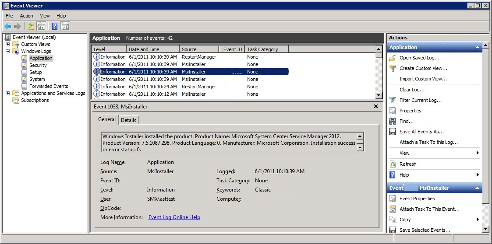

# Deploy Service Manager from a command line

>Applies To: System Center 2016 - Service Manager


This article describes how to deploy System Center - Service Manager using command\-line parameters. For easier reading, the command\-line examples in this guide list each command\-line parameter on its own line. If you copy these examples, you must remove the carriage returns\/line\-feeds \(CRs\/LFs\) from each line before you can run the commands.  

> [!NOTE]  
>  The **/silent** parameter must be the last parameter used in a command\-line install.  

 In this guide, the command\-line arguments that you provide are delineated by brackets: \[\]. For example, you provide the Registered Owner's name **\[owners name\]** and Registered Organization's name **\[company name\]** as shown in the following example:  

```  
Setup.exe  
/Install:Datawarehouse  
/RegisteredOwner:[owners name]  
/RegisteredOrganization:[company name]   
/Silent  

```  

 If your command\-line argument contains a space-for example, **\[owners name\]**-enclose the argument in double quotation marks. For example, if you use **Garret Young** as the argument for the **RegisteredOwner** command\-line parameter, type the name as shown in the following example:  

```  
/RegisteredOwner:"Garret Young"  
```  

 Some of the command\-line parameters that are used for the Operations Manager and Configuration Manager data marts define Structured Query Language \(SQL\) path statements as command\-line arguments. You must define the drive name and make sure that the path that is listed in this guide is the correct path for your version of Microsoft SQL&nbsp;Server. The examples in this guide are correct for SQL&nbsp;Server&nbsp;2016, as shown in the following example:  

```  
/OMDataMartDatabaseLogFilePath:[drive name]\Program Files\Microsoft SQL Server\MSSQL13.MSSQLSERVER\MSSQL\DATA  
```  


 For additional information about command\-line parameters, type **setup.exe /?**. The parameters in the following table are optional.  

|command|notes|  
|---|---|  
|**/ProductKey**|If this parameter is omitted, Service Manager is installed as an evaluation edition with an evaluation period of 180 days.|  
|**/Installpath**|If this parameter is omitted, Service Manager is installed in the default folder and path:<br /><br /> \[drive name\]:\\Program Files\\Microsoft System Center\\Service Manager 2016.|  
|**/ServiceRunUnderAccount**|If this parameter is omitted, the local system account is used.|  
|**/WorkflowAccount**|If this parameter is omitted, the local system account is used.|  

## Before you start

### Prepare the computer

 To help prevent an installation failure, perform the following steps on the computer where you will be installing Service Manager:  

1.  Run the UI\-based Setup up to the point where you run the prerequisite checker. Make sure that the prerequisite checker passes, or at least passes with a warning.  

2.  On the computer where you will be installing the reporting server, make sure that the SQL&nbsp;Server Reporting Services \(SSRS\) service has started.  

3.  If you are going to deploy the Reporting Server on a computer other than the computer hosting the data warehouse management server, make sure that you have completed the procedure in [Manual Steps to Configure the Remote SQL Server Reporting Services](config-remote-ssrs.md).  

### Determine when installation is complete  
 When installation of either the Service Manager management server or the data warehouse management server is complete, an event with Event&nbsp;ID&nbsp;1033 is written into the Application Event log, as shown in the following illustration.  

   


 If you use the **start \/w** command when you are using setup.exe, the command window will remain open when Setup completes, giving you the opportunity to examine any return codes.  

### Check error codes  
 When the command\-line Setup is complete, the command prompt appears. You can view the error code that was returned by typing **echo %errorlevel%**. An error code of 0 means that the installation was successful. The error codes that could be returned by the command\-line installation are listed in [Command-line option error codes](#service-manager-command-line-option-error-codes)..  

 The command\-line installation will not check the database name that you supply to see if it already exists. If you supply a database name that already exists, the command\-line installation will fail and a \-1 will be returned as an error code.  

## Deploy a management server

You can use the following command\-line procedures to deploy the Service Manager management server and the Service Manager database.  

### To deploy the Service Manager management server and database on one computer  

1.  Log on to the computer where you want to install the Service Manager console using administrative credentials.  

2.  Open the command window.  

3.  At the command prompt, change directories to the location of the Service Manager installation media, and then type the following:  

    ```  
    Start /Wait   
    Setup.exe   
    /Install:Server   
    /AcceptEula:[YES/NO]   
    /RegisteredOwner:[owner name]   
    /RegisteredOrganization:[company name]   
    /ProductKey:[25-character product key]   
    /CreateNewDatabase   
    /ManagementGroupName:[management group name]   
    /AdminRoleGroup:[domain\account name]   
    /ServiceRunUnderAccount:[domain\account name\password]   
    /WorkflowAccount:[domain\account name\password]   
    /CustomerExperienceImprovementProgram:[YES/NO]   
    /EnableErrorReporting:[YES/NO]   

    /Silent  

    ```  

## Deploy a Data Warehouse management server

Use the following procedures to deploy a Service Manager data warehouse and databases, including the Operations Manager and Configuration Manager data mart databases, in System Center - Service Manager.  

## Deploy the data warehouse  

 Use the following procedures to deploy the data warehouse with the Operations Manager and Configuration Manager data mart databases. If you want to install the data warehouse management server and data warehouse databases on the same computer, use the same computer name that you are running Setup on for all instances of **\[computer name\]**. If you want to deploy the databases on a separate computer, adjust the **\[computer name\]** entries accordingly.  

 The **/AnalysisServerDatabaseDataFilePath** is optional, and if it is not used, the default path will be used.  

 The DWStagingAndConfig database and the DWRepository database must reside on the same instance. Make sure that you specify the same computer and instance for the **/StgConfigSqlServerInstance** and **/RepositorySqlServerInstance** command\-line options.  

#### To deploy the data warehouse management server, data warehouse databases, and optional data marts  

1.  Log on to the computer where you want to install the Service Manager console using administrative credentials.  

2.  Open a command window.  

    > [!NOTE]  
    >  You must run the command prompt with administrative credentials.  

3.  At the command prompt, change directories to the location of the Service Manager installation media, and then type the following:  

    ```  
    Start /Wait   
    Setup.exe   
    /Install:Datawarehouse   
    /AcceptEula:[YES/NO]   
    /RegisteredOwner:[owner name]   
    /RegisteredOrganization:[company name]   
    /ProductKey:[25-character product key]   
    /CreateNewDatabase   
    /AdminRoleGroup:[domain\account name]   
    /StgConfigSqlServerInstance:[computer name]   
    /RepositorySqlServerInstance:[computer name]   
    /DataMartSqlServerInstance:[computer name]   
    /ReportingServer:[computer name]   
    /ReportingWebServiceURL:"http://[computer name]:80/ReportServer"   
    /ServiceRunUnderAccount:[domain\account name\password]   
    /DatasourceAccount:[domain\account name\password]   
    /CustomerExperienceImprovementProgram:[YES/NO]   
    /EnableErrorReporting:[YES/NO]   
    /ManagementGroupName:DW_improvement   
    /OMDataMartSqlServerInstance:[computer name]   
    /CMDataMartSqlServerInstance:[computer name]   
    /AnalysisServerInstance:[computer name]   
    /AnalysisServerDatabaseDataFilePath:[path to analysis database]   
    /ASRunUnderAccount:[domain\account name\password]   
    /Silent  
    ```  

## Deploy a Service Manager console

Use the following command\-line procedure to deploy the Service Manager console in System Center - Service Manager.  

### To deploy the Service Manager console  

1.  Log on to the computer where you want to install the Service Manager console using administrative credentials.  

2.  Open a command window.  

3.  At the command prompt, change directories to the location of the Service Manager installation media, and then type the following:  

    ```  
    Start /Wait   
    Setup.exe   
    /Install:Console   
    /AcceptEula:[YES/NO]  
    /RegisteredOwner:[owner name]   
    /RegisteredOrganization:[company name]   
    /ProductKey:[25-character product key]   
    /Installpath:[drive name]\Program Files\Microsoft System Center\Service Manager 2016   
    /CustomerExperienceImprovementProgram:[YES/NO]   
    /EnableErrorReporting:[YES/NO]  

    /Silent  
    ```  

## Command-line option error codes

The following is a list of the error codes that are used in the command-line installation of Service Manager.  

|Error code|Error|  
|----------------|-----------|  
|\-16|PreUpgradeCheckFailed|  
|\-15|InvalidCommandLine|  
|\-14|FailedPrerequisiteChecks|  
|\-1|Failed|  
|0|Successful|  
|200|DuplicateDataLogPath|  
|201|DuplicatedCMDB|  
|202|EnterValidDatabaseServer|  
|203|FailedToGetCaseSensitiveAccount|  
|204|FailedToValidateMgmtGrp|  
|205|FullTextSearchNotInstalled|  
|206|InstallPathAccessDenied|  
|207|InstallPathCreateDirectory|  
|208|InstallPathTooLong|  
|209|InvalidCMDB|  
|210|InvalidDatabaseConfiguration|  
|211|InvalidDatabaseSize|  
|212|InvalidDataLogPath|  
|213|InvalidDwServer|  
|214|InvalidInstallPath|  
|215|InvalidPrereqResultFile|  
|216|InvalidProductKey|  
|217|InvalidReportServerConfig|  
|218|InvalidSCSM|  
|219|InvalidSmAdminGroup|  
|220|InvalidSqlInstance|  
|221|InvalidSqlServiceState|  
|222|InvalidToInstalleScsm|  
|223|InvCharInMG|  
|224|MgmtGrpRegistryExist|  
|225|MissingSetupFiles|  
|226|NotEnoughFreeSpace|  
|227|NotEnoughFreeSpaceOnSqlServer|  
|228|NotLocalAdminOnSqlServer|  
|229|NotWin2k8x64Machine|  
|230|NotVistaSP2OrAboveMachine|  
|231|NullDatabaseName|  
|232|NullMG|  
|233|NullSMAdmin|  
|234|OldDwDatabaseExist|  
|235|orMessageBoxTitle|  
|236|PrimarySdkServerEmpty|  
|237|RequiredFreeDiskSpace|  
|238|RequiredFreeDiskSpaceForDataFile|  
|239|RequiredFreeDiskSpaceForLogFile|  
|240|ScomAgentInstalled|  
|241|ScomServerInstalled|  
|242|ScsmComponentsInstalled|  
|243|SelectCMDB|  
|244|SelectSqlServerInstance|  
|245|ServerAccessDenied|  
|246|ServerNotFound|  
|247|SetupAlreadyRunning|  
|248|SetupCancelByUser|  
|249|SetupCrashMsg|  
|250|SetupFailedAt|  
|251|SetupFailedWithMsior|  
|252|SqlAccessDenied|  
|253|SsrsInvalidWebUrl|  
|254|SsrsNeedSecureUrl|  
|255|SsrsNotInstalledOn|  
|256|TestCredentialsFailed|  
|257|TestCredentialsNotLocalAdmin|  
|258|TooLongDatabaseName|  
|259|TooLongMG|  
|260|UnableToNavogateFolderOnRemoteServer|  
|261|UncDataLogPath|  
|262|UnsupportedSQL|  
|263|UserNotSysAdmin|  
|264|FaildToConnectAD|  
|265|ScsmSameVersionInstalled|  
|266|InvalidWebSiteName|  
|267|InvCharInWebSiteName|  
|268|TooLongWebSiteName|  
|269|InvalidWebSitePort|  
|270|WebSiteNameInUse|  
|271|WebSitePortInUse|  
|272|DWServerInstalled|  
|273|SMServerInstalled|  
|274|SMConsoleInstalled|  
|275|SMPortalInstalled|  
|276|IISNotConfigured|  
|277|FailedToConnectToAD|  
|278|SmAdminIsDomainAdministrators|  
|279|InvalidRegisteredOwner|  
|280|InvalidRegisteredOrganization|  
|281|IIS7RoleNotEnable|  
|282|Not64BitSetup|  
|283|DatabaseSqlStoreNotFound|  
|284|ScomUIInstalled|  
|285|InvalidDatabaseName|  
|286|InvalidCMDBVersion|  
|287|UNCPathExpected|  
|288|DataDirectoryDoesNotExist|  
|289|AnalysisServicesNotInstalled|  
|290|DuplicatedASDatabaseID|  
|3010|SuccessfulNeedReboot|


## Next steps

- Review [Move the Service Manager and data warehouse databases to different servers](move-databases.md) to read prescriptive and how-to guidance about moving Service Manager databases.
