# Deploy the Self-Service portal for Service Manager

>Applies To: System Center 2016 - Service Manager

The Self-Service portal provides web-based access to the features of System Center 2016 - Service Manager for end users. This article describes how you can deploy the Self-Service portal and customize it.

### Supported operating systems  
 - Windows Server 2016

 - Windows Server 2012 R2

## Supported web browsers
The Self Service portal needs a screen resolution above 1024 X 768. It is supported on the following browsers.

-   Microsoft Edge

-   Microsoft Internet Explorer 10 and 11

-   Mozilla Firefox 42 and later

-   Google Chrome 46 and later

## Set up the Self Service portal
You'll use the following sections to set up the Self Service portal.

### Set up the web server
Join the Windows server machine to the same domain where the Service Manager SDK Service is running. Ideally, on the secondary server. Enable the IIS role and ASP.NET 4.5 on the server using following steps.

1.  Start the Add Roles and Features Wizard and then enable IIS.

    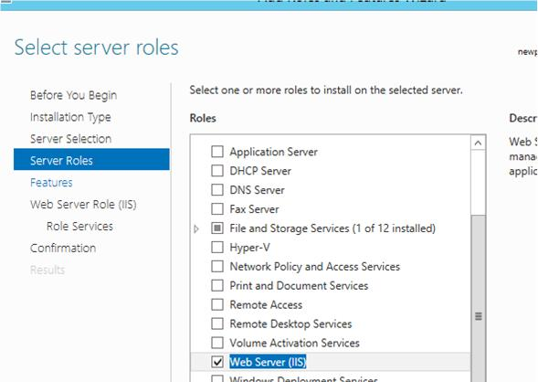

2.  Enable the .NET features.

    1.  Enable .NET 3.5

        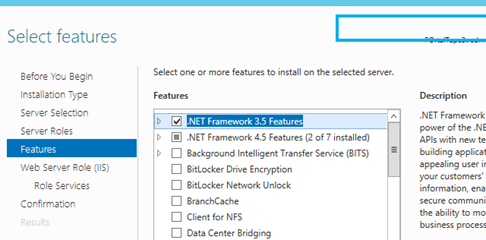

    2.  Enable HTTP Activation

        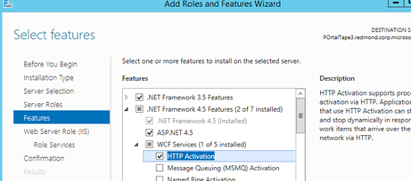

    3.  Enable ASP.NET 4.5

        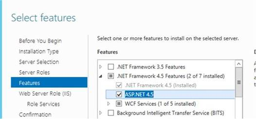

3.  Enable the following role services on the Web Server Role (IIS) page.

    1.  **Basic Authentication** and **Windows Authentication**

        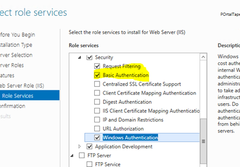

    2.  Add **Application Development** and under it, add **.NET Extensibility 4.5**, **ASP**, and **ASP.NET 4.5**.

        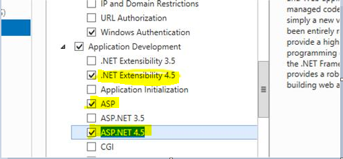

### Install the Self Service Portal Webapp using Setup
Use the following steps to install the Self Service Portal WebApp using Setup.

1.  Click on **Service Manager Self Service Portal** in Service Manager 2016 setup wizard.


2.  Go through the EULA and accept it.

    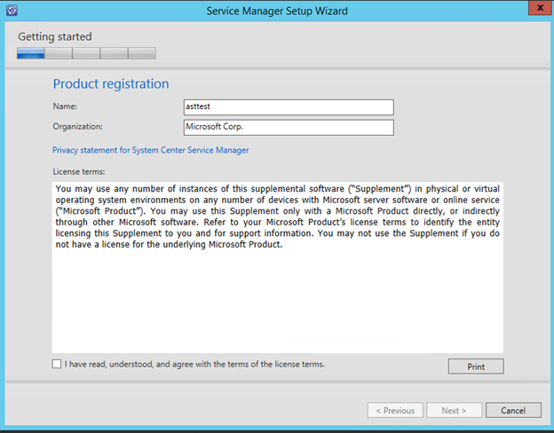

3.  Choose your installation location.

    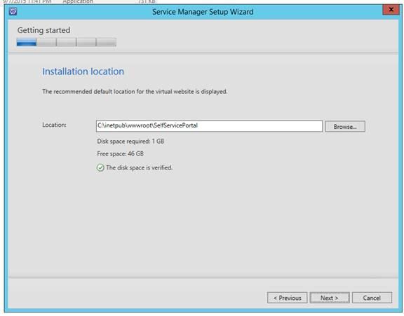

4.  Review the System check results.

5.  Configure the Self Service Portal server and type configuration details for your server.

    -   **WebSite Name** :   The name of the website to display in the IIS Management console.

    -   **SM Server name**:  You can provide a fully-qualified domain name or the NetBIOS name of the server running the Service Manager SDK service. We recommend that you use a dedicated secondary Service Manager management server to communicate with the portal.

    -   **Portal Port**: The port number that the  website will use.

    -   **SSL Certificate:** (Optional) The SSL certificate to configure the website in secure mode (https://). This is the recommended setting if you are using Basic Authentication. The default is Windows  Authentication.

    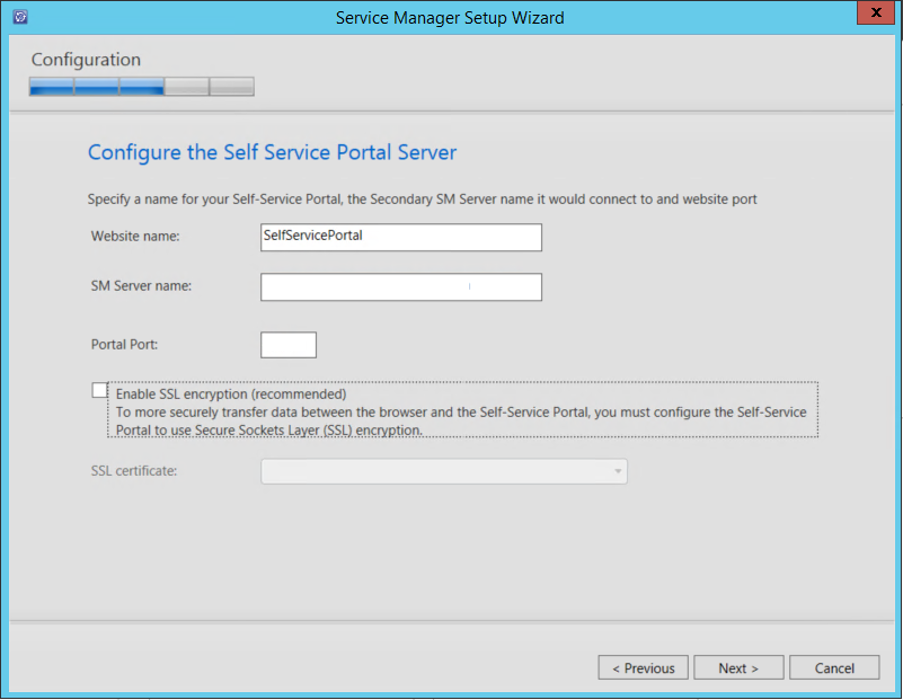

6.  Configure the account for the Self Service Portal. This is the account that the IIS instance will run under. This account should have the Service Manger Admin role.

    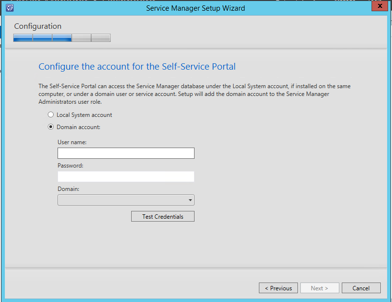

7.  The Diagnostic and usage data notification information is displayed, informing you that data is sent to Microsoft by default.   You can change this setting in the Service Manager console. Click **Next**.

    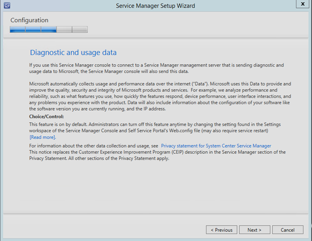

8.  Choose whether to automatically install Microsoft updates.

    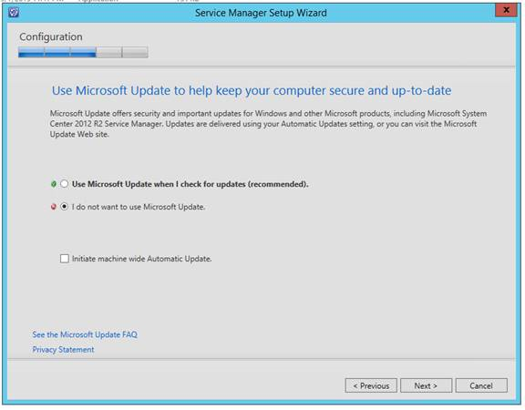

9. Wait for installation to complete.

    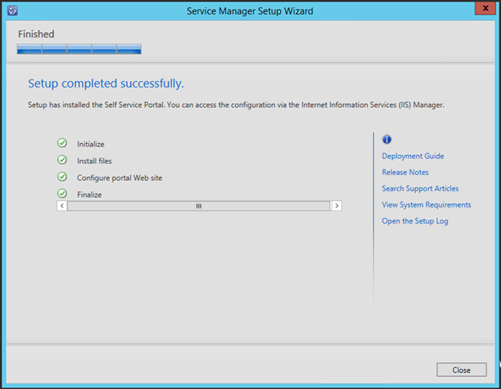

### Install the Self Service portal webapp using the command line
You can modify the following example to install the Self Service portal.

```
SetupWizard.exe /Install:SelfServicePortal /silent /accepteula /CustomerExperienceImprovementProgram:No /EnableErrorReporting:No /PortalWebSiteName:<Portal Name> /SMServerName:<SDK Server Name> /PortalWebSitePort:<PortNumber> /PortalAccount:<domain>\<user>\<pwd>
```

### Complete the installation
Use the following step to complete your installation.

-   Restart IIS. You can access the Web App (http://yourwebsite:port) in your browser. It will resemble the following image.

    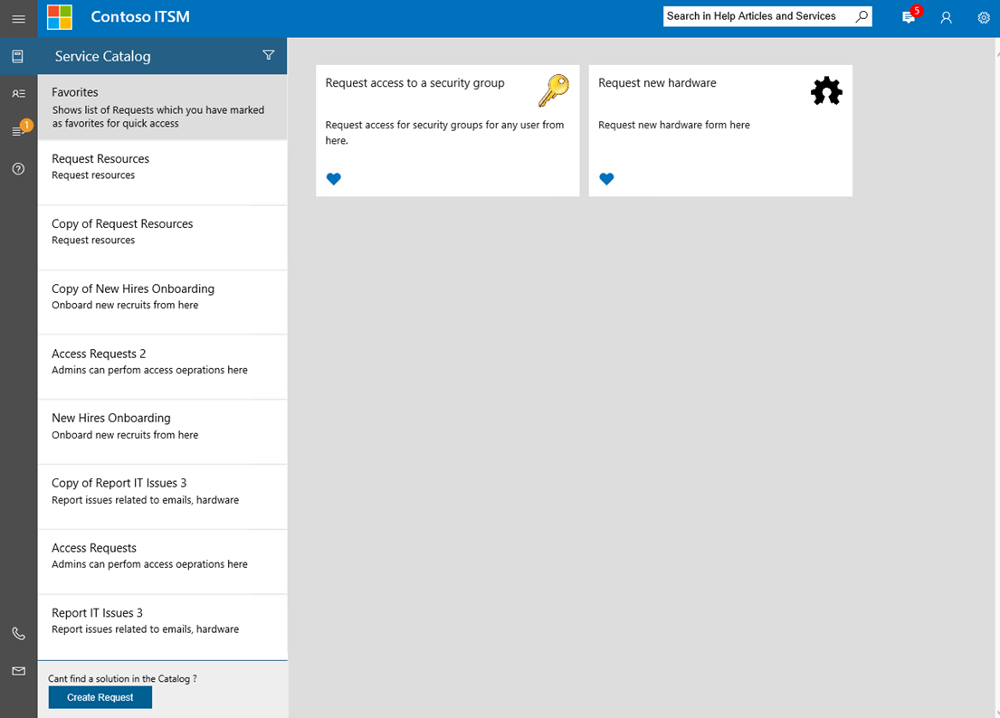

## Customize the Self Service portal
The following section describes how you can customize the Self Service portal to suit your organization.

Before you install Service Manager 2016 Update Rollup 2, note that all customizations are made in the portal sidebar (CustomSidebar.cshtml), then use the following steps to get started.

1.	Create a new cshtml file named CustomSidebar.cshtml in the &lt;Self Service Portal install path&gt;\inetpub\wwwroot\SelfServicePortal\Views\Shared folder path.
2.	Move your customizations from sidebar.cshtml to the new file, which is CustomSidebar.cshtml.

In the future, you need to make all customizations to the Service Manager 2016 Self Service portal’s sidebar in the CustomSidebar.cshtml file.


### Basic customization

The `<appSettings>` tab in the Web.config file offers some standard settings to easily customize and personalize the areas which are most often modified. Here's a list of them.

|Key|Purpose|
|-------|-----------|
|CompanyName|The value of this key appears as the company's name inside the portal.|
|CompanyLogoLocation|The value of this key is used as the image file, which is displayed as the company's logo inside the portal.|
|ITPhone|This key takes the value to configure the IT help desk's phone number. This information appears at the bottom of the navigation menu.|
|ITEmail|The value of this key is used configure the IT help desk's email ID. This information appears at the bottom of the navigation menu.|
|DefaultLanguage|By default, the Portal web pages are loaded as defined by the browser's language. Then current user can manually select the language in the top-right corner of each page.<br />The value of this key defines the default failover language which is chosen by the portal, when the browser's language is not available.|
|GenericOffering|The value of this key accepts the name of the request offering which is mapped to the generic request button. This generic request button is used by the user, when they can't find an appropriate request offering in the catalog.|
|SDKServerName|The value of this key defines the name of the server where the Service Manager SDK runs and it is used to interact with other Service Manager servers. By default, it has the same value that you provided in Setup.<br />You can use the fully qualified domain name or the NetBIOS name of the server running the Service Manger SDK service. We recommend that you dedicate a secondary Service Manager management server to communicate with the portal.|
|MaxQueryResults|The value of this key defines the maximum number of results that are returned by any query form element inside your request offering forms.|
|UserCacheTimeout|The Portal uses a caching infrastructure to provide a swift user experience. The value of this key defines the timeout, in seconds, to cache user-specific details of the signed-in user.|
|DataCacheTimeout|The Portal uses a caching infrastructure to provide a swift user experience. The value of this key defines the timeout, in seconds, to cache generic data which can be shared among different users.|
|EnableTelemetry|The value of this key defines your selection about participating in Microsoft's Customer Experience Improvement Program. Your portal sends usage telemetry data to Microsoft when this key is marked as **True**. By default, it has the same value that you chose during Setup.|


> [!NOTE]
> You must restart the IIS service after you make any changes to the Web.config file.

### Style customization
Web page style, such as font, color, and background, is customized by adding the Custom.css file in the \Content\css website folder.

Styles defined in the CSS file overrides the default styles of the Self Service Portal..

### Customizing the left menu bar
You can modify the content shown in the left navigation bar (menu) by editing the Sidebar.cshtml file which is in the \Views\Shared inside the website folder.

For example:

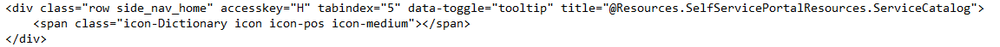

You can add or remove shortcuts from the menu, and you can customize them with details for the CSS class, keyboard hotkeys, and others.

### Additional UI customization

For more information about UI customization, see [The Official System Center Service Manager Blog](https://blogs.technet.microsoft.com/servicemanager/2016/03/15/basic-ui-customization-in-new-self-service-portal-html5/).

## Next steps

- Review [Guidance for load balancing](../sm/deploy/deploy-guidance-for-load-balancing-system-center-2016-service-manager.md) to configure Windows Server Network Load Balancing with Service Manager.
