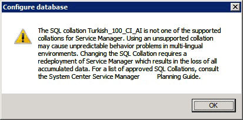

# Deploy System Center - Service Manager

>Applies To: System Center 2016 - Service Manager

This articles in this guide helps you deploy System Center - Service Manager in one of several different scenarios. The scenarios range from a simple, one\-computer scenario to a four\-computer scenario that is designed to support production\-type environments. In addition, this guide shows you how to register a Service Manager management group with the Service Manager data warehouse so that you can generate reports. You have the option of deploying the Self-Service Portal so you can provide access to Service Manager through a web browser. To improve performance and provide for redundancy, you can deploy additional secondary Service Manager management servers.  

> [!NOTE]  
>  It is assumed that you are installing Service Manager on a computer where no previous version of Service Manager is installed. For information about upgrading to System Center 2016 - Service Manager, see the [Upgrade System Center 2012 R2 - Service Manager to System Center 2016 - Service Manager](../sm/deploy/upgrade-upgrading-system-center-2012-service-manager-to-system-center-2016.md).  

This articles in this guide also describe how to find and read the Setup log if you encounter issues when you deploy Service Manager. And, finally, information about backing up Service Manager management server encryption keys is included. After you run Setup, the Encryption Key Backup and Restore Wizard starts automatically.  

The following sections describe considerations you should read before you deploy Service Manager.

## Avoid using Turkish language collations with Service Manager

This section applies only if you are considering deploying a Service Manager database or data warehouse database to a SQL&nbsp;Server that has been configured to use a Turkish language collation.  

 The installation of a Service Manager database is not supported on a computer running SQL&nbsp;Server that uses a Turkish language collation. This is true for both the Service Manager and data warehouse databases. If you specify a computer running SQL&nbsp;Server that contains a Turkish language collation during the deployment of a Service Manager database, the following warning message appears.

 If you encounter this warning message during the deployment of any of the Service Manager databases, click **OK**. On the **Database Configuration** page, in the **Database server** box, type the name of a computer that is hosting an installation of SQL&nbsp;Server that is configured with a non\-Turkish collation, and then press the TAB key. When **Default** appears in the **SQL Server instance** box, click **Next**.  

## Use the Prerequisite checker before you deploy Service Manager

During installation, System Center - Service Manager Setup performs prerequisite checks for software and hardware requirements and returns one of the three following states:  

-   **Success**: Setup finds that all software and hardware requirements are met, and installation proceeds.  

-   **Warning**: Setup finds that all software requirements are met, but the computer does not meet minimum hardware requirements. Or, the requirements for optional software are missing. Installation proceeds.  

-   **Failure**: At least one software or hardware requirement is not met, and installation cannot proceed. An **Installation cannot continue** message appears.  

> [!NOTE]  
>  On the **Installation cannot continue** screen, there is no option to restart the prerequisite checker. You must click **Cancel** to restart the installation process. Make sure that the computer meets all hardware and software requirements before you run Setup again.

## Next steps

- Review [Deployment scenarios for Service Manager](deploy-scenarios.md) to learn about how to deploy Service Manager in one-server, two-server, and four-server topologies.
