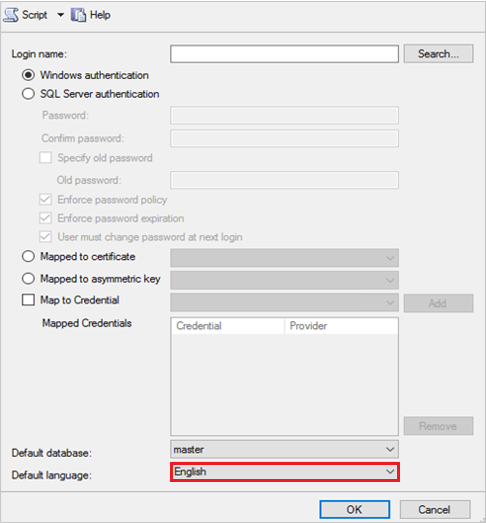

# Deploy System Center - Service Manager

The sections in this article help you deploy System Center - Service Manager in one of several different scenarios. The scenarios range from a simple, one\-computer scenario to a four\-computer scenario that is designed to support production\-type environments. In addition, this article shows you how to register a Service Manager management group with the Service Manager data warehouse so that you can generate reports. You have the option of deploying the Self-Service Portal so you can provide access to Service Manager through a web browser. To improve performance and provide for redundancy, you can deploy additional secondary Service Manager management servers.  

> [!NOTE]  
> - It's assumed that you're installing Service Manager on a computer where no previous version of Service Manager is installed.
> - Manually configure the SQL Server Reporting Services even when SSRS and data warehouse management server MS are on the same machine. For detailed information, see [Manual steps to configure remote SQL Server Reporting Services](./config-remote-ssrs.md).

The sections in this article also describe how to find and read the Setup log if you encounter issues when you deploy Service Manager. And, finally, information about backing up Service Manager management server encryption keys is included. After you run Setup, the Encryption Key Backup and Restore Wizard start automatically.  

The following sections describe considerations you should read before you deploy Service Manager.

## Manage default language for SQL login accounts

We recommend English as the default language for the SQL users sign-in accounts.

As date format is based on the language, if the language of SQL user sign-in accounts isn't English, then a few data Warehouse jobs, especially the jobs that use SQL *SET_DateFormat* function, fail. These jobs don't push the data into the data warehouse from Service Manager or might send incorrect data into the data warehouse, leading to data corruption in the data warehouse.

To set the default language for a new SQL sign-in account or change the default language for an existing account, follow these steps:

1. Open *SQL Management Studio* with elevated privileges and connect to SQL server, where you want to create Service Manager or Data Warehouse databases.
2. Go to **Security** folder.
3. Right-click **Logins** folder, and then select **New Login** as shown below:

    

4. On the properties page, from the  **Default language** dropdown list, select **English**.

    

5. Select **OK**.

6. To change the default language for an existing sign-in account:
    1. Repeat steps 1 and 2.
    2. From the **Logins** folder, select and double-click the account for which you want to change the default language.
    3. Select **Properties** and repeat step 4 and 5.  

    

## Avoid using Turkish language collations with Service Manager

This section applies only if you're considering deploying a Service Manager database or data warehouse database to a SQL Server that has been configured to use a Turkish language collation.  

 The installation of a Service Manager database isn't supported on a computer running SQL&nbsp;Server that uses a Turkish language collation. This is true for both the Service Manager and data warehouse databases. If you specify a computer running SQL&nbsp;Server that contains a Turkish language collation during the deployment of a Service Manager database, the following warning message appears.

 If you encounter this warning message during the deployment of any of the Service Manager databases, select **OK**. On the **Database Configuration** page, in the **Database server** box, enter the name of a computer that is hosting an installation of SQL&nbsp;Server that is configured with a non-Turkish collation, and then press the TAB key. When **Default** appears in the **SQL Server instance** box, select **Next**.  

## Use the Prerequisite checker before you deploy Service Manager

During installation, System Center - Service Manager Setup performs prerequisite checks for software and hardware requirements and returns one of the three following states:  

- **Success**: Setup finds that all software and hardware requirements are met, and the installation proceeds.  

- **Warning**: Setup finds that all software requirements are met, but the computer doesn't meet the minimum hardware requirements or the requirements for optional software are missing. The installation proceeds.  

- **Failure**: At least one software or hardware requirement isn't met, and the installation can't proceed. An **Installation cannot continue** message appears.  

> [!NOTE]  
> On the **Installation cannot continue** screen, there's no option to restart the prerequisite checker. You must select **Cancel** to restart the installation process. Ensure that the computer meets all the hardware and software requirements before you run Setup again.

## Next steps

- To learn about how to deploy Service Manager in one-server, two-server, and four-server topologies, review [Deployment scenarios for Service Manager](deploy-scenarios.md).
