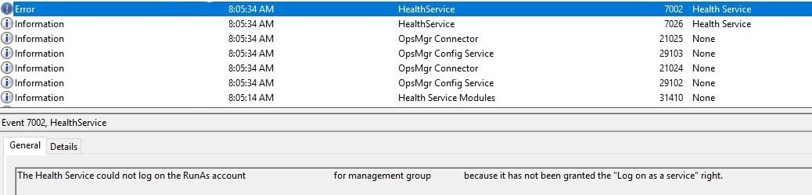

# Enable Service Logon

Security best practice is to disable interactive and remote interactive sessions for service accounts. Security teams, across organizations have strict controls to enforce this best practice to prevent credential theft, and associated attacks.

System Center 2019 - Service Manager (SM) supports hardening of service accounts, and don't require granting the *Allow log on locally* user right for several accounts, required in support of SM.

You must provide service log on permission to the following accounts that are used by SM management server and data warehouse management server.

**Service Manager Services Account**:
This account is used for System Center Data Access Service and System Center Management Configuration service.

With SM 2019, this account requires service logon permission.  

**Service Manager Workflow account**
This account is used to run the *MonitoringHost.exe* process (runs all the Workflows). With SM 2019, this account requires service logon permission.

>[!NOTE]
>We recommend that you provide service logon permission to the accounts used by various SM connectors (AD, OM, SCO, CM, VMM, exchange connectors).
>Service reporting account and analysis services accounts don't require service log on permission.

## How to enable service log on

You can grant service log on permission through a domain policy or a local group policy.

To enable using domain policy, contact your administrators. To use local group policy, see the section on [enable service through a local group policy](#enable-service-log-on-through-a-local-group policy)

## Identify the accounts that need service Log on permission

If required accounts aren't provided with service log on permission, then *monitoringhost.exe* doesn't run under those accounts. Which means, some of the workflows such as SLA/SLO wouldn't run. In such case, the following error event is logged in the Operations Manager event log:

*The Health Service could not log on the RunAs account XXXXXXX for management group XXXX because it has not been granted the *Log on as a service*

Here is a sample error:

## Enable service log on through a local group policy
Follow these steps:

1.	Sign in with administrator privileges to the computer from which you want to provide Log on as Service permission to accounts.
2.	Go to **Administrative Tools**, click **Local Security Policy**.
3.	Expand **Local Policy**, click **User Rights Assignment**. In the right pane, right-click **Log on as a service** and select **Properties**.
4.	Click **Add User** or **Group** option to add the new user.
5.	In the **Select Users** or **Groups** dialogue, find the user you wish to add and click **OK**.
6.	Click **OK** in the **Log on as a service Properties** to save the changes.

    

##  Change logon type from a default value

With SM 2019, default logon type is *Service log on*.
After new installation of  SM 2019 or an upgrade, logon type will be Service log on, by default.

You can change the default log on type by using the following steps:

1.	Sign in as with administrator to the computer from which you want to provide **Log on as Service** permission to accounts.
2.	Run gpedit.msc
3.	Under **Computer Configuration**, expand **Administrative Templates**.
4.	Click **System Center – Operations Manager**.
5.	Right click **Monitoring Action Account Logon Type**, click **Edit**, select **Enabled**.
7.	Choose **Logon Type** from the drop-down menu.

    
