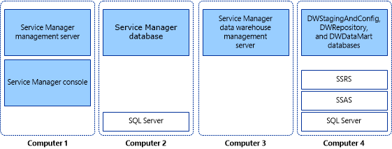

# Installing Service Manager on four computers

When you are ready to move System Center - Service Manager into a production environment, or if you want to maximize performance and scalability, you can consider an installation topology in which each part of the Service Manager installation resides on its own computer. This topology requires the use of four computers, as shown in figure 3.  

 **Figure 3: Four\-computer topology**  

   

 In this deployment scenario, you install Microsoft SQL&nbsp;Server only on the computers that hosts databases \(computers 2 and 4\). You install SQL&nbsp;Server Reporting Services \(SSRS\) and SQL&nbsp;Server Analysis Services \(SSAS\) on the computer that hosts the data warehouse databases \(computer 4\).  

> [!IMPORTANT]  
>  For this release, Service Manager does not support case\-sensitive instance names. Setup will display a warning if you attempt to install Service Manager on a case\-sensitive instance of Microsoft SQL&nbsp;Server.

## Install the Service Manager management server (four-computer scenario)

The following procedure describes how to install the System Center - Service Manager management server, the Service Manager database, the data warehouse management server, data warehouse databases, and the Service Manager console in a four\-computer topology. You start the deployment process by installing the Service Manager management server and the Service Manager console on one computer and the Service Manager database on a second computer. Before you start, make sure that Microsoft SQL&nbsp;Server&nbsp;2016 is installed on the computer that will host the Service Manager database.  

 During Setup, you will be prompted to provide credentials for the following accounts:  

-   Management group administrator  

-   Service Manager services account  

-   Service Manager workflow account  

 For more information about the permissions that these accounts require, see [Accounts Required During Setup](prepare-deploy.md).  

### To install the Service Manager management server, Service Manager database, and console  

1.  Log on to the computer that will host the Service Manager management server by using an account that has administrative rights.  

2.  On the System Center Service Manager installation media, double\-click the **Setup.exe** file.  

3.  On the **Service Manager Setup Wizard** page, click **Service Manager management server**.  

4.  On the **Product registration** page, in the **Product key** boxes, type the product key that you received with Service Manager, or as an alternative, select **Install as an evaluation edition \(180 day trial\)**. Read the Microsoft Software License Terms, and, if applicable, click **I have read, understood, and agree with the terms of the license agreement**, and then click **Next**.  

5.  On the **Installation location** page, verify that sufficient free disk space is available. If necessary, click **Browse** to change the location of where the Service Manager management server will be installed. Click **Next**.  

6.  On the **System check results** page, make sure that the prerequisite check passed or at least passed with warnings.  

     If the prerequisite checker determines that the Microsoft Report Viewer Redistributable has not been installed, click **Install Microsoft Report Viewer Redistributable**. After the Microsoft Report Viewer Redistributable 2008 \(KB971119\) Setup Wizard completes, click **Check prerequisites again**. Click **Next**.  

7.  On the **Configure the Service Manager database** page, in the **Database server** field, type the name of the computer that will host the Service Manager database, and press the TAB key. Ensure that **SQL Server instance** box is set to the desired SQL Server instance and that **Create a new database** is selected, and then click **Next**. For example, type **Computer 2** in the **Database server** box.  

    > [!IMPORTANT]  
    >  A warning message appears if you are using the default collation \(SQL\_Latin1\_General\_CP1\_CI\_AS\). Support for multiple languages in Service Manager is not possible when you are using the default collation. If later you decide to support multiple languages using a different collation, you have to reinstall SQL&nbsp;Server. See [Planning Guide for System Center - Service Manager](plan-sm.md).  

8.  On the **Configure the Service Manager management group** page, complete these steps:  

    1.  In the **Management group name** box, type a unique name for the group name.  

        > [!IMPORTANT]  
        >  Management group names must be unique. Do not use the same management group name even when you are deploying a Service Manager management server and a Service Manager data warehouse management server. Furthermore, do not use the management group name that is used for Operations Manager.  

    2.  In the **Management group administrators** areas, click **Browse**, enter the user or group that you want to be the Service Manager administrator, and then click **Next**. For example, select the group Woodgrove\\SM\_Admins.  

9. On the **Configure the account for Service Manager services** page, click **Domain account**; specify the user name, password, and domain for the account; and then click **Test Credentials**. After you receive a "The credentials were accepted" message, click **Next**.  

10. On the **Configure the Service Manager workflow account** page, click **Domain account**; specify the user name, password, and domain for the account; and then click **Test Credentials**. After you receive a "The credentials were accepted" message, click **Next**.  

11. On the **Diagnostic and usage data** page, indicate your preference for sharing your Service Manager diagnostic and usage data with Microsoft. As an option, click **Privacy statement for System Center Service Manager**, and then click **Next**.  

12. On the **Use Microsoft Update to help keep your computer secure and up\-to\-date** page, indicate your preference for using Microsoft Update to check for Service Manager updates. If you want Windows Update to check for updates, select **Initiate machine wide Automatic update**. Click **Next**.  

13. On the **Installation summary** page, click **Install**.  

14. On the **Setup completed successfully** page, we recommend that you leave **Open the Encryption Backup or Restore Wizard** selected, and then click **Close**. For more information about backing up the encryption key, see [Completing Deployment by Backing Up the Encryption Key](encryption-key.md).

## Install the Service Manager data warehouse (four-computer scenario)

To start deployment of the System Center - Service Manager data warehouse and data warehouse databases, install the data warehouse management server on one computer \(for example, computer 3\), and all of the data warehouse databases on another computer \(for example, computer 4\).  

 During Setup, you will be prompted to provide credentials for the following accounts:  

-   Management group administrator  

-   Service Manager services account  

-   Reporting account  

-   Analysis Services account  

 For more information about the permissions that these accounts require, see [Accounts Required During Setup](prepare-deploy.md).  

 The data warehouse databases include the following three databases: DWStagingAndConfig, DWRepository, and DWDataMart. The first two databases, DWStagingAndConfig and DWRepository, must reside on the same instance of Microsoft SQL&nbsp;Server. The DWDataMart database can reside on a separate instance of SQL&nbsp;Server. The optional OMDWDataMart and CMDWDataMart databases can reside together or separately on their own instances of Microsoft SQL Server.  

### To install a data warehouse management server  

1.  Because, in this scenario, the computer that hosts SQL&nbsp;Server Reporting Services \(SSRS\) is not the same computer that hosts the data warehouse management server, you have to prepare the computer that will remotely host SSRS for Service Manager. See [Manual Steps to Configure the Remote SQL Server Reporting Services](config-remote-ssrs.md) before continuing with this procedure.  

2.  Log on to the computer that will host the data warehouse management server by using an account that has administrator rights. For example, run Setup on Computer&nbsp;3.  

3.  On the System Center Service Manager installation media, double\-click the **Setup.exe** file.  

4.  On the **Service Manager Setup Wizard** page, click **Service Manager data warehouse management server**.  

5.  On the **Product registration** page, in the **Product key** boxes, type the product key that you received with Service Manager, or as an alternative, select **Install as an evaluation edition \(180 day trial\)**. Read the Microsoft Software License Terms, and, if applicable, click **I have read, understood, and agree with the terms of the license agreement**, and then click **Next**.  

6.  On the **Installation location** page, verify that sufficient free disk space is available, and then click **Next**. If necessary, click **Browse** to change the location where the Service Manager management server will be installed.  

7.  On the **System check results** page, verify that prerequisites passed or at least passed with warnings, and then click **Next**.  

8.  On the **Configure data warehouse databases** page, in the **Database server** box, type the computer name of the physical computer that will host the data warehouse databases, the SQL server port, and Database name for all three data warehouse databases, then click **Next**.  

    > [!IMPORTANT]  
    >  A warning message appears if you are using the default collation \(SQL\_Latin1\_General\_CP1\_CI\_AS\). Support for multiple languages in Service Manager is not possible when you are using the default collation. If later you decide to support multiple languages using a different collation, you have to reinstall SQL&nbsp;Server. See [Planning Guide for System Center - Service Manager](plan-sm.md).  

9. In the list of the three databases, select **Data Mart**. In the **Database server** box, type the computer name of the server that will host the Data Mart database. For example, type **Computer 4**, and then press the TAB key. When **Default** appears in the **SQL Server instance** box, click **Next**.  

10. On the **Configure additional data warehouse datamarts** page, complete these steps:  

    1.  Click **OM Data mart**. In the **Database server** box, type the computer name of the computer that will host the Operations Manager data mart database. For example, type **Computer 4**, and then press the TAB key.  

    2.  Click **CM Data mart**. In the **Database server** box, type the computer name of the computer that will host the CM data mart database. For example, type **Computer 4**, and then press the TAB key.  

    3.  Click **Next**.  

11. On the **Configure the data warehouse management group** page, complete these steps:  

    1.  In the **Management group name** box, type a unique name for the group name.  

        > [!CAUTION]  
        >  Management group names must be unique. Do not use the same management group name even when deploying a Service Manager management server and a Service Manager data warehouse management server. Furthermore, do not use the management group name that is used for Operations Manager. All data warehouse management group names have the prefix DW\_.  

    2.  Click **Browse**, enter the user or group that you want to be the Service Manager administrator, and then click **Next**.  

        > [!NOTE]  
        >  The group Domain\\Administrators is not allowed as a management group administrator.  

12. On the **Configure the reporting server for the data warehouse** page, follow these steps:  

    1.  In the **Report server** box, enter the name of the computer that will host the reporting server. In this example, this will be the computer that hosts the data warehouse database, enter **Computer 4**, and then press the TAB key.  

        > [!NOTE]  
        >  The URL that you are presented with might not be in the form of a fully qualified domain name \(FQDN\). If the URL as presented cannot be resolved in your environment, you will need to configure SQL Server Reporting URLs so that the FQDN is listed in the **Web service URL** field. For more information see the TechNet article [Configure a URL](https://go.microsoft.com/fwlink/p/?LinkId=230712).  

    2.  Verify that **Default** is displayed in the **Report server instance** box.  

    3.  Because you followed the procedure [Manual Steps to Configure the Remote SQL Server Reporting Services](config-remote-ssrs.md), select the **I have taken the manual steps to configure the remote SQL Server Reporting Services as described in the Service Manager Deployment Guide** check box, and then click **Next**.  

13. On the **Configure the account for Service Manager services** page, click **Domain account**, specify the user name, password, and domain for the account, and then click **Test Credentials**. After you receive a **The credentials were accepted** message, click **Next**.  

     For example, enter the account information for the domain user SM\_Acct.  

14. On the **Configure the reporting account** page, specify the user name, password, and domain for the account, and then click **Test Credentials**. After you receive a **The credentials were accepted** message, click **Next**.  

15. On the **Configure Analysis Service for OLAP cubes** page, in the **Database server** box, type the computer name of the server that will host the Analysis Services database, and then press the TAB key. When **Default** appears in the **SQL Server instance** box, click **Next**. For example, type **Computer 4** in the **Database server** box.  

    > [!WARNING]  
    >  If you are installing SQL Server Analysis Services on a computer other than the computer hosting the data warehouse management server and there is a firewall in your environment, you must make sure that the proper firewall ports are opened. For more information, see [Port Assignments for Service Manager](~/scsm/ports.md).  

16. On the **Configure Analysis Services credential** page, select a domain account, click **Domain account**, specify the user name, password, and domain for the account, and then click **Test Credentials**. After you receive a **The credentials were accepted** message, click **Next**.  

    > [!NOTE]  
    >  The account you specify here must have administrator rights on the computer hosting SQL Server Analysis Services.  

17. On the **Diagnostic and usage data** page, indicate your preference for sharing your Service Manager diagnostic and usage data with Microsoft. As an option, click **Privacy statement for System Center Service Manager**, and then click **Next**.  

18. On the **Use Microsoft Update to help keep your computer secure and up\-to\-date** page, indicate your preference for using Microsoft Update to check for Service Manager updates. Select **Initiate machine wide Automatic update** if you want Windows Update to check for updates. Click **Next**.  

19. On the **Installation summary** page, click **Install**.  

20. On the **Setup completed successfully** page, we recommend that you leave **Open the Encryption Backup or Restore Wizard** selected, and then click **Close**. For more information about backing up the encryption key, see [Completing Deployment by Backing Up the Encryption Key](encryption-key.md).

## Validate the four-computer installation

The procedures in this topic describe how to validate the four\-computer installation of System Center - Service Manager.  

### Step 1: validate the installation of the management server and database  

#### To validate a Service Manager management server installation  

1.  On the computer hosting the Service Manager management server, verify that a Program Files\\Microsoft System Center&nbsp;2016\\Service Manager folder exists.  

2.  Run **services.msc**, and then verify that the following services are installed, that they have the status of **Started**, and that the startup type is **Automatic**:  

    -   System Center Data Access Service  
    -   Microsoft Monitoring Agent  
    -   System Center Management Configuration  

#### To validate the Service Manager console installation  

1.  On the first computer, click **Start**, click **All Programs**, click **Microsoft System Center**, and then click **Service Manager Console**.  

2.  The first time that you run the Service Manager console, the **Connect to Service Manager Server** dialog box appears. In the **Server name** box, enter the computer name of the server that is hosting the Service Manager management server.  

3.  The Service Manager console successfully connects to the Service Manager management server.  

#### To validate the Service Manager database  

1.  On the computer hosting the Service Manager database, click **Start**, click **All Programs**, click **Microsoft SQL Server&nbsp;2016**, and then click **SQL Server Management Studio**.  

2.  In the **Connect to Server** dialog box, select the following:  

    1.  In the **Server Type** list, select **Database Engine**.  

    2.  In the **Server Name** list, select the server name for your Service Manager database. For example, select **Computer&nbsp;2**.  

    3.  In the **Authentication** list, select **Windows Authentication**, and then click **Connect**.  

3.  In the **Object Explorer** pane, expand **Databases**.  

4.  Verify that the **ServiceManager** database is listed.  

5.  Exit **Microsoft SQL Server Management Studio**.  

### Step 2: validate the installation of the data warehouse management server and database  

#### To validate a data warehouse management server installation  

-   On the computer hosting the data warehouse management server \(the server you ran Setup on\), run **services.msc**, and verify that the following services have been installed:  

    -   System Center Data Access Service  
    -   Microsoft Monitoring Agent  
    -   System Center Management Configuration  

#### To validate data warehouse databases  

1.  On the computer hosting the data warehouse management databases, click **Start**, click **All Programs**, click **Microsoft SQL&nbsp;Server&nbsp;2016**, and then click **SQL&nbsp;Server Management Studio**.  

2.  In the **Connect to Server** dialog box, select the following:  

    1.  In the **Server Type** list, select **Database Engine**.  

    2.  In the **Server Name** list, select the server and instance for your Service Manager data warehouse database. For example, select **Computer&nbsp;4**.  

    3.  In the **Authentication** list, select **Windows Authentication**, and then click **Connect**.  

3.  In the **Object Explorer** pane, expand **Databases**.  

4.  Verify that the **DWStagingAndConfig** and **DWRepository** databases are listed.  

5.  On the computer hosting SQL&nbsp;Server Reporting Services \(SSRS\), click **Start**, click **All Programs**, click **Microsoft SQL&nbsp;Server&nbsp;2016**, and then click **SQL&nbsp;Server Management Studio**.  

6.  In the **Connect to Server** dialog box, select the following:  

    1.  In the **Server Type** list, select **Database Engine**.  

    2.  In the **Server Name** list, select the server and instance for your Service Manager data warehouse database. For example, select **Computer&nbsp;4**.  

    3.  In the **Authentication** list, select **Windows Authentication**, and then click **Connect**.  

7.  In the **Object Explorer** pane, expand **Databases**.  

8.  Verify that the **DWDataMart** database is listed.  

9. In the **Object Explorer** pane, click **Connect**, and then click **Analysis Services**.  

10. In the **Server Name** list, type the computer name for the computer hosting the Service Manager data warehouse database. In this example, type **localhost**.  

11. In the **Object Explorer** pane, expand the new entry for Analysis Services, and then expand **Databases**.  

12. Verify that the **DWASDataBase** database is listed.  

13. Exit Microsoft SQL&nbsp;Server Management Studio.

## Next steps

- Review [Manual steps to configure remote SQL Server Reporting Services](config-remote-ssrs.md) to manually configure SSRS in situations where SSRS is not on the same server as the data warehouse management server.
