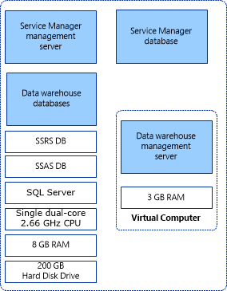

# Install Service Manager on a single computer (minimum configuration)

If you want to evaluate System Center - Service Manager and you've a minimal amount of hardware available, install Service Manager on one computer. A sample single-computer configuration is shown in figure&nbsp;1. This configuration won't support a production environment, and no scalability or performance estimates are provided. Because you can't install both the Service Manager management server and the data warehouse management server on the same computer, use Hyper-V to create a virtual computer to host the data warehouse management server.

 To install Service Manager on a single computer, start with a physical computer that is running Windows Server and Hyper-V, and ensure that the CPU on the physical computer is compatible with Hyper-V. Of the 8&nbsp;gigabytes (GB) of RAM on the host computer, 3&nbsp;GB is used for the virtual computer that hosts the data warehouse management server. Ensure that at least 200&nbsp;GB of free space is available on the hard disk drive.  

 **Figure 1: Single-computer installation in which you use a physical computer that is running Windows Server and Hyper-V**  

   

 If your organization's best practice guidelines don't allow you to install applications on a Hyper-V host, you can create a second virtual computer to host the Service Manager management server, the Service Manager database, and the data warehouse databases. Use the following procedures to install Service Manager on a single computer. 

::: moniker range=">=sc-sm-2019"

[!INCLUDE [validation-service-manager.md](../includes/validation-service-manager.md)]

::: moniker-end

## Install Service Manager

To install System Center - Service Manager on a single computer, you install the Service Manager management server, database, and console on the computer. Then, you install the data warehouse on a virtual machine on the same computer.  

 During Setup, you'll be prompted to provide credentials for the following accounts:  

- Management group administrator  

- Service Manager account  

- Workflow account  

For more information about the permissions that these accounts require, see **Accounts Required During Setup** in the [Planning Guide for System Center - Service Manager](plan-sm.md). Before you start, ensure that Microsoft SQL&nbsp;Server is installed on the computer.  

### Install the Service Manager management server, database, and console  

1. Sign in to the physical computer by using an account that has administrative credentials.  

2. On the Service Manager installation media, double\-click the **Setup.exe** file.  

3. On the **Microsoft System Center \<version\>** page, select **Service Manager management server**.  

4. On the **Product registration** page, enter information in the boxes. In the **Product key** boxes, enter the product key that you received with Service Manager, or alternatively, select **Install as an evaluation edition \(180 day trial\)**. Read the Microsoft Software License Terms, and, if applicable, select **I have read, understood, and agree with the terms of the license agreement**, and select **Next**.  

5. On the **Installation location** page, verify that sufficient free disk space is available, and select **Next**. If necessary, select **Browse** to change the location in which the Service Manager management server will be installed.  

6. On the **System check results** page, ensure that the prerequisite check passed or at least passed with warnings, and select **Next**.  

    If the prerequisite checker determines that the Microsoft Report Viewer Redistributable hasn't been installed, select **Install Microsoft Report Viewer Redistributable**. After the Microsoft Report Viewer Redistributable 2008 \(KB971119\) Setup Wizard completes, select **Check prerequisites again**.  

7. On the **Configure the Service Manager database** page, Service Manager checks the current computer to see if an instance of SQL&nbsp;Server exists. By default, if an instance is found, Service Manager creates a new database in the existing instance. If an instance is displayed, select **Next**.  

   > [!IMPORTANT]  
   > A warning message appears if you're using the default collation \(SQL\_Latin1\_General\_CP1\_CI\_AS\). Support for multiple languages in Service Manager isn't possible when you're using the default collation. If later you decide to support multiple languages using a different collation, you've to reinstall SQL&nbsp;Server. See [Planning Guide for System Center - Service Manager](plan-sm.md).  

8. On the **Configure the Service Manager management group** page, complete these steps:  

   1. In the **Management group name** box, enter a unique name for the management group.  

       > [!IMPORTANT]  
       > Management group names must be unique. Don't use the same management group name when you deploy a Service Manager management server and a Service Manager data warehouse management server. Furthermore, don't use the management group name that is used for Operations Manager.  

   2. Select **Browse**, enter the user account or group to which you want to give Service Manager administrative credentials, and select **Next**.  

9. On the **Configure the account for Service Manager services** page, select **Domain account**; specify the user name, password, and domain for the account; and select **Test Credentials**. After you receive a **The credentials were accepted** message, select **Next**.  

10. On the **Configure the Service Manager workflow account** page, select **Domain account**; specify the user name, password, and domain for the account; and then select **Test Credentials**. After you receive a **The credentials were accepted** message, select **Next**.  

11. On the **Diagnostic and usage data** page, indicate your preference for sharing your Service Manager diagnostic and usage data with Microsoft. As an option, select **Privacy statement for System Center Service Manager**, and select **Next**.  

12. On the **Use Microsoft Update to help keep your computer secure and up\-to\-date** page, indicate your preference for using Microsoft Update to check for Service Manager updates. If you want Windows Update to check for updates, select **Initiate machine wide Automatic update**. Select **Next**.  

13. On the **Installation summary** page, select **Install**.  

14. On the **Setup completed successfully** page, we recommend that you leave **Open the Encryption Backup or Restore Wizard** selected, and select **Close**. For more information about backing up the encryption key, see [Completing Deployment by Backing Up the Encryption Key](encryption-key.md).  

### Install the data warehouse  

1. Sign in to the virtual machine by using an account that has administrative credentials.  

2. On the Service Manager installation media, double\-click the **Setup.exe** file.  

3. On the **Microsoft System Center \<version\>** page, select **Service Manager data warehouse management server**.  

4. On the **Product registration** page, enter information in the boxes. In the **Product key** boxes, enter the product key you received with Service Manager, or as an alternative, select **Install as an evaluation edition (180 day trial)**. Read the Microsoft Software License Terms, and, if applicable, select **I have read, understood, and agree with the terms of the license agreement**, and select **Next**.  

5. On the **Installation location** page, verify that sufficient free disk space is available, and select **Next**. If necessary, select **Browse** to change the location in which the Service Manager data warehouse management server will be installed.  

6. On the **System check results** page, ensure that the prerequisite check passed or at least passed with warnings, and select **Next**.  

7. On the **Configure data warehouse databases** page, in the **Database server** box, enter the computer name of the physical computer that will host the data warehouse databases, the SQL server port, and Database name for all three data warehouse databases, and select **Next**.  

   > [!IMPORTANT]  
   > A warning message appears if you're using the default collation \(SQL\_Latin1\_General\_CP1\_CI\_AS\). Support for multiple languages in Service Manager isn't possible when you're using the default collation. If later you decide to support multiple languages using a different collation, you have to reinstall SQL Server. For more information, see [Planning Guide for System Center - Service Manager](plan-sm.md).  

8. On the **Configure additional data warehouse datamarts** page, Service Manager will check the current computer to see if an instance of SQL&nbsp;Server exists. By default, if an instance is found, Service Manager creates a new database in the existing instance. If an instance appears, select **Next**.  

9. On the **Configure the data warehouse management group** page, complete these steps:  

    1. In the **Management group name** box, enter a unique name for the group.  

        > [!IMPORTANT]  
        > Management group names must be unique. Don't use the same management group name when you deploy a Service Manager management server and a Service Manager data warehouse management server. Furthermore, don't use the management group name that is used for Operations Manager.  

    2. Select **Browse**, enter the user account or group to which you want to give Service Manager administrative credentials, and select **Next**.  

10. On the **Configure the reporting server for the data warehouse** page, Service Manager will use the existing computer if SQL Server Reporting Services \(SSRS\) is present. Accept the defaults, and select **Next**.  

    > [!NOTE]
    > - Manually configure the SQL Server Reporting Services even when SSRS and data warehouse management server MS are on the same machine. For detailed information, see [Manual steps to configure remote SQL Server Reporting Services](./config-remote-ssrs.md).
    > - The URL that you are presented with might not be in the form of a fully qualified domain name \(FQDN\). If the URL as presented can't be resolved in your environment, configure SQL Server Reporting URLs so that the FQDN is listed in the **Web service URL** field. For more information, see [How to: Configure a URL \(Reporting Services Configuration\)](/sql/reporting-services/install-windows/configure-a-url-ssrs-configuration-manager).  

11. On the **Configure the account for Service Manager services** page, select a domain account; select **Domain account**; specify the user name, password, and domain for the account; and select **Test Credentials**. After you receive a **The credentials were accepted** message, select **Next**.  

12. On the **Configure the reporting account** page, specify the user name, password, and domain for the account, and select **Test Credentials**. After you receive a **The credentials were accepted** message, select **Next**.  

13. On the **Configure Analysis Service for OLAP cubes** page, select **Next**.  

14. On the **Configure Analysis Services credential** page, select a domain account; select **Domain account**; specify the user name, password, and domain for the account; and select **Test Credentials**. After you receive a **The credentials were accepted** message, select **Next**.  

    > [!NOTE]  
    > The account that you specify here must have administrator rights on the computer that hosts SSRS.  

15. On the **Diagnostic and usage data** page, indicate your preference for sharing your Service Manager diagnostic and usage data with Microsoft. As an option, select **Privacy statement for System Center Service Manager**, and select **Next**.  

16. On the **Use Microsoft Update to help keep your computer secure and up\-to\-date** page, indicate your preference for using Microsoft Update to check for Service Manager updates. Select **Initiate machine wide Automatic update** if you want Windows Update to check for updates. Select **Next**.  

17. On the **Installation summary** page, select **Install**.  

18. On the **Setup completed successfully** page, we recommend that you leave **Open the Encryption Backup or Restore Wizard** selected, and select **Close**. For more information about backing up the encryption key, see [Completing Deployment by Backing Up the Encryption Key](encryption-key.md).

After the installation, do the following:

19. Disable all the Data Warehouse jobs. To do this, open the Service Manager shell, and then run the  following commands:

    ```powershell   
    $DW ='DWMS Servername'

    Get-scdwjob -Computername $DW | %{disable-scdwjobschedule -Computername $DW -jobname $_.Name}
    ```

20. Make the required changes in the following PowerShell script based on the data source views in your environment, and then run the script by using elevated privileges:

    ```powershell   
    $SSAS_ServerName = "ssas servername" # - to be replaced with Analysis Service instance Name

    [System.Reflection.Assembly]::LoadWithPartialName("Microsoft.AnalysisServices")
    $Server = New-Object Microsoft.AnalysisServices.Server
    $Server.Connect($SSAS_ServerName)
    $Databases = $Server.Databases
    $DWASDB = $Databases["DWASDataBase"]

    #update DWDatamart dsv. Comment the below 3 commands if DWdatamart dsv is not present 

    $DWASDB.DataSourceViews["DwDataMart"].Schema.Tables["OperatingsystemDim"].Columns["PhysicalMemory"].DataType  =  [decimal] 

    $DWASDB.DataSourceViews["DwDataMart"].Schema.Tables["LogicalDiskDim"].Columns["Size"].DataType  =  [decimal] 

    $DWASDB.DataSourceViews["DwDataMart"].Update([Microsoft.AnalysisServices.UpdateOptions]::ExpandFull) 

    #update CMDatamart dsv.Comment the below 2 commands if cmdatamart dsv is not present 

    $DWASDB.DataSourceViews["CMDataMart"].Schema.Tables["OperatingsystemDim"].Columns["PhysicalMemory"].DataType  =  [decimal] 

    $DWASDB.DataSourceViews["CMDataMart"].Update([Microsoft.AnalysisServices.UpdateOptions]::ExpandFull) 

    #update OperatingsystemDim
    $DWASDB.Dimensions["OperatingsystemDim"].Attributes["PhysicalMemory"].KeyColumns[0].DataType =  [System.Data.OleDb.OleDbType]::Double 

    $DWASDB.Dimensions["OperatingsystemDim"].Update([Microsoft.AnalysisServices.UpdateOptions]::ExpandFull + [Microsoft.AnalysisServices.UpdateOptions]::AlterDependents)
    #update LogicalDiskDim 

    $DWASDB.Dimensions["LogicalDiskDim"].Attributes["Size"].KeyColumns[0].DataType =  [System.Data.OleDb.OleDbType]::Double 

    $DWASDB.Dimensions["LogicalDiskDim"].Update([Microsoft.AnalysisServices.UpdateOptions]::ExpandFull + [Microsoft.AnalysisServices.UpdateOptions]::AlterDependents) 

    ```

21. Enable the job schedules by running the following commands:

    ```powershell    
    $DW ='DWMS Servername'

    Get-scdwjob -Computername $DW | %{enable-scdwjobschedule -Computername $DW -jobname $_.Name}
    ```

22. Restart the Data Warehouse management server.

## Validate the single-computer installation

You can use the following procedures to validate the single-computer installation of System Center - Service Manager.

Select the required tab for steps to validate the installation of:

# [Service Manager management server](#tab/ManagementServer)

Follow these steps to validate the Service Manager management server installation:

1. On the physical computer that hosts the Service Manager management server, verify that the Program Files\\Microsoft System Center \<version\>\\Service Manager\\ folder exists.  

2. Run **services.msc**, and then verify that the following services are installed, that they have a status of **Started**, and that the startup type is **Automatic**:  

    - **System Center Data Access Service**  
    - **Microsoft Monitoring Agent**  
    - **System Center Management Configuration**  

# [Service Manager console](#tab/Console)

Follow these steps to validate the Service Manager console installation:

1. On the physical computer, select **Start**, select **All Programs**, select **Microsoft System Center**, and select **Service Manager Console**.  

2. The first time that you run the Service Manager console, the **Connect to Service Manager Server** dialog appears. In the **Server name** box, enter the computer name of the server that hosts the Service Manager management server.  

3. The Service Manager console successfully connects to the Service Manager management server and starts.  

# [Data warehouse management server](#tab/DataWarehouseManagementServer)

Follow these steps to validate the data warehouse management server installation:

- On the virtual machine, run **services.msc**, and verify that the following services are installed:  

    - **System Center Data Access Service**  
    - **Microsoft Monitoring Agent**  
    - **System Center Management Configuration**  

# [Service Manager database](#tab/Database)

Follow these steps to validate the Service Manager database:

1. On the physical computer, select **Start**, select **All Programs**, select **Microsoft SQL Server**, and select **SQL Server Management Studio**.  

2. In the **Connect to Server** dialog, follow these steps:  

    1. In the **Server Type** list, select **Database Engine**.  

    2. In the **Server Name** list, select the name of the computer that hosts the Service Manager database.  

    3. In the **Authentication** list, select **Windows Authentication**, and select **Connect**.  

3. In the **Object Explorer** pane, expand **Databases**.  

4. Verify that the **ServiceManager** database is listed.  

5. Exit Microsoft SQL Server Management Studio.  

# [Data warehouse](#tab/DataWarehouse)

Follow these steps to validate the data warehouse installation:

1. On the physical computer that hosts the data warehouse databases, select **Start**, select **All Programs**, select **Microsoft SQL Server**, and select **SQL Server Management Studio**.

2. In the **Connect to Server** dialog, complete these steps:  

   1. In the **Server Name** list, enter the computer name of the computer hosting Service Manager data warehouse databases. For this example, enter **localhost**.  

   2. In the **Authentication** list, select **Windows Authentication**, and select **Connect**.  

3. In the **Object Explorer** pane, expand **Databases**.  

4. Verify that the **DWDataMart**, **DWRepository**, and **DWStagingAndConfig** databases are listed.  

5. In the **Object Explorer** pane, select **Connect**, and select **Analysis Services**.  

6. In the **Server Name** list, enter the computer name for the computer hosting the Service Manager data warehouse database. In this example, enter **localhost**.  

7. In the **Object Explorer** pane, expand the new entry for Analysis Services, and then expand **Databases**.  

8. Verify that the **DWASDataBase** database is listed.  

9. Exit Microsoft SQL&nbsp;Server Management Studio.

---

## Next steps

To install Service Manager on two computers, which is a useful scenario for testing Service Manager in a lab environment, review [Install Service Manager on two computers](install-two-computers.md).
